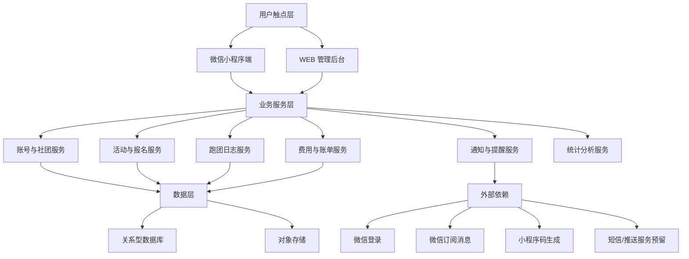
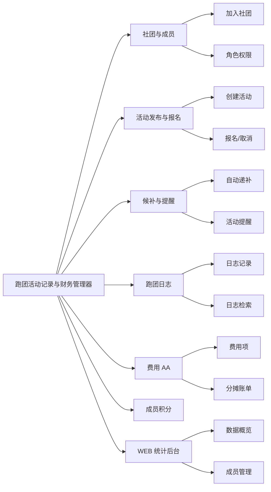
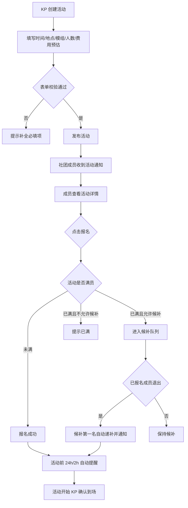
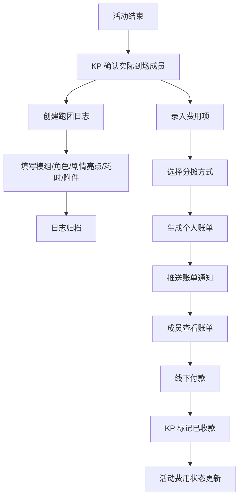
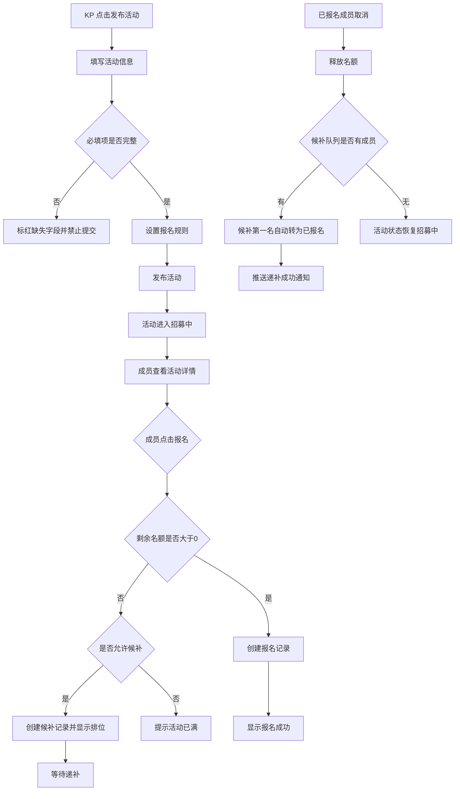
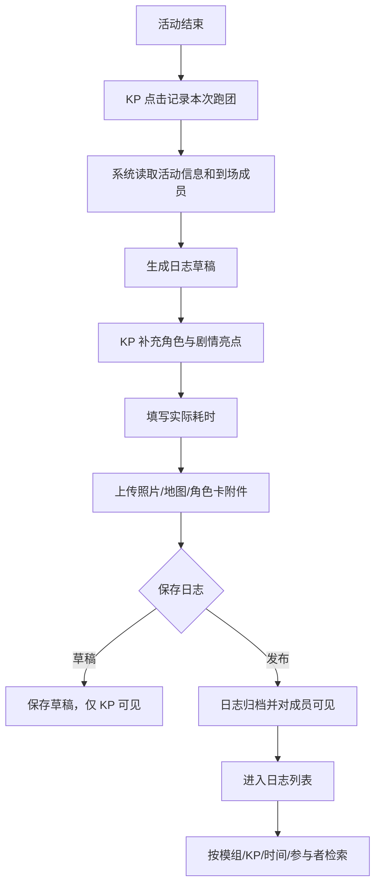
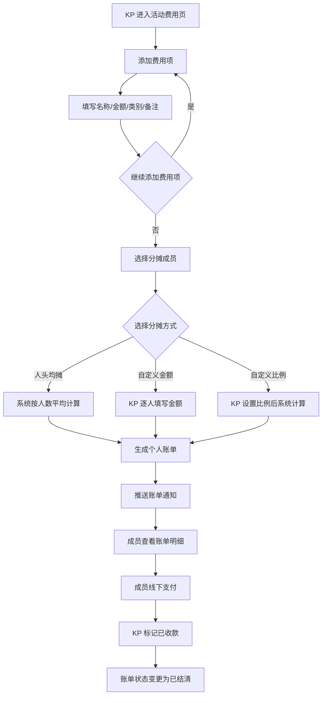
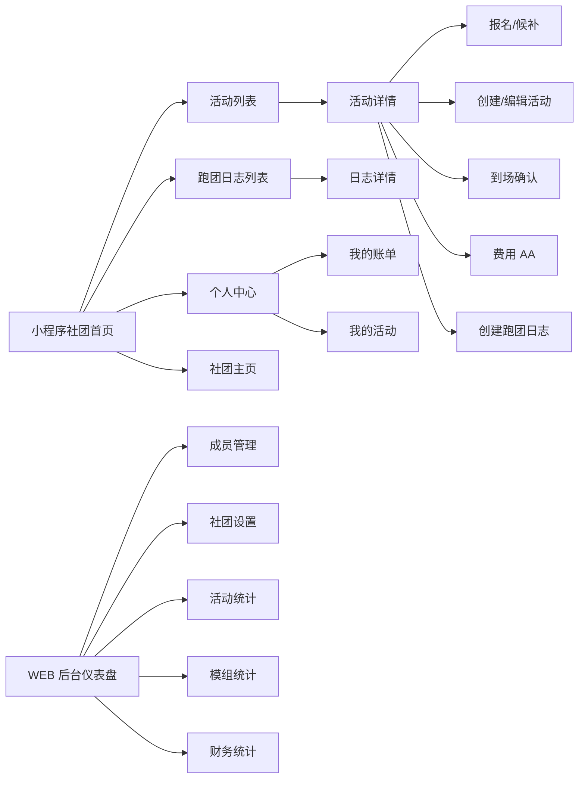
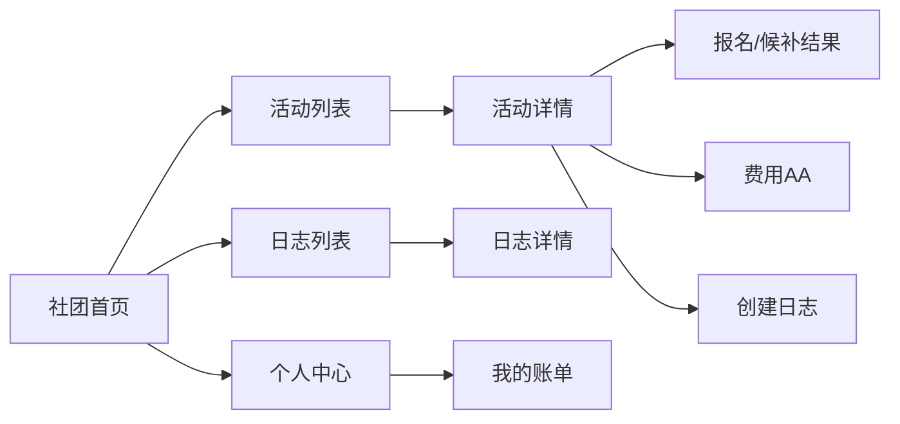
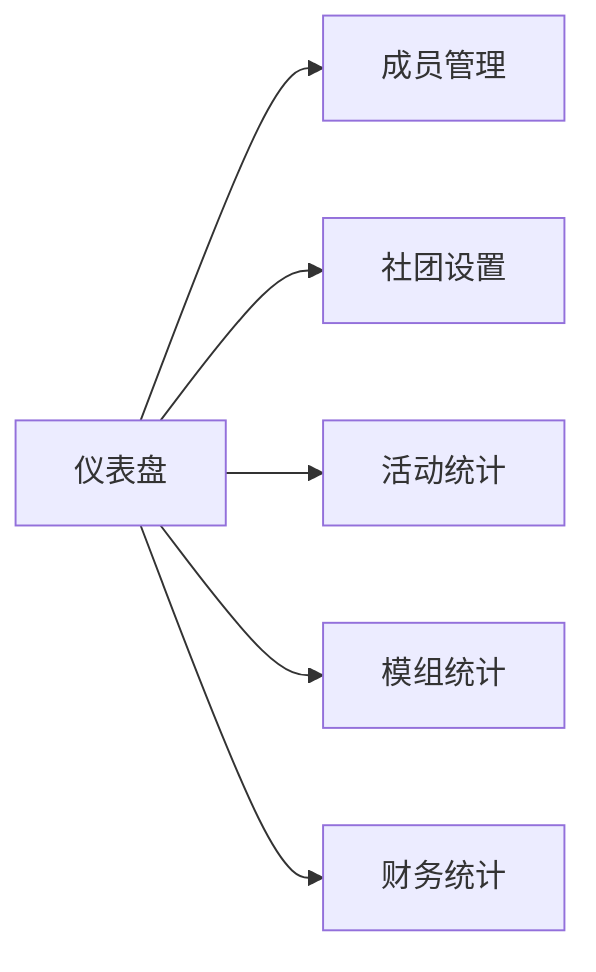

# 跑团活动记录与财务管理器 — 产品文档 / PRD

> 文档版本：V1.0  
> 编写日期：2026-06-29  
> 文档状态：评审稿  
> 输出目录：`./跑团活动记录与财务管理器/`

---

## 变更历史

| 版本号 | 变更日期 | 变更内容 | 变更人 | 审核人 |
| --- | --- | --- | --- | --- |
| V1.0 | 2026-06-29 | 基于 URS 完成 PRD 初稿，覆盖活动发布/报名、跑团日志、费用 AA、社团管理、WEB 后台与配套原型 | 产品文档结对写作专家 | 待评审 |

---

# 1 概述

## 1.1 需求背景

TRPG（桌上角色扮演游戏）跑团活动通常由 KP/DM 在微信群、QQ群、飞书群或桌游店社群中发布活动信息，成员通过接龙报名，活动后再由组织者手工整理参团人员、剧情摘要、费用分摊和历史记录。当前方式存在四类明显痛点：

1. **活动信息散落**：时间、地点、模组、人数上限、费用说明分散在群消息中，成员需要反复翻聊天记录确认信息。
2. **报名与候补混乱**：微信群接龙容易被插队、漏接、误删；活动满员后候补顺序不透明，退出后的递补依赖 KP 手工通知。
3. **跑团档案难沉淀**：每次跑团的参与者、角色、剧情亮点、耗时和附件通常散落在聊天记录或个人笔记中，无法按模组、KP、时间检索。
4. **AA 费用追踪低效**：场地费、零食、道具、打印等费用依赖 Excel 或群收款截图，分摊规则不透明，未收款名单需要人工维护。

本产品面向 TRPG 跑团社团、桌游店和高校/社区跑团组织者，提供“活动发布与报名管理 + 跑团日志归档 + 费用 AA 分摊”三合一工具，帮助社团将线下跑团组织流程数字化、结构化和可追溯化。

## 1.2 名词解释

| 名词 | 说明 |
| --- | --- |
| TRPG | Tabletop Role-Playing Game，桌上角色扮演游戏，例如《龙与地下城》《克苏鲁的呼唤》等。 |
| 跑团 | 玩家围绕一个模组进行角色扮演、探索、战斗或推理的活动过程。 |
| KP / DM | 跑团主持人。KP 常用于克苏鲁类游戏，DM 常用于 DND 类游戏；本文统一称为 KP。 |
| 模组 | 一次或多次跑团使用的故事剧本、世界观和任务设定。 |
| 社团 | 由管理员、KP 和成员组成的跑团组织单元，可对应桌游店、校园社团、社区小组或私人跑团群。 |
| 候补 | 活动报名人数达到上限后，继续报名的成员按时间顺序进入的等待队列。 |
| AA 分摊 | 将活动公共费用按人头均摊或按自定义比例/金额分摊到成员。 |
| 账单 | 系统根据费用项和分摊规则生成的个人应付记录。 |
| 小程序端 | 面向成员、KP 和管理员的微信小程序，承担日常活动、日志和账单操作。 |
| WEB 管理后台 | 面向社团管理员和桌游店老板的浏览器后台，承担设置、成员管理和统计分析。 |

## 1.3 产品介绍

### 1.3.1 产品定位

跑团活动记录与财务管理器是一款面向 TRPG 线下社团的垂直 SaaS 工具。它不做通用活动平台，也不做线上跑团地图、骰子或语音工具，而是聚焦跑团社团最刚需的三件事：

- 快速发布活动并管理报名、候补、提醒和到场；
- 活动结束后沉淀结构化跑团日志；
- 将场地、零食、道具等费用透明分摊并追踪收款。

### 1.3.2 目标用户

| 用户类型 | 典型场景 | 核心诉求 |
| --- | --- | --- |
| 社团管理员 / Owner | 管理一个 20-100 人跑团社团，配置成员角色、积分规则和社团设置 | 统一管理社团数据、减少沟通成本、沉淀社团资产 |
| KP / DM | 每周发布多场跑团活动，管理报名、到场、日志和费用 | 快速发车、降低候补和收款负担、沉淀主持记录 |
| 普通成员 / Player | 关注社团活动，报名参与，查看账单和历史日志 | 及时发现活动、报名透明、账单清楚、回顾方便 |
| 桌游店老板 | 用社群组织线下跑团，并收取场地费或活动费 | 管理排期、追踪付费、查看经营数据 |
| 游客 / Guest | 通过公开链接了解社团活动 | 低门槛浏览公开活动，决定是否加入社团 |

### 1.3.3 范围说明

| 项 | 内容 |
| --- | --- |
| 包含功能 | 微信登录与社团加入、活动发布、活动报名、候补队列、活动提醒、到场确认、跑团日志、日志检索、费用项录入、AA 分摊、账单生成、收款标记、成员角色、积分、WEB 统计后台。 |
| 不包含功能 | 线上跑团地图、骰子、语音、角色卡自动战斗、在线支付闭环、通用非 TRPG 活动运营、复杂 CRM 营销、跨社团联盟广场。 |
| MVP 边界 | 7 天可实现活动发布/报名、跑团日志、费用 AA、社团与成员基础能力；在线支付、AI 日志总结和公开模组库进入后续版本。 |

### 1.3.4 商业模式

| 套餐 | 价格 | 权益 | 限制 |
| --- | --- | --- | --- |
| 免费版 | ¥0 | 1 个社团、基础活动发布、报名和候补、基础费用记录 | 每月最多 5 次活动；日志检索和统计能力受限 |
| 社团版 | ¥15/月 | 不限活动、不限成员、完整跑团日志、费用 AA、多 KP 管理、成员积分、统计后台 | 面向稳定运营社团或桌游店 |

### 1.3.5 产品设计方案与选型

| 方案 | 描述 | 优点 | 缺点 | 结论 |
| --- | --- | --- | --- | --- |
| 方案 A：微信群增强工具 | 仅围绕微信群接龙、提醒、费用汇总做轻量工具 | 开发最快，学习成本低 | 无法形成完整日志档案，社团运营能力弱 | 不采用 |
| 方案 B：小程序端优先的一体化 MVP | 以小程序覆盖成员与 KP 高频场景，辅以 WEB 后台做设置和统计 | 贴合社团日常使用习惯，功能闭环完整，7 天 MVP 可落地 | WEB 后台初期功能需克制 | 推荐采用 |
| 方案 C：完整 SaaS 后台优先 | 先做强大的 WEB 后台，再补移动端 | 统计和管理能力强 | 成员报名、账单查看不方便，MVP 周期过长 | 后续增强方向 |

本 PRD 采用**方案 B：小程序端优先的一体化 MVP**。小程序承载活动、日志、账单等高频操作；WEB 管理后台承载社团设置、成员管理和数据统计。

---

# 2 产品设计

## 2.1 系统架构图

## 2.2 业务模块图

## 2.3 主业务流程

### 2.3.1 活动发布、报名与候补流程

### 2.3.2 活动结束后的日志与账单流程

## 2.4 功能图 / 列表

| 功能模块 | 功能名称 | 优先级 | 功能描述 |
| --- | --- | --- | --- |
| 社团与成员 | 微信登录 | P0 | 用户通过微信授权登录，系统建立成员身份。 |
| 社团与成员 | 扫码/邀请码加入社团 | P0 | 用户通过小程序码或邀请码加入指定社团。 |
| 社团与成员 | 成员角色设置 | P1 | 管理员设置成员为 KP、普通成员或同时具备多身份。 |
| 社团与成员 | 成员积分 | P1 | 根据参与、主持、缺席等行为自动累积或扣减积分。 |
| 活动管理 | 创建活动 | P0 | KP 创建跑团活动，填写时间、地点、模组、人数上限和费用预估。 |
| 活动管理 | 活动列表与详情 | P0 | 成员查看活动信息、报名状态、候补位置和费用说明。 |
| 活动管理 | 报名/取消报名 | P0 | 成员报名活动或在允许时间内取消报名。 |
| 活动管理 | 候补队列 | P0 | 满员后按报名时间进入候补，退出时自动递补。 |
| 活动管理 | 活动提醒 | P1 | 活动前 24 小时和 2 小时自动提醒已报名成员。 |
| 活动管理 | 到场确认 | P1 | 活动开始时 KP 确认到场、缺席和临时替补情况。 |
| 跑团日志 | 创建日志 | P0 | KP 在活动结束后记录参与人员、角色、剧情亮点和耗时。 |
| 跑团日志 | 上传附件 | P1 | 支持跑团照片、地图、角色卡等附件。 |
| 跑团日志 | 日志列表与详情 | P0 | 成员浏览社团历史跑团记录。 |
| 跑团日志 | 日志检索 | P1 | 按模组、KP、时间、参与者和角色名检索。 |
| 费用 AA | 添加费用项 | P0 | KP 录入场地、餐饮、道具、交通等费用项。 |
| 费用 AA | 分摊规则 | P0 | 支持按人头均摊和自定义金额/比例分摊。 |
| 费用 AA | 生成账单 | P0 | 系统按费用项和规则生成每位成员应付金额。 |
| 费用 AA | 收款标记 | P0 | KP 手动标记线下转账、现金等收款状态。 |
| WEB 后台 | 仪表盘 | P1 | 展示活动、成员、日志、费用和收款率概览。 |
| WEB 后台 | 成员管理 | P1 | 批量查看、筛选、导入成员并调整角色。 |
| WEB 后台 | 社团设置 | P1 | 管理社团名称、简介、公告、公开状态和邀请信息。 |
| WEB 后台 | 统计分析 | P1 | 查看活动趋势、模组热度、财务分类和成员活跃度。 |

## 2.5 你的产品有哪些端

| 序号 | 端名称 | 端类型 | 目标用户 | 说明 |
| --- | --- | --- | --- | --- |
| 1 | 跑团小程序端 | 小程序端 | 社团成员、KP、社团管理员、游客 | 日常活动浏览、报名、候补、日志、账单、个人中心与社团主页。 |
| 2 | WEB 管理后台 | WEB端 | 社团管理员、桌游店老板、核心 KP | 社团设置、成员管理、数据概览、活动统计、模组统计、财务统计。 |

---

# 3 产品功能

## 3.1 跑团小程序端 - 活动发布与报名管理

### 3.1.1 功能说明

活动发布与报名管理用于完成从 KP 发起活动、成员报名、满员候补、活动提醒到到场确认的完整链路。该模块是 MVP 的核心入口，直接替代微信群接龙。

**用户故事：**

- 作为 KP，我希望 2 分钟内发布一场跑团活动，使成员能看到时间、地点、模组和费用预估。
- 作为成员，我希望一键报名或取消报名，并能清楚看到自己的报名状态和候补排位。
- 作为候补成员，我希望前面有人退出时系统自动递补并通知我，避免人工沟通遗漏。
- 作为管理员，我希望活动开始前能提醒参与者，提高到场率。

| 项 | 内容 |
| --- | --- |
| 优先级 | P0 |
| 依赖需求 | URS 3.1 活动管理、URS 4.3 性能需求、URS 5.2 微信订阅消息接口 |
| 前置条件 | 用户已登录并加入社团；KP 已获得活动发布权限。 |
| 触发入口 | 小程序首页“发布活动”、活动列表“报名”、活动详情“取消报名/候补”。 |

### 3.1.2 详细流程

**业务规则：**

1. 活动必填字段为标题、活动时间、地点、人数上限；费用预估和描述为选填。
2. 人数上限默认包含 KP，KP 可在创建时选择“KP 是否占用名额”。
3. 报名截止时间默认为活动开始前 2 小时，KP 可调整但不得晚于活动开始时间。
4. 活动开始后成员不可自行取消报名；如需变更，由 KP 手动调整到场状态。
5. 候补队列按报名时间升序排列；同一用户不得重复报名或同时处于已报名与候补状态。
6. 已报名成员取消后，若存在候补队列，系统自动将候补第一名转为已报名，并推送通知。
7. 活动提醒默认在活动开始前 24 小时和 2 小时触发；若活动创建时距离开始不足 24 小时，则只触发 2 小时提醒。
8. KP 可在活动详情中取消活动，取消后已报名和候补成员均收到通知。

### 3.1.3 主要原型

[活动发布与报名 widget 原型](活动发布与报名-widget.html)

**验收标准：**

- [ ] 正常流程：KP 可创建活动，成员可报名，未满员活动展示“报名成功”。
- [ ] 候补流程：活动满员后继续报名进入候补，并显示候补排位；有人退出后第一位候补自动递补。
- [ ] 异常流程：必填字段缺失、报名截止、活动取消、重复报名均给出明确提示。
- [ ] 性能要求：500 名成员并发报名同一活动时，不出现超卖，报名结果在 500ms P95 内返回。

## 3.2 跑团小程序端 - 跑团日志

### 3.2.1 功能说明

跑团日志用于在活动结束后记录本次跑团的核心信息，包括参与人员、模组名称、角色、剧情亮点、实际耗时和附件。日志沉淀为社团资产，支持按模组、时间、KP、参与者和角色检索。

**用户故事：**

- 作为 KP，我希望活动结束后能基于报名名单快速生成日志草稿，减少重复录入。
- 作为成员，我希望查看自己参与过的模组、角色和剧情回顾。
- 作为社团管理员，我希望按模组聚合历史记录，了解社团主要跑团方向。

| 项 | 内容 |
| --- | --- |
| 优先级 | P0 |
| 依赖需求 | URS 3.2 跑团日志、URS 5.2 对象存储上传接口 |
| 前置条件 | 活动已结束或 KP 手动进入日志记录；用户具备 KP 或管理员权限。 |
| 触发入口 | 活动详情“记录本次跑团”、日志列表“新增日志”。 |

### 3.2.2 详细流程

**业务规则：**

1. 日志默认继承活动标题、模组、KP、日期和实际到场成员。
2. 每位参与者可填写角色名；一个成员在一次活动中可对应一个主要角色。
3. 剧情亮点支持富文本输入，建议限制在 5000 字以内。
4. 附件支持最多 9 张图片或 1 个视频，单文件不超过 20MB。
5. 日志可保存为草稿或发布；草稿仅 KP 和管理员可见。
6. 已发布日志可由创建 KP 或管理员编辑，编辑后记录最后更新时间。
7. 游客不可查看社团私密日志；公开社团可选择是否公开部分日志摘要。

### 3.2.3 主要原型

[跑团日志记录 widget 原型](跑团日志记录-widget.html)

**验收标准：**

- [ ] 正常流程：KP 可从已结束活动创建日志，系统自动带出活动、模组、成员和日期。
- [ ] 检索流程：成员可按模组、KP、时间范围和参与者检索历史日志。
- [ ] 异常流程：附件超限、内容为空、无权限编辑时给出清晰提示。
- [ ] 数据要求：单社团 1000 条以上日志时，列表和检索仍可稳定返回。

## 3.3 跑团小程序端 - 费用 AA 管理

### 3.3.1 功能说明

费用 AA 管理用于记录活动公共支出，并按人头均摊或自定义金额/比例生成个人账单。MVP 阶段不接入在线支付，采用线下转账或现金收款，系统负责账单透明化和收款状态追踪。

**用户故事：**

- 作为 KP，我希望录入场地费、零食和道具费用后自动生成每个人应付金额。
- 作为成员，我希望清楚看到自己为什么要付多少钱，以及是否已经结清。
- 作为管理员，我希望查看活动总支出、已收款、未收款和收款率。

| 项 | 内容 |
| --- | --- |
| 优先级 | P0 |
| 依赖需求 | URS 3.3 费用 AA、URS 4.4 MVP 不对接在线支付约束 |
| 前置条件 | 活动已创建；KP 已确认参与分摊的成员范围。 |
| 触发入口 | 活动详情“费用 AA”、个人中心“我的费用”。 |

### 3.3.2 详细流程

**业务规则：**

1. 费用项至少包含名称、金额、类别；金额精确到分，必须大于 0。
2. 费用类别默认包含场地、餐饮、道具、交通、其他。
3. 默认参与分摊成员为实际到场成员，KP 可增删成员，并可选择 KP 是否参与分摊。
4. 人头均摊时产生的分摊尾差计入最后一位成员，确保个人账单合计等于总费用。
5. 自定义金额分摊时，所有成员分摊金额合计必须等于总费用，允许保存草稿但不允许生成账单。
6. 自定义比例分摊时，比例合计必须为 100%。
7. 账单生成后成员可查看明细，但不可自行修改金额或状态。
8. KP 可将账单标记为已收款或已豁免；已结清账单若需撤销，必须二次确认并记录操作人。

### 3.3.3 主要原型

[费用 AA 管理 widget 原型](费用AA管理-widget.html)

**验收标准：**

- [ ] 正常流程：KP 可添加多条费用项，选择均摊后生成个人账单。
- [ ] 自定义流程：自定义金额或比例不平衡时，系统禁止生成账单并提示差额。
- [ ] 收款流程：KP 可逐一标记已收款，费用汇总同步更新已收款金额和收款率。
- [ ] 账单准确性：所有个人账单合计必须等于费用总额，金额精确到分。

## 3.4 跑团小程序端 - 社团与个人中心

### 3.4.1 社团加入与主页

| 项 | 内容 |
| --- | --- |
| 优先级 | P0 |
| 功能说明 | 用户通过小程序码或邀请码加入社团；社团主页展示社团名称、简介、公告、近期活动、热门模组和日志摘要。 |
| 主要入口 | 小程序扫码、邀请码输入、首页社团卡片。 |
| 验收标准 | 用户输入有效邀请码后加入社团；无效或过期邀请码提示原因；游客仅可查看公开信息。 |

### 3.4.2 成员角色与权限

| 角色 | 权限 |
| --- | --- |
| 游客 | 查看公开活动和社团公开信息，不可报名、查看私密日志或账单。 |
| 普通成员 | 查看社团活动、报名、取消报名、查看日志、查看个人账单。 |
| KP | 普通成员权限 + 创建活动、管理报名、记录日志、录入费用、标记收款。 |
| 管理员 | KP 权限 + 成员管理、角色设置、社团设置、积分规则、统计后台。 |

### 3.4.3 成员积分

| 行为 | 默认积分规则 | 可配置性 |
| --- | --- | --- |
| 参加活动并到场 | +5 分 | 管理员可调整 |
| 担任 KP 并完成日志 | +10 分 | 管理员可调整 |
| 准时到场 | +2 分 | 管理员可调整 |
| 报名后缺席 | -5 分 | 管理员可调整 |
| 完成费用结清 | +1 分 | 管理员可关闭 |

### 3.4.4 个人中心

个人中心聚合用户与社团相关的个人信息：我的活动、我的候补、我的主持、我的角色、我的账单、积分排行和通知设置。普通成员默认进入“我的活动”；KP 额外展示“我主持的活动”。

## 3.5 WEB 管理后台功能

### 3.5.1 仪表盘

| 项 | 内容 |
| --- | --- |
| 优先级 | P1 |
| 功能说明 | 展示社团活动总数、月度活动趋势、平均参与人数、日志数量、总支出、收款率和成员活跃度。 |
| 验收标准 | 管理员进入后台后首屏可看到核心指标；时间筛选变更后图表同步刷新。 |

### 3.5.2 成员管理

| 项 | 内容 |
| --- | --- |
| 优先级 | P1 |
| 功能说明 | 查看成员列表，支持按角色、加入时间、积分、活跃度筛选；可调整角色、移除成员、导入成员。 |
| 验收标准 | 管理员可将成员设置为 KP；移除成员需二次确认；批量导入失败项需展示原因。 |

### 3.5.3 社团设置

| 项 | 内容 |
| --- | --- |
| 优先级 | P1 |
| 功能说明 | 管理社团名称、头像、简介、公告、公开状态、邀请码、二维码和积分规则。 |
| 验收标准 | 修改后小程序端同步展示；重置邀请码后旧邀请码失效。 |

### 3.5.4 统计分析

| 统计主题 | 指标 | 用途 |
| --- | --- | --- |
| 活动统计 | 活动总数、活动完成率、平均报名人数、满员率 | 判断活动供给与成员参与情况。 |
| 模组统计 | 模组跑团次数、平均耗时、参与人数 | 识别热门模组和长期 campaign。 |
| 财务统计 | 总支出、人均费用、费用类别占比、收款率 | 管理社团费用透明度和桌游店经营情况。 |
| 成员活跃 | 参与频次、到场率、积分趋势、KP 主持次数 | 发现核心成员和沉默成员。 |

---

# 4 产品原型

## 4.1 页面跳转逻辑图

## 4.2 全站点原型设计

### 4.2.1 跑团小程序端

**页面清单：**

| 序号 | 页面名称 | 所属模块 | 页面描述 | 关键元素 |
| --- | --- | --- | --- | --- |
| 1 | 社团首页 | 社团与成员 | 成员进入社团后的总览页面 | 社团公告、今日活动、快捷入口、热门模组、未结账单提醒 |
| 2 | 活动列表 | 活动管理 | 浏览全部活动并按状态筛选 | 状态筛选、活动卡片、报名人数、费用预估、发布按钮 |
| 3 | 活动详情 | 活动管理 | 查看活动详情并报名/候补/取消 | 模组信息、时间地点、报名名单、候补队列、操作按钮 |
| 4 | 创建活动 | 活动管理 | KP 发布活动 | 标题、模组、时间、地点、人数上限、费用预估、报名规则 |
| 5 | 跑团日志列表 | 跑团日志 | 浏览历史跑团记录 | 搜索框、筛选器、日志卡片、模组聚合 |
| 6 | 日志详情 | 跑团日志 | 查看单次跑团完整记录 | 参与者、角色、剧情摘要、附件、费用结果 |
| 7 | 创建日志 | 跑团日志 | KP 记录活动日志 | 参与者、角色、剧情亮点、耗时、附件上传 |
| 8 | 费用 AA | 费用 AA | 录入费用、分摊并追踪收款 | 费用项、分摊方式、个人账单、收款状态 |
| 9 | 个人中心 | 个人中心 | 查看个人活动、账单、角色和积分 | 我的活动、我的费用、角色档案、积分排行 |

**交互说明：**

- 页面跳转关系：

- 特殊交互：
  1. 小程序原型采用宫格布局，每个格子展示一个微信小程序页面，便于评审整体信息架构。
  2. 活动详情页根据活动容量显示“立即报名”“加入候补”“取消报名”三类状态按钮。
  3. 费用页支持通过 Tab 切换“费用项 / 分摊 / 收款”。
  4. 空数据态以羊皮纸卡片展示引导文案，如“还没有跑团日志，结束活动后记录第一章冒险”。

**产品原型：**

[打开跑团小程序端全站点原型](小程序端全站点原型.html)

### 4.2.2 WEB 管理后台

**页面清单：**

| 序号 | 页面名称 | 所属模块 | 页面描述 | 关键元素 |
| --- | --- | --- | --- | --- |
| 1 | 仪表盘 | 数据统计 | 管理员查看核心运营数据 | 指标卡、趋势图、近期活动、未收款提醒 |
| 2 | 成员管理 | 社团设置 | 管理社团成员与角色 | 成员表格、角色筛选、积分、批量导入、角色设置 |
| 3 | 社团设置 | 社团设置 | 设置社团基础信息和规则 | 名称、公告、公开状态、邀请码、积分规则 |
| 4 | 活动统计 | 数据统计 | 分析活动趋势与满员率 | 月度趋势、活动状态、平均参与人数 |
| 5 | 模组统计 | 数据统计 | 查看模组使用情况 | 模组排行、跑团次数、平均耗时、参与成员 |
| 6 | 财务统计 | 数据统计 | 查看费用与收款情况 | 支出趋势、类别占比、收款率、未收款列表 |

**交互说明：**

- 页面跳转关系：

- 特殊交互：
  1. WEB 原型为单体应用全屏布局，左侧导航切换页面，内容区不刷新整体框架。
  2. 图表采用静态可视化样式表达趋势、占比和收款率，便于产品评审。
  3. 成员管理表格支持视觉上的角色标签、积分和到场率展示。
  4. 社团设置保存后出现 Toast 风格反馈。

**产品原型：**

[打开 WEB 管理后台全站点原型](WEB管理后台全站点原型.html)

---

# 5 数据需求

## 5.1 数据使用规格

### 5.1.1 核心数据对象

| 数据对象 | 关键字段 | 是否 MVP 必需 | 描述 |
| --- | --- | --- | --- |
| 用户 User | 用户ID、微信 OpenID、昵称、头像、手机号、创建时间 | 是 | 记录基础用户身份。 |
| 社团 Club | 社团ID、名称、简介、头像、公告、公开状态、套餐、邀请码 | 是 | 跑团组织单元。 |
| 社团成员 ClubMember | 社团ID、用户ID、角色、积分、加入时间、状态 | 是 | 记录用户在社团中的身份和权限。 |
| 活动 Activity | 活动ID、社团ID、标题、模组、KP、时间、地点、人数上限、费用预估、状态 | 是 | 跑团活动主体。 |
| 报名 Signup | 活动ID、用户ID、报名状态、候补排位、报名时间、到场状态 | 是 | 记录报名、候补、取消和到场。 |
| 跑团日志 RunLog | 日志ID、活动ID、模组、KP、参与者、角色、剧情摘要、耗时、发布状态 | 是 | 跑团历史档案。 |
| 附件 Attachment | 附件ID、关联对象、文件类型、URL、大小、上传人 | 是 | 日志图片、地图、角色卡等。 |
| 费用项 ExpenseItem | 费用项ID、活动ID、名称、金额、类别、备注、录入人 | 是 | 活动公共费用明细。 |
| 分摊账单 Bill | 账单ID、活动ID、用户ID、应付金额、状态、收款时间、操作人 | 是 | 个人应付和收款状态。 |
| 积分记录 PointRecord | 用户ID、社团ID、行为类型、积分变化、关联活动 | 否，P1 | 成员积分流水。 |

### 5.1.2 关键字段规则

| 字段 | 是否必填 | 数据类型 | 描述 |
| --- | --- | --- | --- |
| activity.title | 是 | 字符串 | 活动标题，1-40 个中文字符。 |
| activity.module_name | 是 | 字符串 | TRPG 模组名称，支持模糊检索。 |
| activity.start_time / end_time | 是 | 日期时间 | 结束时间必须晚于开始时间。 |
| activity.capacity | 是 | 数字 | 人数上限，最小 2，最大 30，默认包含 KP。 |
| signup.status | 是 | 枚举 | signed、waitlist、cancelled、attended、absent。 |
| run_log.summary | 是 | 富文本 | 剧情摘要，建议 50-5000 字。 |
| expense_item.amount | 是 | 金额 | 必须大于 0，精确到分。 |
| bill.status | 是 | 枚举 | pending、paid、waived。 |
| bill.amount | 是 | 金额 | 由分摊规则生成，不允许成员自行修改。 |

## 5.2 统计数据

| 统计主题 | 指标 | 维度 | 优先级 |
| --- | --- | --- | --- |
| 活动统计 | 活动总数、完成活动数、取消活动数、满员率、平均报名人数 | 月、季度、模组、KP | P1 |
| 日志统计 | 日志数量、模组跑团次数、平均耗时、附件数量 | 模组、KP、时间 | P1 |
| 财务统计 | 总支出、已收款、未收款、人均费用、费用类别占比、收款率 | 活动、月份、费用类别 | P1 |
| 成员活跃 | 参与次数、到场率、缺席次数、主持次数、积分变化 | 成员、月份、角色 | P1 |
| 套餐转化 | 免费版活动次数、触达上限次数、社团版开通率 | 社团、月份 | P2 |

## 5.3 埋点需求

| 页面 | 事件 | 采集字段 | 说明 |
| --- | --- | --- | --- |
| 活动列表 | view_activity_list | 社团ID、筛选状态、用户角色 | 评估活动浏览转化。 |
| 活动详情 | click_signup | 活动ID、剩余名额、用户角色 | 评估报名转化和满员情况。 |
| 活动详情 | click_waitlist | 活动ID、候补人数 | 评估候补需求强度。 |
| 创建活动 | submit_activity | 社团ID、KP ID、是否费用预估、容量 | 评估 KP 发布效率。 |
| 创建日志 | submit_run_log | 活动ID、字数、附件数、耗时 | 评估日志沉淀情况。 |
| 费用 AA | generate_bill | 活动ID、费用项数、总金额、分摊方式 | 评估 AA 功能使用深度。 |
| 账单详情 | mark_bill_paid | 活动ID、账单ID、金额、操作人 | 评估收款效率。 |
| WEB 仪表盘 | view_dashboard | 社团ID、时间范围 | 评估后台使用情况。 |

---

# 6 非功能需求

## 6.1 性能需求

### 6.1.1 延迟

| 编号 | 项目 | 最大延迟 | 平均延迟 | 优先级 | 备注 |
| --- | --- | --- | --- | --- | --- |
| PERF-001 | 小程序首屏加载 | ≤ 2 秒 | ≤ 1.2 秒 | 高 | 常规 4G/5G 网络环境。 |
| PERF-002 | 活动报名提交 | ≤ 500ms P95 | ≤ 300ms | 高 | 需要防止超卖。 |
| PERF-003 | 日志列表查询 | ≤ 800ms P95 | ≤ 500ms | 中 | 单社团 1000+ 条日志。 |
| PERF-004 | 账单生成 | ≤ 1 秒 | ≤ 600ms | 高 | 参与人数 ≤ 30 的常规跑团。 |
| PERF-005 | WEB 仪表盘加载 | ≤ 3 秒 | ≤ 2 秒 | 中 | 默认近 90 天数据。 |

### 6.1.2 吞吐量

| 编号 | 项 | 吞吐量 | 备注 |
| --- | --- | --- | --- |
| THR-001 | 单活动并发报名 | 支持 500 人同时点击报名 | 不允许出现报名超上限。 |
| THR-002 | 通知推送 | 5 分钟内完成单社团 500 名成员通知 | 受微信订阅消息能力约束。 |
| THR-003 | 文件上传 | 单用户连续上传 9 张图片 | 单文件 ≤ 20MB。 |

### 6.1.3 容量

| 编号 | 项 | 容量 | 备注 |
| --- | --- | --- | --- |
| CAP-001 | 单社团成员数 | ≥ 500 人 | 满足中型社团和桌游店。 |
| CAP-002 | 单社团活动数 | ≥ 2000 场 | 支持多年历史。 |
| CAP-003 | 单社团日志数 | ≥ 1000 条 | 检索性能不明显劣化。 |
| CAP-004 | 单社团账单数 | ≥ 5000 条 | 支持历史财务追溯。 |

## 6.2 安全需求

| 编号 | 项 |
| --- | --- |
| SEC-001 | 未登录用户只能查看公开社团允许展示的信息，不得访问报名、账单、私密日志。 |
| SEC-002 | 普通成员只能查看自己的账单明细和社团公开日志，不得修改活动、日志或账单。 |
| SEC-003 | KP 只能管理自己主持的活动、日志和费用；管理员可管理社团全部数据。 |
| SEC-004 | 成员手机号、OpenID 等敏感信息仅管理员和授权 KP 可见，默认不在游客页面展示。 |
| SEC-005 | 跑团日志内容需提供举报入口，管理员可隐藏不合规日志。 |
| SEC-006 | 文件上传需限制类型、大小和数量，避免上传可执行文件或恶意内容。 |
| SEC-007 | 关键操作（取消活动、删除成员、撤销收款、重置邀请码）必须二次确认并记录操作人。 |

## 6.3 可靠性

| 编号 | 项 | 值 |
| --- | --- | --- |
| REL-001 | 核心报名服务可用性 | ≥ 99.5% |
| REL-002 | 通知任务失败重试 | 至少重试 3 次，仍失败则记录失败状态 |
| REL-003 | 账单生成一致性 | 账单合计必须等于费用总额，不允许半生成状态对成员可见 |
| REL-004 | 数据保存 | 活动、日志、账单保存成功后刷新页面不丢失 |

## 6.4 可连续性

| 编号 | 项 |
| --- | --- |
| CONT-001 | 系统需支持日常 7×24 小时访问，活动提醒任务可按计划自动执行。 |
| CONT-002 | 当微信订阅消息发送失败时，系统保留站内通知和发送失败记录，KP 可手动提醒。 |
| CONT-003 | 当对象存储短时不可用时，日志正文可先保存，附件上传允许稍后补传。 |

## 6.5 可恢复性

| 编号 | 项 |
| --- | --- |
| REC-001 | 业务数据每日全量备份，关键流水数据支持增量备份。 |
| REC-002 | 活动、报名、账单等核心数据误删除后，管理员可通过后台工单申请恢复。 |
| REC-003 | 账单状态变更保留操作记录，便于追溯误标记和人工恢复。 |

## 6.6 兼容性

| 编号 | 要求 | 备注 |
| --- | --- | --- |
| COMP-001 | 微信小程序基础库 ≥ 2.25.0 | 兼容 iOS 14+ / Android 8.0+。 |
| COMP-002 | 小程序适配 375-428px 主流手机宽度 | 关键操作按钮在首屏或固定底部可达。 |
| COMP-003 | WEB 后台兼容 Chrome 90+、Firefox 90+、Edge 90+、Safari 15+ | 使用响应式布局。 |
| COMP-004 | WEB 后台支持 1366×768 及以上桌面分辨率 | 左侧导航 + 内容区布局。 |

## 6.7 易用性

| 编号 | 要求 | 备注 |
| --- | --- | --- |
| USE-001 | 创建活动、记录日志、费用记账三个核心流程均不超过 3 个主步骤 | 降低 KP 使用负担。 |
| USE-002 | 关键状态使用明确标签展示：招募中、已满员、候补中、进行中、已结束、待支付、已结清 | 避免成员误解。 |
| USE-003 | 活动详情底部固定主操作按钮 | 移动端报名和取消操作易触达。 |
| USE-004 | 金额、人数、时间均提供输入校验和即时提示 | 降低账单错误。 |
| USE-005 | 暗色奇幻风格必须保证文字对比度 | 夜间使用友好，不牺牲可读性。 |

---

# 7 总结

## 7.1 上线计划

| 阶段 | 时间 | 内容 | 负责人 |
| --- | --- | --- | --- |
| 需求与原型评审 | 第 1 天 | 确认 PRD、核心流程、页面清单和原型 | 产品负责人 / 社团代表 |
| MVP 开发 | 第 2-6 天 | 完成小程序端活动、日志、费用 AA 和基础后台 | 研发团队 |
| 联调与测试 | 第 7 天 | 功能测试、报名并发测试、账单准确性测试、微信通知联调 | 研发 / 测试 |
| 小范围试运行 | 第 8-14 天 | 选择 1-2 个真实跑团社团试用，收集反馈 | 产品 / 运营 |
| 正式发布 | 第 15 天 | 开放免费版与社团版购买入口 | 产品 / 运营 |

## 7.2 后续迭代规划

- **V1.1：在线支付与自动对账**：接入微信支付，支持成员在线支付账单、自动结清和退款记录。
- **V1.2：AI 跑团日志助手**：根据 KP 简短记录自动润色剧情摘要，生成可公开分享的跑团回顾。
- **V1.3：公开模组库与活动模板**：沉淀常用模组模板，KP 可一键复用活动信息。
- **V1.4：跨社团活动招募**：允许社团将部分活动公开招募，吸引新成员加入。
- **V1.5：桌游店经营增强**：增加场地预约、包间排期、会员储值和经营报表。

## 7.3 参考文档

- [用户需求说明书](需求文档.md)
- [活动发布与报名 widget 原型](活动发布与报名-widget.html)
- [跑团日志记录 widget 原型](跑团日志记录-widget.html)
- [费用 AA 管理 widget 原型](费用AA管理-widget.html)
- [跑团小程序端全站点原型](小程序端全站点原型.html)
- [WEB 管理后台全站点原型](WEB管理后台全站点原型.html)

---

# 8 自审查记录

| 检查项 | 结果 |
| --- | --- |
| 需求描述清晰、无歧义 | 通过 |
| 所有需求可追溯到 URS 或产品创意 | 通过 |
| 功能优先级已定义 | 通过 |
| 活动、日志、费用 AA 核心流程完整 | 通过 |
| 异常流程和边界条件已覆盖 | 通过 |
| 第 3 章存在“主要原型”的功能均已链接 widget 原型 | 通过 |
| 第 4 章每个端实例均已链接全站点 HTML 原型 | 通过 |
| 非功能需求覆盖性能、安全、可靠性、兼容性、易用性 | 通过 |
| 文档不存在 TODO/TBD 占位 | 通过 |
