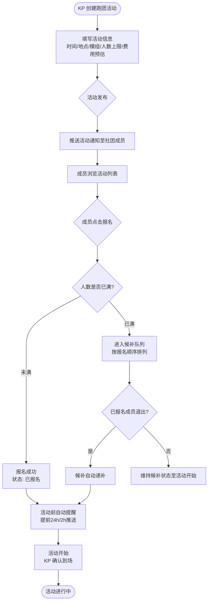
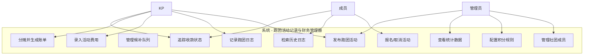
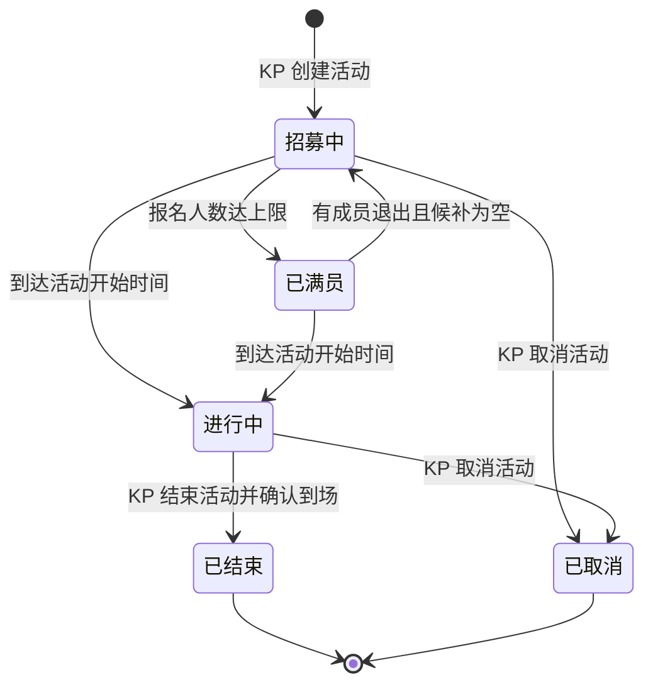
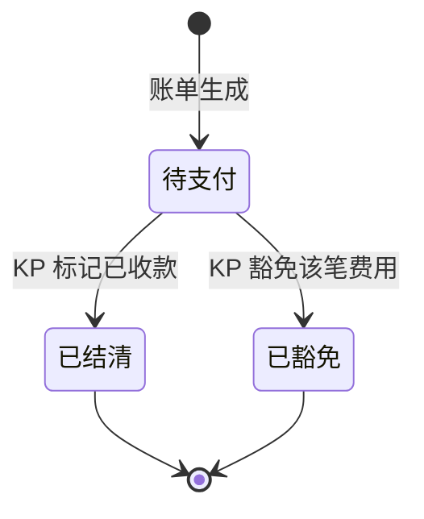

# 跑团活动记录与财务管理器 — 用户需求说明书（URS）

# 1. 需求概述

## 1.1 需求介绍

跑团活动记录与财务管理器是一款面向 TRPG（桌上角色扮演游戏）跑团社团的垂直管理工具，为社团组织者/KP/DM、桌游店老板以及大学/社区跑团社团负责人提供"活动发布与报名管理 + 跑团日志归档 + 费用 AA 分摊"三合一的数字化管理能力，解决当前跑团活动组织依赖微信群接龙、Excel 记账导致的信息散落、难追溯、效率低等问题。

### 1.1.1 所属领域

- 文化娱乐 / 桌游与 TRPG 社团管理
- 小众垂直 SaaS（线下活动管理细分赛道）

## 1.2 需求目标

1. **活动组织提效**：将跑团活动从发布、报名、候补、提醒到到场确认的全流程线上化，取代微信群接龙式低效管理。
2. **社团记忆沉淀**：每一次跑团结束后形成结构化的跑团日志（参与人员/模组/角色/剧情亮点/耗时），构成社团可检索的跑团档案。
3. **费用透明化**：活动产生的场地费、零食、道具等公共支出自动按人头或自定义比例分摊，账单清晰、收款可追踪。
4. **社团规模化运营**：通过多 KP 管理、成员积分、免费/付费分层，支撑社团从 5-10 人的小规模向稳定运营的中型社群发展。

## 1.3 系统使用角色

| 角色 | 说明 |
| --- | --- |
| 社团管理员（Owner） | 社团创建者，拥有社团最高权限，可管理成员角色、设置社团信息、查看社团全部数据，通常是社团主理人或桌游店老板 |
| KP / DM（Keeper/Dungeon Master） | 跑团主持人，可发布活动、记录跑团日志、管理其所主持活动的费用，一个社团可有多名 KP |
| 普通成员（Player） | 社团参与者，可浏览活动列表、报名参加活动、查看跑团日志、查看并支付个人账单 |
| 候补成员（Waitlist Player） | 活动已满员后报名的参与者，按报名顺序进入候补队列，当已报名成员退出时自动递补 |
| 游客（Guest） | 未加入社团的访问者，可查看社团公开的活动信息（仅浏览，不可报名或查看日志） |

## 1.4 业务流程图

### 1.4.1 活动发布与报名流程



### 1.4.2 跑团日志记录流程

```mermaid
flowchart TD
    A([活动结束]) --> B[KP 进入活动详情页]
    B --> C[点击"记录本次跑团"]
    C --> D[填写日志信息<br/>参与人员/模组名称/角色/剧情亮点/耗时]
    D --> E[可选: 上传照片或跑团回顾附件]
    E --> F{保存日志}
    F --> G[日志归档至社团跑团档案]
    G --> H[成员可查看历史日志]
    H --> I[支持按 模组/时间/KP 检索]
```

### 1.4.3 费用 AA 分摊流程

```mermaid
flowchart TD
    A([活动结束或 KP 主动记账]) --> B[KP 录入费用项<br/>场地费/零食/道具等]
    B --> C{选择分摊方式}
    C -- 按人头均摊 --> D[总金额 ÷ 参与人数]
    C -- 自定义比例 --> E[KP 为每位参与者设定分摊比例或金额]
    D --> F[生成个人账单]
    E --> F
    F --> G[推送账单通知至参与者]
    G --> H[成员查看账单明细]
    H --> I{成员确认支付}
    I -- 线下/转账支付 --> J[KP 手动标记"已收款"]
    I -- 在线支付(预留) --> K[系统自动确认]
    J --> L[账单状态更新为"已结清"]
    K --> L
    L --> M([KP 查看费用汇总与收款状态])
```

# 2. 功能原型

| 原型名称 | 原型链接 | 对应端 | 备注 |
| --- | --- | --- | --- |
| 跑团活动记录与财务管理器 - 微信小程序 | 见配套 UI 原型文件 | 小程序端 | MVP 阶段主要载体，覆盖活动发布/报名/日志/费用 AA 全场景 |
| 跑团活动记录与财务管理器 - WEB 管理后台 | 见配套 UI 原型文件 | WEB端 | 社团管理员用于社团设置、数据统计、成员管理等运营场景 |

# 3. 需求清单

## 3.1 小程序端 - 活动管理

| 模块 | 一级功能 | 二级功能 | 功能描述 | 备注 |
| --- | --- | --- | --- | --- |
| 活动发布 | 创建活动 | 填写活动基本信息 | KP 填写活动标题、所属模组（TRPG 模组名称）、活动时间（起止）、地点（支持地图选点）、人数上限（含 KP）、费用预估（选填）、活动描述/备注 | 必填项：标题、时间、地点、人数上限 |
| 活动发布 | 创建活动 | 设置报名规则 | 设置报名截止时间（默认为活动开始前 2 小时）、是否允许候补（默认开启）、候补人数上限（默认不限制） | |
| 活动发布 | 活动列表 | 查看社团活动列表 | 成员查看社团内所有活动，默认按时间倒序排列；支持按状态筛选（招募中/已满员/进行中/已结束） | 游客仅可查看已标记为"公开"的活动 |
| 活动发布 | 活动列表 | 查看活动详情 | 查看活动基本信息、已报名成员列表（含角色偏好）、候补队列位置、活动描述 | |
| 活动发布 | 报名管理 | 报名/取消报名 | 成员点击报名；报名后可取消报名（取消后释放名额，候补自动递补） | 活动开始后不允许取消 |
| 活动发布 | 报名管理 | 候补队列 | 活动满员后报名进入候补队列，显示当前排位；已报名成员退出时按顺序自动递补并推送通知 | |
| 活动发布 | 活动提醒 | 自动提醒 | 活动开始前 24 小时和 2 小时向已报名成员推送提醒（微信服务通知/小程序订阅消息） | 提醒时间可由社团管理员在设置中调整 |
| 活动发布 | 活动提醒 | 手动提醒 | KP 可向所有已报名成员发送一次性手动通知（如临时变更地点、携带物品等） | |
| 活动发布 | 到场确认 | KP 确认到场 | 活动开始时 KP 在成员列表中逐一确认到场（或一键全部确认）；未到者标记为"缺席" | 缺席记录将影响成员积分 |

## 3.2 小程序端 - 跑团日志

| 模块 | 一级功能 | 二级功能 | 功能描述 | 备注 |
| --- | --- | --- | --- | --- |
| 日志记录 | 创建日志 | 填写日志信息 | 活动结束后 KP 填写：参与人员（从报名列表中勾选）、模组名称、各参与者扮演的角色、剧情亮点/摘要（富文本）、实际耗时 | 参与人员默认继承活动报名列表 |
| 日志记录 | 创建日志 | 上传附件 | 支持上传跑团照片、手绘地图、角色卡照片等附件（最多 9 张图片或 1 个视频） | 单文件不超过 20MB |
| 日志记录 | 日志列表 | 查看社团日志 | 社团成员按时间倒序浏览所有跑团日志，每条显示模组名称、KP、日期、参与人数摘要 | |
| 日志记录 | 日志列表 | 日志详情 | 查看完整日志内容：参与人员及角色、剧情摘要、附件、费用分摊结果 | |
| 日志记录 | 日志检索 | 按条件检索 | 支持按模组名称、KP、时间范围、参与者（含角色名）进行组合检索 | 支持模糊搜索 |
| 日志记录 | 日志检索 | 模组维度聚合 | 同一模组多次跑团的记录聚合展示（如"克苏鲁的呼唤 - 暗夜低语"模组共跑团 5 次） | |

## 3.3 小程序端 - 费用 AA

| 模块 | 一级功能 | 二级功能 | 功能描述 | 备注 |
| --- | --- | --- | --- | --- |
| 费用记账 | 录入费用 | 添加费用项 | KP 为本次活动添加费用项：费用名称（如"场地费""零食""道具打印"）、金额、费用类别（预设：场地/餐饮/道具/交通/其他）、备注 | 支持多条费用项 |
| 费用记账 | 录入费用 | 选择分摊方式 | 按人头均摊（默认）或自定义比例/金额分摊；自定义模式下可为每位参与者单独设置分摊金额 | KP 自身可选择是否参与分摊 |
| 费用记账 | 账单生成 | 生成个人账单 | 系统根据费用项和分摊方式自动生成每位参与者的应付金额 | 账单精确到分 |
| 费用记账 | 账单生成 | 推送账单通知 | 账单生成后向所有应付成员推送通知 | |
| 费用记账 | 收款追踪 | 手动标记收款 | KP 在账单详情页逐一标记成员为"已收款"（适用于线下现金/微信转账等线下支付方式） | |
| 费用记账 | 收款追踪 | 查看收款状态 | KP 查看本次活动的费用汇总：总支出、已收款金额、未收款金额、未收款成员列表 | |
| 费用记账 | 历史账单 | 个人账单汇总 | 成员查看自己在社团内所有未结清账单，以及历史已结清账单 | |
| 费用记账 | 历史账单 | 社团费用统计 | 社团管理员查看社团累计活动费用、人均费用趋势、各模组费用对比 | 仅管理员和 KP 可见 |

## 3.4 小程序端 - 社团与成员

| 模块 | 一级功能 | 二级功能 | 功能描述 | 备注 |
| --- | --- | --- | --- | --- |
| 社团管理 | 加入社团 | 扫码/邀请码加入 | 用户通过扫描社团二维码或输入邀请码加入社团 | 邀请码可由管理员重置 |
| 社团管理 | 社团信息 | 查看社团主页 | 查看社团名称、简介、成员列表、近期活动、跑团日志摘要 | 游客可浏览公开信息 |
| 社团管理 | 成员管理 | 成员角色设置 | 管理员可设置成员角色：KP / 普通成员；支持一名成员同时拥有 KP 和普通成员身份 | |
| 社团管理 | 成员管理 | 移除成员 | 管理员可将成员从社团移除（移除后不可再加入，除非重新邀请） | 需二次确认 |
| 社团管理 | 成员积分 | 积分规则配置 | 管理员配置积分规则：参加活动 +N 分、担任 KP +N 分、缺席 -N 分、准时到场 +N 分 | 积分规则可按社团自定义 |
| 社团管理 | 成员积分 | 积分排行榜 | 展示社团成员积分排行榜（月度/季度/全部），积分可作为社团内部激励依据 | |
| 个人中心 | 我的活动 | 我报名的活动 | 查看自己已报名/已结束/候补中的活动列表 | |
| 个人中心 | 我的活动 | 我主持的活动 | KP 查看自己发布/主持的活动列表 | 仅 KP 角色可见 |
| 个人中心 | 我的记录 | 我的跑团角色 | 汇总展示自己参与过的所有角色（按模组分组） | |
| 个人中心 | 我的记录 | 我的费用 | 查看自己所有未结清/已结清账单 | |

## 3.5 WEB 管理后台

| 模块 | 一级功能 | 二级功能 | 功能描述 | 备注 |
| --- | --- | --- | --- | --- |
| 社团设置 | 基础设置 | 社团信息管理 | 管理员编辑社团名称、简介、头像、公告、公开/私密状态 | |
| 社团设置 | 基础设置 | 邀请管理 | 生成/重置邀请码和二维码；查看邀请链接的使用情况 | |
| 社团设置 | 成员管理 | 成员列表 | 查看社团全部成员，支持按角色（KP/普通成员）筛选、按加入时间/积分排序 | |
| 社团设置 | 成员管理 | 批量导入成员 | 支持通过 Excel 批量导入成员（姓名、手机号、角色） | 适用于桌游店已有成员名单的场景 |
| 数据统计 | 活动统计 | 活动数据概览 | 展示社团活动总数、月度活动趋势、平均参与人数、活动完成率等 | |
| 数据统计 | 活动统计 | 模组使用统计 | 展示社团跑过的模组列表、各模组跑团次数、平均耗时 | |
| 数据统计 | 财务统计 | 财务数据概览 | 展示社团累计活动支出、人均费用、费用类别占比、收款率 | |
| 数据统计 | 成员活跃度 | 成员活跃度分析 | 展示成员参与频率、出勤率、积分变化趋势 | |

# 4. 非功能需求

## 4.1 使用界面需求

| 需求项 | 描述 |
| --- | --- |
| 整体风格 | 契合 TRPG 文化氛围，采用暗色主题或奇幻风格 UI（羊皮纸、魔法书等视觉元素可选），同时保持信息层级清晰、操作高效 |
| 核心页面 | 活动列表页、活动详情页、跑团日志列表页、日志详情页、费用账单页、社团主页、个人中心 |
| 信息密度 | 活动卡片需在有限空间内展示时间、模组、人数、费用等关键信息，采用卡片式布局 |
| 移动端适配 | 小程序端优先适配主流手机屏幕（375-428px 宽度），关键操作（报名、查看账单）需在首屏可达 |
| 操作效率 | 核心流程（创建活动、记录日志、记账）步骤不超过 3 步，减少用户输入负担 |

## 4.2 软硬件环境需求

| 需求项 | 描述 |
| --- | --- |
| 客户端 | 微信小程序（基础库 ≥ 2.25.0），兼容 iOS 14+ / Android 8.0+ |
| WEB 端 | 现代浏览器（Chrome 90+、Firefox 90+、Edge 90+、Safari 15+），响应式布局 |
| 服务端 | 无特殊硬件要求，支持容器化部署的云主机或 PaaS 平台 |
| 存储 | 对象存储（用于照片/附件），关系型数据库（活动、成员、账单等结构化数据） |

## 4.3 性能需求

| 需求项 | 指标 |
| --- | --- |
| 页面加载 | 小程序首屏加载时间 ≤ 2 秒（常规网络环境） |
| 接口响应 | 核心操作（报名、创建日志、记账）接口响应时间 ≤ 500ms（P95） |
| 并发支持 | 支持单社团 500 成员同时在线报名场景，不出现数据竞争或超卖 |
| 推送延迟 | 活动提醒、账单通知推送延迟 ≤ 5 分钟 |
| 数据容量 | 单社团支持累计 1000+ 条跑团日志、5000+ 条账单记录，查询不劣化 |

## 4.4 约束性需求

1. **不做通用活动管理平台**：不支持非 TRPG 类型的活动发布（如桌游之夜、剧本杀等不在此列），保持垂直聚焦。
2. **不做线上跑团工具**：不集成线上跑团功能（如地图、骰子、语音），不替代 Roll20 / FVTT 等工具；本系统聚焦线下活动的组织与记录。
3. **MVP 阶段不对接在线支付**：费用 AA 的收款通过线下方式进行，系统仅做账单生成与收款状态标记；在线支付接口作为后续版本预留。
4. **需要后台服务支撑**：是，需要后端服务支持活动管理、通知推送、数据存储等核心功能。
5. **数据安全**：社团数据相互隔离，成员手机号等敏感信息仅管理员和 KP 可见，游客不可见。
6. **内容合规**：跑团日志中的剧情内容需符合国内内容合规要求，提供敏感内容举报入口。

# 5. 接口需求

## 5.2 软件接口需求

| 模块 | 接口名称 | 输入 | 输出 | 功能描述 |
| --- | --- | --- | --- | --- |
| 活动管理 | 微信订阅消息接口 | 活动信息、提醒时间、用户 OpenID | 推送结果状态码 | 用于活动提醒、候补递补通知的微信服务通知推送 |
| 活动管理 | 微信登录接口 | 小程序登录凭证 code | 用户 OpenID、会话密钥 | 用户授权登录，获取用户标识 |
| 社团管理 | 微信二维码生成接口 | 社团标识 | 小程序码图片 | 生成社团专属二维码用于邀请新成员 |
| 文件存储 | 对象存储上传接口 | 图片/视频文件 | 文件访问 URL | 用于跑团日志附件、社团头像等文件上传 |
| 通知推送 | 短信/推送服务接口（预留） | 手机号、通知内容 | 发送结果 | 用于重要通知（如活动变更、账单催缴）的备用推送通道 |

# 6. 附录

## 用例图



## 状态图 - 活动状态流转



## 状态图 - 账单状态流转


