# 邻里工具共享与借用管理 - 产品需求规格说明书（PRD）

| 版本号 | 变更日期 | 变更内容 | 变更人 | 审核人 |
| --- | --- | --- | --- | --- |
| V1.0 | 2026-06-29 | 初始版本创建 | 产品文档结对写作专家 | 阶段一产品落地页文档总编辑 |

---

# 1 概述

## 1.1 需求背景

随着共享经济的深入发展和社区治理的数字化转型，住宅小区、共享办公空间、合租房等社区场景中，居民/使用者对工具类物品的临时借用需求日益增长。电钻、梯子、吸尘器、烧烤架等工具单价较高但使用频率低，家家户户都配备既不经济也不环保。

然而，当前社区工具借用完全依赖口头约定或微信群沟通，存在以下痛点：

1. **借出无记录**：物品借出后无法追踪，经常出现"借了不还"或"不知道在谁手里"的情况，导致物品丢失
2. **损坏责任不清**：物品归还后发现损坏，借用人否认，双方各执一词，引发邻里纠纷
3. **超期无提醒**：借出后缺乏有效的催还机制，物品长期被占用，影响其他人的使用需求
4. **物品信息不透明**：社区有哪些可共享的物品、物品当前状态如何，缺乏统一的信息展示渠道

本系统旨在通过轻量化的数字工具，以"扫码即借、到期提醒、损坏留痕"为核心，解决社区共用物品管理难题，让邻里互助更高效、更透明。

## 1.2 名词解释

| **名词** | **说明** |
| --- | --- |
| 物品档案 | 系统中为每件共享工具/物品建立的数字化记录，包含照片、名称、购入价格、使用说明、存放位置等信息 |
| 借用记录 | 用户借用物品时生成的记录，包含借用人、借出时间、预计归还时间、实际归还时间、状态等信息 |
| 专属二维码 | 系统为每件物品自动生成的唯一二维码，用户扫码可快速进入该物品的借用页面 |
| 超期未还 | 借用记录超过预计归还时间仍未确认归还的状态 |
| 损坏登记 | 物品归还时发现损坏，管理员或物品提供者记录损坏情况并发起赔偿协商的流程 |
| 社区管理员 | 负责管理共享物品台账、处理借用纠纷、登记损坏情况的角色，如物业人员、业委会成员、房东等 |
| 物品提供者 | 拥有可共享物品并发布到平台供他人借用的用户 |
| 普通用户/借用人 | 社区居民或共享空间使用者，浏览并借用平台上的共享物品 |

## 1.3 产品介绍

**邻里工具共享与借用管理**是一款面向住宅小区、共享办公空间、合租房等社区场景的轻量级物品借用管理工具。通过为共享工具/物品建立数字化档案，配合扫码借用、超期提醒、损坏追溯等功能，让社区工具共享变得简单可信。

### 1.3.1 范围说明

| 项 | 内容 |
| --- | --- |
| 包含功能 | 物品档案管理（新增/编辑/删除/上下架）、借用管理（一键借用/归还确认/借用记录查询）、超期提醒（到期前提醒/超期催还）、损坏登记与赔偿协商（第二期）、用户管理、系统设置、数据统计 |
| 不包含功能 | 企业级固定资产管理、财务结算系统、通用库存管理、跨社区物品流转、线下物流配送 |

**目标用户：**
- 社区居民/共享空间使用者（借用人）
- 拥有可共享物品的居民或空间管理方（物品提供者）
- 物业工作人员、业委会成员、共享空间管理员、合租房房东（社区管理员）

**使用场景：**
- 小区居民临时需要使用电钻、梯子等工具，通过小程序查看并借用邻居共享的物品
- 共享办公空间管理员管理公共区域的打印机、投影仪等设备借用
- 合租房室友管理共用吸尘器、厨房电器等物品的借用

**核心价值：**
- **对借用人**：快速了解社区有哪些可借用物品，一键扫码即可借走，到期收到温馨提醒
- **对物品提供者**：物品借出有记录、归还有时限、损坏有追溯，再也不用担心物品"有去无回"
- **对社区管理员**：统一管理社区共享物品台账，实时查看物品状态和借用情况，减少纠纷调解工作

---

# 2 产品设计

## 2.1 系统架构图

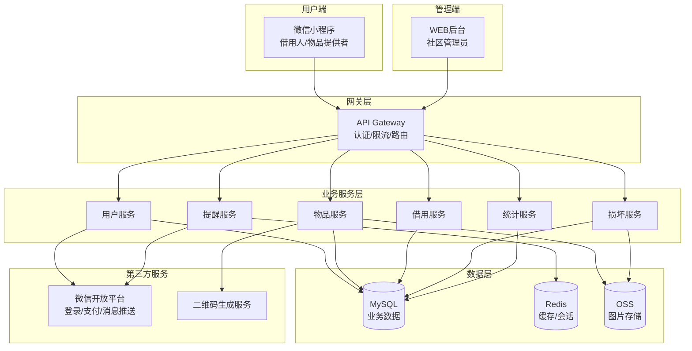
```mermaid
graph TD
    subgraph 用户端
        A1[微信小程序<br/>借用人/物品提供者]
    end

    subgraph 管理端
        A2[WEB后台<br/>社区管理员]
    end

    subgraph 网关层
        B1[API Gateway<br/>认证/限流/路由]
    end

    subgraph 业务服务层
        C1[用户服务]
        C2[物品服务]
        C3[借用服务]
        C4[提醒服务]
        C5[损坏服务]
        C6[统计服务]
    end

    subgraph 数据层
        D1[(MySQL<br/>业务数据)]
        D2[(Redis<br/>缓存/会话)]
        D3[(OSS<br/>图片存储)]
    end

    subgraph 第三方服务
        E1[微信开放平台<br/>登录/支付/消息推送]
        E2[二维码生成服务]
    end

    A1 --> B1
    A2 --> B1
    B1 --> C1
    B1 --> C2
    B1 --> C3
    B1 --> C4
    B1 --> C5
    B1 --> C6

    C1 --> D1
    C2 --> D1
    C2 --> D3
    C3 --> D1
    C4 --> D2
    C5 --> D1
    C5 --> D3
    C6 --> D1

    C1 --> E1
    C4 --> E1
    C2 --> E2
```

## 2.2 业务模块图

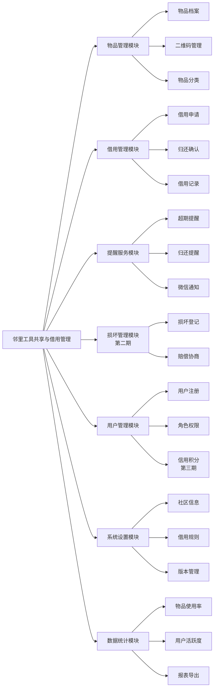
```mermaid
flowchart LR
    A[邻里工具共享与借用管理] --> B[物品管理模块]
    A --> C[借用管理模块]
    A --> D[提醒服务模块]
    A --> E[损坏管理模块<br/>第二期]
    A --> F[用户管理模块]
    A --> G[系统设置模块]
    A --> H[数据统计模块]

    B --> B1[物品档案]
    B --> B2[二维码管理]
    B --> B3[物品分类]

    C --> C1[借用申请]
    C --> C2[归还确认]
    C --> C3[借用记录]

    D --> D1[超期提醒]
    D --> D2[归还提醒]
    D --> D3[微信通知]

    E --> E1[损坏登记]
    E --> E2[赔偿协商]

    F --> F1[用户注册]
    F --> F2[角色权限]
    F --> F3[信用积分<br/>第三期]

    G --> G1[社区信息]
    G --> G2[借用规则]
    G --> G3[版本管理]

    H --> H1[物品使用率]
    H --> H2[用户活跃度]
    H --> H3[报表导出]
```

## 2.3 主业务流程

### 2.3.1 物品发布流程

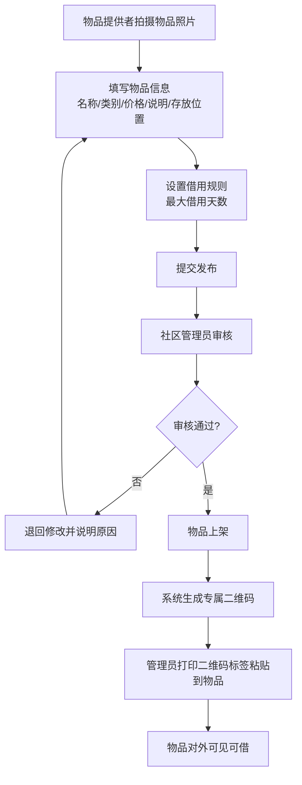
```mermaid
flowchart TD
    A[物品提供者拍摄物品照片] --> B[填写物品信息<br/>名称/类别/价格/说明/存放位置]
    B --> C[设置借用规则<br/>最大借用天数]
    C --> D[提交发布]
    D --> E[社区管理员审核]
    E --> F{审核通过?}
    F -->|否| G[退回修改并说明原因]
    G --> B
    F -->|是| H[物品上架]
    H --> I[系统生成专属二维码]
    I --> J[管理员打印二维码标签粘贴到物品]
    J --> K[物品对外可见可借]
```

### 2.3.2 借用与归还流程

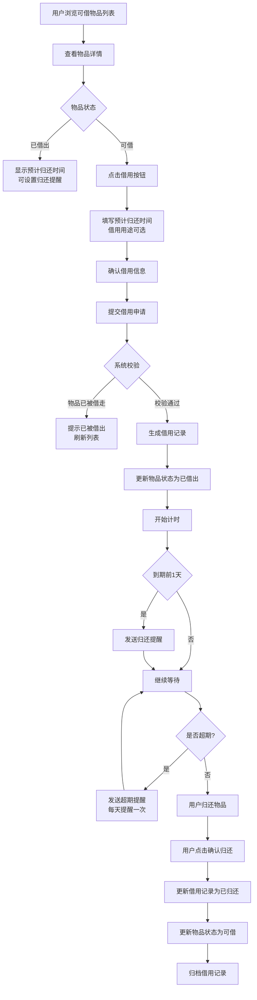
```mermaid
flowchart TD
    A[用户浏览可借物品列表] --> B[查看物品详情]
    B --> C{物品状态}
    C -->|已借出| D[显示预计归还时间<br/>可设置归还提醒]
    C -->|可借| E[点击借用按钮]
    E --> F[填写预计归还时间<br/>借用用途可选]
    F --> G[确认借用信息]
    G --> H[提交借用申请]
    H --> I{系统校验}
    I -->|物品已被借走| J[提示已被借出<br/>刷新列表]
    I -->|校验通过| K[生成借用记录]
    K --> L[更新物品状态为已借出]
    L --> M[开始计时]
    M --> N{到期前1天}
    N -->|是| O[发送归还提醒]
    N -->|否| P[继续等待]
    O --> P
    P --> Q{是否超期?}
    Q -->|是| R[发送超期提醒<br/>每天提醒一次]
    R --> P
    Q -->|否| S[用户归还物品]
    S --> T[用户点击确认归还]
    T --> U[更新借用记录为已归还]
    U --> V[更新物品状态为可借]
    V --> W[归档借用记录]
```

### 2.3.3 损坏登记与赔偿流程（第二期）

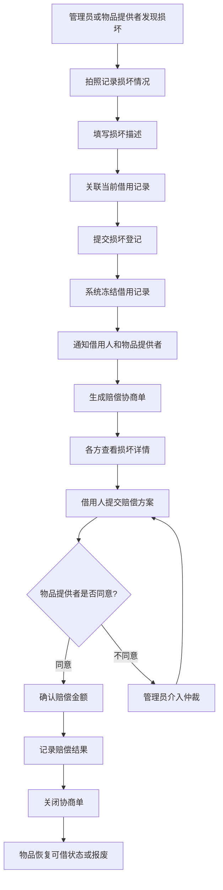
```mermaid
flowchart TD
    A[管理员或物品提供者发现损坏] --> B[拍照记录损坏情况]
    B --> C[填写损坏描述]
    C --> D[关联当前借用记录]
    D --> E[提交损坏登记]
    E --> F[系统冻结借用记录]
    F --> G[通知借用人和物品提供者]
    G --> H[生成赔偿协商单]
    H --> I[各方查看损坏详情]
    I --> J[借用人提交赔偿方案]
    J --> K{物品提供者是否同意?}
    K -->|同意| L[确认赔偿金额]
    L --> M[记录赔偿结果]
    M --> N[关闭协商单]
    N --> O[物品恢复可借状态或报废]
    K -->|不同意| P[管理员介入仲裁]
    P --> J
```

## 2.4 功能图/列表

| 功能模块 | 功能名称 | 优先级 | 功能描述 |
| --- | --- | --- | --- |
| **物品管理** | 新增物品 | P0 | 录入物品信息，生成专属二维码 |
| | 物品列表 | P0 | 展示所有物品档案，支持筛选搜索 |
| | 编辑物品 | P0 | 修改物品信息、更新照片 |
| | 删除/下架物品 | P0 | 删除或暂时下架不再共享的物品 |
| | 二维码管理 | P0 | 查看、重新生成、打印物品专属二维码 |
| **借用管理** | 一键借用 | P0 | 用户在物品详情页点击借用按钮发起借用 |
| | 扫码借用 | P0 | 扫描物品二维码自动识别并进入借用页面（第二期） |
| | 确认归还 | P0 | 用户对已归还的物品点击确认归还 |
| | 借用记录查询 | P0 | 查看当前借用中和历史借用记录 |
| | 续借申请 | P2 | 对即将到期的借用申请延长归还时间（第二期） |
| **提醒服务** | 超期提醒 | P0 | 借用超期后自动发送催还提醒 |
| | 归还提醒 | P1 | 借用到期前1天发送归还提醒 |
| | 微信服务通知 | P1 | 通过微信订阅消息推送提醒 |
| **损坏管理** | 损坏登记 | P1 | 拍照记录损坏情况，关联借用记录（第二期） |
| | 损坏记录列表 | P1 | 查看所有损坏登记记录（第二期） |
| | 赔偿协商 | P1 | 发起赔偿协商、记录协商过程、确认赔偿结果（第二期） |
| **用户管理** | 用户列表 | P0 | 查看社区/空间内所有注册用户信息 |
| | 用户详情 | P1 | 查看用户的借用历史、超期次数 |
| | 用户权限 | P0 | 设置用户角色（普通用户/物品提供者/管理员） |
| **系统设置** | 社区/空间信息 | P0 | 设置社区名称、地址、管理员信息等基础资料 |
| | 借用规则 | P0 | 设置默认借用时长、超期提醒时间、最大续借次数等 |
| | 版本管理 | P1 | 免费版/社区版功能权限控制 |
| **数据统计** | 物品使用率 | P2 | 统计各物品的借用频率、使用率排名（第二期） |
| | 用户活跃度 | P2 | 统计用户借用频次、按时归还率（第二期） |
| | 报表导出 | P2 | 支持将统计数据导出为Excel报表（第二期） |

## 2.5 你的产品有哪些端

| 序号 | 端名称 | 端类型 | 目标用户 | 说明 |
| --- | --- | --- | --- | --- |
| 1 | 用户端小程序 | 小程序端 | 普通用户（借用人）、物品提供者 | 社区居民通过微信小程序浏览可借物品、发起借用、确认归还、查看借用记录、管理发布的物品 |
| 2 | 管理端后台 | WEB端 | 社区管理员 | 物业人员、业委会成员、共享空间管理员、房东通过WEB后台管理物品档案、处理借用记录、发送催还提醒、登记损坏情况、查看统计数据 |

---

# 3 产品功能

## 3.1 用户端小程序功能

### 3.1.1 微信授权登录

**功能描述**

用户首次进入小程序时，通过微信授权快速获取用户信息（头像、昵称、openid），完成注册登录，无需手动填写账号密码。

**优先级与依赖说明：**

| 项 | 内容 |
| --- | --- |
| 优先级 | P0 |
| 依赖需求 | 无 |
| 前置条件 | 用户已安装微信且微信版本 >= 7.0 |

### 3.1.2 微信授权登录—详细流程

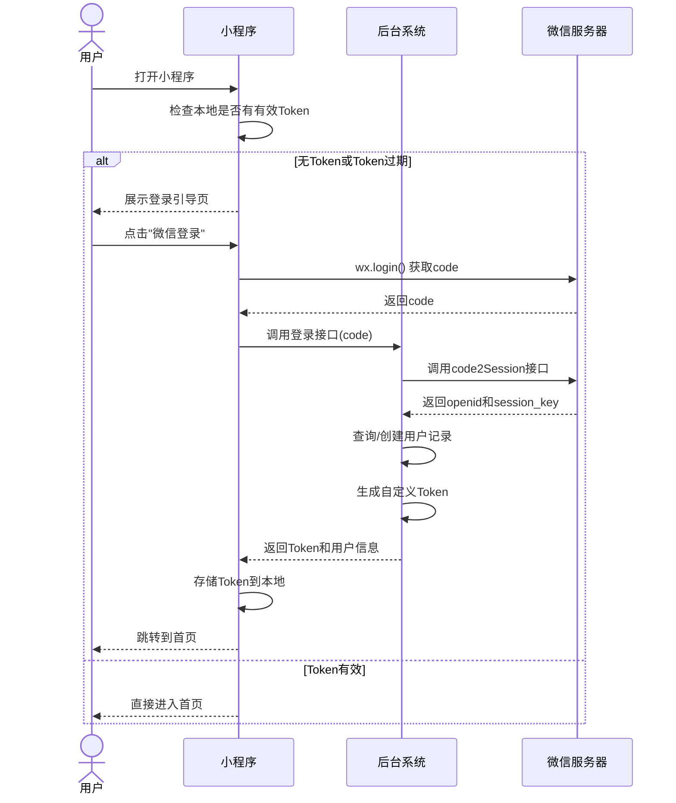
```mermaid
sequenceDiagram
    actor User as 用户
    participant Mini as 小程序
    participant Sys as 后台系统
    participant WX as 微信服务器

    User->>Mini: 打开小程序
    Mini->>Mini: 检查本地是否有有效Token
    alt 无Token或Token过期
        Mini-->>User: 展示登录引导页
        User->>Mini: 点击"微信登录"
        Mini->>WX: wx.login() 获取code
        WX-->>Mini: 返回code
        Mini->>Sys: 调用登录接口(code)
        Sys->>WX: 调用code2Session接口
        WX-->>Sys: 返回openid和session_key
        Sys->>Sys: 查询/创建用户记录
        Sys->>Sys: 生成自定义Token
        Sys-->>Mini: 返回Token和用户信息
        Mini->>Mini: 存储Token到本地
        Mini-->>User: 跳转到首页
    else Token有效
        Mini-->>User: 直接进入首页
    end
```

**业务规则说明：**

1. 用户首次登录时，系统自动创建用户记录，默认角色为"普通用户"
2. Token有效期为7天，过期后需重新授权登录
3. 若用户拒绝授权，可继续浏览物品列表，但无法进行借用操作
4. 用户信息（头像、昵称）变更时，下次登录自动同步更新

### 3.1.3 微信授权登录—主要原型

[🔐 登录授权原型](assets/prototypes/mini-program/login-widget.html)

**验收标准说明：**

- [ ] 正常流程：用户点击"微信登录"后，成功获取用户信息并跳转到首页，本地存储Token
- [ ] 异常流程：用户拒绝授权时，展示友好的提示文案，允许继续浏览但限制借用功能
- [ ] 性能要求：登录接口响应时间 < 500ms，Token校验时间 < 100ms

---

### 3.1.4 物品列表浏览

**功能描述**

用户进入小程序首页后，可浏览当前社区/空间内所有可借用的物品列表。支持按类别筛选、关键词搜索、状态筛选（全部/可借/已借出），帮助用户快速找到需要的物品。

**优先级与依赖说明：**

| 项 | 内容 |
| --- | --- |
| 优先级 | P0 |
| 依赖需求 | 微信授权登录 |
| 前置条件 | 用户已完成微信授权登录 |

### 3.1.5 物品列表浏览—详细流程

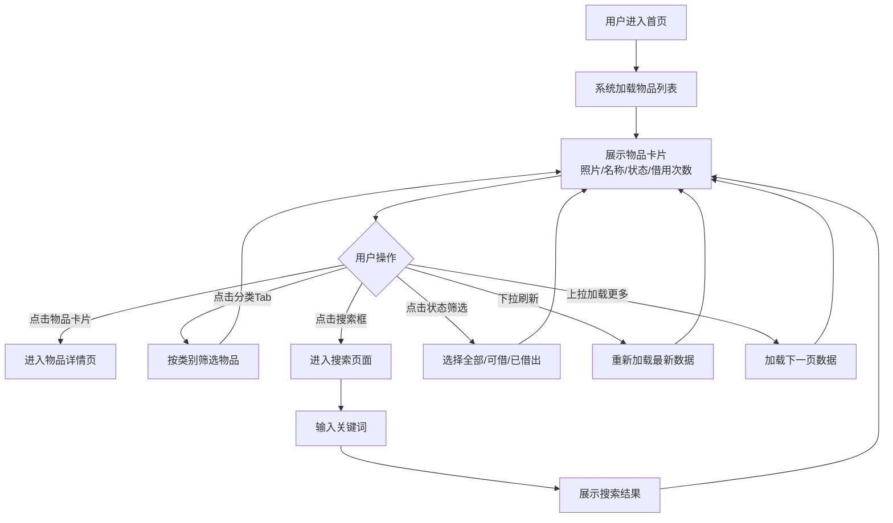
```mermaid
flowchart TD
    A[用户进入首页] --> B[系统加载物品列表]
    B --> C[展示物品卡片<br/>照片/名称/状态/借用次数]
    C --> D{用户操作}
    D -->|点击物品卡片| E[进入物品详情页]
    D -->|点击分类Tab| F[按类别筛选物品]
    F --> C
    D -->|点击搜索框| G[进入搜索页面]
    G --> H[输入关键词]
    H --> I[展示搜索结果]
    I --> C
    D -->|点击状态筛选| J[选择全部/可借/已借出]
    J --> C
    D -->|下拉刷新| K[重新加载最新数据]
    K --> C
    D -->|上拉加载更多| L[加载下一页数据]
    L --> C
```

**业务规则说明：**

1. 物品列表默认按"最近发布时间"倒序排列
2. 已借出的物品仍然展示，但在卡片上显示"已借出"标签和预计归还时间
3. 每页加载20条数据，上拉触底自动加载下一页
4. 搜索支持物品名称、描述的模糊匹配
5. 空状态展示友好的插画和引导文案："暂无可借物品，快去发布第一件吧"

### 3.1.6 物品列表浏览—主要原型

[📋 物品列表原型](assets/prototypes/mini-program/item-list-widget.html)

**验收标准说明：**

- [ ] 正常流程：用户进入首页后，1秒内加载并展示物品列表，支持下拉刷新和上拉加载
- [ ] 筛选功能：点击分类Tab或状态筛选后，列表实时更新，筛选条件保留在URL参数中
- [ ] 搜索功能：输入关键词后，实时展示搜索结果，支持清除搜索
- [ ] 异常状态：网络异常时展示"加载失败，点击重试"提示；空数据时展示空状态插画

---

### 3.1.7 物品详情查看

**功能描述**

用户点击物品卡片后进入物品详情页，查看物品的完整信息，包括多张照片、名称、类别、购入价格、购入时间、使用说明、存放位置、当前借用状态、历史借用次数等。若物品可借，可直接点击"借用"按钮发起借用。

**优先级与依赖说明：**

| 项 | 内容 |
| --- | --- |
| 优先级 | P0 |
| 依赖需求 | 物品列表浏览 |
| 前置条件 | 用户已完成微信授权登录 |

### 3.1.8 物品详情查看—详细流程

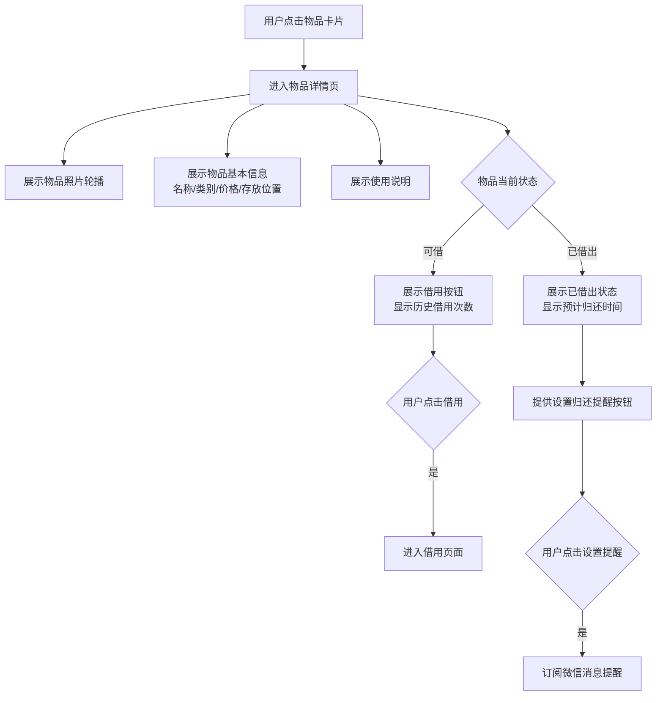
```mermaid
flowchart TD
    A[用户点击物品卡片] --> B[进入物品详情页]
    B --> C[展示物品照片轮播]
    B --> D[展示物品基本信息<br/>名称/类别/价格/存放位置]
    B --> E[展示使用说明]
    B --> F{物品当前状态}
    F -->|可借| G[展示借用按钮<br/>显示历史借用次数]
    F -->|已借出| H[展示已借出状态<br/>显示预计归还时间]
    H --> I[提供设置归还提醒按钮]
    G --> J{用户点击借用}
    J -->|是| K[进入借用页面]
    I --> L{用户点击设置提醒}
    L -->|是| M[订阅微信消息提醒]
```

**业务规则说明：**

1. 照片支持左右滑动查看，最多展示9张照片
2. 若物品已借出，"借用"按钮置灰，显示"已借出，预计X月X日归还"
3. 历史借用次数展示格式："已被借用X次"
4. 使用说明中的换行和特殊字符正常展示
5. 存放位置支持点击复制，方便用户查找

### 3.1.9 物品详情查看—主要原型

[📄 物品详情原型](assets/prototypes/mini-program/item-detail-widget.html)

**验收标准说明：**

- [ ] 正常流程：用户点击物品卡片后，1秒内加载并展示物品详情，照片轮播可左右滑动
- [ ] 状态展示：物品可借时展示绿色"立即借用"按钮；已借出时展示灰色状态标签和预计归还时间
- [ ] 交互功能：照片轮播流畅，存放位置点击后复制到剪贴板并提示"已复制"
- [ ] 异常状态：物品不存在时展示"物品已被删除"提示页

---

### 3.1.10 一键借用

**功能描述**

用户在物品详情页点击"借用"按钮后，进入借用确认页面，填写预计归还时间和借用用途（可选），确认后提交借用申请。系统校验物品状态后生成借用记录，物品状态更新为"已借出"。

**优先级与依赖说明：**

| 项 | 内容 |
| --- | --- |
| 优先级 | P0 |
| 依赖需求 | 物品详情查看 |
| 前置条件 | 物品状态为"可借"，用户已完成微信授权登录 |

### 3.1.11 一键借用—详细流程

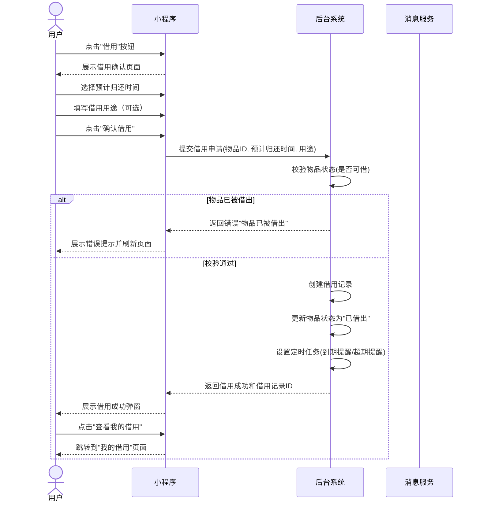
```mermaid
sequenceDiagram
    actor User as 用户
    participant Mini as 小程序
    participant Sys as 后台系统
    participant Msg as 消息服务

    User->>Mini: 点击"借用"按钮
    Mini-->>User: 展示借用确认页面
    User->>Mini: 选择预计归还时间
    User->>Mini: 填写借用用途（可选）
    User->>Mini: 点击"确认借用"
    Mini->>Sys: 提交借用申请(物品ID, 预计归还时间, 用途)
    Sys->>Sys: 校验物品状态(是否可借)
    alt 物品已被借出
        Sys-->>Mini: 返回错误"物品已被借出"
        Mini-->>User: 展示错误提示并刷新页面
    else 校验通过
        Sys->>Sys: 创建借用记录
        Sys->>Sys: 更新物品状态为"已借出"
        Sys->>Sys: 设置定时任务(到期提醒/超期提醒)
        Sys-->>Mini: 返回借用成功和借用记录ID
        Mini-->>User: 展示借用成功弹窗
        User->>Mini: 点击"查看我的借用"
        Mini-->>User: 跳转到"我的借用"页面
    end
```

**业务规则说明：**

1. 预计归还时间必须大于当前时间，且不超过系统设置的最大借用天数（默认7天）
2. 借用用途为选填项，最多200字
3. 同一用户同一时间只能借用同一物品一次
4. 借用成功后，系统自动设置到期前1天的归还提醒和超期后的催还提醒
5. 借用成功后，物品提供者收到微信消息通知："您的物品[物品名称]被[用户昵称]借走，预计X月X日归还"

### 3.1.12 一键借用—主要原型

[📝 借用确认原型](assets/prototypes/mini-program/borrow-widget.html)

**验收标准说明：**

- [ ] 正常流程：用户选择预计归还时间并确认后，1秒内生成借用记录，物品状态更新为"已借出"
- [ ] 时间校验：预计归还时间不能早于当前时间，不能晚于最大借用天数
- [ ] 并发控制：若物品在用户确认期间被他人借走，展示"物品已被借出"提示并刷新页面
- [ ] 成功反馈：借用成功后展示成功弹窗，提供"查看我的借用"和"返回首页"两个按钮

---

### 3.1.13 我的借用

**功能描述**

用户查看当前正在借用中的物品列表和历史借用记录。借用中列表展示物品照片、名称、借出时间、预计归还时间、剩余天数，支持一键确认归还。历史记录展示所有已归还的借用记录，包含借用时间、归还时间、是否超期。

**优先级与依赖说明：**

| 项 | 内容 |
| --- | --- |
| 优先级 | P0 |
| 依赖需求 | 一键借用 |
| 前置条件 | 用户已完成微信授权登录 |

### 3.1.14 我的借用—详细流程

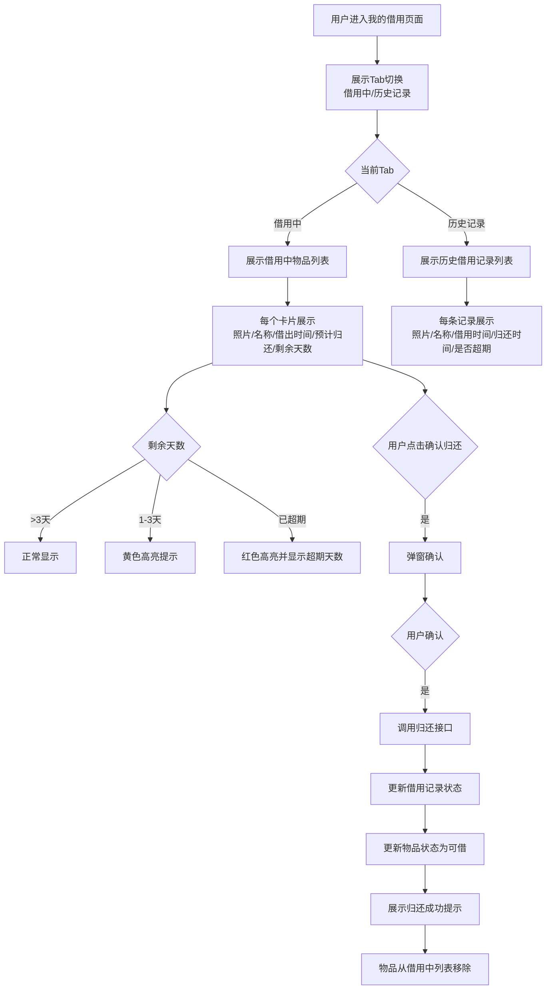
```mermaid
flowchart TD
    A[用户进入我的借用页面] --> B[展示Tab切换<br/>借用中/历史记录]
    B --> C{当前Tab}
    C -->|借用中| D[展示借用中物品列表]
    D --> E[每个卡片展示<br/>照片/名称/借出时间/预计归还/剩余天数]
    E --> F{剩余天数}
    F -->|>3天| G[正常显示]
    F -->|1-3天| H[黄色高亮提示]
    F -->|已超期| I[红色高亮并显示超期天数]
    E --> J{用户点击确认归还}
    J -->|是| K[弹窗确认]
    K --> L{用户确认}
    L -->|是| M[调用归还接口]
    M --> N[更新借用记录状态]
    N --> O[更新物品状态为可借]
    O --> P[展示归还成功提示]
    P --> Q[物品从借用中列表移除]
    C -->|历史记录| R[展示历史借用记录列表]
    R --> S[每条记录展示<br/>照片/名称/借用时间/归还时间/是否超期]
```

**业务规则说明：**

1. 借用中列表按"剩余天数"升序排列（即将到期的排在前面）
2. 剩余天数 <= 3天时，卡片背景变为浅黄色提醒
3. 已超期的借用记录，卡片背景变为浅红色，显示"已超期X天"
4. 确认归还时弹出二次确认弹窗："确认已归还[物品名称]？"
5. 历史记录按"归还时间"倒序排列
6. 超期的历史记录显示红色"超期"标签

### 3.1.15 我的借用—主要原型

[📚 我的借用原型](assets/prototypes/mini-program/my-borrows-widget.html)

**验收标准说明：**

- [ ] 正常流程：用户进入页面后，1秒内加载借用中和历史记录列表
- [ ] 状态提醒：剩余天数 <= 3天时黄色高亮，已超期时红色高亮并显示超期天数
- [ ] 归还操作：点击"确认归还"后弹出确认弹窗，确认后物品从借用中列表移除
- [ ] Tab切换：借用中和历史记录Tab切换流畅，状态保留

---

### 3.1.16 消息中心

**功能描述**

用户接收系统发送的各类通知消息，包括超期提醒、归还提醒、损坏纠纷通知等。消息列表展示消息标题、内容摘要、发送时间，支持点击查看详情和标记已读。

**优先级与依赖说明：**

| 项 | 内容 |
| --- | --- |
| 优先级 | P0 |
| 依赖需求 | 微信授权登录 |
| 前置条件 | 用户已完成微信授权登录 |

### 3.1.17 消息中心—详细流程

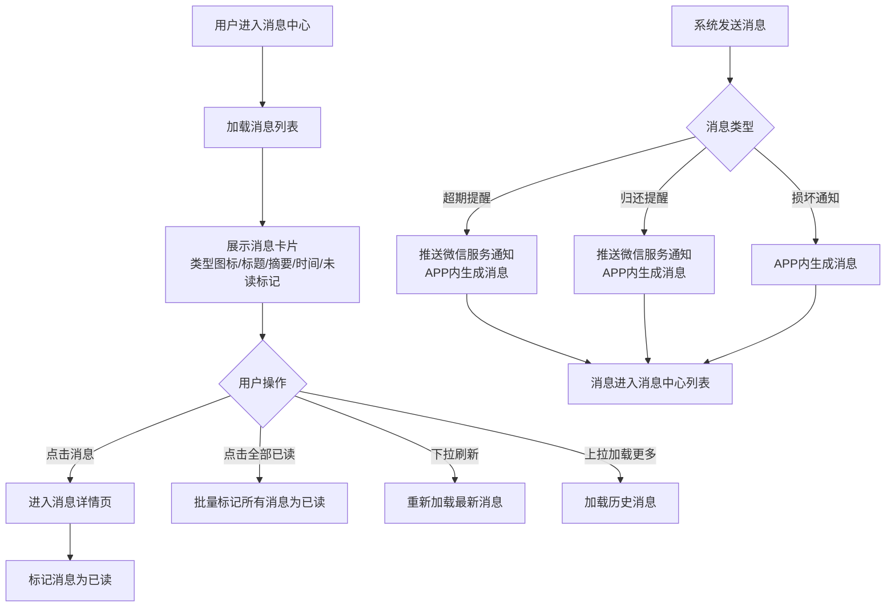
```mermaid
flowchart TD
    A[用户进入消息中心] --> B[加载消息列表]
    B --> C[展示消息卡片<br/>类型图标/标题/摘要/时间/未读标记]
    C --> D{用户操作}
    D -->|点击消息| E[进入消息详情页]
    E --> F[标记消息为已读]
    D -->|点击全部已读| G[批量标记所有消息为已读]
    D -->|下拉刷新| H[重新加载最新消息]
    D -->|上拉加载更多| I[加载历史消息]

    J[系统发送消息] --> K{消息类型}
    K -->|超期提醒| L[推送微信服务通知<br/>APP内生成消息]
    K -->|归还提醒| M[推送微信服务通知<br/>APP内生成消息]
    K -->|损坏通知| N[APP内生成消息]
    L --> O[消息进入消息中心列表]
    M --> O
    N --> O
```

**业务规则说明：**

1. 消息类型包括：超期提醒、归还提醒、损坏纠纷通知、系统公告
2. 未读消息在卡片右上角显示红色圆点
3. 消息按"发送时间"倒序排列
4. 点击消息后自动标记为已读，红色圆点消失
5. 超期提醒和归还提醒同时通过微信服务通知推送
6. 每页加载20条消息，上拉触底自动加载下一页

### 3.1.18 消息中心—主要原型

[🔔 消息中心原型](assets/prototypes/mini-program/message-center-widget.html)

**验收标准说明：**

- [ ] 正常流程：用户进入消息中心后，1秒内加载消息列表，未读消息显示红色圆点
- [ ] 消息详情：点击消息后进入详情页，消息自动标记为已读
- [ ] 批量操作：点击"全部已读"后，所有未读消息标记为已读
- [ ] 空状态：无消息时展示友好的空状态插画："暂无新消息"

---

### 3.1.19 个人中心

**功能描述**

用户管理个人基本信息（昵称、手机号、所在楼栋/房间号），查看自己发布的共享物品列表，查看个人信用积分（第三期）。

**优先级与依赖说明：**

| 项 | 内容 |
| --- | --- |
| 优先级 | P0 |
| 依赖需求 | 微信授权登录 |
| 前置条件 | 用户已完成微信授权登录 |

### 3.1.20 个人中心—详细流程

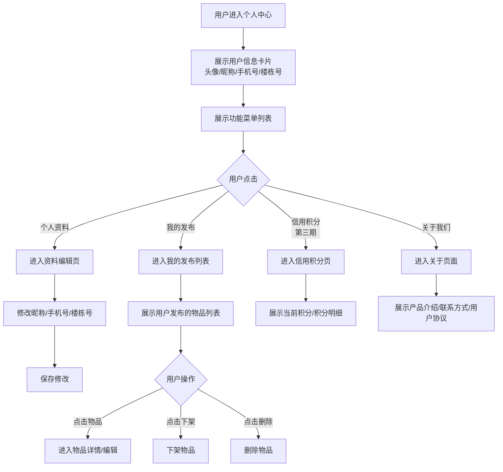
```mermaid
flowchart TD
    A[用户进入个人中心] --> B[展示用户信息卡片<br/>头像/昵称/手机号/楼栋号]
    B --> C[展示功能菜单列表]
    C --> D{用户点击}
    D -->|个人资料| E[进入资料编辑页]
    E --> F[修改昵称/手机号/楼栋号]
    F --> G[保存修改]
    D -->|我的发布| H[进入我的发布列表]
    H --> I[展示用户发布的物品列表]
    I --> J{用户操作}
    J -->|点击物品| K[进入物品详情/编辑]
    J -->|点击下架| L[下架物品]
    J -->|点击删除| M[删除物品]
    D -->|信用积分<br/>第三期| N[进入信用积分页]
    N --> O[展示当前积分/积分明细]
    D -->|关于我们| P[进入关于页面]
    P --> Q[展示产品介绍/联系方式/用户协议]
```

**业务规则说明：**

1. 头像和昵称从微信自动同步，不支持手动修改
2. 手机号和楼栋号为必填项，未填写时提示"请完善个人信息"
3. "我的发布"列表展示用户发布的所有物品，包括已上架、已下架、审核中状态
4. 已下架的物品可重新上架
5. 删除物品前需确认："删除后无法恢复，确认删除？"
6. 信用积分功能在第三期实现，当前版本展示"即将上线"

### 3.1.21 个人中心—主要原型

[👤 个人中心原型](assets/prototypes/mini-program/profile-widget.html)

**验收标准说明：**

- [ ] 正常流程：用户进入个人中心后，展示完整的用户信息和功能菜单
- [ ] 资料编辑：点击"个人资料"后进入编辑页，修改后保存成功并同步更新个人信息卡片
- [ ] 我的发布：点击"我的发布"后展示用户发布的物品列表，支持下架、删除操作
- [ ] 权限控制：未填写手机号和楼栋号时，点击"借用"按钮提示"请先完善个人信息"

---

## 3.2 管理端后台功能

### 3.2.1 控制台数据概览

**功能描述**

管理员登录后台后，首页展示社区/空间的整体数据概览，包括物品统计（总数、可借数量、已借出数量、超期未还数量）、借用统计（今日借用次数、本月借用次数、活跃用户数）、待办提醒（待处理的损坏登记、超期未还提醒）。

**优先级与依赖说明：**

| 项 | 内容 |
| --- | --- |
| 优先级 | P0 |
| 依赖需求 | 无 |
| 前置条件 | 管理员已登录后台 |

### 3.2.2 控制台数据概览—详细流程

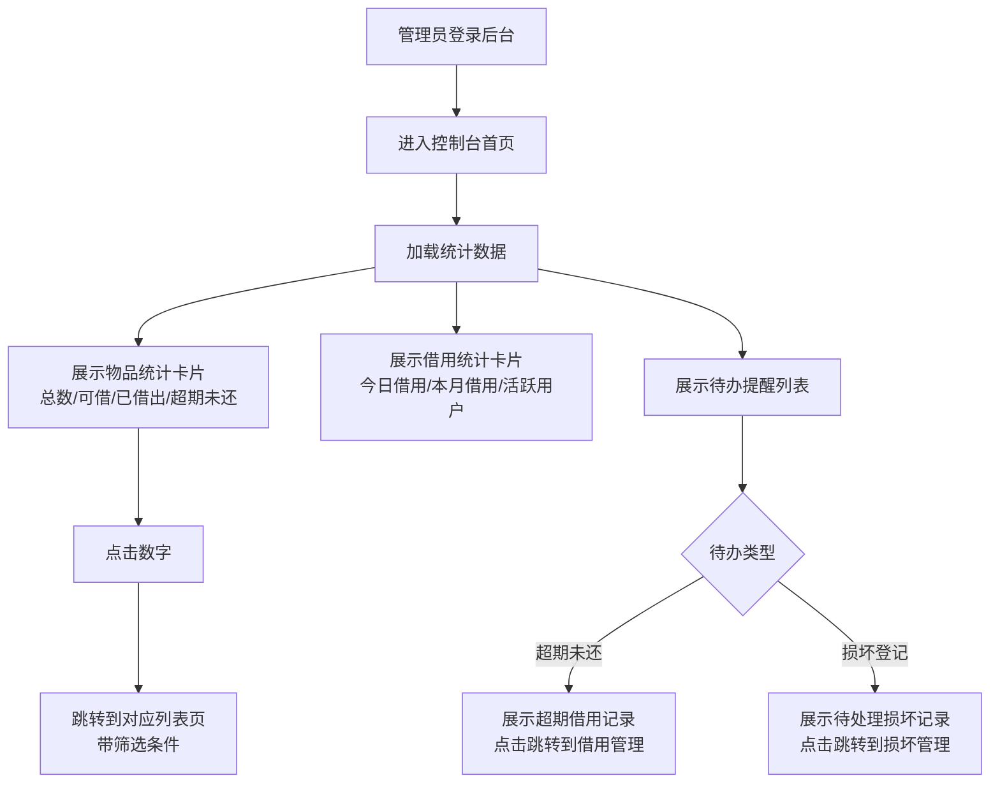
```mermaid
flowchart TD
    A[管理员登录后台] --> B[进入控制台首页]
    B --> C[加载统计数据]
    C --> D[展示物品统计卡片<br/>总数/可借/已借出/超期未还]
    C --> E[展示借用统计卡片<br/>今日借用/本月借用/活跃用户]
    C --> F[展示待办提醒列表]
    F --> G{待办类型}
    G -->|超期未还| H[展示超期借用记录<br/>点击跳转到借用管理]
    G -->|损坏登记| I[展示待处理损坏记录<br/>点击跳转到损坏管理]
    D --> J[点击数字]
    J --> K[跳转到对应列表页<br/>带筛选条件]
```

**业务规则说明：**

1. 统计数据每5分钟自动刷新一次
2. 超期未还数量 > 0 时，卡片数字显示红色
3. 待办提醒列表最多展示10条，按"创建时间"倒序排列
4. 点击物品统计数字可跳转到物品列表页，并自动应用对应状态筛选
5. 点击超期未还提醒可跳转到借用管理页，筛选条件为"超期未还"

### 3.2.3 控制台数据概览—主要原型

[📊 控制台概览原型](assets/prototypes/admin-web/dashboard-widget.html)

**验收标准说明：**

- [ ] 正常流程：管理员登录后，2秒内加载并展示所有统计数据和待办提醒
- [ ] 数据准确：统计数据与数据库实际数据一致，超期未还数量实时更新
- [ ] 跳转功能：点击统计数字可跳转到对应列表页，并应用正确的筛选条件
- [ ] 待办提醒：点击待办项可跳转到对应详情页或列表页

---

### 3.2.4 物品档案管理

**功能描述**

管理员新增、编辑、删除、上下架共享物品。新增物品时录入物品信息（名称、类别、照片、购入价格、使用说明、存放位置），系统自动生成专属二维码。支持物品列表查看、筛选搜索、批量操作。

**优先级与依赖说明：**

| 项 | 内容 |
| --- | --- |
| 优先级 | P0 |
| 依赖需求 | 控制台数据概览 |
| 前置条件 | 管理员已登录后台 |

### 3.2.5 物品档案管理—详细流程

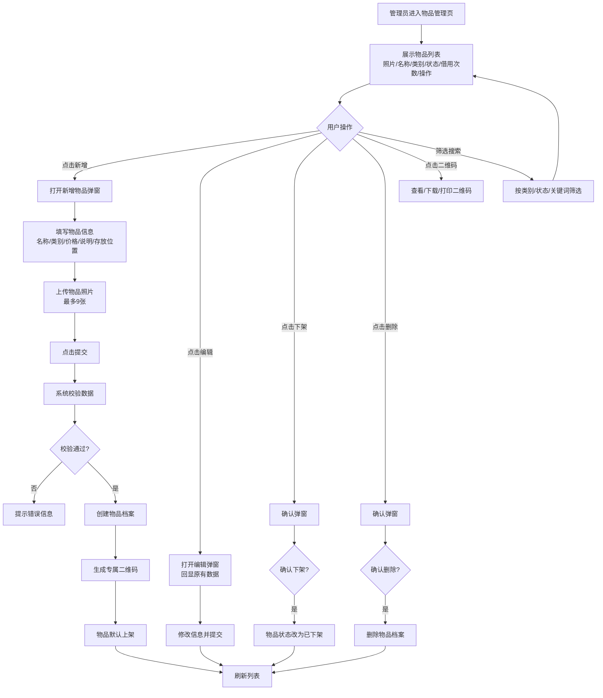
```mermaid
flowchart TD
    A[管理员进入物品管理页] --> B[展示物品列表<br/>照片/名称/类别/状态/借用次数/操作]
    B --> C{用户操作}
    C -->|点击新增| D[打开新增物品弹窗]
    D --> E[填写物品信息<br/>名称/类别/价格/说明/存放位置]
    E --> F[上传物品照片<br/>最多9张]
    F --> G[点击提交]
    G --> H[系统校验数据]
    H --> I{校验通过?}
    I -->|否| J[提示错误信息]
    I -->|是| K[创建物品档案]
    K --> L[生成专属二维码]
    L --> M[物品默认上架]
    M --> N[刷新列表]
    C -->|点击编辑| O[打开编辑弹窗<br/>回显原有数据]
    O --> P[修改信息并提交]
    P --> N
    C -->|点击下架| Q[确认弹窗]
    Q --> R{确认下架?}
    R -->|是| S[物品状态改为已下架]
    S --> N
    C -->|点击删除| T[确认弹窗]
    T --> U{确认删除?}
    U -->|是| V[删除物品档案]
    V --> N
    C -->|点击二维码| W[查看/下载/打印二维码]
    C -->|筛选搜索| X[按类别/状态/关键词筛选]
    X --> B
```

**业务规则说明：**

1. 物品名称为必填项，最多50字
2. 类别为必选项，包括：工具类、电器类、运动类、厨房类、其他
3. 照片至少上传1张，最多9张，第一张为封面
4. 购入价格为选填项，最多保留2位小数
5. 使用说明和存放位置为选填项，使用说明最多500字
6. 物品删除前需确认，删除后无法恢复
7. 已借出的物品不允许下架或删除，需先归还
8. 二维码自动生成，支持下载PNG格式和直接打印

### 3.2.6 物品档案管理—主要原型

[📦 物品管理原型](assets/prototypes/admin-web/item-management-widget.html)

**验收标准说明：**

- [ ] 正常流程：管理员可成功新增、编辑、删除、上下架物品，操作后列表实时更新
- [ ] 表单校验：必填项未填写时提示错误，照片未上传时无法提交
- [ ] 二维码生成：新增物品成功后自动生成二维码，支持下载和打印
- [ ] 删除保护：已借出的物品点击下架或删除时，提示"物品已借出，请先归还"

---

### 3.2.7 借用记录管理

**功能描述**

管理员查看所有借用记录，支持按状态（借用中/已归还/超期未还）、借用人、物品名称筛选。对超期未还的记录可手动发送催还提醒，对已归还的物品可手动标记为已归还（适用于借用人未操作确认的情况）。

**优先级与依赖说明：**

| 项 | 内容 |
| --- | --- |
| 优先级 | P0 |
| 依赖需求 | 物品档案管理 |
| 前置条件 | 管理员已登录后台 |

### 3.2.8 借用记录管理—详细流程

```mermaid
flowchart TD
    A[管理员进入借用管理页] --> B[展示借用记录列表<br/>物品名称/借用人/借出时间/预计归还/实际归还/状态/操作]
    B --> C{用户操作}
    C -->|筛选| D[按状态/借用人/物品筛选]
    D --> B
    C -->|搜索| E[输入物品名称或借用人]
    E --> B
    C -->|点击发送催还| F{记录状态}
    F -->|超期未还| G[确认弹窗]
    G --> H{确认发送?}
    H -->|是| I[发送催还提醒<br/>微信通知+站内消息]
    I --> J[记录发送日志]
    F -->|借用中| K[提示"未超期，无需催还"]
    C -->|点击手动归还| L[确认弹窗]
    L --> M{确认标记为已归还?}
    M -->|是| N[更新借用记录状态]
    N --> O[更新物品状态为可借]
    O --> P[刷新列表]
    C -->|点击查看详情| Q[展示借用详情弹窗<br/>包含借用人信息/借用时间/归还时间/超期天数]
```

**业务规则说明：**

1. 借用记录按"借出时间"倒序排列
2. 超期未还的记录高亮显示（红色背景）
3. 发送催还提醒后，借用人收到微信服务通知和站内消息
4. 手动归还需要二次确认，确认后物品状态自动更新为"可借"
5. 借用详情展示借用人的完整信息（昵称、手机号、楼栋号）
6. 支持导出借用记录为Excel（第二期）

### 3.2.9 借用记录管理—主要原型

[📋 借用管理原型](assets/prototypes/admin-web/borrow-management-widget.html)

**验收标准说明：**

- [ ] 正常流程：管理员可查看所有借用记录，筛选和搜索功能正常
- [ ] 催还功能：超期未还记录可发送催还提醒，发送后记录日志
- [ ] 手动归还：已归还物品可手动标记为已归还，状态实时更新
- [ ] 详情查看：点击查看详情可展示完整的借用信息和借用人信息

---

### 3.2.10 损坏登记与管理（第二期）

**功能描述**

管理员或物品提供者发现物品损坏时，拍照记录损坏情况，填写损坏描述，关联对应借用记录，提交损坏登记。系统自动通知借用人，生成赔偿协商单，支持各方协商赔偿方案，记录协商过程和结果。

**优先级与依赖说明：**

| 项 | 内容 |
| --- | --- |
| 优先级 | P1 |
| 依赖需求 | 借用记录管理 |
| 前置条件 | 管理员已登录后台，第二期功能开放 |

### 3.2.11 损坏登记与管理—详细流程

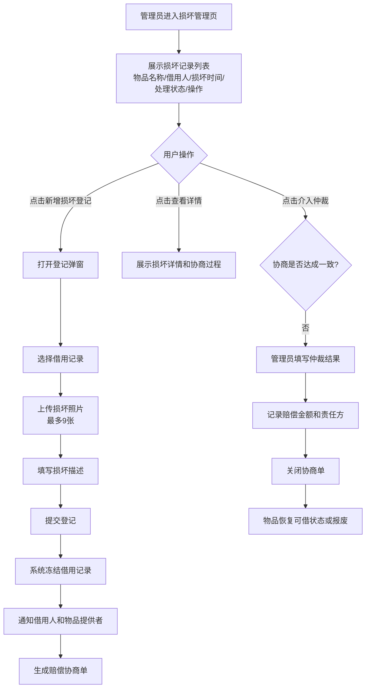
```mermaid
flowchart TD
    A[管理员进入损坏管理页] --> B[展示损坏记录列表<br/>物品名称/借用人/损坏时间/处理状态/操作]
    B --> C{用户操作}
    C -->|点击新增损坏登记| D[打开登记弹窗]
    D --> E[选择借用记录]
    E --> F[上传损坏照片<br/>最多9张]
    F --> G[填写损坏描述]
    G --> H[提交登记]
    H --> I[系统冻结借用记录]
    I --> J[通知借用人和物品提供者]
    J --> K[生成赔偿协商单]
    C -->|点击查看详情| L[展示损坏详情和协商过程]
    C -->|点击介入仲裁| M{协商是否达成一致?}
    M -->|否| N[管理员填写仲裁结果]
    N --> O[记录赔偿金额和责任方]
    O --> P[关闭协商单]
    P --> Q[物品恢复可借状态或报废]
```

**业务规则说明：**

1. 损坏登记必须关联一条借用记录
2. 损坏照片至少上传1张，最多9张
3. 损坏描述为必填项，最多500字
4. 提交损坏登记后，借用记录自动冻结，不允许确认归还
5. 赔偿协商单包含：损坏详情、借用人方案、物品提供者意见、协商记录、最终结果
6. 管理员仲裁后，协商单关闭，物品状态根据情况恢复或报废

### 3.2.12 损坏登记与管理—主要原型

[🔧 损坏管理原型](assets/prototypes/admin-web/damage-management-widget.html)

**验收标准说明：**

- [ ] 正常流程：管理员可成功新增损坏登记，关联借用记录，上传照片，填写描述
- [ ] 通知功能：提交登记后，借用人和物品提供者收到通知
- [ ] 协商流程：各方可查看损坏详情，提交赔偿方案，记录协商过程
- [ ] 仲裁功能：管理员可介入仲裁，记录最终结果，关闭协商单

---

### 3.2.13 用户管理

**功能描述**

管理员查看社区/空间内所有注册用户信息，包括用户基本信息、借用历史、超期次数、信用积分（第三期）。支持用户查询、查看详情、设置用户角色（普通用户/物品提供者/管理员）。

**优先级与依赖说明：**

| 项 | 内容 |
| --- | --- |
| 优先级 | P0 |
| 依赖需求 | 控制台数据概览 |
| 前置条件 | 管理员已登录后台 |

### 3.2.14 用户管理—详细流程

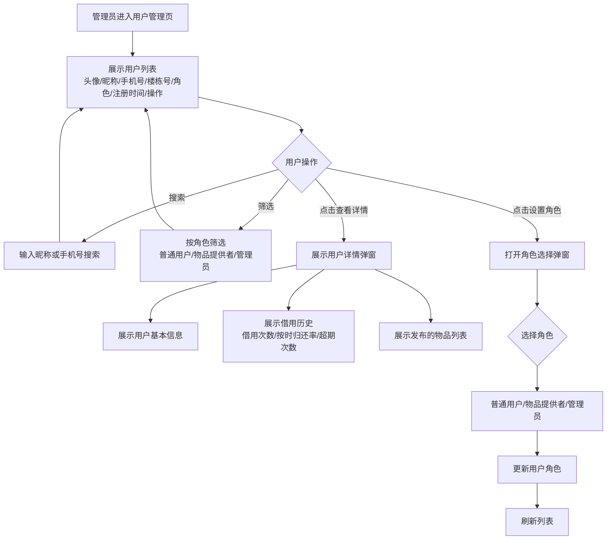
```mermaid
flowchart TD
    A[管理员进入用户管理页] --> B[展示用户列表<br/>头像/昵称/手机号/楼栋号/角色/注册时间/操作]
    B --> C{用户操作}
    C -->|搜索| D[输入昵称或手机号搜索]
    D --> B
    C -->|筛选| E[按角色筛选<br/>普通用户/物品提供者/管理员]
    E --> B
    C -->|点击查看详情| F[展示用户详情弹窗]
    F --> G[展示用户基本信息]
    F --> H[展示借用历史<br/>借用次数/按时归还率/超期次数]
    F --> I[展示发布的物品列表]
    C -->|点击设置角色| J[打开角色选择弹窗]
    J --> K{选择角色}
    K --> L[普通用户/物品提供者/管理员]
    L --> M[更新用户角色]
    M --> N[刷新列表]
```

**业务规则说明：**

1. 用户列表按"注册时间"倒序排列
2. 手机号中间4位脱敏展示（如：138****1234）
3. 用户详情展示借用历史统计：总借用次数、按时归还率、超期次数
4. 角色权限：普通用户只能借用；物品提供者可以发布物品；管理员可以管理所有功能
5. 一个用户可以同时拥有多个角色（如既是普通用户又是物品提供者）
6. 至少保留一个管理员角色，不允许将最后一个管理员降级

### 3.2.15 用户管理—主要原型

[👥 用户管理原型](assets/prototypes/admin-web/user-management-widget.html)

**验收标准说明：**

- [ ] 正常流程：管理员可查看所有用户信息，搜索和筛选功能正常
- [ ] 详情查看：点击查看详情可展示用户完整信息和借用历史统计
- [ ] 角色设置：可成功修改用户角色，权限实时更新
- [ ] 权限保护：不允许将最后一个管理员降级，提示"至少保留一个管理员"

---

### 3.2.16 系统设置

**功能描述**

管理员设置社区/空间的基础信息（名称、地址、管理员联系方式）和借用规则（默认借用时长、超期提醒时间、最大续借次数、是否允许物品提供者自行发布物品）。

**优先级与依赖说明：**

| 项 | 内容 |
| --- | --- |
| 优先级 | P0 |
| 依赖需求 | 无 |
| 前置条件 | 管理员已登录后台 |

### 3.2.17 系统设置—详细流程

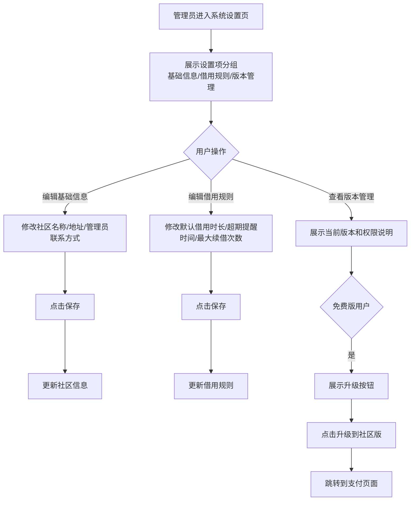
```mermaid
flowchart TD
    A[管理员进入系统设置页] --> B[展示设置项分组<br/>基础信息/借用规则/版本管理]
    B --> C{用户操作}
    C -->|编辑基础信息| D[修改社区名称/地址/管理员联系方式]
    D --> E[点击保存]
    E --> F[更新社区信息]
    C -->|编辑借用规则| G[修改默认借用时长/超期提醒时间/最大续借次数]
    G --> H[点击保存]
    H --> I[更新借用规则]
    C -->|查看版本管理| J[展示当前版本和权限说明]
    J --> K{免费版用户}
    K -->|是| L[展示升级按钮]
    L --> M[点击升级到社区版]
    M --> N[跳转到支付页面]
```

**业务规则说明：**

1. 社区名称为必填项，最多50字
2. 地址为选填项，最多200字
3. 管理员联系方式为必填项，支持手机号和邮箱
4. 默认借用时长：1-30天，默认7天
5. 超期提醒时间：每天上午10点，可设置提醒频率（每天/每2天/每3天）
6. 最大续借次数：0-5次，默认1次（第二期功能）
7. 免费版最多管理20件物品，社区版不限物品数量
8. 修改设置后即时生效，影响后续所有借用操作

### 3.2.18 系统设置—主要原型

[⚙️ 系统设置原型](assets/prototypes/admin-web/settings-widget.html)

**验收标准说明：**

- [ ] 正常流程：管理员可成功修改社区信息和借用规则，保存后即时生效
- [ ] 表单校验：必填项未填写时提示错误，数值超出范围时提示"请输入1-30之间的数字"
- [ ] 版本管理：免费版用户可查看升级说明，点击升级跳转到支付页面
- [ ] 权限控制：只有管理员角色可以访问系统设置页面

---

### 3.2.19 数据统计与报表（第二期）

**功能描述**

管理员查看社区物品使用情况和用户活跃度统计，包括物品使用率排名、用户借用频次排名、按时归还率统计。支持按时间范围筛选（最近7天/30天/90天/自定义），支持将统计数据导出为Excel报表。

**优先级与依赖说明：**

| 项 | 内容 |
| --- | --- |
| 优先级 | P2 |
| 依赖需求 | 物品档案管理、借用记录管理 |
| 前置条件 | 管理员已登录后台，第二期功能开放 |

### 3.2.20 数据统计与报表—详细流程

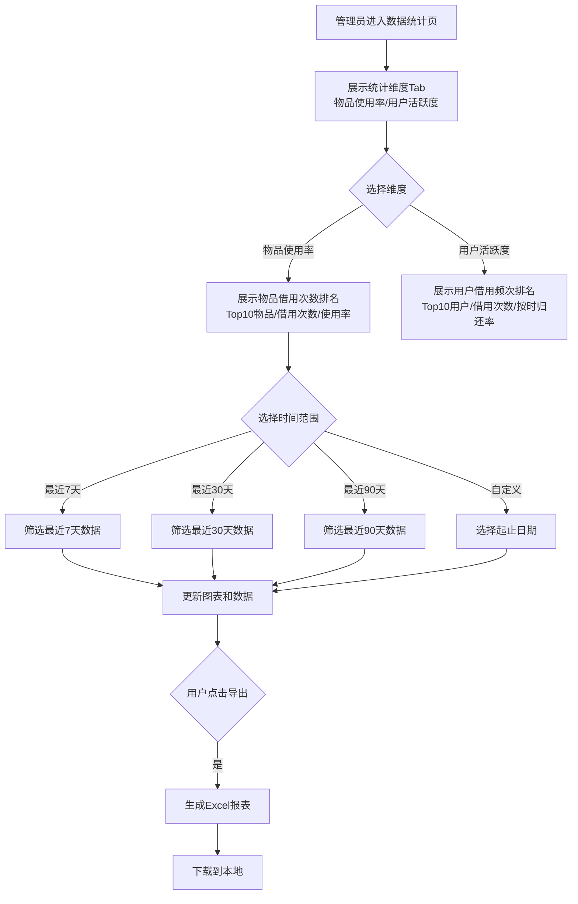
```mermaid
flowchart TD
    A[管理员进入数据统计页] --> B[展示统计维度Tab<br/>物品使用率/用户活跃度]
    B --> C{选择维度}
    C -->|物品使用率| D[展示物品借用次数排名<br/>Top10物品/借用次数/使用率]
    C -->|用户活跃度| E[展示用户借用频次排名<br/>Top10用户/借用次数/按时归还率]
    D --> F{选择时间范围}
    F -->|最近7天| G[筛选最近7天数据]
    F -->|最近30天| H[筛选最近30天数据]
    F -->|最近90天| I[筛选最近90天数据]
    F -->|自定义| J[选择起止日期]
    G --> K[更新图表和数据]
    H --> K
    I --> K
    J --> K
    K --> L{用户点击导出}
    L -->|是| M[生成Excel报表]
    M --> N[下载到本地]
```

**业务规则说明：**

1. 统计数据每10分钟自动刷新一次
2. 物品使用率 = 借用次数 / (物品数量 × 统计天数) × 100%
3. 按时归还率 = 按时归还次数 / 总归还次数 × 100%
4. Top10排名按"借用次数"降序排列
5. 导出的Excel包含完整数据（所有物品/用户，不限于Top10）
6. 自定义时间范围最大跨度为365天

### 3.2.21 数据统计与报表—主要原型

[📈 数据统计原型](assets/prototypes/admin-web/statistics-widget.html)

**验收标准说明：**

- [ ] 正常流程：管理员可查看所有统计维度的数据，图表展示正常
- [ ] 时间筛选：切换时间范围后，数据实时更新，图表重新渲染
- [ ] 导出功能：点击导出后成功下载Excel报表，数据完整
- [ ] 性能要求：统计数据加载时间 < 3秒，图表渲染流畅

---

# 4 产品原型

## 4.1 页面跳转逻辑图

### 4.1.1 用户端小程序页面跳转

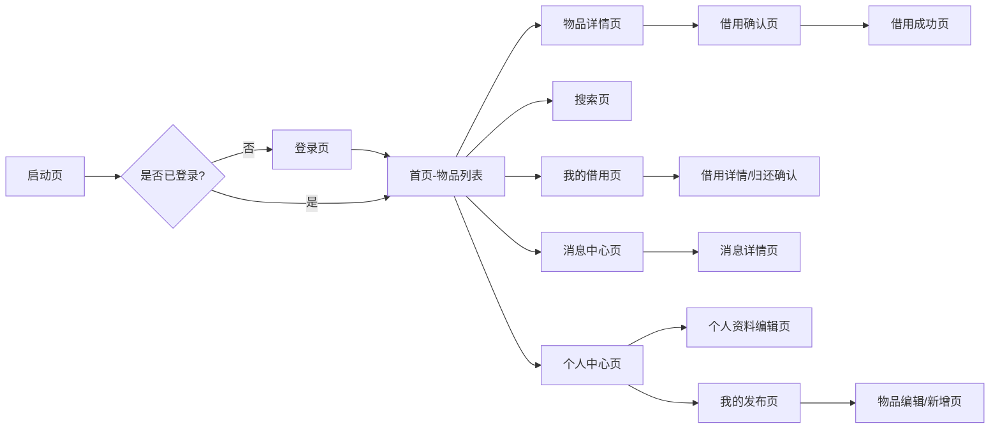
```mermaid
flowchart LR
    A[启动页] --> B{是否已登录?}
    B -->|否| C[登录页]
    C --> D[首页-物品列表]
    B -->|是| D
    D --> E[物品详情页]
    E --> F[借用确认页]
    F --> G[借用成功页]
    D --> H[搜索页]
    D --> I[我的借用页]
    I --> J[借用详情/归还确认]
    D --> K[消息中心页]
    K --> L[消息详情页]
    D --> M[个人中心页]
    M --> N[个人资料编辑页]
    M --> O[我的发布页]
    O --> P[物品编辑/新增页]
```

### 4.1.2 管理端后台页面跳转

```mermaid
flowchart LR
    A[登录页] --> B[控制台首页]
    B --> C[物品管理页]
    C --> D[新增/编辑物品弹窗]
    C --> E[二维码查看弹窗]
    B --> F[借用管理页]
    F --> G[借用详情弹窗]
    F --> H[发送催还确认弹窗]
    B --> I[损坏管理页<br/>第二期]
    I --> J[新增损坏登记弹窗]
    I --> K[赔偿协商详情页]
    B --> L[用户管理页]
    L --> M[用户详情弹窗]
    L --> N[角色设置弹窗]
    B --> O[系统设置页]
    B --> P[数据统计页<br/>第二期]
    P --> Q[导出报表确认]
```

## 4.2 全站点原型设计

### 4.2.1 用户端小程序

**页面清单：**

| 序号 | 页面名称 | 所属模块 | 页面描述 | 关键元素 |
| --- | --- | --- | --- | --- |
| 1 | 启动页 | 登录模块 | 小程序启动时展示品牌Logo和Slogan | Logo、Slogan"让邻里互助更简单"、微信登录按钮 |
| 2 | 首页-物品列表 | 物品浏览 | 展示所有可借物品的卡片列表 | 顶部搜索栏、分类Tab、状态筛选、物品卡片（照片/名称/状态）、底部导航栏 |
| 3 | 物品详情页 | 物品浏览 | 展示物品完整信息和借用入口 | 照片轮播、物品信息、使用说明、存放位置、借用按钮、返回按钮 |
| 4 | 借用确认页 | 借用操作 | 填写借用信息并确认 | 物品信息摘要、预计归还时间选择器、借用用途输入框、确认按钮 |
| 5 | 借用成功页 | 借用操作 | 借用成功后的反馈页 | 成功图标、借用信息摘要、查看我的借用按钮、返回首页按钮 |
| 6 | 搜索页 | 物品浏览 | 搜索物品 | 搜索输入框、搜索历史、搜索结果列表 |
| 7 | 我的借用页 | 借用管理 | 查看借用中和历史记录 | Tab切换（借用中/历史）、借用卡片（照片/名称/时间/状态）、确认归还按钮 |
| 8 | 消息中心页 | 消息通知 | 查看所有通知消息 | 消息列表（图标/标题/摘要/时间/未读标记）、全部已读按钮 |
| 9 | 消息详情页 | 消息通知 | 查看消息完整内容 | 消息标题、发送时间、消息正文、返回按钮 |
| 10 | 个人中心页 | 用户管理 | 个人信息和功能入口 | 用户信息卡片（头像/昵称/手机号）、功能菜单列表 |
| 11 | 个人资料编辑页 | 用户管理 | 修改个人信息 | 头像、昵称、手机号输入、楼栋号输入、保存按钮 |
| 12 | 我的发布页 | 物品管理 | 查看自己发布的物品 | 物品列表（照片/名称/状态/操作）、新增物品按钮 |
| 13 | 物品编辑/新增页 | 物品管理 | 编辑或新增物品信息 | 照片上传、名称、类别选择、价格、使用说明、存放位置、提交按钮 |

**交互说明：**

- 页面跳转关系：
```mermaid
flowchart TD
    A[启动页] -->|自动检测登录状态| B{已登录?}
    B -->|否| C[登录页]
    B -->|是| D[首页]
    C -->|登录成功| D
    D -->|点击物品卡片| E[物品详情]
    D -->|点击我的借用| F[我的借用]
    D -->|点击消息| G[消息中心]
    D -->|点击我的| H[个人中心]
    E -->|点击借用| I[借用确认]
    I -->|确认借用| J[借用成功]
    J -->|查看我的借用| F
    J -->|返回首页| D
    F -->|点击物品| E
    H -->|点击个人资料| K[资料编辑]
    H -->|点击我的发布| L[我的发布]
    L -->|点击新增/编辑| M[物品编辑]
```

- 特殊交互：
  1. 下拉刷新：首页、我的借用、消息中心支持下拉刷新
  2. 上拉加载：列表页上拉触底自动加载下一页
  3. Tab切换：我的借用页支持"借用中"和"历史记录"Tab切换
  4. 照片轮播：物品详情页照片支持左右滑动
  5. 弹窗确认：删除、归还等操作前弹出二次确认弹窗
  6. Toast提示：操作成功/失败后展示短暂的Toast提示
  7. 空状态：列表为空时展示友好的空状态插画和引导文案

**产品原型：**

[📱 打开用户端小程序全站点原型](assets/prototypes/mini-program-prototype.html)

---

### 4.2.2 管理端后台

**页面清单：**

| 序号 | 页面名称 | 所属模块 | 页面描述 | 关键元素 |
| --- | --- | --- | --- | --- |
| 1 | 登录页 | 登录模块 | 管理员登录后台 | 账号输入、密码输入、登录按钮、忘记密码链接 |
| 2 | 控制台首页 | 数据概览 | 展示整体数据统计和待办提醒 | 物品统计卡片、借用统计卡片、待办提醒列表 |
| 3 | 物品管理页 | 物品管理 | 管理所有物品档案 | 物品列表表格、新增按钮、筛选搜索、操作按钮（编辑/下架/删除/二维码） |
| 4 | 新增/编辑物品弹窗 | 物品管理 | 录入或修改物品信息 | 表单（名称/类别/照片/价格/说明/存放位置）、提交按钮 |
| 5 | 二维码查看弹窗 | 物品管理 | 查看和下载物品二维码 | 二维码图片、下载按钮、打印按钮 |
| 6 | 借用管理页 | 借用管理 | 查看所有借用记录 | 借用记录表格、筛选搜索、操作按钮（催还/手动归还/详情） |
| 7 | 借用详情弹窗 | 借用管理 | 查看借用完整信息 | 物品信息、借用人信息、借用时间、归还时间、超期天数 |
| 8 | 损坏管理页（第二期） | 损坏管理 | 管理损坏登记和赔偿协商 | 损坏记录表格、新增按钮、操作按钮（详情/仲裁） |
| 9 | 新增损坏登记弹窗 | 损坏管理 | 录入损坏信息 | 选择借用记录、上传照片、损坏描述、提交按钮 |
| 10 | 赔偿协商详情页 | 损坏管理 | 查看协商过程和结果 | 损坏详情、协商记录时间线、仲裁按钮 |
| 11 | 用户管理页 | 用户管理 | 查看所有注册用户 | 用户列表表格、筛选搜索、操作按钮（详情/设置角色） |
| 12 | 用户详情弹窗 | 用户管理 | 查看用户完整信息和借用历史 | 基本信息、借用统计、发布的物品列表 |
| 13 | 角色设置弹窗 | 用户管理 | 修改用户角色 | 角色复选框（普通用户/物品提供者/管理员）、保存按钮 |
| 14 | 系统设置页 | 系统设置 | 配置社区信息和借用规则 | 基础信息表单、借用规则表单、保存按钮 |
| 15 | 数据统计页（第二期） | 数据统计 | 查看物品使用率和用户活跃度 | 统计维度Tab、时间范围选择、图表、导出按钮 |

**交互说明：**

- 页面跳转关系：
```mermaid
flowchart TD
    A[登录页] -->|登录成功| B[控制台]
    B -->|点击物品管理| C[物品管理]
    B -->|点击借用管理| D[借用管理]
    B -->|点击损坏管理| E[损坏管理]
    B -->|点击用户管理| F[用户管理]
    B -->|点击系统设置| G[系统设置]
    B -->|点击数据统计| H[数据统计]
    C -->|点击新增| I[新增物品弹窗]
    C -->|点击编辑| J[编辑物品弹窗]
    C -->|点击二维码| K[二维码弹窗]
    D -->|点击详情| L[借用详情弹窗]
    D -->|点击催还| M[催还确认弹窗]
    E -->|点击新增| N[新增损坏弹窗]
    E -->|点击详情| O[协商详情页]
    F -->|点击详情| P[用户详情弹窗]
    F -->|点击设置角色| Q[角色设置弹窗]
```

- 特殊交互：
  1. 侧边栏导航：左侧固定侧边栏，点击切换不同模块
  2. 弹窗操作：新增、编辑、详情等操作通过弹窗完成
  3. 表格筛选：支持多条件组合筛选和关键词搜索
  4. 批量操作：物品列表和借用记录列表支持批量选择和操作
  5. 分页：所有列表页支持分页，每页显示20/50/100条可切换
  6. 排序：表格列支持点击排序（升序/降序）
  7. 响应式：适配1280px及以上屏幕宽度

**产品原型：**

[🖥️ 打开管理端后台全站点原型](assets/prototypes/admin-web-prototype.html)

---

# 5 数据需求

## 5.1 数据使用规格

### 5.1.1 物品表（items）

| **字段** | **是否必填** | **描述** | **数据类型** |
| --- | --- | --- | --- |
| id | 是 | 物品唯一标识 | UUID |
| space_id | 是 | 所属社区/空间ID | UUID |
| name | 是 | 物品名称，最多50字 | 字符串 |
| category | 是 | 物品类别（工具类/电器类/运动类/厨房类/其他） | 枚举 |
| photos | 是 | 物品照片URL列表，最多9张 | JSON数组 |
| purchase_price | 否 | 购入价格，最多2位小数 | 数字 |
| purchase_date | 否 | 购入日期 | 日期 |
| description | 否 | 使用说明，最多500字 | 字符串 |
| location | 否 | 存放位置，最多100字 | 字符串 |
| status | 是 | 物品状态（待审核/已上架/已借出/已下架/损坏待处理/已报废） | 枚举 |
| qrcode_url | 是 | 专属二维码图片URL | 字符串 |
| publisher_id | 是 | 发布者用户ID | UUID |
| borrow_count | 是 | 累计借用次数 | 数字 |
| created_at | 是 | 创建时间 | 时间戳 |
| updated_at | 是 | 更新时间 | 时间戳 |

### 5.1.2 借用记录表（borrow_records）

| **字段** | **是否必填** | **描述** | **数据类型** |
| --- | --- | --- | --- |
| id | 是 | 借用记录唯一标识 | UUID |
| item_id | 是 | 物品ID | UUID |
| borrower_id | 是 | 借用人用户ID | UUID |
| borrow_time | 是 | 借出时间 | 时间戳 |
| expected_return_time | 是 | 预计归还时间 | 时间戳 |
| actual_return_time | 否 | 实际归还时间 | 时间戳 |
| purpose | 否 | 借用用途，最多200字 | 字符串 |
| status | 是 | 借用状态（借用中/已归还/超期未还/损坏处理中） | 枚举 |
| overdue_count | 是 | 超期提醒次数 | 数字 |
| reminder_sent | 是 | 是否已发送归还提醒 | 布尔 |
| created_at | 是 | 创建时间 | 时间戳 |
| updated_at | 是 | 更新时间 | 时间戳 |

### 5.1.3 损坏记录表（damage_records）（第二期）

| **字段** | **是否必填** | **描述** | **数据类型** |
| --- | --- | --- | --- |
| id | 是 | 损坏记录唯一标识 | UUID |
| item_id | 是 | 物品ID | UUID |
| borrow_record_id | 是 | 关联的借用记录ID | UUID |
| reporter_id | 是 | 报告人用户ID | UUID |
| photos | 是 | 损坏照片URL列表，最多9张 | JSON数组 |
| description | 是 | 损坏描述，最多500字 | 字符串 |
| status | 是 | 处理状态（协商中/已达成一致/管理员仲裁） | 枚举 |
| compensation_amount | 否 | 赔偿金额 | 数字 |
| responsible_party | 否 | 责任方用户ID | UUID |
| created_at | 是 | 创建时间 | 时间戳 |
| updated_at | 是 | 更新时间 | 时间戳 |

### 5.1.4 用户表（users）

| **字段** | **是否必填** | **描述** | **数据类型** |
| --- | --- | --- | --- |
| id | 是 | 用户唯一标识 | UUID |
| openid | 是 | 微信openid | 字符串 |
| nickname | 是 | 微信昵称 | 字符串 |
| avatar_url | 是 | 头像URL | 字符串 |
| phone | 是 | 手机号 | 字符串 |
| building_number | 是 | 楼栋号 | 字符串 |
| room_number | 是 | 房间号 | 字符串 |
| space_id | 是 | 所属社区/空间ID | UUID |
| roles | 是 | 用户角色列表（普通用户/物品提供者/管理员） | JSON数组 |
| credit_score | 是 | 信用积分（第三期） | 数字 |
| created_at | 是 | 注册时间 | 时间戳 |
| updated_at | 是 | 更新时间 | 时间戳 |

### 5.1.5 消息表（messages）

| **字段** | **是否必填** | **描述** | **数据类型** |
| --- | --- | --- | --- |
| id | 是 | 消息唯一标识 | UUID |
| user_id | 是 | 接收用户ID | UUID |
| type | 是 | 消息类型（超期提醒/归还提醒/损坏通知/系统公告） | 枚举 |
| title | 是 | 消息标题 | 字符串 |
| content | 是 | 消息内容 | 字符串 |
| related_id | 否 | 关联的业务ID（借用记录ID/损坏记录ID） | UUID |
| is_read | 是 | 是否已读 | 布尔 |
| created_at | 是 | 发送时间 | 时间戳 |

## 5.2 统计数据

1. 统计各物品的借用次数、使用率，按物品维度进行统计（P2）
2. 统计各用户的借用次数、按时归还率、超期次数，按用户维度进行统计（P2）
3. 统计每日/每周/每月的借用次数、活跃用户数，按时间维度进行统计（P2）

## 5.3 埋点需求

| 页面 | 事件 | 采集字段 | 说明 |
| --- | --- | --- | --- |
| 首页 | 浏览物品列表 | user_id, timestamp, filter_params | 记录用户浏览行为，分析热门分类 |
| 物品详情 | 查看物品详情 | user_id, item_id, timestamp | 记录物品热度，分析用户兴趣 |
| 借用确认 | 点击借用 | user_id, item_id, timestamp | 记录借用转化 |
| 借用成功 | 借用成功 | user_id, item_id, borrow_record_id, timestamp | 记录借用完成情况 |
| 确认归还 | 确认归还 | user_id, borrow_record_id, timestamp, is_overdue | 记录归还行为，分析超期率 |
| 消息中心 | 查看消息 | user_id, message_id, message_type, timestamp | 记录消息触达效果 |

---

# 6 非功能需求

## 6.1 性能需求

**6.1.1 延迟**

| 编号 | 项目 | 最大延迟 | 平均延迟 | 优先级 | 备注 |
| --- | --- | --- | --- | --- | --- |
| 0001 | 95%的页面首屏加载 | <1.5秒 | <1秒 | 高 |  |
| 0002 | 物品列表加载（100件） | <1秒 | <0.6秒 | 高 |  |
| 0003 | 物品详情加载 | <0.8秒 | <0.5秒 | 高 |  |
| 0004 | 借用接口响应 | <1秒 | <0.5秒 | 高 |  |
| 0005 | 图片上传 | <3秒 | <2秒 | 中 | 单张图片 |
| 0006 | 二维码识别 | <1秒 | <0.6秒 | 中 | 第二期 |

**6.1.2 吞吐量**

| 编号 | 项 | 吞吐量 | 备注 |
| --- | --- | --- | --- |
| 0001 | 借用操作 | 每分钟50次 | 高峰期 |
| 0002 | 物品列表查询 | 每分钟500次 |  |
| 0003 | 消息推送 | 每分钟1000条 |  |

**6.1.3 容量**

| 编号 | 项 | 容量 | 备注 |
| --- | --- | --- | --- |
| 0001 | 单个社区物品数量 | <=500件 |  |
| 0002 | 单个社区用户数量 | <=2000人 |  |
| 0003 | 单条借用记录保留时间 | 永久 | 归档后保留3年 |
| 0004 | 图片存储空间 | 不限 | 按量计费 |

## 6.2 安全需求

| 编号 | 项（系统数据 / 处理过程） |
| --- | --- |
| 0001 | 用户手机号等敏感信息必须加密存储，使用AES-256加密算法 |
| 0002 | 借用记录中借用人信息对其他用户脱敏展示（手机号中间4位用*替代） |
| 0003 | 所有API接口必须进行身份认证，使用JWT Token |
| 0004 | 管理端接口必须进行权限校验，只有管理员角色可访问 |
| 0005 | 防止SQL注入、XSS攻击，对所有用户输入进行过滤和转义 |
| 0006 | 图片上传限制文件类型（jpg/png/gif）和大小（单张<5MB） |
| 0007 | 防止重复提交，借用、归还等关键操作增加幂等性校验 |

## 6.3 可靠性

| 编号 | 项 | 值 |
| --- | --- | --- |
| 0001 | 系统正常运行的可能性 | 99.9% |
| 0002 | 平均正常运行时间 | 365天 |
| 0003 | 平均故障恢复时间 | 30分钟 |
| 0004 | 数据备份频率 | 每日全量备份，每小时增量备份 |
| 0005 | 数据备份保留时间 | 30天 |

## 6.4 可连续性

| 编号 | 项 |
| --- | --- |
| Modi.1 | 系统需要 7 × 24 式的全天候运行 |
| Modi.2 | 定时任务（超期提醒、归还提醒）支持故障转移，主节点故障时自动切换到备节点 |
| Modi.3 | 消息推送服务支持降级，推送失败时记录日志，后续重试 |

## 6.5 可恢复性

| 编号 | 项 |
| --- | --- |
| Modi.1 | 系统可以进行数据备份，最近30日的业务数据、数据库数据全备份（30份，每日一份，保留1个月），每日进行数据完全备份一次（保留1个月），每1小时业务数据、数据库数据增量备份一次 |
| Modi.2 | 重大故障需要在1～3小时恢复服务的可用性，并在24小时内恢复历史数据 |
| Modi.3 | 支持数据恢复演练，每季度进行一次恢复演练，验证备份数据的可用性 |

## 6.6 兼容性

| 编号 | 要求 | 备注 |
| --- | --- | --- |
| 0001 | 小程序端：iOS 11+、Android 6.0+、微信7.0+ |  |
| 0002 | 管理端WEB：Chrome >=90、Firefox >=88、Safari >=14、Edge >=90 |  |
| 0003 | 移动端适配主流分辨率：375×667、390×844、414×896 |  |
| 0004 | WEB端适配1280px及以上屏幕宽度 |  |

## 6.7 易用性

| 编号 | 要求 | 备注 |
| --- | --- | --- |
| 0001 | 核心操作路径不超过3步（借用：浏览→详情→确认） |  |
| 0002 | 普通用户无需培训即可使用核心功能 |  |
| 0003 | 空状态、错误状态提供友好的提示和引导 |  |
| 0004 | 关键操作（删除、归还）提供二次确认 |  |
| 0005 | 表单填写提供实时校验和错误提示 |  |

---

# 7 总结

## 7.1 上线计划

| 阶段 | 时间 | 内容 | 负责人 |
| --- | --- | --- | --- |
| 需求评审 | 2026-07-01 | 需求文档评审，确认功能范围 | 产品经理 |
| UI设计 | 2026-07-02 ~ 2026-07-03 | 高保真UI设计稿 | UI设计师 |
| 开发阶段 | 2026-07-04 ~ 2026-07-07 | 前后端开发（MVP功能） | 开发团队 |
| 测试阶段 | 2026-07-08 | 功能测试、性能测试、安全测试 | 测试团队 |
| 灰度阶段 | 2026-07-09 | 灰度1个社区（50用户），验证稳定性 | 运营团队 |
| 全量上线 | 2026-07-10 | 全量开放给所有社区 | 运营团队 |

## 7.2 后续迭代规划

- **V1.1（第二期，2026-08）**：损坏登记与赔偿协商流程、扫码借用全流程打通、费用分摊模块、消息通知增强（微信服务通知、短信提醒）
- **V1.2（第三期，2026-09）**：多社区/多空间管理（SaaS模式）、社区物品交换/捐赠功能、用户信用积分体系、数据统计与分析报表增强
- **V1.3（第四期，2026-10）**：物品预订功能、物品维护保养提醒、社区排行榜、分享邀请奖励

## 7.3 参考文档

- [邻里工具共享与借用管理 - 用户需求说明书（URS）](./需求文档.md)
- 微信小程序开发文档：https://developers.weixin.qq.com/miniprogram/dev/framework/
- 微信订阅消息文档：https://developers.weixin.qq.com/miniprogram/dev/framework/open-ability/subscribe-message.html

---

**文档说明：** 本产品需求规格说明书基于"优特云-用户语言"五层架构模板规范编写，聚焦"邻里/社区/共享空间的工具借用管理"轻量场景，可作为后续UI设计、开发、测试的依据。MVP版本（第一期）聚焦物品档案管理、借用管理、超期提醒三大核心功能，预计在5天内完成开发上线。
