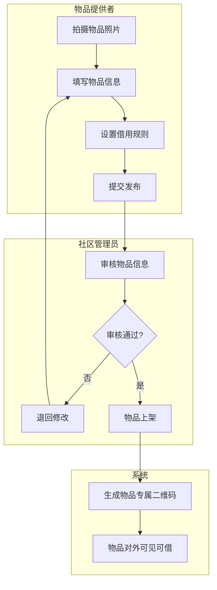
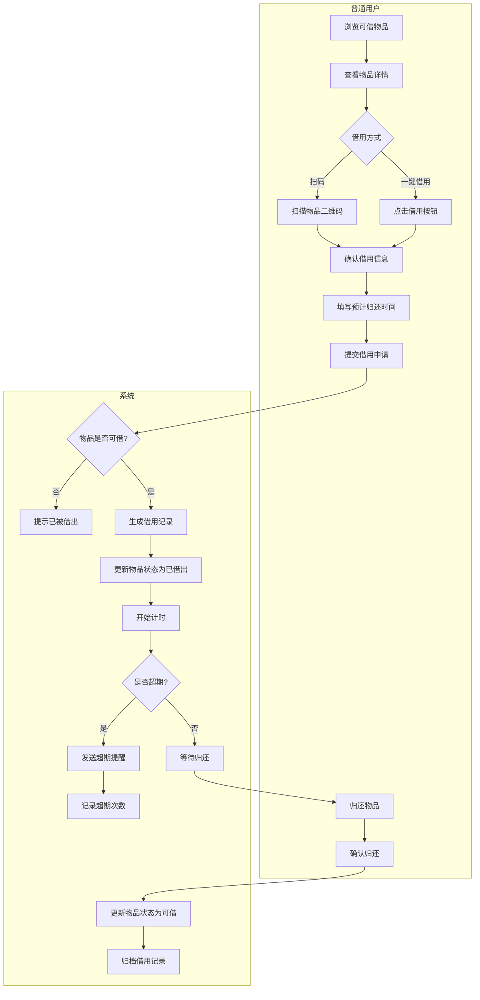
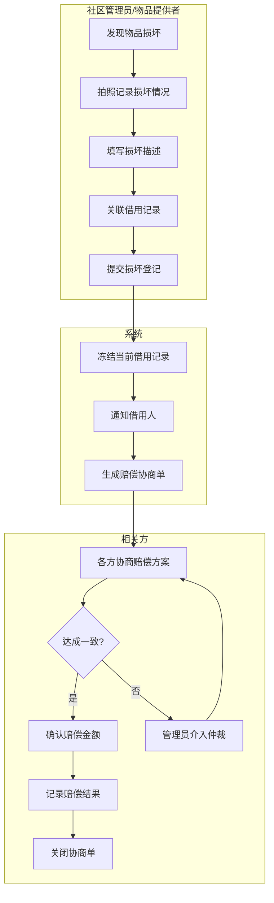
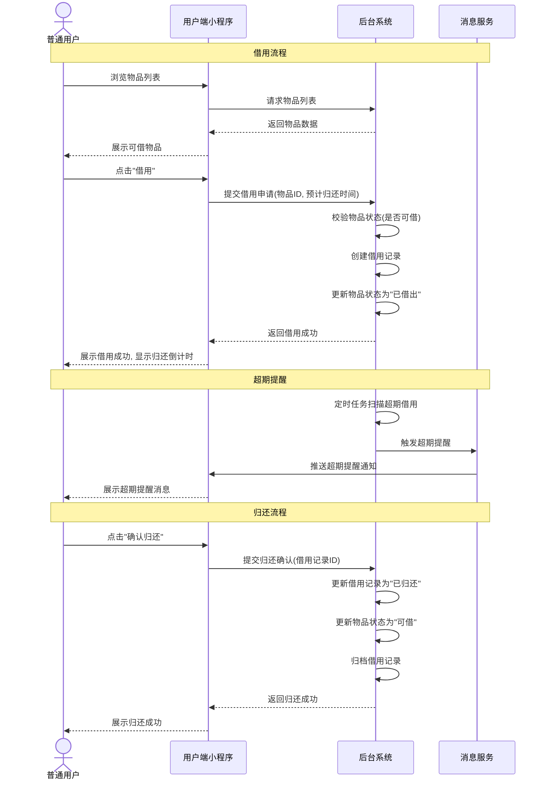
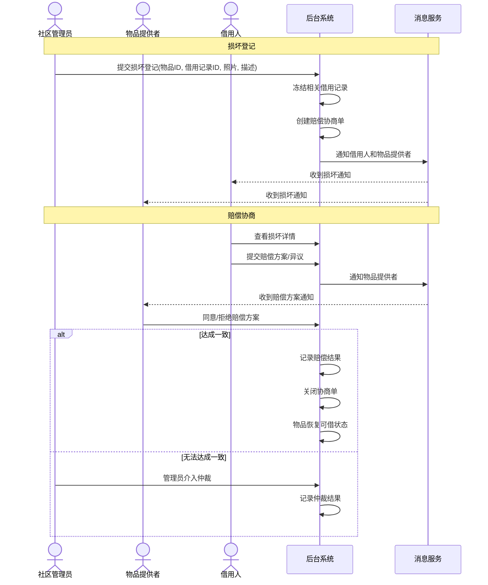
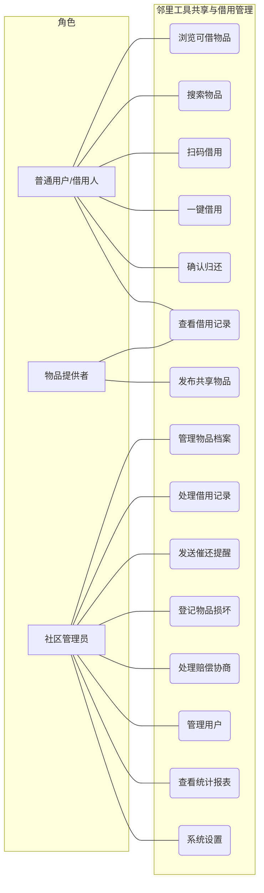
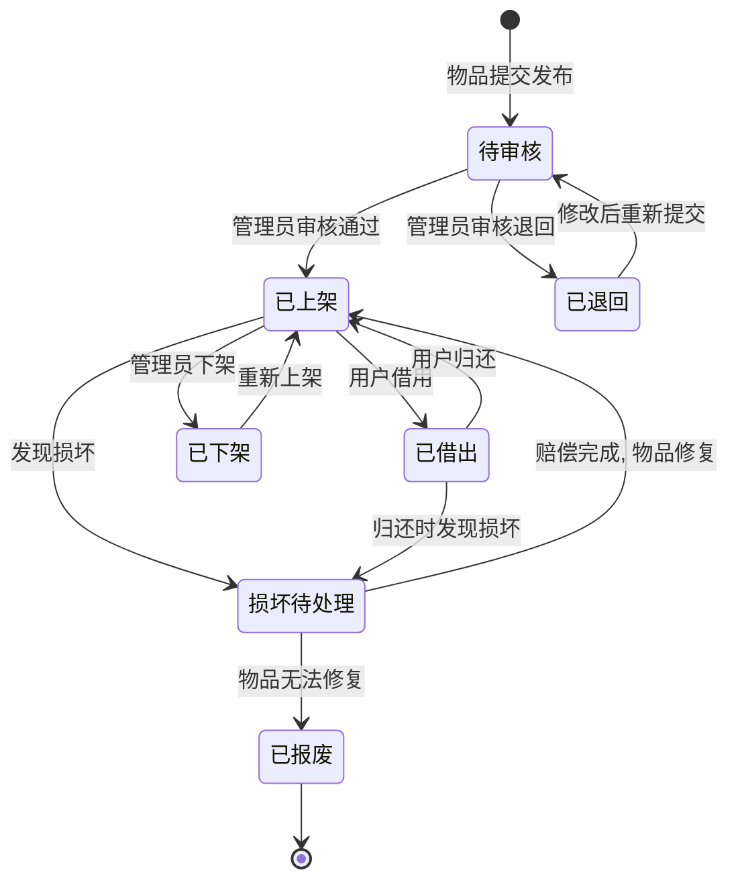
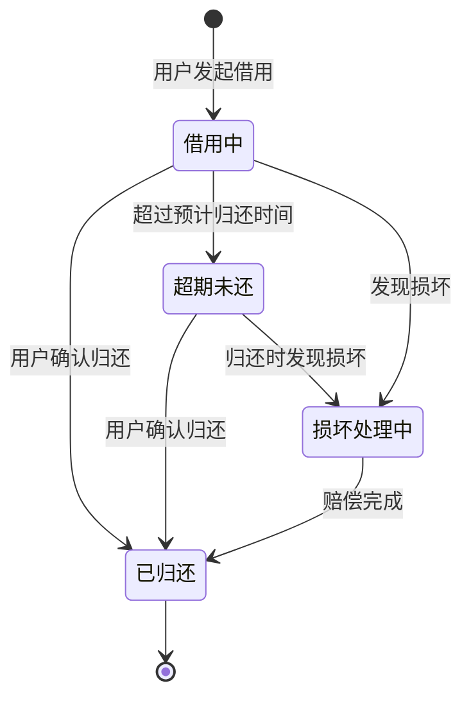

# 邻里工具共享与借用管理 - 用户需求说明书

# 1.需求概述

邻里工具共享与借用管理是一款面向住宅小区、共享办公空间、合租房等社区场景的轻量级物品借用管理工具。通过为共享工具/物品（如电钻、梯子、吸尘器、烧烤架等）建立数字化档案，配合扫码借用、超期提醒、损坏追溯等功能，解决社区共用物品管理中"借了不还、损坏不认、责任不清"的常见纠纷，让邻里互助更高效、更透明。

## 1.1 需求介绍

在社区生活与共享办公场景中，居民/使用者常常需要临时使用某些不常用的工具或设备（如电钻、梯子、吸尘器、烧烤架、厨房电器等）。这些物品单价较高、使用频率低，家家户户都买一份既不经济也不环保。然而，现有的借用方式完全依赖口头约定或微信群沟通，存在以下痛点：

1. **借出无记录**：物品借出后无法追踪，经常出现"借了忘记还"或"不知道在谁手里"的情况，导致物品丢失
2. **损坏责任不清**：物品归还后发现损坏，借用人否认，双方各执一词，引发邻里纠纷
3. **超期无提醒**：借出后缺乏有效的催还机制，物品长期被占用，影响其他人的使用需求
4. **物品信息不透明**：社区有哪些可共享的物品、物品当前状态如何，缺乏统一的信息展示渠道

本系统旨在通过轻量化的数字工具，以"扫码即借、到期提醒、损坏留痕"为核心，让社区工具共享变得简单可信。

### 1.1.1 所属领域

社区共享经济、物业管理科技、共享办公管理

### 1.1.2 核心价值

- **对社区居民/使用者**：快速了解社区有哪些可借用的工具，一键扫码即可借走，无需四处打听，到期收到温馨提醒，借用体验便捷舒适
- **对物品提供者**：物品借出有记录、归还有时限、损坏有追溯，再也不用担心物品"有去无回"
- **对物业/社区管理员**：统一管理社区共享物品台账，实时查看物品状态和借用情况，减少因物品纠纷产生的投诉调解工作
- **对共享办公空间管理员**：低成本管理公共区域的共用设备和工具，提升空间服务品质
- **对合租房室友**：清晰记录共用物品的借用情况，避免室友间因小事产生矛盾

## 1.2 需求目标

### 1.2.1 第一期目标（MVP，约5天）

完成核心借用管理功能：

- 用户端微信小程序（物品浏览、扫码借用、借用记录、归还确认）
- 管理端WEB后台（物品档案管理、借用记录管理、超期提醒、损坏登记）

### 1.2.2 第二期目标

扩展高级功能：

- 损坏追溯与赔偿协商流程
- 费用分摊模块（如物业维修基金）
- 扫码借还全流程打通（物品粘贴专属二维码）
- 消息通知增强（微信服务通知、短信提醒）

### 1.2.3 第三期目标

生态扩展：

- 多社区/多空间管理（SaaS模式）
- 社区物品交换/捐赠功能
- 用户信用积分体系
- 数据统计与分析报表

## 1.3 系统使用角色

1. **普通用户（借用人）**：社区居民或共享空间使用者，浏览可借用物品，扫码或一键借用，按期归还
2. **物品提供者**：拥有可共享物品的居民或空间管理方，发布物品信息，查看物品借出状态
3. **社区管理员**：物业工作人员、业委会成员、共享空间管理员或合租房房东，负责管理共享物品台账、处理借用纠纷、登记损坏情况
4. **系统**：后台服务，负责超期自动提醒、借用记录归档、数据统计等自动化任务

## 1.4 业务流程图

### 1.4.1 物品发布与管理流程

### 1.4.2 借用与归还核心流程

### 1.4.3 损坏登记与责任追溯流程

# 2.功能原型

| 原型名称 | 原型链接 | 对应端 | 备注 |
| --- | --- | --- | --- |
| 用户端小程序 | 见同目录UI原型文件 | 小程序端 | V1.0 MVP |
| 管理端后台 | 见同目录UI原型文件 | WEB端 | V1.0 MVP |

# 3.需求清单

## 3.1 用户端-小程序端

| 模块 | 一级功能 | 二级功能 | 功能描述 | 优先级 | 备注 |
| --- | --- | --- | --- | --- | --- |
| 首页 | 物品列表 | 可借物品展示 | 展示当前社区/空间内所有可借用物品的卡片列表，包含物品照片、名称、当前状态（可借/已借出） | P0 | |
| | | 分类筛选 | 按物品类别（工具类、电器类、运动类、厨房类等）筛选 | P0 | |
| | | 关键词搜索 | 支持按物品名称、描述关键词搜索 | P1 | |
| | | 状态筛选 | 按"全部/可借/已借出"筛选物品 | P0 | |
| 物品详情 | 信息展示 | 物品基本信息 | 展示物品名称、照片（多图）、购入价格、购入时间、使用说明、存放位置 | P0 | |
| | | 当前借用状态 | 展示物品当前是否可借、若已借出则显示预计归还时间 | P0 | |
| | | 历史借用记录 | 展示该物品的最近借用记录（隐去借用人隐私信息） | P2 | 第二期 |
| 借用操作 | 扫码借用 | 扫描物品二维码 | 调用摄像头扫描物品上的专属二维码，自动识别物品并进入借用页面 | P0 | 第二期 |
| | 一键借用 | 点击借用按钮 | 在物品详情页点击"借用"按钮发起借用 | P0 | |
| | | 填写借用信息 | 填写预计归还时间、借用用途（可选） | P0 | |
| | | 确认提交 | 确认借用信息后提交，系统生成借用记录 | P0 | |
| 我的借用 | 当前借用 | 借用中列表 | 展示当前正在借用中的物品列表，包含借出时间、预计归还时间、剩余天数 | P0 | |
| | | 归还确认 | 对已归还的物品点击"确认归还"，更新借用记录状态 | P0 | |
| | | 续借申请 | 对即将到期的借用申请延长归还时间（需物品提供者/管理员同意） | P2 | 第二期 |
| | 历史记录 | 借用历史 | 展示历史所有借用记录，包含借用时间、归还时间、是否超期 | P1 | |
| 消息中心 | 系统通知 | 超期提醒 | 收到借用物品超期未还的温馨提醒 | P0 | |
| | | 归还提醒 | 借用即将到期前1天收到归还提醒 | P1 | |
| | | 损坏纠纷通知 | 收到涉及自身的损坏登记通知 | P1 | 第二期 |
| 个人中心 | 个人信息 | 资料管理 | 管理个人基本信息（昵称、手机号、所在楼栋/房间号） | P0 | |
| | | 我的发布 | 查看自己发布的共享物品列表及管理 | P1 | |
| | | 信用积分 | 查看个人信用积分（按时归还加分，超期扣分） | P2 | 第三期 |

## 3.2 管理端-WEB端

| 模块 | 一级功能 | 二级功能 | 功能描述 | 优先级 | 备注 |
| --- | --- | --- | --- | --- | --- |
| 控制台 | 数据概览 | 物品统计 | 展示物品总数、可借数量、已借出数量、超期未还数量 | P0 | |
| | | 借用统计 | 展示今日借用次数、本月借用次数、活跃用户数 | P1 | |
| | | 待办提醒 | 展示待处理的损坏登记、超期未还提醒等 | P0 | |
| 物品管理 | 物品档案 | 新增物品 | 录入物品信息（名称、类别、照片、购入价格、使用说明、存放位置），生成专属二维码 | P0 | |
| | | 物品列表 | 展示所有物品档案，支持按类别、状态、关键词筛选 | P0 | |
| | | 编辑物品 | 修改物品信息、更新照片、调整借用规则 | P0 | |
| | | 删除/下架物品 | 删除或暂时下架不再共享的物品 | P0 | |
| | | 二维码管理 | 查看、重新生成、打印物品专属二维码 | P0 | 第二期 |
| 借用管理 | 借用记录 | 全部记录 | 查看所有借用记录，包含借用人、借出时间、预计归还时间、实际归还时间、状态 | P0 | |
| | | 超期记录 | 筛选查看所有超期未还的借用记录 | P0 | |
| | | 手动归还 | 管理员手动将某条借用记录标记为已归还（适用于借用人未操作确认的情况） | P0 | |
| | | 借用提醒 | 对超期未还的用户发送催还提醒（站内信/微信通知） | P0 | |
| 损坏管理 | 损坏登记 | 新增损坏登记 | 拍照记录损坏情况，填写损坏描述，关联对应借用记录 | P1 | 第二期 |
| | | 损坏记录列表 | 查看所有损坏登记记录及处理进度 | P1 | 第二期 |
| | | 赔偿协商 | 发起赔偿协商、记录协商过程、确认赔偿结果 | P1 | 第二期 |
| 用户管理 | 用户列表 | 用户查询 | 查看社区/空间内所有注册用户信息 | P0 | |
| | | 用户详情 | 查看用户的借用历史、信用积分、超期次数 | P1 | |
| | | 用户权限 | 设置用户角色（普通用户/物品提供者/管理员） | P0 | |
| 系统设置 | 基础设置 | 社区/空间信息 | 设置社区名称、地址、管理员信息等基础资料 | P0 | |
| | | 借用规则 | 设置默认借用时长、超期提醒时间、最大续借次数等全局规则 | P0 | |
| | | 版本管理 | 免费版/社区版功能权限控制 | P1 | |
| 统计报表 | 数据分析 | 物品使用率 | 统计各物品的借用频率、使用率排名 | P2 | 第二期 |
| | | 用户活跃度 | 统计用户借用频次、按时归还率 | P2 | 第二期 |
| | | 报表导出 | 支持将统计数据导出为Excel报表 | P2 | 第二期 |

# 4.非功能需求

## 4.1 使用界面需求

| 需求项 | 详细描述 | 备注 |
| --- | --- | --- |
| 设计风格 | 亲切、邻里感、简洁实用，突出"共享互助"的社区氛围，配色温暖友好 | P0 |
| 主色调 | 使用绿色系（#4CAF50 社区绿）作为主色，传递信任与环保意识 | P0 |
| 响应式设计 | 小程序端适配主流手机屏幕尺寸（320px~428px宽度）；WEB端适配1280px及以上屏幕 | P0 |
| 加载体验 | 使用骨架屏或loading动画，避免空白页面；图片采用懒加载 | P1 |
| 空状态 | 主要列表页（物品列表、借用记录等）设计空状态引导，包含插画和操作引导按钮 | P1 |
| 扫码交互 | 扫码页面在弱光环境下提供自动补光和手动开灯提示 | P1 | 第二期 |

## 4.2 软硬件环境需求

| 需求项 | 详细描述 | 备注 |
| --- | --- | --- |
| 小程序端环境 | 微信小程序，支持iOS 11+和Android 6.0+ | P0 |
| 微信版本 | 微信7.0及以上版本 | P0 |
| WEB端环境 | 主流浏览器（Chrome 80+、Firefox 75+、Edge 80+、Safari 13+） | P0 |
| 后端环境 | 云服务部署，支持水平扩展 | P0 |
| 二维码打印 | 支持普通A4纸打印二维码标签（管理员自行打印粘贴） | P1 |

## 4.3 性能需求

| 需求项 | 详细描述 | 备注 |
| --- | --- | --- |
| 页面加载 | 95%的页面首屏加载时间 < 1.5秒 | P0 |
| 物品列表加载 | 100件物品列表加载时间 < 1.0秒 | P0 |
| 扫码识别 | 二维码识别响应时间 < 1.0秒 | P1 |
| 消息推送 | 超期提醒、归还提醒的推送延迟 < 5分钟 | P0 |
| 系统容量 | 支持单个社区/空间500件物品、2000名注册用户 | P0 |
| 并发借用 | 支持每分钟50次借用操作 | P0 |

## 4.4 约束性需求

| 需求项 | 详细描述 | 备注 |
| --- | --- | --- |
| 登录方式 | 必须使用微信授权登录，不额外注册账号密码 | P0 |
| 数据安全 | 用户手机号等敏感信息加密存储；借用记录中借用人信息对其他用户脱敏展示 | P0 |
| 免费版限制 | 免费版最多管理20件物品，仅支持基础借用记录功能 | P0 |
| 社区版范围 | 社区版（¥19/月）不限物品数量，包含扫码借用、超期提醒、损坏追溯、费用分摊功能 | P0 |
| 不做通用资产管理 | 本系统聚焦"邻里/社区/共享空间的工具借用管理"轻量场景，不实现企业级固定资产管理功能 | P0 |
| 后台服务 | 是，需要后台服务来支撑超期提醒、数据统计、物品管理等核心功能 | P0 |
| 数据归属 | 各社区/空间的物品和借用数据相互隔离，不可跨空间查看 | P0 |

# 5.接口需求

## 5.1 硬件接口需求

| 模块 | 接口名称 | 输入 | 输出 | 功能描述 |
| --- | --- | --- | --- | --- |
| 摄像头 | 扫码识别 | 摄像头画面流 | 二维码解析结果 | 调用手机摄像头扫描物品专属二维码，解析出物品ID |
| 存储 | 图片上传 | 图片文件 | 图片URL | 调用手机摄像头拍照或从相册选取图片，上传至云端存储 |

## 5.2 软件接口需求

| 模块 | 接口名称 | 输入 | 输出 | 功能描述 |
| --- | --- | --- | --- | --- |
| 用户认证 | 微信登录 | 微信Code | 用户信息、Token | 通过微信授权登录获取用户openid和基本信息 |
| | 用户信息更新 | 用户资料 | 更新结果 | 更新用户个人信息（昵称、手机号、楼栋号等） |
| 物品服务 | 物品列表 | 筛选条件、分页参数 | 物品列表 | 获取当前空间内的物品列表 |
| | 物品搜索 | 关键词、筛选条件 | 搜索结果 | 按关键词搜索物品 |
| | 物品详情 | 物品ID | 物品详细信息 | 获取物品完整信息（含照片、借用状态等） |
| | 物品新增 | 物品数据 | 创建结果 | 新增物品档案，自动生成二维码 |
| | 物品编辑 | 物品ID、修改数据 | 更新结果 | 修改物品信息 |
| | 物品删除 | 物品ID | 删除结果 | 删除或下架物品 |
| 借用服务 | 发起借用 | 物品ID、预计归还时间 | 借用记录ID | 创建一条新的借用记录 |
| | 确认归还 | 借用记录ID | 更新结果 | 将借用记录标记为已归还 |
| | 借用记录查询 | 用户ID/物品ID | 借用记录列表 | 查询某用户或某物品的借用记录 |
| | 超期记录查询 | 空间ID | 超期借用列表 | 查询当前空间所有超期未还的借用记录 |
| | 续借申请 | 借用记录ID、新归还时间 | 申请结果 | 申请延长归还时间 |
| 损坏服务 | 损坏登记 | 物品ID、借用记录ID、损坏描述、照片 | 登记结果 | 新增物品损坏记录 |
| | 损坏记录查询 | 物品ID/空间ID | 损坏记录列表 | 查询损坏登记记录 |
| | 赔偿协商 | 损坏记录ID、协商内容 | 协商结果 | 记录赔偿协商过程与结果 |
| 提醒服务 | 超期提醒 | 借用记录ID | 推送结果 | 向借用人发送超期未还提醒 |
| | 归还提醒 | 借用记录ID | 推送结果 | 在借用到期前向借用人发送归还提醒 |
| 管理服务 | 数据统计 | 空间ID、时间范围 | 统计数据 | 获取物品统计、借用统计等数据 |
| | 用户管理 | 空间ID | 用户列表 | 获取空间内的用户列表及角色信息 |
| | 系统设置 | 空间ID、设置数据 | 更新结果 | 管理空间的基础设置和借用规则 |

## 5.4 通讯接口需求

| 模块 | 接口名称 | 输入 | 输出 | 功能描述 |
| --- | --- | --- | --- | --- |
| 消息推送 | 微信服务通知 | 消息模板、用户OpenID、消息数据 | 推送结果 | 通过微信订阅消息向用户推送超期提醒、归还提醒、损坏通知 |
| | 站内消息 | 用户ID、消息内容 | 推送结果 | 在系统内向用户发送通知消息 |
| 二维码服务 | 二维码生成 | 物品ID、尺寸参数 | 二维码图片 | 为物品生成专属二维码，支持下载和打印 |

# 6. 附录

## 流程图

详见1.4章节业务流程图。

## 时序图

### 借用与归还时序

### 损坏登记与赔偿时序

## （用户与系统交互）用例图

## （系统）状态图

### 物品生命周期状态图

### 借用记录生命周期状态图

---
**文档说明**：本用户需求说明书基于"优特云-用户语言"五层架构模板规范编写，聚焦"邻里/社区/共享空间的工具借用管理"轻量场景，可作为后续产品设计（PRD）、UI原型设计、开发和测试的需求依据。
