# 邻里拼车费用分摊助手 - 产品需求规格说明书（PRD）

| 版本号 | 变更日期 | 变更内容 | 变更人 | 审核人 |
| --- | --- | --- | --- | --- |
| V1.0 | 2026-06-29 | 初始版本创建 | 产品文档结对写作专家 | 阶段一产品落地页文档总编辑 |

---

# 1 概述

## 1.1 需求背景

**需求来源：** 固定拼车群体（同事通勤、家长接送、邻里拼车）在日常拼车场景中，费用长期由一人垫付或临时AA，微信群接龙记账繁琐且易出错，缺少轻量化的费用分摊工具。

**业务痛点：**
1. 拼车费用记录依赖微信群聊，信息零散难以追溯
2. 按里程/按次的费用计算繁琐，人工计算易出错
3. 月底对账催款沟通成本高，容易引发矛盾
4. 现有记账工具（如随手记等）功能过重，不贴合拼车场景

**业务价值：** 为固定拼车群体提供专属的费用分摊工具，实现费用记录透明化、计算自动化、账单标准化，减少因费用不清引发的矛盾，降低催款沟通成本。

**预期达成目标：**
- 上线3个月内服务至少1000个活跃拼车群组
- 用户平均每次记账操作耗时 < 30秒
- 月度账单生成后7天内支付率 ≥ 85%

**产品定位：** 轻量化工具型小程序，专注解决"拼车费用的记录、计算与分摊"这一执行环节，不做出行平台或顺风车匹配。

## 1.2 名词解释

| 名词 | 说明 |
| --- | --- |
| 拼车群组 | 由发起人创建的固定拼车团体，包含2名及以上成员，共享同一套分摊规则 |
| 分摊模式 | 群组的费用分摊方式，分为"轮流开车"和"固定司机"两种 |
| 计费方式 | 群组费用的计量方式，分为"按里程"和"按次"两种 |
| 轮流开车模式 | 群组成员轮流担任司机的分摊模式，当次费用由当次乘客分摊给当次司机 |
| 固定司机模式 | 群组指定一名固定司机的分摊模式，每次费用由当次乘客分摊给固定司机 |
| 按里程计费 | 以本次行程的行驶里程乘以每公里单价计算总费用 |
| 按次计费 | 以预设的每次单价作为本次行程的总费用 |
| 月度账单 | 系统在每月末自动生成的汇总账单，包含本月所有行程的费用明细 |
| 收款提醒 | 司机向未支付乘客发送的账单提醒通知 |
| 催款提醒 | 系统对超期未支付成员自动发送的催款通知 |

## 1.3 产品介绍

**目标用户：**
1. 固定拼车上下班的同事（2-5人规模）
2. 拼车接送孩子的家长群体（3-8人规模）
3. 小区/社区内组织拼车的发起人

**使用场景：**
- 场景1：3位同事每天轮流开车通勤，月末需结算各自当司机时的费用
- 场景2：4位家长轮流接送孩子上下学，需要清晰记录每次接送的费用
- 场景3：1位固定司机+多位乘客的长期拼车，乘客需按月支付固定费用

**产品核心价值：**
- **省时**：3步完成行程记录（选乘客→输入里程→提交），无需手动记账
- **准确**：系统自动计算分摊金额，消除人工计算误差
- **透明**：所有成员可随时查看行程和费用明细，避免纠纷
- **省心**：月末自动生成账单并提醒收款，减少催款尴尬

### 1.3.1 范围说明

| 项 | 内容 |
| --- | --- |
| 包含功能 | 拼车群组管理、行程记录与费用分摊、月度账单生成、收款提醒与确认、账单导出（Pro版）、个人设置 |
| 不包含功能 | 出行匹配/顺风车平台功能、在线支付功能、聊天/社交功能、路线规划功能 |

---

# 2 产品设计

## 2.1 系统架构图

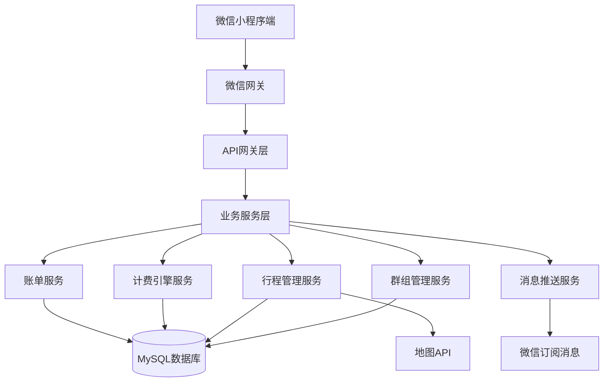

## 2.2 业务模块图

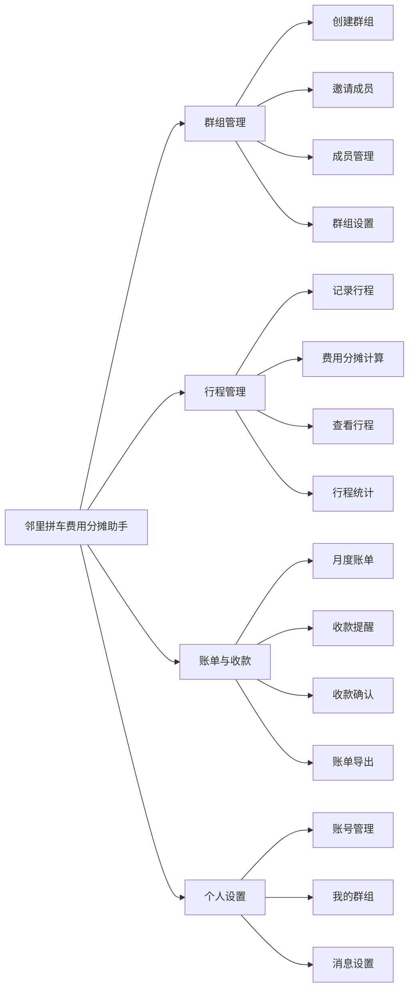

## 2.3 主业务流程

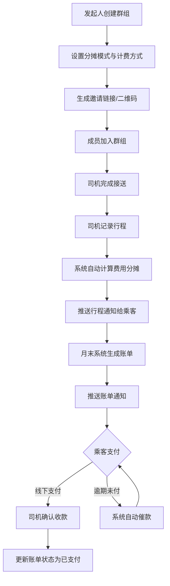

## 2.4 功能图/列表

| 功能模块 | 功能名称 | 优先级 | 功能描述 |
| --- | --- | --- | --- |
| 群组管理 | 创建群组 | P0 | 发起人输入群组名称、选择场景、设置分摊模式与计费方式 |
| 群组管理 | 邀请成员 | P0 | 生成邀请链接/二维码，成员通过链接加入群组 |
| 群组管理 | 成员管理 | P0 | 查看成员列表、移除成员 |
| 群组管理 | 群组设置 | P1 | 修改群组信息、分摊模式、计费参数、解散群组 |
| 行程管理 | 记录行程 | P0 | 司机选择乘客、输入里程/确认按次、选择日期、提交行程 |
| 行程管理 | 费用分摊计算 | P0 | 系统根据分摊模式与计费方式自动计算每位乘客应付金额 |
| 行程管理 | 查看行程记录 | P0 | 展示群组所有行程记录，支持筛选与搜索 |
| 行程管理 | 行程统计 | P2 | 司机查看驾驶次数、总里程、累计应收等统计信息 |
| 账单与收款 | 月度账单自动生成 | P0 | 月末自动汇总行程，生成月度账单 |
| 账单与收款 | 查看账单详情 | P0 | 乘客/司机查看月度账单的费用明细 |
| 账单与收款 | 账单核对 | P1 | 成员可对具体行程标记异议 |
| 账单与收款 | 一键发送账单 | P0 | 司机向未支付乘客一键发送账单提醒 |
| 账单与收款 | 自动催款提醒 | P1 | 系统对超期未支付成员自动发送催款 |
| 账单与收款 | 收款确认 | P0 | 司机确认收款/乘客确认已支付 |
| 账单与收款 | 账单导出 | P1 | 发起人/司机导出月度账单Excel（Pro版） |
| 个人设置 | 微信授权登录 | P0 | 微信授权一键登录 |
| 个人设置 | 个人资料 | P1 | 修改昵称和头像 |
| 个人设置 | 我的群组 | P0 | 查看加入的所有群组列表 |
| 个人设置 | 消息通知设置 | P2 | 配置是否接收各类通知 |

## 2.5 你的产品有哪些端

| 序号 | 端名称 | 端类型 | 目标用户 | 说明 |
| --- | --- | --- | --- | --- |
| 1 | 拼车群组端 | 小程序端 | 拼车群组成员（发起人/司机/乘客） | 微信小程序，拼车群组的核心操作载体，在微信群内直接使用 |
| 2 | 运营管理后台 | WEB端 | 平台运营人员 | Web管理后台，用于数据统计与群组管理，MVP阶段可简化 |

---

# 3 产品功能

## 3.1 拼车群组端（小程序端）功能

### 3.1.1 首页 - 我的群组

**功能描述：** 用户进入小程序后看到的首页，展示当前加入的所有拼车群组卡片，每张卡片显示群组名称、当月行程次数、本人当月应付/应收金额概览，点击卡片进入群组详情页。底部提供"创建群组"入口和"记录行程"快捷入口。

**优先级与依赖说明：**

| 项 | 内容 |
| --- | --- |
| 优先级 | P0 |
| 依赖需求 | 微信授权登录 |
| 前置条件 | 用户已完成微信授权登录 |

**详细流程：**

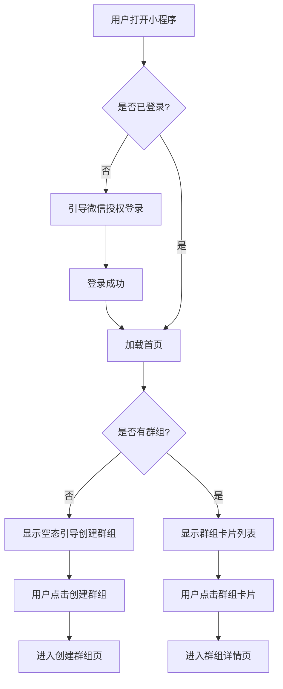

**业务规则说明：**
1. 群组卡片按最近活跃时间倒序排列
2. 每个群组卡片显示：群组名称、场景标签、成员数、当月行程次数、本人应付/应收金额
3. 应付金额显示为红色，应收金额显示为绿色
4. 若用户未加入任何群组，显示空态页面，引导创建或加入群组
5. 列表支持下拉刷新，上拉加载更多（超过10个群组时）

**验收标准：**
- [ ] 正常流程：登录后展示所有已加入群组卡片，信息准确
- [ ] 异常流程：无群组时显示空态引导，网络异常时显示重试提示
- [ ] 性能要求：首页加载时间 < 1秒（已登录有缓存）

### 3.1.2 创建群组

**功能描述：** 发起人创建新的拼车群组，填写群组名称、选择拼车场景、设置分摊模式和计费方式。创建成功后生成邀请链接和二维码，供发起人分享给潜在成员。

**优先级与依赖说明：**

| 项 | 内容 |
| --- | --- |
| 优先级 | P0 |
| 依赖需求 | 微信授权登录 |
| 前置条件 | 用户已完成微信授权登录 |

**详细流程：**

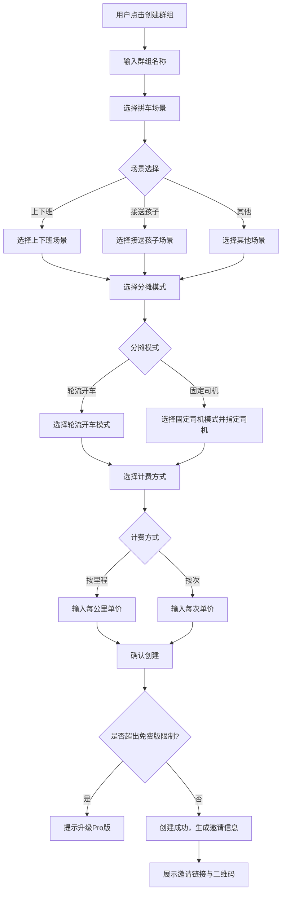

**业务规则说明：**
1. 群组名称长度限制：2-20个字符，不允许包含特殊字符
2. 拼车场景选项：上下班、接送孩子、其他
3. 分摊模式创建后支持后续修改，修改后对未来行程生效
4. 按里程计费：单价精确到小数点后两位，单位元/公里
5. 按次计费：单价精确到小数点后两位，单位元/次
6. 免费版限制：最多3人群组（含发起人），超出需升级Pro版
7. 创建成功后自动将创建者设为群主（发起人角色）

**验收标准：**
- [ ] 正常流程：填写完整信息后成功创建群组，生成邀请链接和二维码
- [ ] 异常流程：免费版超出人数限制时提示升级Pro版
- [ ] 性能要求：创建操作响应时间 < 500ms

### 3.1.3 邀请成员

**功能描述：** 发起人通过分享邀请链接或二维码邀请潜在成员加入群组。潜在成员通过链接或扫码进入群组加入页面，确认后完成加入。

**优先级与依赖说明：**

| 项 | 内容 |
| --- | --- |
| 优先级 | P0 |
| 依赖需求 | 创建群组 |
| 前置条件 | 群组已创建成功 |

**详细流程：**

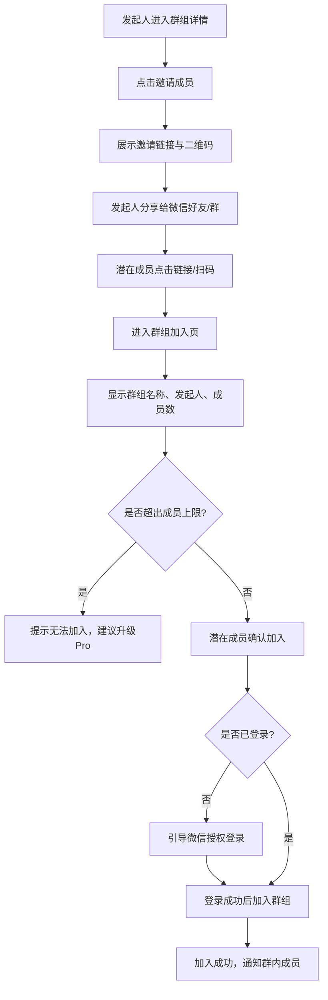

**业务规则说明：**
1. 邀请链接为小程序分享卡片形式，包含群组名称和邀请码
2. 二维码可在群组详情页生成并保存为图片
3. 潜在成员加入前需完成微信授权登录（如未登录）
4. 加入成功后，群内所有成员收到通知
5. 已加入群组的成员再次点击链接，直接进入群组

**验收标准：**
- [ ] 正常流程：成员通过链接/二维码成功加入群组，群内收到通知
- [ ] 异常流程：超出人数限制时拒绝加入并提示升级
- [ ] 性能要求：加入操作响应时间 < 500ms

### 3.1.4 记录行程

**功能描述：** 司机在完成接送后记录本次行程，选择乘车乘客、输入里程数（或确认按次计费）、选择行程日期，提交后系统自动计算每位乘客应付金额。

**优先级与依赖说明：**

| 项 | 内容 |
| --- | --- |
| 优先级 | P0 |
| 依赖需求 | 创建群组、邀请成员 |
| 前置条件 | 司机已加入群组，群组已设置分摊模式和计费方式 |

**详细流程：**

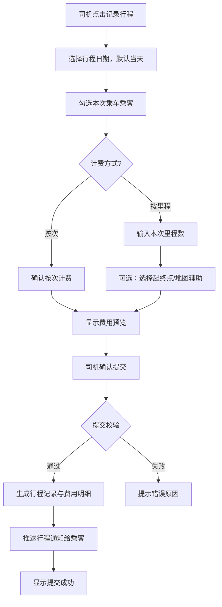

**业务规则说明：**
1. 行程日期默认为当天，支持选择过去7天内的日期用于补录，补录行程标注"补录"标签
2. 乘客选择：从群组成员中多选，支持全选/取消全选
3. 按里程计费：司机手动输入里程数（单位：公里，精确到1位小数），也可通过地图辅助测算
4. 按次计费：无需输入里程，系统自动按预设单价计算
5. 费用分摊规则：
   - 轮流开车+按里程：总费用 = 里程 × 单价，由当次乘客按人数均摊
   - 轮流开车+按次：每人应付 = 单次单价
   - 固定司机+按里程：总费用 = 里程 × 单价，由当次乘客按人数均摊给固定司机
   - 固定司机+按次：每人应付 = 单次单价，支付给固定司机
6. 提交后不可由司机单方面修改，如需修改需联系发起人
7. 行程记录需校验：至少选择1名乘客，里程数 > 0

**验收标准：**
- [ ] 正常流程：司机提交行程后，系统正确计算每位乘客应付金额
- [ ] 异常流程：未选择乘客或里程为0时提示错误
- [ ] 性能要求：行程提交响应时间 < 500ms

### 3.1.5 查看行程记录

**功能描述：** 展示当前群组的所有行程记录列表，按日期倒序排列。每条行程显示日期、司机、乘客列表、里程/次数和费用总额。支持点击查看详情，支持按日期、司机、乘客筛选。

**优先级与依赖说明：**

| 项 | 内容 |
| --- | --- |
| 优先级 | P0 |
| 依赖需求 | 记录行程 |
| 前置条件 | 群组内已有行程记录 |

**详细流程：**

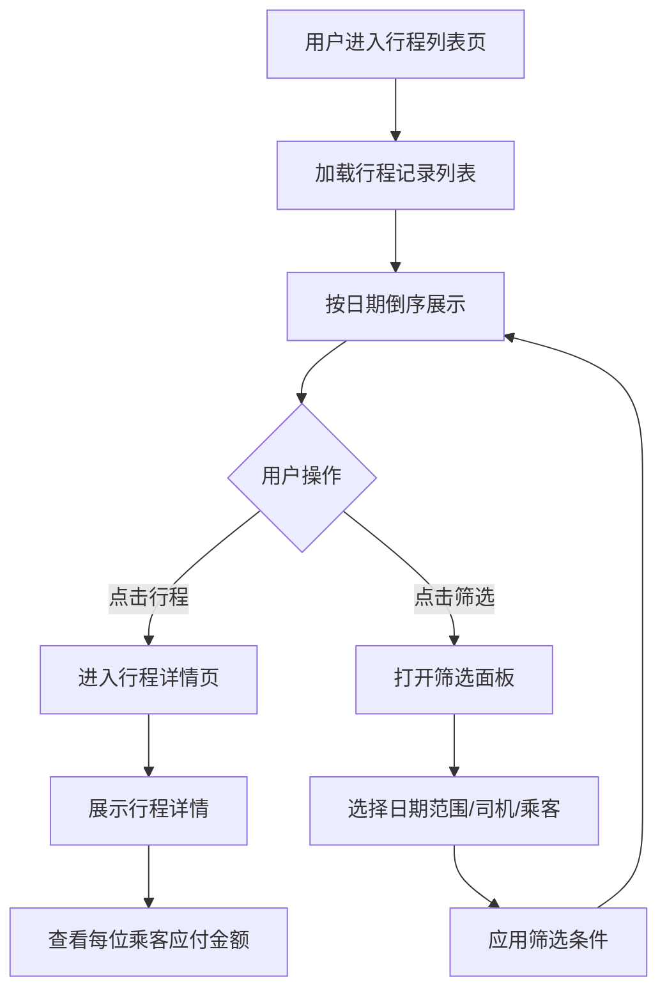

**业务规则说明：**
1. 列表默认显示近30天的行程记录
2. 每条行程卡片显示：日期、司机姓名、乘客数量、里程数/按次、费用总额
3. 行程详情页显示：完整乘客列表、每位乘客应付金额、起点终点（如有）、补录标签（如有）
4. 筛选条件可组合使用：日期范围、司机、乘客
5. 列表支持下拉刷新和上拉加载更多

**验收标准：**
- [ ] 正常流程：行程列表正确展示所有行程，筛选功能正常
- [ ] 异常流程：无行程记录时显示空态引导
- [ ] 性能要求：列表加载时间 < 1秒

### 3.1.6 月度账单

**功能描述：** 每月最后一天23:00系统自动汇总本月所有行程记录，按分摊模式和计费方式计算各成员的应付/应收金额，生成月度账单。乘客可查看本人月度账单（含每笔行程费用明细），司机可查看应收账单。

**优先级与依赖说明：**

| 项 | 内容 |
| --- | --- |
| 优先级 | P0 |
| 依赖需求 | 行程记录 |
| 前置条件 | 当月有行程记录 |

**详细流程：**

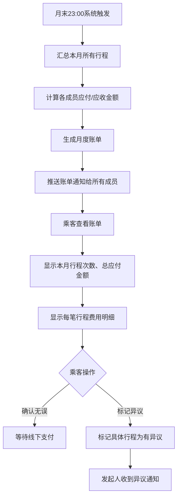

**业务规则说明：**
1. 账单生成时间：每月最后一天23:00，涵盖当月1日至最后一天的全部行程
2. 乘客账单包含：本月行程次数、总应付金额、每笔行程的日期/司机/应付金额/应付对象
3. 司机账单包含：本月驾驶次数、总应收金额、每位乘客的应付明细
4. 账单状态：待结算 → 已结算 → 待支付 → 已支付/逾期
5. 异议标记：乘客可对具体行程标记"有异议"，发起人收到通知后介入处理
6. 异议标记不阻止账单整体状态推进

**验收标准：**
- [ ] 正常流程：账单正确汇总本月行程并计算金额
- [ ] 异常流程：无行程记录的月份不生成账单
- [ ] 性能要求：账单生成时间 < 5秒/群组

### 3.1.7 收款提醒与确认

**功能描述：** 司机可一键向所有未支付乘客发送账单提醒通知；乘客线下支付后确认已支付，司机确认收到款项后更新账单状态。系统对超期未支付成员自动发送催款提醒。

**优先级与依赖说明：**

| 项 | 内容 |
| --- | --- |
| 优先级 | P0 |
| 依赖需求 | 月度账单 |
| 前置条件 | 账单已生成 |

**详细流程：**

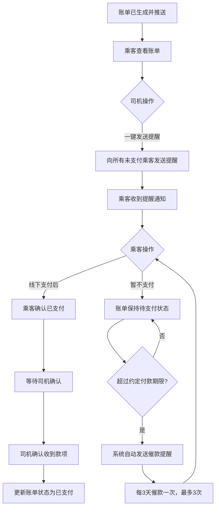

**业务规则说明：**
1. 司机一键提醒：每位乘客每天最多收到1次提醒，避免骚扰
2. 默认付款期限：7天（发起人可在群组设置中配置）
3. 自动催款：超期后每3天催款一次，最多催款3次
4. 乘客确认已支付后，账单状态变为"待司机确认"
5. 司机确认收款后，账单状态变为"已支付"
6. 已支付后不可撤销

**验收标准：**
- [ ] 正常流程：司机发送提醒后乘客收到通知，收款确认后状态正确更新
- [ ] 异常流程：超期未支付触发自动催款
- [ ] 性能要求：提醒推送时延 < 30秒

### 3.1.8 账单导出（Pro版）

**功能描述：** 发起人或司机可将月度账单导出为Excel文件，包含全部成员的应付/应收明细和汇总数据。

**优先级与依赖说明：**

| 项 | 内容 |
| --- | --- |
| 优先级 | P1 |
| 依赖需求 | 月度账单 |
| 前置条件 | 用户为发起人或司机角色，已升级Pro版 |

**业务规则说明：**
1. 仅Pro版用户可使用此功能
2. 导出格式：Excel (.xlsx)
3. 导出内容：群组名称、账单月份、成员列表、每人每笔行程明细、汇总金额
4. 仅发起人和司机可导出账单

**验收标准：**
- [ ] 正常流程：Pro版用户成功导出Excel文件，内容完整
- [ ] 异常流程：免费版用户尝试导出时提示升级Pro版

### 3.1.9 个人设置

**功能描述：** 用户管理个人资料（昵称、头像）、查看加入的所有群组、配置消息通知偏好。

**优先级与依赖说明：**

| 项 | 内容 |
| --- | --- |
| 优先级 | P1 |
| 依赖需求 | 微信授权登录 |
| 前置条件 | 用户已登录 |

**业务规则说明：**
1. 微信授权登录：首次登录需授权，获取微信昵称和头像作为默认资料
2. 个人资料修改对所有已加入群组同步生效
3. 消息通知设置：可按类型开关（行程通知、账单通知、催款提醒），默认全部开启
4. 我的群组：展示加入的所有群组，支持快速切换

**验收标准：**
- [ ] 正常流程：用户可修改资料、切换群组、设置通知偏好
- [ ] 异常流程：未登录时引导授权登录

---

# 4 产品原型

## 4.1 页面跳转逻辑图

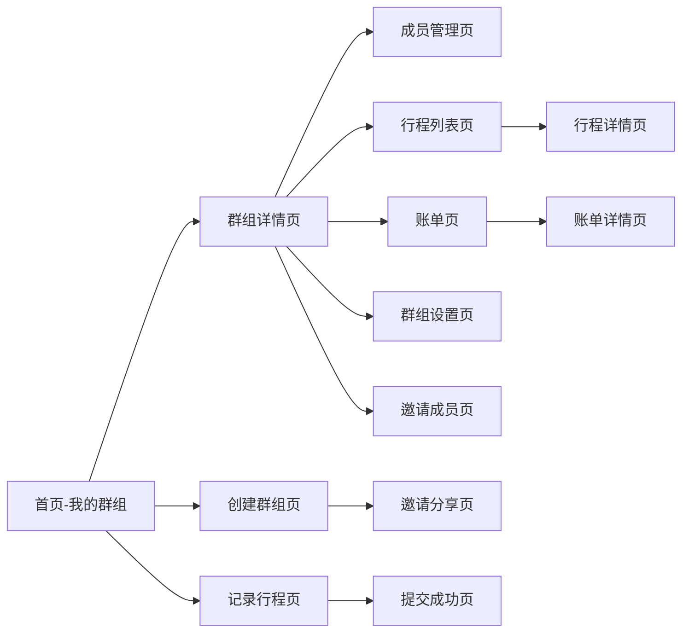

## 4.2 全站点原型设计

### 4.2.1 拼车群组端（小程序端）

**页面清单：**

| 序号 | 页面名称 | 所属模块 | 页面描述 | 关键元素 |
| --- | --- | --- | --- | --- |
| 1 | 首页-我的群组 | 首页 | 展示用户加入的所有群组卡片 | 群组卡片列表、创建群组按钮、记录行程快捷入口 |
| 2 | 创建群组 | 群组管理 | 填写群组信息、设置分摊模式和计费方式 | 表单（群组名称、场景、分摊模式、计费方式、单价） |
| 3 | 邀请成员 | 群组管理 | 展示邀请链接和二维码 | 邀请链接、二维码图片、分享按钮 |
| 4 | 群组详情 | 群组管理 | 群组信息概览、快捷入口 | 群组信息卡片、成员列表、记录行程入口、行程列表入口、账单入口 |
| 5 | 成员管理 | 群组管理 | 展示群组成员列表 | 成员列表（昵称、角色、加入时间）、移除按钮 |
| 6 | 记录行程 | 行程管理 | 司机记录本次行程 | 日期选择、乘客多选、里程输入/按次确认、费用预览、提交按钮 |
| 7 | 行程列表 | 行程管理 | 展示群组所有行程记录 | 行程卡片列表、筛选按钮 |
| 8 | 行程详情 | 行程管理 | 展示单条行程完整信息 | 日期、司机、乘客列表、起点终点、里程、费用明细 |
| 9 | 账单列表 | 账单与收款 | 展示月度账单列表 | 账单卡片列表（月份、金额、状态） |
| 10 | 账单详情 | 账单与收款 | 展示月度账单费用明细 | 总应付/应收、行程明细列表、异议标记、确认支付按钮 |
| 11 | 个人中心 | 个人设置 | 个人资料、我的群组、消息设置 | 头像昵称、群组列表、通知开关 |
| 12 | 群组设置 | 群组管理 | 修改群组信息和分摊规则 | 表单（群组名称、分摊模式、计费参数）、解散群组按钮 |

**交互说明：**
- 页面跳转关系：
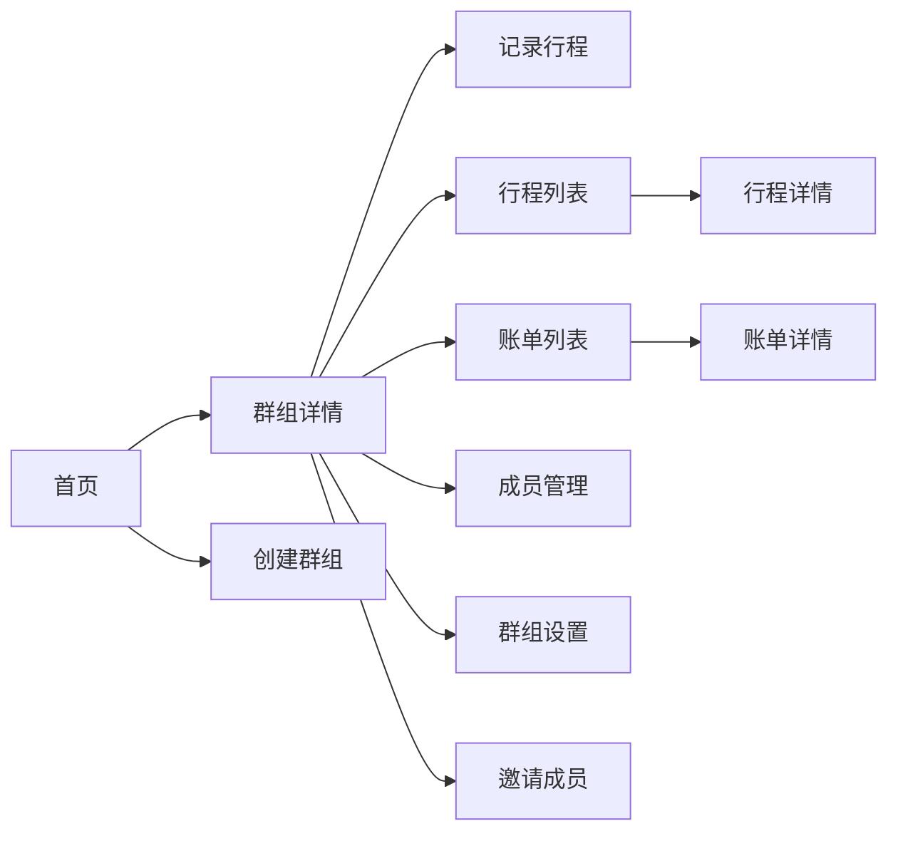

- 特殊交互：
  1. 下拉刷新：首页、行程列表、账单列表支持下拉刷新
  2. 上拉加载：列表页支持上拉加载更多
  3. Toast提示：操作成功/失败时显示Toast提示（2秒自动消失）
  4. 确认对话框：删除、解散等操作需二次确认
  5. 空数据态：列表为空时显示引导文案和入口按钮
  6. 加载态：数据加载中显示骨架屏
  7. 底部弹窗：邀请成员、筛选条件等使用底部弹窗展示

**产品原型：**

[📱 打开拼车群组端小程序全站点原型](assets/prototypes/mini-program-prototype.html)

---

# 5 数据需求

## 5.1 数据使用规格

### 用户表（user）
| 字段 | 是否必填 | 描述 | 数据类型 |
| --- | --- | --- | --- |
| id | 是 | 用户唯一标识 | UUID |
| openid | 是 | 微信openid | 字符串 |
| nickname | 是 | 用户昵称 | 字符串 |
| avatar_url | 否 | 头像URL | 字符串 |
| created_at | 是 | 创建时间 | 时间戳 |
| updated_at | 是 | 更新时间 | 时间戳 |

### 群组表（group）
| 字段 | 是否必填 | 描述 | 数据类型 |
| --- | --- | --- | --- |
| id | 是 | 群组唯一标识 | UUID |
| name | 是 | 群组名称 | 字符串 |
| scene | 是 | 拼车场景（上下班/接送孩子/其他） | 枚举 |
| split_mode | 是 | 分摊模式（轮流开车/固定司机） | 枚举 |
| billing_type | 是 | 计费方式（按里程/按次） | 枚举 |
| unit_price | 是 | 单价（元/公里 或 元/次） | 数值 |
| owner_id | 是 | 发起人ID | UUID |
| fixed_driver_id | 否 | 固定司机ID（固定司机模式下必填） | UUID |
| member_limit | 是 | 成员上限（免费版3，Pro版不限） | 整数 |
| payment_deadline_days | 是 | 付款期限天数（默认7天） | 整数 |
| status | 是 | 群组状态（活跃/冻结/已解散） | 枚举 |
| created_at | 是 | 创建时间 | 时间戳 |
| updated_at | 是 | 更新时间 | 时间戳 |

### 群组成员表（group_member）
| 字段 | 是否必填 | 描述 | 数据类型 |
| --- | --- | --- | --- |
| id | 是 | 成员记录ID | UUID |
| group_id | 是 | 群组ID | UUID |
| user_id | 是 | 用户ID | UUID |
| role | 是 | 角色（发起人/司机/乘客） | 枚举 |
| joined_at | 是 | 加入时间 | 时间戳 |

### 行程表（trip）
| 字段 | 是否必填 | 描述 | 数据类型 |
| --- | --- | --- | --- |
| id | 是 | 行程唯一标识 | UUID |
| group_id | 是 | 群组ID | UUID |
| driver_id | 是 | 司机ID | UUID |
| trip_date | 是 | 行程日期 | 日期 |
| mileage | 否 | 里程数（按里程计费时必填） | 数值 |
| total_amount | 是 | 总费用 | 数值 |
| is_retroactive | 是 | 是否为补录 | 布尔 |
| start_location | 否 | 起点地址 | 字符串 |
| end_location | 否 | 终点地址 | 字符串 |
| created_at | 是 | 创建时间 | 时间戳 |

### 行程乘客表（trip_passenger）
| 字段 | 是否必填 | 描述 | 数据类型 |
| --- | --- | --- | --- |
| id | 是 | 记录ID | UUID |
| trip_id | 是 | 行程ID | UUID |
| passenger_id | 是 | 乘客ID | UUID |
| amount | 是 | 应付金额 | 数值 |

### 月度账单表（monthly_bill）
| 字段 | 是否必填 | 描述 | 数据类型 |
| --- | --- | --- | --- |
| id | 是 | 账单唯一标识 | UUID |
| group_id | 是 | 群组ID | UUID |
| bill_month | 是 | 账单月份（YYYY-MM） | 字符串 |
| total_trips | 是 | 本月行程次数 | 整数 |
| status | 是 | 账单状态（待结算/已结算/待支付/已支付/逾期） | 枚举 |
| created_at | 是 | 创建时间 | 时间戳 |

### 账单明细表（bill_detail）
| 字段 | 是否必填 | 描述 | 数据类型 |
| --- | --- | --- | --- |
| id | 是 | 明细ID | UUID |
| bill_id | 是 | 账单ID | UUID |
| passenger_id | 是 | 乘客ID | UUID |
| driver_id | 是 | 司机ID | UUID |
| trip_id | 是 | 行程ID | UUID |
| amount | 是 | 应付金额 | 数值 |
| payment_status | 是 | 支付状态（待支付/已支付/逾期） | 枚举 |
| is_disputed | 是 | 是否有异议 | 布尔 |
| paid_at | 否 | 支付时间 | 时间戳 |

## 5.2 统计数据

1. 统计每个群组的月度行程次数、总费用、活跃成员数，按月维度统计（P0）
2. 统计每个司机的驾驶次数、总里程、累计应收金额，按月/按周维度统计（P1）
3. 统计每个乘客的乘车次数、总应付金额、已支付金额，按月维度统计（P1）

## 5.3 埋点需求

| 页面 | 事件 | 采集字段 | 说明 |
| --- | --- | --- | --- |
| 首页 | 进入首页 | user_id, timestamp | 统计日活 |
| 首页 | 点击群组卡片 | group_id, user_id | 统计群组活跃度 |
| 创建群组 | 提交创建 | group_name, scene, split_mode, billing_type | 统计新功能使用 |
| 记录行程 | 提交行程 | group_id, driver_id, passenger_count, mileage, amount | 统计行程记录量 |
| 账单详情 | 标记异议 | bill_id, trip_id, user_id | 统计异议率 |
| 账单详情 | 确认支付 | bill_id, user_id, amount | 统计支付率 |

---

# 6 非功能需求

## 6.1 性能需求

| 编号 | 项目 | 最大延迟 | 平均延迟 | 优先级 | 备注 |
| --- | --- | --- | --- | --- | --- |
| 0001 | 首页加载 | < 2秒 | < 1秒 | 高 | 4G网络环境 |
| 0002 | 行程记录提交 | < 500ms | < 300ms | 高 | 核心接口 |
| 0003 | 费用分摊计算 | < 500ms | < 200ms | 高 | 核心接口 |
| 0004 | 月度账单生成 | < 5秒 | < 3秒 | 中 | 单群组 |
| 0005 | 消息推送时延 | < 30秒 | < 10秒 | 中 | 行程/账单通知 |

**吞吐量：**

| 编号 | 项 | 吞吐量 | 备注 |
| --- | --- | --- | --- |
| 0001 | 行程记录提交 | 每分钟500次 | 高峰时段 |
| 0002 | 账单查询 | 每分钟1000次 | 月末高峰 |

**容量：**

| 编号 | 项 | 容量 | 备注 |
| --- | --- | --- | --- |
| 0001 | 系统用户数 | ≤ 100,000 | 上线3个月目标 |
| 0002 | 活跃群组数 | ≤ 10,000 | 上线3个月目标 |
| 0003 | 单群组行程记录 | ≥ 10,000条 | 存储与查询 |
| 0004 | 并发用户数 | ≥ 500 | 同时在线操作 |

## 6.2 安全需求

| 编号 | 项 |
| --- | --- |
| 0001 | 所有API接口必须使用HTTPS协议 |
| 0002 | 用户敏感数据（openid等）加密存储 |
| 0003 | 接口调用需校验用户身份，防止越权访问 |
| 0004 | 群组数据隔离，用户只能访问自己加入的群组数据 |
| 0005 | 防止SQL注入、XSS攻击等常见安全漏洞 |

## 6.3 可靠性

| 编号 | 项 | 值 |
| --- | --- | --- |
| 0001 | 系统可用性 | ≥ 99.9% |
| 0002 | 平均故障恢复时间 | ≤ 30分钟 |
| 0003 | 数据备份频率 | 每日全量备份，每小时增量备份 |

## 6.4 可连续性

| 编号 | 项 |
| --- | --- |
| 0001 | 系统需要7×24小时全天候运行 |
| 0002 | 支持服务器弹性扩缩容，应对流量高峰 |
| 0003 | 弱网环境下支持行程记录基本操作（离线暂存，联网后自动同步） |

## 6.5 可恢复性

| 编号 | 项 |
| --- | --- |
| 0001 | 数据库每日全量备份，保留30天 |
| 0002 | 重大故障需在1-3小时内恢复服务可用性 |
| 0003 | 24-72小时内恢复历史数据 |

## 6.6 兼容性

| 编号 | 要求 | 备注 |
| --- | --- | --- |
| 0001 | 微信版本 ≥ 8.0 | 小程序基础库 |
| 0002 | 基础库版本 ≥ 2.25.0 |  |
| 0003 | 适配主流手机屏幕：iPhone SE 至 iPhone 15 Pro Max，主流Android机型 | 响应式设计 |
| 0004 | 支持4G/5G/WiFi网络环境 |  |

## 6.7 易用性

| 编号 | 要求 | 备注 |
| --- | --- | --- |
| 0001 | 记录行程操作路径不超过3步 | 核心操作 |
| 0002 | 核心操作按钮尺寸 ≥ 44×44pt | 适老化设计 |
| 0003 | 字体大小 ≥ 14sp | 适老化设计 |
| 0004 | 普通用户无需培训即可使用核心功能 |  |

---

# 7 免费版与Pro版功能差异

| 功能 | 免费版 | Pro版（¥9/月） |
| --- | --- | --- |
| 群组成员数上限 | 3人 | 不限 |
| 行程记录次数上限 | 10次（累计） | 不限 |
| 群组数量 | 1个 | 不限（多群组管理） |
| 月度账单 | ✅ | ✅ |
| 收款提醒 | ✅（手动一键提醒） | ✅（手动+自动催款） |
| 账单导出 | ❌ | ✅（Excel导出） |
| 历史记录查询 | 近3个月 | 不限 |
| 客服支持 | 基础 | 优先 |

---

# 8 总结

## 8.1 上线计划

| 阶段 | 时间 | 内容 | 负责人 |
| --- | --- | --- | --- |
| 开发阶段 | Day 1-5 | 核心功能开发（群组管理+行程记录+费用计算+账单生成） | 开发团队 |
| 测试阶段 | Day 6-7 | 功能测试、兼容性测试 | 测试团队 |
| 灰度阶段 | Day 8-10 | 灰度10%用户，验证稳定性 | 产品+运营 |
| 全量上线 | Day 11 | 全量开放给所有用户 | 全体 |

## 8.2 后续迭代规划

- V1.1：增加行程统计功能、支持行程数据图表展示
- V1.2：支持多群组管理优化、增加群组模板功能
- V1.3：探索集成微信支付（可选），实现在线支付功能
- V1.4：增加数据仪表盘，为运营提供决策支持

## 8.3 参考文档

- 需求文档：`./邻里拼车费用分摊助手/需求文档.md`
- UI原型：`./邻里拼车费用分摊助手/assets/prototypes/mini-program-prototype.html`
