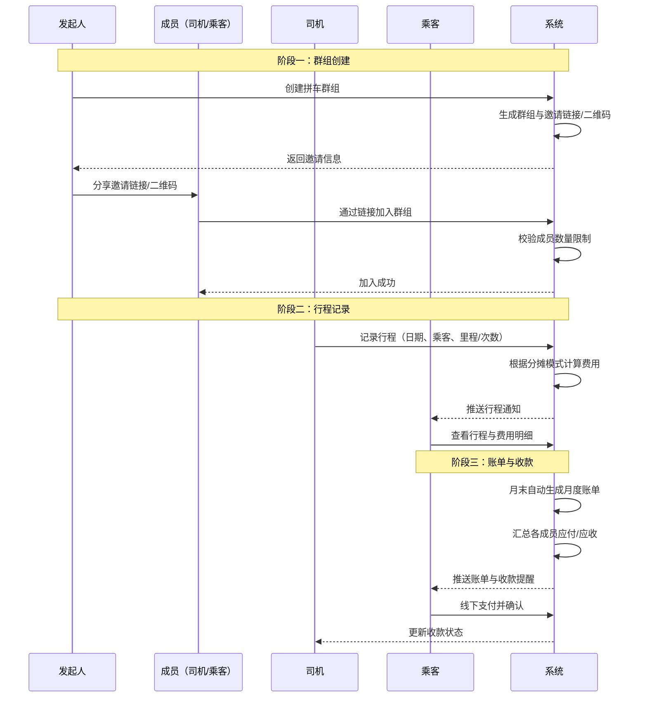
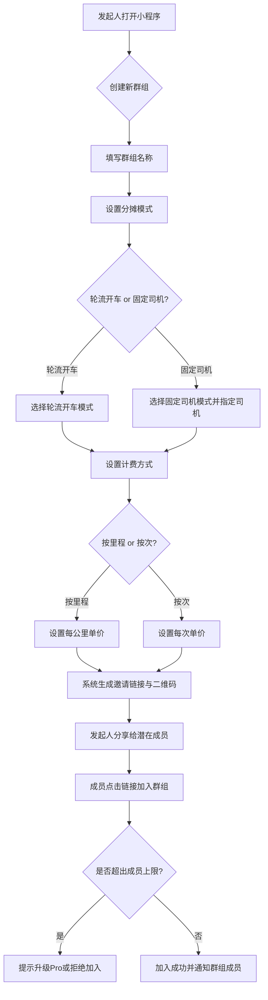
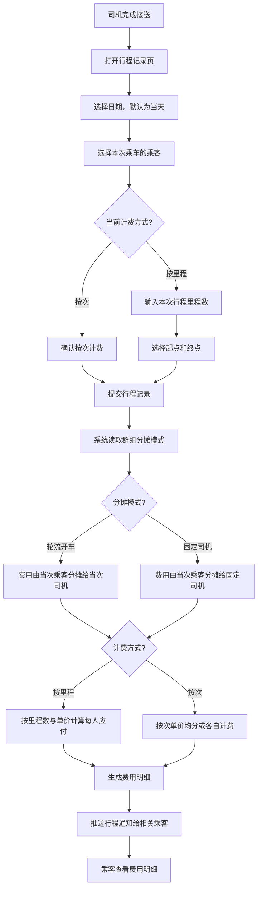
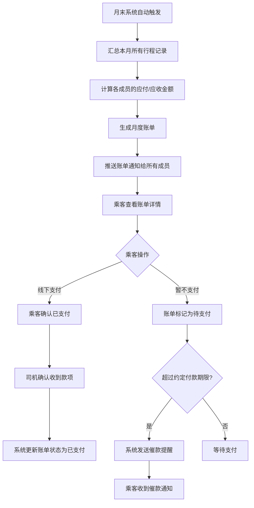
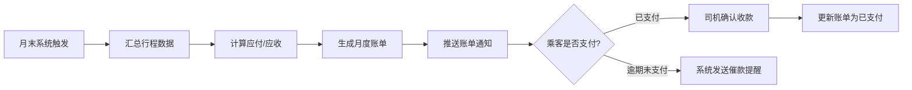
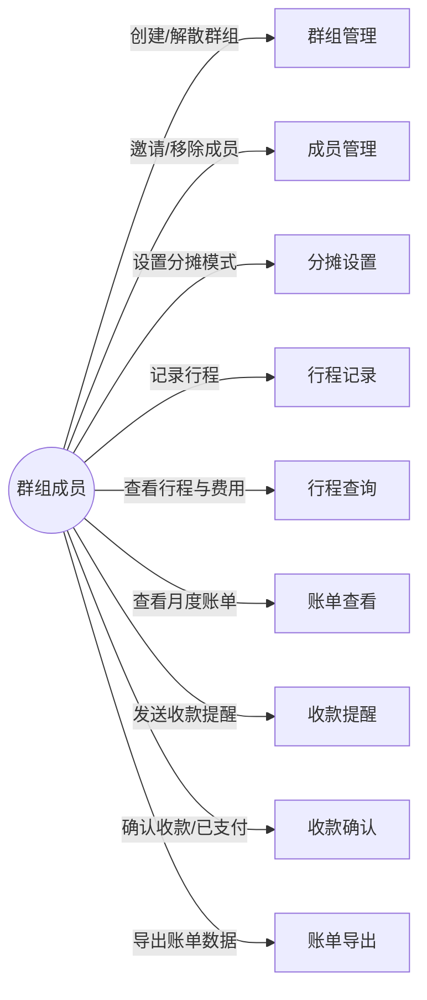
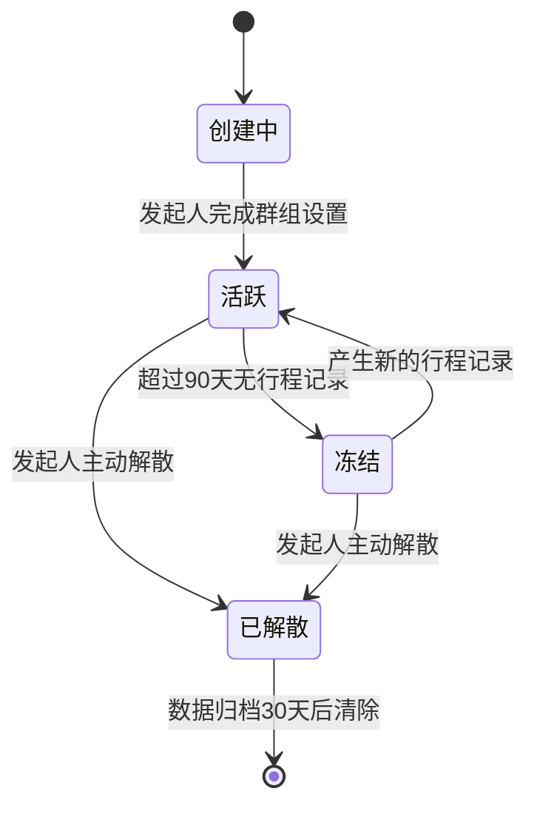
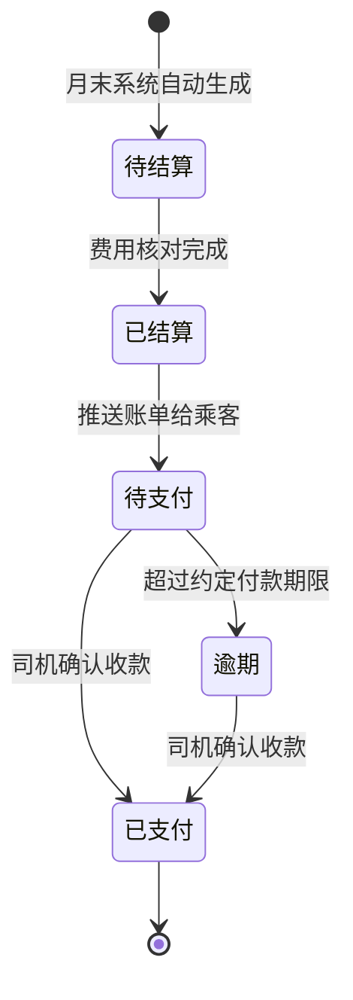

# 1. 需求概述

## 1.1 需求介绍

邻里拼车费用分摊助手是一款面向固定拼车群体的轻量化工具型产品，专注于解决拼车场景下费用的记录、计算与分摊问题。产品不做出行平台或顺风车匹配，仅作为拼车群体内部的"费用记账工具"，帮助固定拼车的同事、家长、邻居实现费用透明化，消除因费用分摊不清引发的矛盾。

### 1.1.1 所属领域

共享出行辅助工具 / 邻里互助 / 轻量级财务管理

## 1.2 需求目标

当前拼车场景中，费用长期由一人垫付或临时AA，微信群接龙记账繁琐且易出错，缺少轻量化的费用分摊工具。本产品旨在：

1. 为固定拼车群体提供便捷的费用记录方式，乘客无需手动记账
2. 支持轮流开车和固定司机两种常见计费模式，覆盖主流拼车场景
3. 按里程或次数自动计算每位乘客应付金额，消除人工计算误差
4. 提供月度账单与收款提醒，减少催款沟通成本
5. 以纯工具形态切入，不依赖司机资源，避开与滴滴、高德等出行平台的竞争

业务目标：上线后3个月内服务至少1000个活跃拼车群组，帮助拼车群体实现费用透明化。

用户价值：减少拼车费用纠纷，提升拼车体验，降低记账和催款的时间成本。

## 1.3 系统使用角色

| 角色 | 说明 | 典型用户 |
| --- | --- | --- |
| 发起人 | 创建拼车群组、设置分摊模式与计费参数、邀请和管理成员的角色。发起人同时也是群组成员，可担任司机或乘客 | 拼车活动的组织者，如拼车上下班的同事牵头人、接送孩子的家长牵头人、社区拼车发起人 |
| 司机 | 在行程中驾驶车辆并提供出行服务的成员。可记录行程、查看收入统计和生成个人账单 | 拥有车辆并承担驾驶任务的拼车成员 |
| 乘客 | 乘坐车辆并支付分摊费用的成员。可查看行程记录、费用明细和账单 | 无车或不担任驾驶的拼车成员 |

注：同一用户在同一群组内可同时担任多个角色（如既是发起人又是司机/乘客），也可在不同群组内担任不同角色。

## 1.4 业务流程图

### 1.4.1 核心业务总览

### 1.4.2 群组创建流程

### 1.4.3 行程记录与费用分摊流程

### 1.4.4 账单生成与收款流程

# 2. 功能原型

| 原型名称 | 原型链接 | 对应端 | 备注 |
| --- | --- | --- | --- |
| 邻里拼车费用分摊助手 | 待设计 | 小程序端 | MVP阶段以微信小程序为主要载体，拼车群组天然基于微信群运作，小程序便于在群内直接使用 |
| 邻里拼车费用分摊助手管理后台 | 待设计 | WEB端 | 仅用于运营方数据统计与群组管理，MVP阶段可简化或暂不实现 |

# 3. 需求清单

## 3.1 拼车群组端 - 小程序端

### 3.1.1 群组管理模块

| 模块 | 一级功能 | 二级功能 | 功能描述 | 备注 |
| --- | --- | --- | --- | --- |
| 群组管理 | 创建群组 | 填写群组信息 | 发起人输入群组名称、选择拼车场景（上下班/接送孩子/其他），系统创建群组并生成唯一标识 | |
| 群组管理 | 创建群组 | 设置分摊模式 | 发起人选择分摊模式：轮流开车模式（成员轮流担任司机）或固定司机模式（指定一名固定司机） | 分摊模式创建后支持后续修改，修改后对未来行程生效 |
| 群组管理 | 创建群组 | 设置计费方式 | 发起人选择计费方式：按里程（输入每公里单价）或按次数（输入每次单价），系统保存计费参数 | 按里程模式下单价精确到小数点后两位，单位为人民币元 |
| 群组管理 | 邀请成员 | 生成邀请信息 | 系统生成群组专属邀请链接和二维码，包含群组名称与邀请码 | 邀请链接可在微信聊天中直接分享 |
| 群组管理 | 邀请成员 | 加入群组 | 潜在成员通过邀请链接或扫描二维码进入群组，系统校验是否超出成员上限（免费版3人，Pro版不限），通过后完成加入 | 加入后自动通知群内其他成员 |
| 群组管理 | 成员管理 | 查看成员列表 | 展示当前群组所有成员，显示成员昵称、角色（发起人/司机/乘客）和加入时间 | |
| 群组管理 | 成员管理 | 移除成员 | 发起人可将成员移出群组，被移除成员的历史行程和账单数据保留，但不再接收该群组的新通知 | 移除操作需发起人二次确认 |
| 群组管理 | 群组设置 | 修改群组信息 | 发起人修改群组名称、场景描述，修改后立即生效 | |
| 群组管理 | 群组设置 | 修改分摊模式 | 发起人切换分摊模式（轮流开车 ↔ 固定司机）或修改计费参数（单价），修改对未来行程生效，不影响历史数据 | 修改分摊模式需发起人二次确认 |
| 群组管理 | 群组设置 | 解散群组 | 发起人可解散群组，解散后群组内所有行程和账单数据归档保留30天后清除，所有成员收到解散通知 | 解散操作需发起人二次确认 |

### 3.1.2 行程管理模块

| 模块 | 一级功能 | 二级功能 | 功能描述 | 备注 |
| --- | --- | --- | --- | --- |
| 行程管理 | 记录行程 | 选择乘车乘客 | 司机从当前群组成员中勾选本次行程的乘车乘客，支持多选 | 默认显示群内全部成员，可快速全选/取消全选 |
| 行程管理 | 记录行程 | 输入里程数 | 按里程计费模式下，司机输入本次行程的总里程数（单位：公里），支持手动输入和地图辅助测算两种方式 | 地图辅助测算调用微信地图接口自动计算起点到终点的里程 |
| 行程管理 | 记录行程 | 确认按次计费 | 按次计费模式下，司机确认本次行程按次计费，系统自动按预设单价计算 | 按次模式无需输入里程数 |
| 行程管理 | 记录行程 | 选择行程日期 | 司机选择行程日期，默认为当天，支持选择过去7天内的日期用于补录 | 补录的行程需经系统标注"补录"标签 |
| 行程管理 | 记录行程 | 选择起点和终点 | 司机通过地图定位选择行程的起点和终点，用于里程测算参考和行程记录展示 | |
| 行程管理 | 记录行程 | 提交行程记录 | 司机确认行程信息无误后提交，系统根据群组当前分摊模式和计费方式自动计算每位乘客应付金额，并生成费用明细 | 提交后不可由司机单方面修改，如需修改需联系发起人 |
| 行程管理 | 费用分摊计算 | 轮流开车按里程分摊 | 当分摊模式为轮流开车且计费方式为按里程时，系统将本次行程费用（里程 × 单价）全部计入当次司机应收，由当次乘客按人数均摊 | 当次司机本身不计入分摊 |
| 行程管理 | 费用分摊计算 | 轮流开车按次分摊 | 当分摊模式为轮流开车且计费方式为按次时，系统将单次费用按乘客人数均摊，每人支付预设单价 | |
| 行程管理 | 费用分摊计算 | 固定司机按里程分摊 | 当分摊模式为固定司机且计费方式为按里程时，系统将本次行程费用（里程 × 单价）计入固定司机应收，由当次乘客按人数均摊 | 固定司机不参与分摊 |
| 行程管理 | 费用分摊计算 | 固定司机按次分摊 | 当分摊模式为固定司机且计费方式为按次时，每位乘客按预设单价支付，费用计入固定司机应收 | |
| 行程管理 | 查看行程记录 | 行程列表 | 展示当前群组的所有行程记录，按日期倒序排列，每条行程显示日期、司机、乘客列表、里程/次数和费用总额 | |
| 行程管理 | 查看行程记录 | 行程详情 | 展示单条行程的完整信息：日期、司机、乘客列表、起点终点、里程数、计费方式、每位乘客应付金额 | |
| 行程管理 | 查看行程记录 | 筛选与搜索 | 支持按日期范围、司机、乘客等条件筛选行程记录 | |
| 行程管理 | 行程统计 | 司机收入统计 | 司机可查看本人在当前群组内的驾驶统计，包括驾驶次数、总里程、累计应收金额，支持按月/按周维度切换 | |

### 3.1.3 账单与收款模块

| 模块 | 一级功能 | 二级功能 | 功能描述 | 备注 |
| --- | --- | --- | --- | --- |
| 账单与收款 | 月度账单 | 自动生成账单 | 每月最后一天系统自动汇总本月所有行程记录，按分摊模式和计费方式计算各成员的应付/应收金额，生成月度账单 | 账单生成时间为每月23:00，涵盖当月1日至最后一天的全部行程 |
| 账单与收款 | 月度账单 | 查看账单详情 | 乘客可查看本人月度账单，包含本月行程次数、总应付金额、每笔行程对应的费用明细和应付对象；司机可查看本人应收账单 | 账单中展示每位乘客的明细，便于核对 |
| 账单与收款 | 月度账单 | 账单核对 | 成员对账单有疑问时，可标记具体行程为"有异议"，发起人收到通知后介入处理 | 异议标记不阻止账单整体状态推进 |
| 账单与收款 | 收款提醒 | 一键发送账单 | 司机可一键向所有未支付乘客发送账单提醒通知，通知内容包含应付金额和账单链接 | 每位乘客每天最多收到一次提醒，避免骚扰 |
| 账单与收款 | 收款提醒 | 自动催款提醒 | 系统对超过约定付款期限（默认7天，发起人可配置）仍未支付的成员自动发送催款提醒 | 催款频率为每3天一次，最多3次 |
| 账单与收款 | 收款确认 | 确认收款 | 司机在收到乘客线下支付后，确认该乘客的账单状态为已支付，系统更新对应账单记录 | |
| 账单与收款 | 收款确认 | 确认已支付 | 乘客在线下完成支付后，可在账单页面确认已支付，等待司机确认 | |
| 账单与收款 | 账单导出 | 导出账单数据 | 发起人或司机可将月度账单导出为Excel文件，包含全部成员的应付/应收明细和汇总数据 | Pro版功能，免费版不支持导出 |

### 3.1.4 个人设置模块

| 模块 | 一级功能 | 二级功能 | 功能描述 | 备注 |
| --- | --- | --- | --- | --- |
| 个人设置 | 账号管理 | 微信授权登录 | 用户通过微信授权一键登录小程序，系统自动获取微信昵称和头像作为默认个人资料 | 首次登录需授权，后续登录自动识别 |
| 个人设置 | 账号管理 | 修改个人资料 | 用户可修改昵称和头像，用于在群组内的显示 | 个人资料修改对所有已加入的群组同步生效 |
| 个人设置 | 群组列表 | 我的群组 | 展示用户加入的所有拼车群组列表，显示群组名称、角色、成员数和当月行程次数，支持快速切换 | |
| 个人设置 | 订阅管理 | 消息通知设置 | 用户可配置是否接收行程通知、账单通知和催款提醒，支持按类型开关 | 默认全部开启 |

# 4. 非功能需求

## 4.1 使用界面需求

| 需求项 | 描述 |
| --- | --- |
| 首页布局 | 首页展示用户当前所在群组的卡片，包含群组名称、当月行程次数、本人应付/应收金额概览，点击进入群组详情；底部提供"记录行程"快捷入口 |
| 行程记录页 | 行程记录页面操作路径不超过3步（选择乘客 → 输入里程/确认 → 提交），支持一键提交 |
| 账单展示 | 账单页面采用卡片式布局，突出显示应付/应收总金额，下方以列表形式展示每笔行程的费用明细 |
| 适老化设计 | 考虑到家长群体中可能有年长用户，核心操作按钮尺寸不小于44×44pt，字体不小于14sp |
| 响应式设计 | 适配主流手机屏幕尺寸（iPhone SE 至 iPhone 15 Pro Max，以及主流Android机型） |

## 4.2 软硬件环境需求

| 需求项 | 描述 |
| --- | --- |
| 客户端要求 | 微信版本 8.0 及以上；基础库版本 2.25.0 及以上 |
| 网络要求 | 支持4G/5G/WiFi网络环境，弱网环境下支持行程记录的基本操作（离线暂存，联网后自动同步） |
| 服务端要求 | 云服务器部署，支持弹性扩缩容；数据库采用关系型数据库（MySQL或PostgreSQL） |
| 浏览器要求 | WEB管理后台（若实现）兼容Chrome 90+、Safari 14+、Edge 90+ |

## 4.3 性能需求

| 需求项 | 指标 |
| --- | --- |
| 页面加载时间 | 首屏加载时间不超过2秒（4G网络环境） |
| 接口响应时间 | 核心接口（行程记录提交、费用分摊计算）响应时间不超过500ms |
| 账单生成时间 | 单个月度账单生成时间不超过5秒 |
| 并发用户数 | 支持至少500个并发用户同时操作 |
| 数据存储容量 | 单群组支持至少10000条行程记录的存储与查询 |
| 消息推送时延 | 行程通知和账单提醒推送时延不超过30秒 |

## 4.4 约束性需求

| 约束项 | 描述 |
| --- | --- |
| 不提供出行匹配 | 系统不提供顺风车匹配、路线规划等出行服务，仅作为已有拼车群体的费用管理工具 |
| 不集成在线支付 | MVP阶段不集成微信支付或其他在线支付功能，费用结算由用户线下完成，系统仅提供记录和提醒 |
| 不提供社交功能 | 不提供聊天、动态、评论等社交功能，保持纯工具定位 |
| MVP开发周期 | 核心功能（群组管理 + 行程记录 + 费用计算 + 账单生成）开发周期不超过5天 |
| 免费版限制 | 免费版支持最多3人群组和10次行程记录，超出后需升级Pro版 |
| Pro版功能 | Pro版（¥9/月）支持不限成员和行程、多群组管理、收款提醒、历史记录导出 |
| 后台服务需求 | 本系统需要后台服务支撑，包括计费引擎、账单定时生成、消息推送等核心功能的运行 |

# 5. 接口需求

## 5.2 软件接口需求

| 模块 | 接口名称 | 输入 | 输出 | 功能描述 |
| --- | --- | --- | --- | --- |
| 个人设置 | 微信登录接口 | 微信授权code | 用户openid、会话密钥session_key | 调用微信login接口完成用户身份认证，获取用户唯一标识用于账号关联 |
| 个人设置 | 用户信息接口 | 用户授权token | 用户昵称、头像URL | 获取微信用户的昵称和头像信息，用于初始化个人资料 |
| 行程管理 | 地图定位接口 | 用户选择的起点/终点地址 | 经纬度坐标、里程数 | 调用微信地图或第三方地图服务，辅助用户选择起点和终点，并计算两点间的行驶里程 |
| 账单与收款 | 消息推送接口 | 推送目标用户openid、消息模板ID、模板数据 | 推送结果（成功/失败） | 调用微信订阅消息接口，向用户推送行程通知、账单通知和催款提醒 |
| 账单与收款 | 数据导出接口 | 群组ID、账单月份 | Excel文件流（.xlsx） | 将指定群组和月份的账单数据生成Excel文件，供发起人或司机下载 |

## 5.4 通讯接口需求

| 模块 | 接口名称 | 描述 |
| --- | --- | --- |
| 行程管理 | HTTPS RESTful API | 小程序端与服务端之间的行程记录提交、查询、费用计算等接口均采用HTTPS协议，数据格式为JSON |
| 账单与收款 | WebSocket（可选） | 账单状态变更（如收款确认）时，可通过WebSocket实时推送至相关在线用户，提升体验 |

# 6. 附录

## 流程图

### 行程记录与费用分摊流程

### 账单生成与收款流程

## 用例图

## （系统）状态图

### 群组生命周期状态

### 账单状态

