# 钥匙门禁借还留痕器 — 产品需求文档（PRD）

> 产品名称：钥匙门禁借还留痕器  
> 版本：v1.0.0  
> 编写日期：2026-06-26  
> 文档状态：草稿

---

## 变更历史

| 版本号 | 变更日期 | 变更内容 | 变更人 | 审核人 |
| --- | --- | --- | --- | --- |
| V1.0 | 2026-06-26 | 初始版本创建 | 产品文档结对写作专家 | — |

---

# 1 概述

## 1.1 需求背景

小区物业、合租房房东、共享办公室管理员在日常管理中，频繁涉及钥匙、门禁卡、工牌等物品的借出与归还。当前这些小型组织普遍依赖纸质登记本或微信群聊来管理借还，存在三大核心痛点：

1. **责任不清**：纸质登记易被篡改、遗漏，物品丢失时无法追溯责任人。
2. **提醒缺失**：没有自动化的超期提醒机制，管理员需逐人催还，效率低、体验差。
3. **记录分散**：借还信息散落在纸质本、微信聊天中，无法快速汇总导出，事后核查困难。

市面上的资产管理系统功能复杂、价格高昂，不适合仅有数十件钥匙/门禁卡的小型组织。市场缺乏一款"轻量、聚焦、低成本"的借还留痕工具。

**产品价值**：以 ¥199/年/组织的低价，提供拍照确认、电子签名、超期提醒、责任记录导出四大核心能力，帮助小型组织以极低成本实现钥匙/门禁卡借还的规范化、可追溯管理。

## 1.2 名词解释

| 名词 | 说明 |
| --- | --- |
| 组织 | 由管理员创建的管理单元，对应一个小区物业、一套合租房或一间共享办公室 |
| 物品 | 被管理的实体对象，如钥匙、门禁卡、工牌等，具有唯一编号 |
| 借出记录 | 一次完整的借还生命周期，从借出到归还（或异常关闭） |
| 留痕 | 通过拍照、签名、时间戳形成的不可篡改的电子凭证 |
| 超期 | 借用时间超过借用人填写的预计归还时间 |
| 订阅消息 | 微信小程序的消息推送能力，需用户一次性授权 |

## 1.3 产品介绍

**钥匙门禁借还留痕器**是一款面向小型组织的轻量级物品借还管理工具，以微信小程序为主载体（兼顾移动 Web），聚焦"钥匙/门禁卡/工牌借还责任留痕"这一高频低价但刚需的场景。

### 1.3.1 范围说明

| 项 | 内容 |
| --- | --- |
| 包含功能 | 组织创建与成员管理、物品录入与管理、借用流程（拍照+签名）、归还流程（拍照+核对）、超期提醒与通知、借还记录查询与导出、责任追溯链 |
| 不包含功能 | GPS 物品定位追踪、第三方资产管理系统对接、CA 数字证书法律认证、PC 桌面端、批量物品导入（V1.1）、短信通知（V1.1 增值功能） |

---

# 2 产品设计

## 2.1 系统架构图

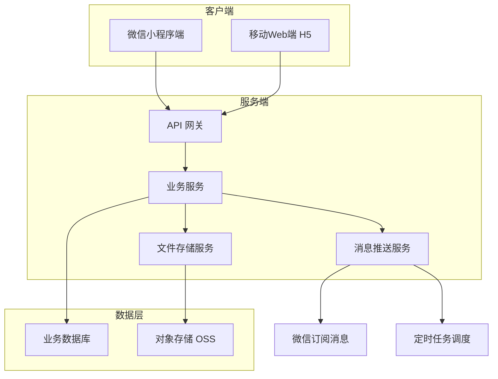

## 2.2 业务模块图

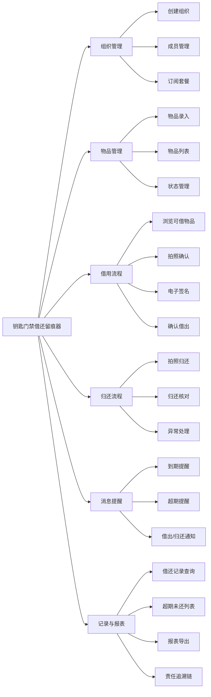

## 2.3 主业务流程

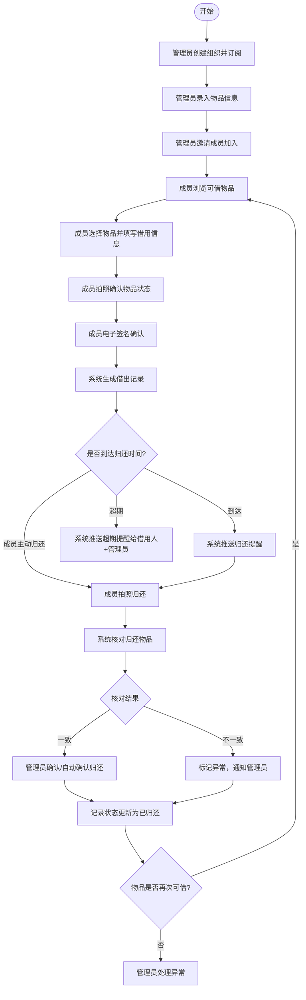

## 2.4 功能图/列表

| 功能模块 | 功能名称 | 优先级 | 功能描述 |
| --- | --- | --- | --- |
| 组织管理 | 创建组织 | P0 | 管理员填写组织名称、类型、联系方式创建组织 |
| 组织管理 | 订阅套餐 | P0 | 选择基础版（¥199/年）完成支付激活组织 |
| 组织管理 | 邀请成员 | P0 | 通过分享链接/二维码邀请成员加入 |
| 组织管理 | 成员列表 | P1 | 查看组织成员，支持搜索、角色设置、移除 |
| 物品管理 | 添加物品 | P0 | 录入物品名称、类型、编号、位置、照片 |
| 物品管理 | 物品列表 | P0 | 查看所有物品，按类型/状态/位置筛选 |
| 物品管理 | 编辑物品 | P1 | 修改物品信息 |
| 物品管理 | 删除物品 | P1 | 删除无进行中借用记录的物品 |
| 物品管理 | 状态管理 | P1 | 手动标记物品为不可借/恢复可借 |
| 借用流程 | 可借物品列表 | P0 | 成员查看当前可借出的物品 |
| 借用流程 | 物品详情 | P0 | 查看物品详细信息及历史借还摘要 |
| 借用流程 | 拍照确认 | P0 | 调用摄像头拍摄物品当前状态照片 |
| 借用流程 | 电子签名 | P0 | 手写签名板采集签名 |
| 借用流程 | 确认借出 | P0 | 提交借用申请生成借出记录 |
| 借用流程 | 我的借用 | P0 | 查看自己的借出/归还记录 |
| 归还流程 | 拍照归还 | P0 | 拍摄归还物品照片 |
| 归还流程 | 确认归还 | P0 | 提交归还请求 |
| 归还流程 | 归还审核 | P1 | 管理员对比照片确认归还 |
| 归还流程 | 异常标记 | P1 | 管理员标记归还物品不符 |
| 消息提醒 | 归还提醒 | P0 | 到期前自动推送归还提醒 |
| 消息提醒 | 超期提醒 | P0 | 超期后自动推送提醒给借用人+管理员 |
| 消息提醒 | 借出/归还通知 | P1 | 通知管理员有新借出/归还事件 |
| 消息提醒 | 提醒规则配置 | P2 | 管理员自定义提醒时间、频率 |
| 记录与报表 | 全部记录列表 | P0 | 管理员查看所有借还记录，支持多维筛选 |
| 记录与报表 | 记录详情 | P0 | 查看单条借还的完整信息 |
| 记录与报表 | 超期未还列表 | P0 | 管理员查看所有超期未还物品 |
| 记录与报表 | 报表导出 | P1 | 导出 Excel/PDF 报表 |
| 记录与报表 | 责任追溯链 | P1 | 按物品/成员查看完整借还历史 |

## 2.5 你的产品有哪些端

| 序号 | 端名称 | 端类型 | 目标用户 | 说明 |
| --- | --- | --- | --- | --- |
| 1 | 小程序端 | 小程序端 | 组织管理员 + 普通成员 | 主要使用端，覆盖借用、归还、管理全部功能，微信扫码即用 |
| 2 | 移动Web端 | WEB端 | 组织管理员 + 普通成员 | H5 兼容版本，供非微信环境下的手机浏览器使用 |

---

# 3 产品功能

## 3.1 小程序端功能

### 3.1.1 组织创建与订阅

**功能描述**

管理员首次使用时创建组织，填写组织基本信息（名称、类型、联系方式），选择订阅套餐（基础版 ¥199/年），完成支付后组织激活，可开始录入物品和邀请成员。

| 项 | 内容 |
| --- | --- |
| 优先级 | P0 |
| 依赖需求 | 微信支付接口 |
| 前置条件 | 用户已微信登录 |

#### 详细流程

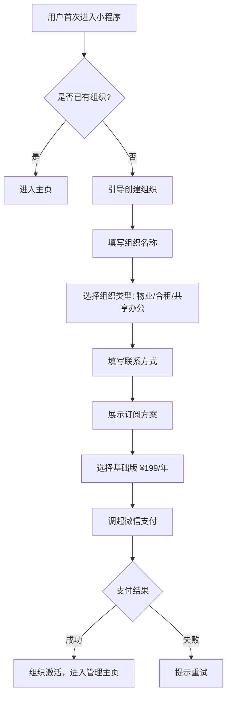

#### 主要原型

[组织创建与订阅原型](assets/prototypes/org-create-widget.html)

#### 验收标准

- [ ] 正常流程：填写完组织信息并完成支付后，组织立即激活，可进入管理主页
- [ ] 异常流程：支付失败时显示明确的失败提示，可重新发起支付
- [ ] 组织名称不超过 30 个字符，不允许为空
- [ ] 组织类型必须三选一（物业/合租/共享办公）

---

### 3.1.2 成员邀请与管理

**功能描述**

管理员通过生成邀请链接或二维码邀请成员加入组织。成员扫码/点击链接即可加入，无需管理员逐一添加。管理员可查看成员列表、设置角色（管理员/普通成员）、移除成员。

| 项 | 内容 |
| --- | --- |
| 优先级 | P0（邀请）、P1（管理列表） |
| 依赖需求 | 组织已创建并激活 |
| 前置条件 | 管理员已登录 |

#### 详细流程

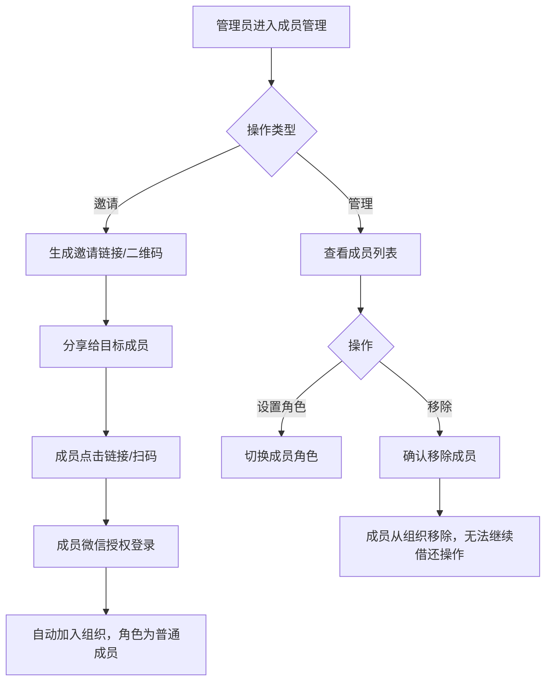

#### 主要原型

[成员邀请与管理原型](assets/prototypes/member-manage-widget.html)

#### 验收标准

- [ ] 邀请链接/二维码有效，成员扫码可成功加入组织
- [ ] 被移除的成员不再出现在成员列表中
- [ ] 管理员不可移除自己（至少保留一个管理员）
- [ ] 成员列表支持按姓名搜索

---

### 3.1.3 物品录入与管理

**功能描述**

管理员录入物品信息：物品名称、类型（钥匙/门禁卡/工牌/其他）、编号、存放位置、照片。支持物品列表查看、按类型/状态/位置筛选搜索、编辑物品信息、删除物品（仅无进行中借用记录时可删除）、手动切换物品为不可借状态。

| 项 | 内容 |
| --- | --- |
| 优先级 | P0（录入+列表）、P1（编辑/删除/状态切换） |
| 依赖需求 | 组织已创建 |
| 前置条件 | 管理员已登录 |

#### 详细流程

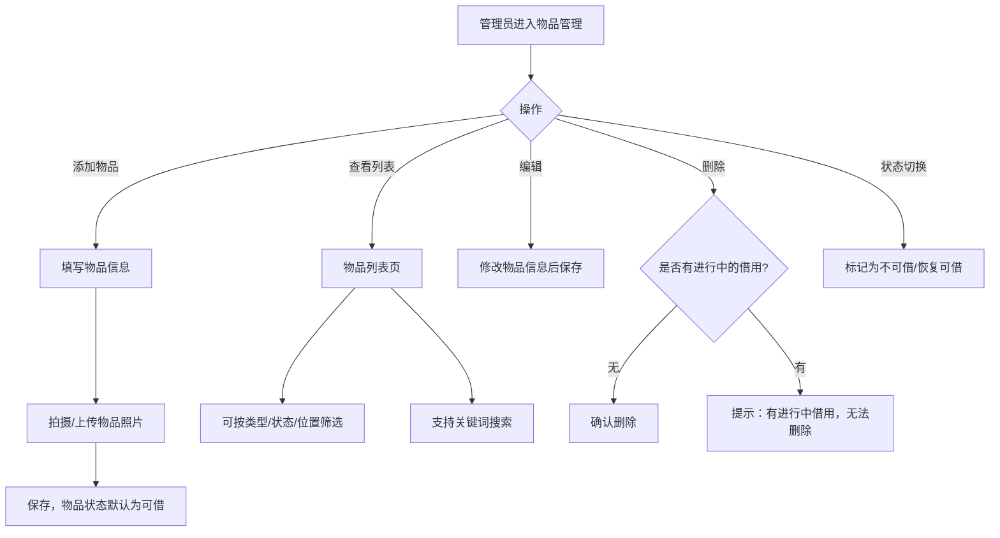

#### 主要原型

[物品录入与管理原型](assets/prototypes/item-manage-widget.html)

#### 验收标准

- [ ] 添加物品时必须填写：名称、类型、编号
- [ ] 物品照片支持拍照或从相册选择，单张不超过 10MB
- [ ] 有进行中借用的物品不可删除，给出明确提示
- [ ] 物品列表默认按最近更新时间倒序排列

---

### 3.1.4 借用流程（浏览→拍照→签名→确认）

**功能描述**

普通成员（或管理员）浏览可借物品列表，选择物品后填写借用信息（预计归还时间、用途说明），对物品当前状态拍照确认，在电子签名板上手写签名，最终确认借出。系统生成借出记录，物品状态变为"已借出"。

| 项 | 内容 |
| --- | --- |
| 优先级 | P0 |
| 依赖需求 | 物品已录入且状态为可借 |
| 前置条件 | 用户已是组织成员 |

#### 详细流程

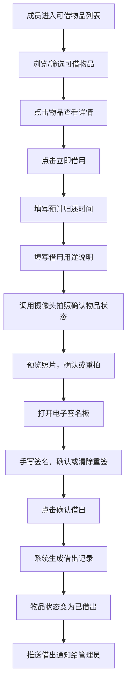

**业务规则：**

1. 预计归还时间必须晚于当前时间，最长不超过 30 天
2. 借用用途说明为选填，不超过 200 字
3. 拍照照片至少 1 张，最多 3 张
4. 签名必须完成（签名板不能为空）
5. 同一物品同一时间只能被一人借用

#### 主要原型

[借用流程原型](assets/prototypes/borrow-flow-widget.html)

#### 验收标准

- [ ] 正常流程：完成拍照+签名+确认后，借出记录生成成功，物品状态更新为已借出
- [ ] 照片可预览、可重拍
- [ ] 签名板流畅跟手，支持清除重签，签名区域不小于屏幕宽度 80%
- [ ] 预计归还时间不可选择过去时间
- [ ] 已借出物品不在可借列表中显示

---

### 3.1.5 我的借用

**功能描述**

成员查看自己所有借出中/已归还/超期的借用记录列表，支持按状态筛选。点击单条记录可查看完整借用详情：借出时间、预计归还时间、借出照片、签名图片、归还状态等。

| 项 | 内容 |
| --- | --- |
| 优先级 | P0 |
| 依赖需求 | 用户有借用记录 |
| 前置条件 | 用户已加入组织 |

#### 详细流程

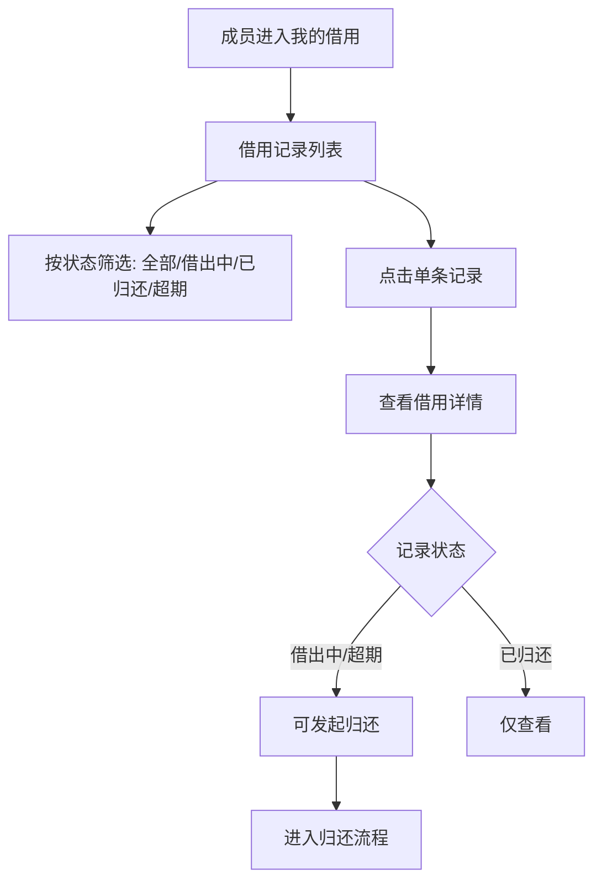

#### 主要原型

[我的借用原型](assets/prototypes/my-borrows-widget.html)

#### 验收标准

- [ ] 列表按借出时间倒序排列
- [ ] 超期记录以红色标识
- [ ] 详情页展示完整的借出照片、签名图片
- [ ] 借出中/超期状态可发起归还操作

---

### 3.1.6 归还流程

**功能描述**

成员对借用中的物品发起归还：拍摄归还物品照片，确认归还后系统提交归还请求。系统核对借出记录，若管理员设置为需确认归还，则等待管理员审核；若设置为自动确认，则直接完成归还。

| 项 | 内容 |
| --- | --- |
| 优先级 | P0 |
| 依赖需求 | 存在借出中的记录 |
| 前置条件 | 成员有借出中的物品 |

#### 详细流程

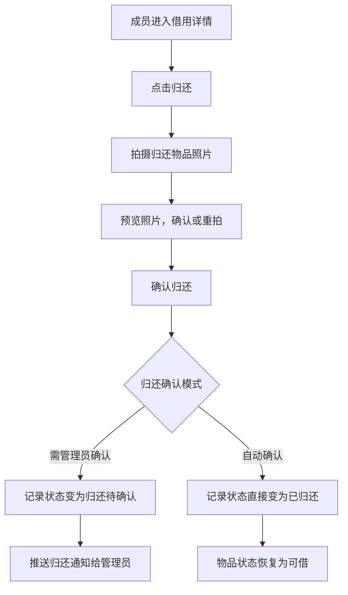

**业务规则：**

1. 归还照片至少 1 张
2. 管理员可在设置中选择"自动确认归还"或"需管理员确认"
3. 管理员确认归还时可对比借出照片与归还照片
4. 管理员发现不符时可标记异常

#### 主要原型

[归还流程原型](assets/prototypes/return-flow-widget.html)

#### 验收标准

- [ ] 归还照片可预览、可重拍
- [ ] 提交归还后记录状态正确更新
- [ ] 自动确认模式下物品立即恢复可借状态
- [ ] 需确认模式下管理员收到通知并可审核

---

### 3.1.7 归还审核与异常处理（管理员）

**功能描述**

管理员查看成员提交的归还请求，对比借出照片与归还照片，确认归还或标记异常。异常记录需填写异常说明，进入异常处理跟踪流程。

| 项 | 内容 |
| --- | --- |
| 优先级 | P1 |
| 依赖需求 | 有待确认的归还请求 |
| 前置条件 | 管理员已登录 |

#### 详细流程

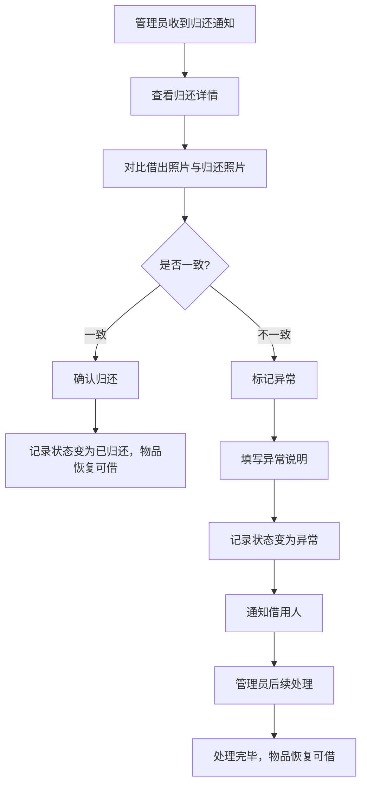

#### 主要原型

[归还审核与异常处理原型](assets/prototypes/return-review-widget.html)

#### 验收标准

- [ ] 管理员可并排对比借出照片与归还照片
- [ ] 确认归还后物品状态正确恢复
- [ ] 异常标记必须填写异常说明
- [ ] 异常记录在列表中红色标识

---

### 3.1.8 消息提醒

**功能描述**

系统在关键时间节点自动推送通知：
- **归还提醒**：在预计归还时间到达前（默认提前 1 小时）向借用人推送提醒
- **超期提醒**：超过归还时间后，按可配置频率（默认每天 1 次）向借用人和管理员推送超期通知
- **借出通知**：有新物品借出时通知管理员
- **归还通知**：有物品提交归还时通知管理员（需确认模式）

| 项 | 内容 |
| --- | --- |
| 优先级 | P0（归还/超期提醒）、P1（借出/归还通知）、P2（规则配置） |
| 依赖需求 | 微信订阅消息接口 |
| 前置条件 | 用户已授权订阅消息 |

#### 详细流程

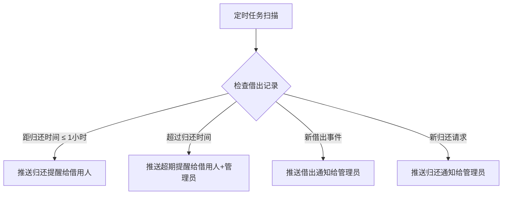

**业务规则：**

1. 小程序端使用微信订阅消息，需在用户首次使用时引导授权
2. 超期提醒默认每天推送 1 次，管理员可配置频率
3. 提醒提前时间默认 1 小时，管理员可配置（可选 15分钟/30分钟/1小时/2小时）

#### 验收标准

- [ ] 归还提醒在预计归还时间前指定时间推送
- [ ] 超期提醒按配置频率推送
- [ ] 推送延迟不超过 5 分钟
- [ ] 用户未授权订阅消息时，引导用户授权

---

### 3.1.9 借还记录查询与报表导出

**功能描述**

管理员查看所有借还记录，支持按物品、借用人、状态（借出中/已归还/超期）、时间范围筛选。可查看记录详情，包括借出人、时间、照片、签名等完整信息。支持将筛选后的记录导出为 Excel 报表。

| 项 | 内容 |
| --- | --- |
| 优先级 | P0（记录查询）、P1（报表导出） |
| 依赖需求 | 存在借还记录 |
| 前置条件 | 管理员已登录 |

#### 详细流程

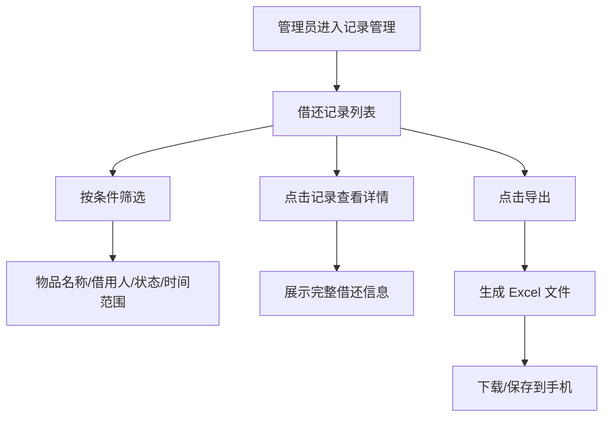

#### 主要原型

[借还记录查询与导出原型](assets/prototypes/records-export-widget.html)

#### 验收标准

- [ ] 筛选条件组合生效，结果准确
- [ ] 1000 条记录导出时间 ≤ 10 秒
- [ ] 导出的 Excel 包含完整字段：物品名称、借用人、借出时间、预计归还时间、实际归还时间、状态、异常说明
- [ ] 超期未还记录以红色高亮标识

---

## 3.2 移动Web端功能

移动Web端（H5）功能与小程序端保持一致，核心区别在于消息推送方式：

| 差异项 | 小程序端 | 移动Web端 |
| --- | --- | --- |
| 登录方式 | 微信授权登录 | 手机号+验证码登录 |
| 消息推送 | 微信订阅消息 | 短信通知（V1.1 增值功能） |
| 拍照 | 微信 JS-SDK 调起相机 | HTML5 input[camera] 调起相机 |
| 签名 | 小程序 Canvas 组件 | H5 Canvas 签名组件 |

功能列表与小程序端完全一致（3.1.1 ~ 3.1.9），此处不再重复。

---

# 4 产品原型

## 4.1 页面跳转逻辑图

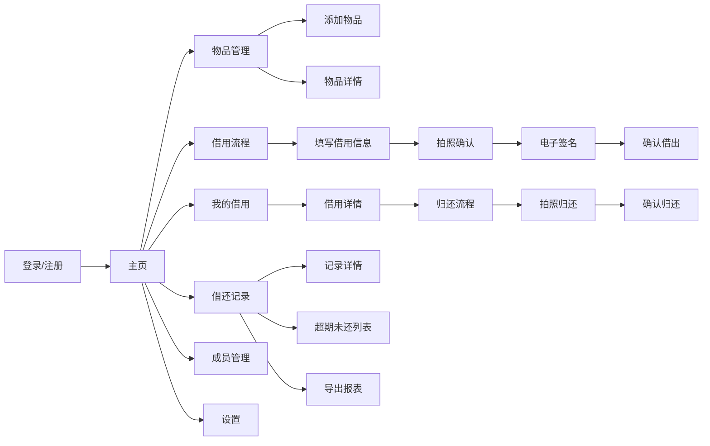

## 4.2 全站点原型设计

### 4.2.1 小程序端

**页面清单：**

| 序号 | 页面名称 | 所属模块 | 页面描述 | 关键元素 |
| --- | --- | --- | --- | --- |
| 1 | 登录页 | 账户 | 微信一键授权登录 | 登录按钮、用户协议勾选 |
| 2 | 创建组织页 | 组织管理 | 首次使用创建组织并订阅 | 表单（名称/类型/联系方式）、订阅方案卡片、支付按钮 |
| 3 | 主页 | 全局 | 功能入口导航 | 快捷入口卡片（借用/归还/记录/管理）、待处理事项提醒 |
| 4 | 可借物品列表 | 借用流程 | 展示当前可借物品 | 物品卡片列表、筛选栏（类型/位置）、搜索框 |
| 5 | 物品详情页 | 借用流程 | 查看物品信息与历史 | 物品照片、基本信息、历史借还摘要、立即借用按钮 |
| 6 | 借用信息填写页 | 借用流程 | 填写借用信息 | 归还时间选择器、用途输入框 |
| 7 | 拍照确认页 | 借用流程 | 拍摄物品状态照片 | 相机预览区、拍照按钮、已拍照片缩略图 |
| 8 | 电子签名页 | 借用流程 | 手写签名确认 | 签名板、清除按钮、确认按钮 |
| 9 | 借出确认页 | 借用流程 | 汇总确认借出信息 | 信息摘要、借出照片缩略图、签名预览、确认按钮 |
| 10 | 我的借用列表 | 借用流程 | 查看个人借用记录 | 记录卡片、状态Tab（全部/借出中/已归还/超期） |
| 11 | 借用详情页 | 借用流程 | 查看单次借用完整信息 | 时间信息、照片对比、签名图片、归还按钮 |
| 12 | 归还拍照页 | 归还流程 | 拍摄归还物品照片 | 相机预览区、拍照按钮 |
| 13 | 物品管理列表 | 物品管理 | 管理员查看/管理物品 | 物品列表、筛选栏、添加按钮、状态标签 |
| 14 | 添加/编辑物品页 | 物品管理 | 录入或修改物品信息 | 表单（名称/类型/编号/位置/照片） |
| 15 | 成员管理页 | 成员管理 | 查看/邀请/管理成员 | 成员列表、邀请按钮（链接/二维码）、角色标签 |
| 16 | 借还记录列表 | 记录管理 | 查看所有借还记录 | 记录列表、多维筛选、导出按钮 |
| 17 | 记录详情页 | 记录管理 | 查看单次借还完整信息 | 借出/归还照片对比、签名、时间线、异常标记 |
| 18 | 超期未还列表 | 记录管理 | 管理员查看超期物品 | 超期记录列表、催还按钮 |
| 19 | 归还审核页 | 审批 | 管理员审核归还请求 | 借出/归还照片对比、确认/标记异常按钮 |
| 20 | 设置页 | 设置 | 管理员配置提醒规则等 | 提醒规则设置、归还确认模式切换 |

**交互说明：**

- 页面跳转关系：
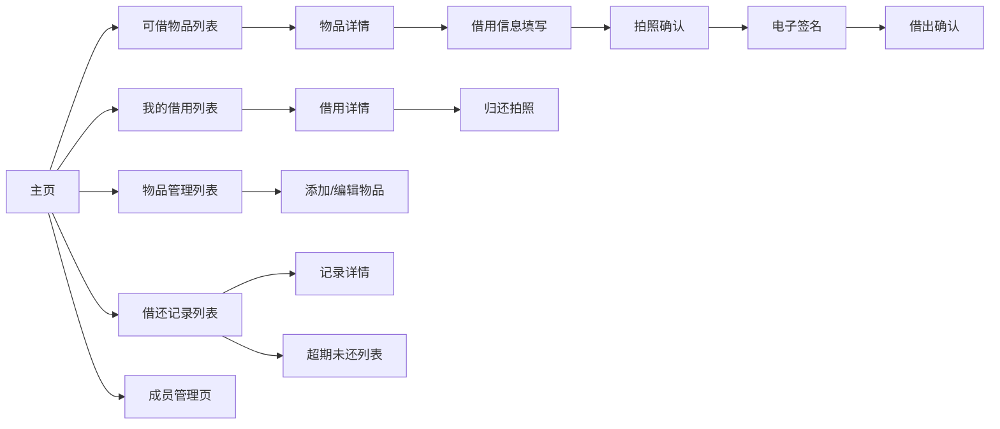

- 特殊交互：
  1. 物品列表支持下拉刷新、上拉加载更多
  2. 拍照页支持前后摄像头切换
  3. 签名板支持横屏显示以获得更大签名区域
  4. 筛选栏使用底部弹出式选择器
  5. 超期记录卡片左边框显示红色

- 异常状态处理：
  1. 空数据态：显示"暂无数据"插画及引导操作按钮
  2. 加载态：使用骨架屏占位
  3. 错误态：显示"网络异常"提示及重试按钮

**产品原型：**

[📱 打开小程序端全站点原型](assets/prototypes/miniapp-prototype.html)

### 4.2.2 移动Web端

**页面清单：**

移动Web端页面结构与小程序端一致（页面 1~20），主要差异：

| 差异项 | 说明 |
| --- | --- |
| 登录页 | 手机号+验证码登录替代微信授权 |
| 导航 | 底部 Tab 栏保持一致，顶部增加浏览器适配 |
| 拍照 | 使用 HTML5 `<input type="file" accept="image/*" capture>` |
| 签名 | 使用 H5 Canvas 签名组件 |

**交互说明：**

- 交互逻辑与小程序端一致
- 额外适配浏览器返回按钮行为（history API）
- 登录态使用 Cookie + Token 双机制

**产品原型：**

[📱 打开移动Web端全站点原型](assets/prototypes/webapp-prototype.html)

---

# 5 数据需求

## 5.1 数据使用规格

### 组织表 (organization)

| 字段 | 是否必填 | 描述 | 数据类型 |
| --- | --- | --- | --- |
| id | 是 | 组织唯一标识 | UUID |
| name | 是 | 组织名称，≤30字符 | 字符串 |
| type | 是 | 组织类型：property/cohome/office | 枚举 |
| contact_phone | 是 | 联系电话 | 字符串 |
| subscription_status | 是 | 订阅状态：active/expired | 枚举 |
| subscription_expire_at | 是 | 订阅到期时间 | 日期时间 |
| created_at | 是 | 创建时间 | 日期时间 |

### 成员表 (member)

| 字段 | 是否必填 | 描述 | 数据类型 |
| --- | --- | --- | --- |
| id | 是 | 成员唯一标识 | UUID |
| organization_id | 是 | 所属组织ID | UUID |
| openid | 否 | 微信openid（小程序端） | 字符串 |
| phone | 否 | 手机号（移动Web端） | 字符串 |
| name | 是 | 成员姓名 | 字符串 |
| role | 是 | 角色：admin/member | 枚举 |
| joined_at | 是 | 加入时间 | 日期时间 |

### 物品表 (item)

| 字段 | 是否必填 | 描述 | 数据类型 |
| --- | --- | --- | --- |
| id | 是 | 物品唯一标识 | UUID |
| organization_id | 是 | 所属组织ID | UUID |
| name | 是 | 物品名称 | 字符串 |
| type | 是 | 类型：key/card/badge/other | 枚举 |
| code | 是 | 物品编号（组织内唯一） | 字符串 |
| location | 否 | 存放位置 | 字符串 |
| photo_url | 否 | 物品照片URL | 字符串 |
| status | 是 | 状态：available/borrowed/unavailable | 枚举 |
| created_at | 是 | 创建时间 | 日期时间 |

### 借还记录表 (borrow_record)

| 字段 | 是否必填 | 描述 | 数据类型 |
| --- | --- | --- | --- |
| id | 是 | 记录唯一标识 | UUID |
| organization_id | 是 | 所属组织ID | UUID |
| item_id | 是 | 物品ID | UUID |
| borrower_id | 是 | 借用人ID | UUID |
| purpose | 否 | 借用用途 | 字符串 |
| expected_return_at | 是 | 预计归还时间 | 日期时间 |
| actual_return_at | 否 | 实际归还时间 | 日期时间 |
| borrow_photos | 是 | 借出照片URL列表 | JSON数组 |
| return_photos | 否 | 归还照片URL列表 | JSON数组 |
| signature_url | 是 | 签名图片URL | 字符串 |
| status | 是 | 状态：borrowed/return_pending/returned/overdue/abnormal | 枚举 |
| abnormal_note | 否 | 异常说明 | 字符串 |
| created_at | 是 | 借出时间 | 日期时间 |

## 5.2 统计数据

1. 单组织内借还记录总数、当前借出中数量、超期未还数量（管理主页看板）
2. 按月的借还次数趋势图（管理员报表页）

## 5.3 埋点需求

| 页面 | 事件 | 采集字段 | 说明 |
| --- | --- | --- | --- |
| 登录页 | login_click | source | 统计登录入口 |
| 主页 | page_view | user_role | 统计各角色活跃度 |
| 借用流程 | borrow_start | item_type | 统计各类型物品借用频次 |
| 借用流程 | borrow_complete | item_id, duration | 统计借用完成率 |
| 归还流程 | return_start | record_id | 统计归还及时率 |
| 记录导出 | export_click | filter_type, record_count | 统计导出使用频率 |

---

# 6 非功能需求

## 6.1 性能需求

**6.1.1 延迟**

| 编号 | 项目 | 最大延迟 | 平均延迟 | 优先级 | 备注 |
| --- | --- | --- | --- | --- | --- |
| 0001 | 首屏加载（4G网络） | ≤ 2 秒 | ≤ 1.5 秒 | 高 | |
| 0002 | 拍照上传响应（4G网络） | ≤ 3 秒 | ≤ 2 秒 | 高 | 含图片压缩 |
| 0003 | 借出操作响应 | ≤ 1 秒 | ≤ 0.5 秒 | 高 | 确认到记录生成 |
| 0004 | 通知推送延迟 | ≤ 5 分钟 | ≤ 2 分钟 | 中 | |
| 0005 | 报表导出（1000条） | ≤ 10 秒 | ≤ 5 秒 | 中 | |

**6.1.2 吞吐量**

| 编号 | 项 | 吞吐量 | 备注 |
| --- | --- | --- | --- |
| 0001 | 单组织并发借还操作 | 每分钟 100 次 | |
| 0002 | 图片上传 | 每分钟 50 张 | |

**6.1.3 容量**

| 编号 | 项 | 容量 | 备注 |
| --- | --- | --- | --- |
| 0001 | 单组织最大成员数 | ≤ 200 人 | |
| 0002 | 单组织最大物品数 | ≤ 500 件（基础版） | 超出需加购 |
| 0003 | 单张图片大小限制 | ≤ 10 MB | |

## 6.2 安全需求

| 编号 | 项 |
| --- | --- |
| 0001 | 所有接口使用 HTTPS 加密传输 |
| 0002 | 用户敏感信息（手机号等）加密存储 |
| 0003 | 接口鉴权：用户只能访问自己所属组织的数据 |
| 0004 | 上传文件类型白名单校验（仅允许 jpg/png/jpeg） |
| 0005 | 防止接口重放攻击，借出/归还操作使用幂等性设计 |

## 6.3 可靠性

| 编号 | 项 | 值 |
| --- | --- | --- |
| 0001 | 服务可用性 | ≥ 99.9% |
| 0002 | 平均故障恢复时间 | ≤ 30 分钟 |

## 6.4 可连续性

| 编号 | 项 |
| --- | --- |
| 0001 | 系统 7 × 24 全天候运行 |
| 0002 | 定时任务（提醒推送）具备故障恢复后补发机制 |

## 6.5 可恢复性

| 编号 | 项 |
| --- | --- |
| 0001 | 每日全量数据库备份，保留 30 天 |
| 0002 | 每小时增量备份 |
| 0003 | 重大故障 1~3 小时内恢复服务 |

## 6.6 兼容性

| 编号 | 要求 | 备注 |
| --- | --- | --- |
| 0001 | 微信小程序基础库 ≥ 2.20.0 | |
| 0002 | 移动Web端：iOS Safari 12+、Android Chrome 80+ | |
| 0003 | 适配主流手机分辨率：375×667、390×844、414×896 | |

## 6.7 易用性

| 编号 | 要求 | 备注 |
| --- | --- | --- |
| 0001 | 核心借用流程不超过 5 步 | 选物→填写→拍照→签名→确认 |
| 0002 | 普通成员无需培训即可使用核心功能 | |
| 0003 | 电子签名板流畅跟手，支持清除重签 | |

---

# 7 总结

## 7.1 上线计划

| 阶段 | 时间 | 内容 | 负责人 |
| --- | --- | --- | --- |
| 开发阶段 | 2026-06-29 ~ 2026-07-03 | MVP 功能开发（微信小程序 + 移动Web） | 开发团队 |
| 测试阶段 | 2026-07-04 ~ 2026-07-05 | 功能测试、兼容性测试 | 测试团队 |
| 全量上线 | 2026-07-06 | 全量开放，MVP 版本发布 | 产品团队 |

## 7.2 后续迭代规划

- V1.1：批量物品导入（Excel模板）、短信通知（增值功能）、物品二维码标签打印
- V1.2：多组织支持（一个用户可加入多个组织）、借用审批流程（管理员审批后才可借出）
- V1.3：数据统计看板（借用频次趋势、热门物品排行）、API 开放对接第三方系统

## 7.3 参考文档

- [URS — 钥匙门禁借还留痕器用户需求说明书](URS-钥匙门禁借还留痕器.md)
- 微信小程序订阅消息文档
- 微信支付接入文档
