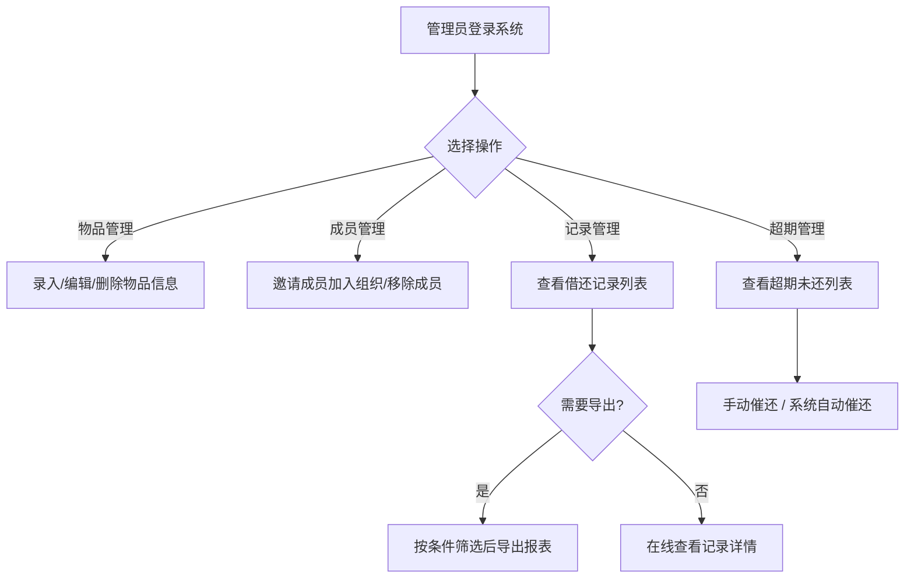
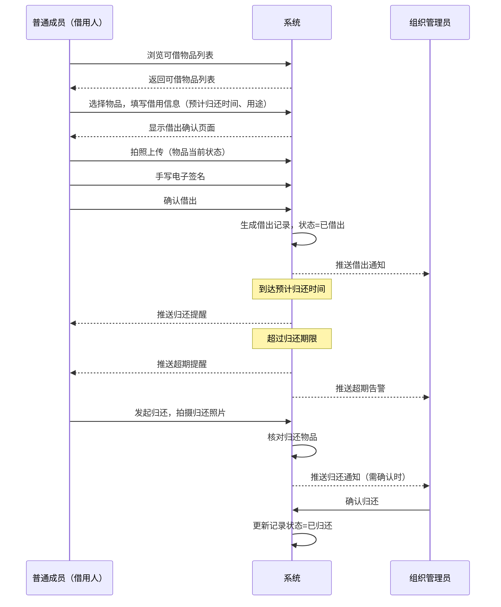
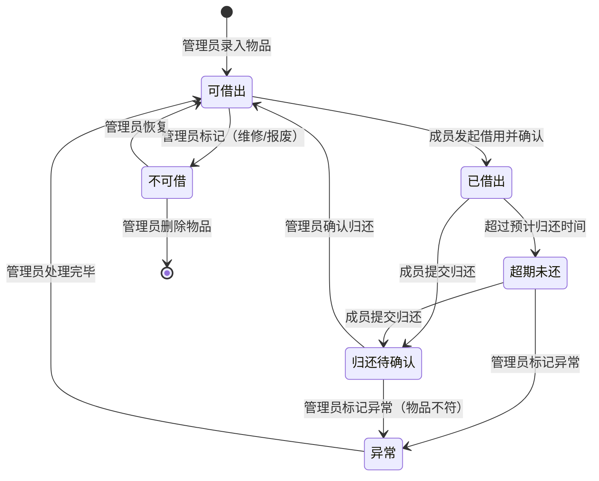
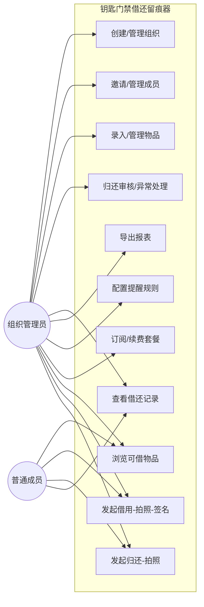

# 钥匙门禁借还留痕器 — 用户需求说明书（URS）

> 产品名称：钥匙门禁借还留痕器  
> 版本：v1.0.0  
> 编写日期：2026-06-26  
> 文档状态：草稿

---

# 1. 需求概述

## 1.1 需求介绍

钥匙门禁借还留痕器是一款面向小型组织（小区物业、合租房房东、共享办公室管理员）的轻量级物品借还管理工具。产品聚焦"钥匙、门禁卡、工牌等物品借还责任留痕"这一高频但轻量化的刚需场景，通过拍照确认、电子签名、超期提醒、责任记录导出等功能，帮助用户以极低成本实现物品借还的规范化、可追溯管理。

当前，上述小型组织在钥匙/门禁卡借还管理中普遍依赖纸质登记或微信群沟通，存在以下痛点：

- **责任不清**：纸质登记易被篡改或遗漏，出现物品丢失时难以追溯责任人。
- **提醒缺失**：无自动化的超期提醒机制，管理员需逐人催还，效率低下。
- **记录分散**：借还记录散落在纸质本、微信聊天中，无法快速导出汇总，不利于事后核查。

本产品旨在通过微信小程序（兼顾移动 Web）提供一站式借还留痕解决方案，填补"轻量级钥匙/门禁卡借还管理"这一市场空白。

### 1.1.1 所属领域

物业管理 / 共享空间管理 / 小型组织行政管理

## 1.2 需求目标

1. **责任可追溯**：每次借还操作均留存拍照照片、电子签名和时间戳，形成完整的借还证据链，确保物品流转责任到人。
2. **超期可提醒**：借出物品超过约定归还时间后，系统自动向借用人发送提醒通知，减少管理员人工催还工作量。
3. **记录可导出**：所有借还记录可一键导出为报表（Excel/PDF），支持按人员、物品、时间段筛选，便于事后核查与责任认定。
4. **低成本上手**：产品定价 ¥199/年/组织，MVP 阶段以微信小程序为主要载体，用户无需下载安装，扫码即用。

## 1.3 系统使用角色

| 角色 | 说明 | 典型用户 |
| --- | --- | --- |
| 组织管理员 | 负责组织创建、物品录入、成员管理、记录查看与导出，拥有最高权限 | 物业经理、房东、共享办公室运营人员 |
| 普通成员（借用人） | 在组织内发起借用申请、确认借出信息（拍照/签名）、归还物品 | 小区住户、租客、共享办公室入驻企业员工 |

## 1.4 业务流程图

### 1.4.1 核心借还流程

```mermaid
flowchart TD
    A[管理员录入物品信息] --> B[物品上架，可被借用]
    B --> C{普通成员发起借用}
    C --> D[选择待借物品]
    D --> E[填写借用信息：预计归还时间、用途说明]
    E --> F[拍照确认：拍摄物品当前状态]
    F --> G[电子签名确认：借用人手写签名]
    G --> H[系统生成借出记录，状态变为"已借出"]
    H --> I{系统监控归还时间}
    I -->|到达预计归还时间| J[向借用人发送归还提醒通知]
    I -->|超过归还期限未还| K[向借用人及管理员发送超期提醒]
    I -->|成员发起归还| L[归还流程]
    L --> M[借用人提交归还：拍摄归还物品照片]
    M --> N[系统核对归还物品与借出记录]
    N --> O{核对是否一致}
    O -->|一致| P[管理员确认归还 / 自动确认]
    O -->|不一致| Q[标记异常，通知管理员处理]
    P --> R[借出记录状态更新为"已归还"]
    Q --> R
```

### 1.4.2 管理员日常管理流程



### 1.4.3 借用时序图



# 2. 功能原型

| 原型名称 | 原型链接 | 对应端 | 备注 |
| --- | --- | --- | --- |
| 钥匙门禁借还留痕器 — 微信小程序 | 需求方提供 | 小程序端 | 主要使用端，覆盖借用、归还、管理员日常管理全部功能 |
| 钥匙门禁借还留痕器 — 移动Web | 需求方提供 | WEB端 | 兼容微信小程序的H5版本，供非微信环境使用 |

# 3. 需求清单

## 3.1 组织管理端（小程序端/移动Web端）

| 模块 | 一级功能 | 二级功能 | 功能描述 | 备注 |
| --- | --- | --- | --- | --- |
| 组织与账户 | 组织创建 | 创建组织 | 管理员创建组织，填写组织名称、类型（物业/合租/共享办公）、联系方式 | |
| 组织与账户 | 组织创建 | 订阅套餐 | 管理员选择订阅方案（基础版 ¥199/年），完成支付后激活组织 | |
| 组织与账户 | 成员管理 | 邀请成员 | 管理员通过分享邀请链接/二维码邀请成员加入组织 | |
| 组织与账户 | 成员管理 | 成员列表 | 管理员查看组织内所有成员列表，支持搜索、筛选 | |
| 组织与账户 | 成员管理 | 移除成员 | 管理员将成员从组织中移除，移除后该成员无法再进行借还操作 | |
| 组织与账户 | 成员管理 | 角色设置 | 管理员可设置成员为"普通成员"或"管理员"角色 | |

## 3.2 物品管理端（小程序端/移动Web端）

| 模块 | 一级功能 | 二级功能 | 功能描述 | 备注 |
| --- | --- | --- | --- | --- |
| 物品管理 | 物品录入 | 添加物品 | 管理员录入物品信息：物品名称、类型（钥匙/门禁卡/工牌/其他）、编号、存放位置、照片、可借状态 | |
| 物品管理 | 物品录入 | 批量导入 | 管理员通过 Excel 模板批量导入物品信息 | 非MVP功能 |
| 物品管理 | 物品管理 | 编辑物品 | 管理员修改物品信息（名称、位置、照片等） | |
| 物品管理 | 物品管理 | 删除物品 | 管理员删除物品（仅当物品无进行中的借用记录时可删除） | |
| 物品管理 | 物品管理 | 物品列表 | 管理员查看所有物品列表，支持按类型、状态（可借/已借出）、位置筛选和搜索 | |
| 物品管理 | 物品状态 | 状态切换 | 管理员手动将物品标记为"不可借"（维修中、已报废等） | |

## 3.3 借用流程端（小程序端/移动Web端）

| 模块 | 一级功能 | 二级功能 | 功能描述 | 备注 |
| --- | --- | --- | --- | --- |
| 借用操作 | 物品浏览 | 可借物品列表 | 普通成员查看当前可借出的物品列表，支持按类型和位置筛选 | |
| 借用操作 | 物品浏览 | 物品详情 | 查看物品详细信息：名称、类型、编号、存放位置、历史借还记录摘要 | |
| 借用操作 | 发起借用 | 填写借用信息 | 成员选择物品后填写：预计归还时间、借用用途说明 | |
| 借用操作 | 发起借用 | 拍照确认 | 成员对物品当前状态拍照上传，作为借出时的物品状态凭证 | 调用手机摄像头 |
| 借用操作 | 发起借用 | 电子签名 | 成员在电子签名板上手写签名，确认借用行为 | 调用签名组件 |
| 借用操作 | 发起借用 | 确认借出 | 成员确认所有信息无误后提交借用申请，系统生成借出记录 | |
| 借用操作 | 我的借用 | 借用记录列表 | 成员查看自己所有借出/已归还记录，支持按状态筛选 | |
| 借用操作 | 我的借用 | 借用详情 | 查看单次借用的完整信息：借出时间、照片、签名、归还状态 | |
| 借用操作 | 发起归还 | 拍照归还 | 成员对归还物品拍照上传，作为归还时的物品状态凭证 | |
| 借用操作 | 发起归还 | 确认归还 | 成员确认归还后提交，系统核对借出记录并更新状态 | |

## 3.4 管理员审批与监控端（小程序端/移动Web端）

| 模块 | 一级功能 | 二级功能 | 功能描述 | 备注 |
| --- | --- | --- | --- | --- |
| 审批与核对 | 归还确认 | 归还审核 | 成员提交归还后，管理员可查看归还照片并与借出记录对比，确认或拒绝归还 | 可设置为自动确认 |
| 审批与核对 | 归还确认 | 异常标记 | 管理员发现归还物品与借出记录不符时，标记为异常并记录异常说明 | |
| 审批与核对 | 异常处理 | 异常记录列表 | 管理员查看所有异常归还记录，跟踪处理状态 | |

## 3.5 提醒与通知端（小程序端/移动Web端）

| 模块 | 一级功能 | 二级功能 | 功能描述 | 备注 |
| --- | --- | --- | --- | --- |
| 消息提醒 | 到期提醒 | 归还提醒 | 在预计归还时间到达前（默认提前1小时），系统自动向借用人推送归还提醒通知 | |
| 消息提醒 | 超期提醒 | 超期通知（借用人） | 物品超过预计归还时间后，系统按可配置频率（默认每天1次）向借用人推送超期提醒 | |
| 消息提醒 | 超期提醒 | 超期告警（管理员） | 物品超期未还时，系统同步通知管理员，便于管理员跟进 | |
| 消息提醒 | 借出通知 | 借出通知 | 有新物品借出时，通知管理员 | |
| 消息提醒 | 归还通知 | 归还通知 | 有物品归还时，通知管理员（需确认归还时） | |
| 消息提醒 | 提醒设置 | 提醒规则配置 | 管理员配置提醒规则：提前提醒时间、超期提醒频率、通知方式（小程序消息/短信） | 短信通知为付费增值功能 |

## 3.6 记录与报表端（小程序端/移动Web端）

| 模块 | 一级功能 | 二级功能 | 功能描述 | 备注 |
| --- | --- | --- | --- | --- |
| 借还记录 | 记录查询 | 全部记录列表 | 管理员查看所有借还记录，支持按物品、借用人、状态（借出中/已归还/超期）、时间范围筛选 | |
| 借还记录 | 记录查询 | 记录详情 | 查看单条借还记录的完整信息：借出人、借出时间、预计归还时间、实际归还时间、借出照片、归还照片、签名、异常标记 | |
| 借还记录 | 记录查询 | 超期未还列表 | 管理员专用视图，展示所有当前超期未还的物品及借用人 | |
| 借还记录 | 记录导出 | 导出报表 | 管理员将筛选后的借还记录导出为 Excel 或 PDF 文件，包含完整借还信息 | |
| 借还记录 | 责任追溯 | 责任记录 | 基于借还记录、照片、签名生成完整的责任追溯链，支持一键查看某物品或某成员的全部历史 | |

# 4. 非功能需求

## 4.1 使用界面需求

| 需求项 | 说明 |
| --- | --- |
| 界面风格 | 简洁直观，操作步骤尽量少（核心借用流程不超过 5 步） |
| 适配要求 | 适配主流手机屏幕尺寸（iOS/Android），小程序端遵循微信设计规范 |
| 拍照体验 | 拍照界面需清晰引导用户对准物品，支持拍照后预览确认再上传 |
| 签名体验 | 电子签名板需流畅跟手，支持清除重签，签名区域不小于屏幕宽度的 80% |
| 通知触达 | 提醒通知需确保到达用户，小程序端使用订阅消息，移动Web端使用短信 |

## 4.2 软硬件环境需求

| 需求项 | 说明 |
| --- | --- |
| 客户端 | 微信 7.0 及以上版本（小程序端）；主流移动浏览器（移动Web端） |
| 操作系统 | iOS 12+ / Android 8.0+ |
| 硬件要求 | 需具备摄像头（拍照功能）、触摸屏（签名功能） |
| 网络要求 | 需联网使用，支持 4G/5G/WiFi |
| 服务端 | 云端部署（推荐使用优特云平台） |

## 4.3 性能需求

| 需求项 | 指标 |
| --- | --- |
| 页面加载时间 | 首屏加载 ≤ 2 秒（4G网络） |
| 拍照上传响应 | 拍照后图片上传完成 ≤ 3 秒（4G网络） |
| 借出操作响应 | 从确认借出到记录生成 ≤ 1 秒 |
| 通知推送延迟 | 到期/超期提醒推送延迟 ≤ 5 分钟 |
| 报表导出时间 | 1000 条记录导出 ≤ 10 秒 |
| 并发支持 | 支持单组织 100 人同时操作 |

## 4.4 约束性需求

1. 本系统不实现物品定位追踪功能（如 GPS 追踪），仅通过借还记录实现责任追溯。
2. 本系统不实现支付结算功能，订阅费用通过独立的支付流程完成。
3. 本系统不对接第三方资产管理系统，独立运行。
4. 电子签名仅作为用户确认的电子凭证，不具备法律效力认证（不做 CA 数字证书绑定）。
5. 照片存储采用云端存储，单张图片大小限制 10MB，保留期限跟随组织订阅有效期。
6. 系统需要后台服务支撑全部功能。

# 5. 接口需求

## 5.2 软件接口需求

| 模块 | 接口名称 | 输入 | 输出 | 功能描述 |
| --- | --- | --- | --- | --- |
| 拍照确认 | 相机调用接口 | 用户触发拍照 | 照片文件 | 调用手机摄像头拍摄物品状态照片 |
| 电子签名 | 手写签名组件 | 用户手写轨迹 | 签名图片（PNG） | 提供电子签名板，采集用户手写签名并生成签名图片 |
| 消息提醒 | 微信订阅消息接口 | 提醒事件、用户openid、模板数据 | 推送结果 | 向微信用户发送归还提醒、超期提醒等通知 |
| 消息提醒 | 短信发送接口 | 手机号、短信内容 | 发送结果 | 向用户发送短信提醒（增值功能） |
| 记录导出 | 文件生成与下载接口 | 筛选条件 | Excel/PDF文件 | 根据筛选条件生成借还记录报表并提供下载 |
| 组织订阅 | 支付接口 | 订单信息、金额 | 支付结果 | 处理组织订阅费用支付 |

## 5.4 通讯接口需求

| 需求项 | 说明 |
| --- | --- |
| 通讯协议 | HTTPS（全链路加密） |
| 数据传输 | 图片上传使用 multipart/form-data，其他数据使用 JSON 格式 |
| 消息推送 | 微信小程序使用微信订阅消息服务；移动Web端使用短信网关 |

# 6. 附录

## 流程图

### 物品状态流转图



## 用例图


