# 钥匙门禁借还留痕器 — 产品需求文档（PRD）

> 文档版本：V1.0.0
> 创建日期：2026-06-26
> 产品名称：钥匙门禁借还留痕器
> 文档类型：产品需求文档（PRD）
> 输入文档：《钥匙门禁借还留痕器_需求规格说明书_v1.0》

---

## 变更历史

| 版本号 | 变更日期 | 变更内容 | 变更人 | 审核人 |
| --- | --- | --- | --- | --- |
| V1.0 | 2026-06-26 | 初始版本创建 | 产品文档结对写作专家 | 阶段一产品落地页文档总编辑 |

---

# 1 概述

## 1.1 需求背景

随着智慧社区建设的深入，小区物业、合租房、共享办公等场景中，钥匙、门禁卡、工牌等小件物品的管理问题日益突出。传统纸质登记方式存在以下核心痛点：

1. **责任不清**：纸质登记易出现代签、漏签，无法追溯实际借用人
2. **状态不明**：物品借出后的状态无法记录，归还时无法对比确认
3. **追溯困难**：超期未还时无法快速定位责任人，纠纷处理缺少依据
4. **效率低下**：人工登记占用管理人员大量时间，高峰期易排队

本产品的目标是提供一款轻量级的借还责任追踪工具，通过微信小程序实现扫码即借、拍照留证、电子签名、超期提醒等功能，实现借还行为全程可追溯，降低管理成本，解决责任纠纷。

## 1.2 名词解释

| **名词** | **说明** |
| --- | --- |
| 借用记录 | 系统为每次物品借出/归还行为生成的电子档案，包含借用人、时间、照片、签名等信息 |
| 物品二维码 | 系统为每个可借用物品生成的唯一二维码，用于扫码识别物品信息 |
| 电子签名 | 借用人通过触摸屏手写的签名图片，作为借用确认的电子凭证 |
| 超期 | 借用物品超过预计归还时间后仍未归还的状态 |
| 自助借用 | 管理员不在场时，借用人自行扫码发起借用登记的模式 |
| 邀请码 | 组织专属的6位数字/字母组合，用于新成员加入组织 |
| 组织管理员 | 负责创建组织、管理配置和查看报表的最高权限角色 |
| 日常管理员 | 负责日常借出/归还操作的管理人员角色 |
| 借用人 | 发起借用请求、使用物品并按期归还的普通用户角色 |

## 1.3 产品介绍

### 1.3.1 范围说明

| 项 | 内容 |
| --- | --- |
| 包含功能 | 物品借还管理（扫码借用/归还、拍照留证、电子签名）、超期提醒与管控、组织与成员管理、物品清单管理、数据报表与导出、订阅计费 |
| 不包含功能 | 物品采购与库存盘点、资产折旧管理、物理门禁硬件对接、借用押金收取与损坏赔偿支付、员工考勤与排班管理 |

**产品定位**：钥匙门禁借还留痕器是一款面向小区物业、合租房房东、共享办公室管理员的轻量级借还责任追踪工具。产品聚焦于"钥匙、门禁卡、工牌"等小件物品的借出与归还场景，通过拍照留证、电子签名、超期提醒等手段，实现借还行为的全程可追溯。

**目标用户**：
- 小区物业经理/保安（管理配电房、水泵房、电梯机房等公共区域钥匙）
- 合租房房东/管家（管理多房间钥匙、公共区域门禁卡）
- 共享办公空间运营人员（管理会议室门禁卡、设备钥匙）

**核心价值**：
1. 责任到人 — 每次借还有签名、有照片、有时间戳，纠纷有据可查
2. 操作极简 — 扫码→拍照→签名，全程30秒内完成
3. 超期可控 — 阶梯式自动提醒，责任记录一键导出
4. 低成本 — 无需硬件部署，¥199/年/组织

---

# 2 产品设计

## 2.1 系统架构图

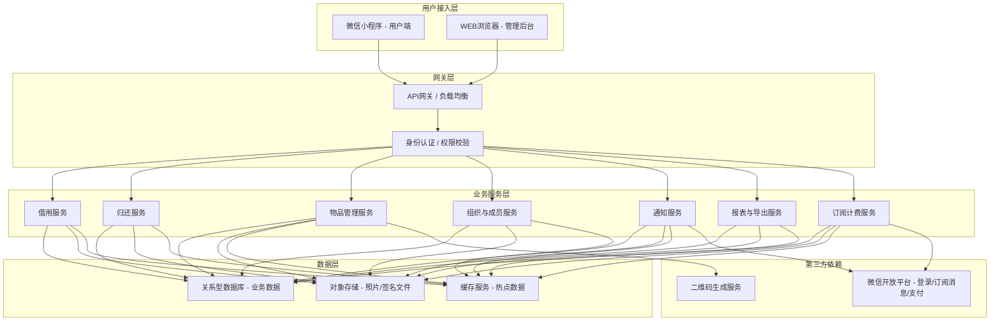

## 2.2 业务模块图

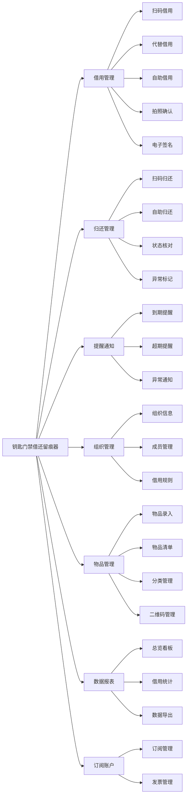

## 2.3 主业务流程

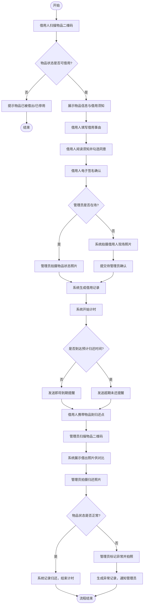

## 2.4 功能图/列表

### 小程序端功能列表

| 功能模块 | 功能名称 | 优先级 | 功能描述 |
| --- | --- | --- | --- |
| 借用管理 | 扫码借用 | P0 | 借用人扫描物品二维码发起借用 |
| 借用管理 | 代替借用 | P0 | 管理员代借用人登记借用 |
| 借用管理 | 自助借用 | P1 | 借用人自助扫码发起借用（管理员不在场） |
| 借用管理 | 物品状态拍照 | P0 | 借出时拍摄物品状态照片 |
| 借用管理 | 电子签名 | P0 | 借用人签名确认借用 |
| 借用管理 | 借用须知确认 | P0 | 借用人阅读并同意借用须知 |
| 借用管理 | 查看当前借用 | P0 | 查看正在借用中的物品列表 |
| 借用管理 | 查看借用历史 | P1 | 查看全部借用历史记录 |
| 归还管理 | 扫码归还 | P0 | 管理员扫码发起归还 |
| 归还管理 | 自助归还 | P1 | 借助人自助拍照归还 |
| 归还管理 | 归还拍照 | P0 | 归还时拍摄物品状态照片 |
| 归还管理 | 状态判定 | P0 | 管理员判定归还物品状态 |
| 归还管理 | 待归还清单 | P0 | 查看当前所有借出未还物品 |
| 提醒通知 | 到期提醒 | P0 | 借用物品即将到期时发送提醒 |
| 提醒通知 | 超期提醒 | P0 | 借用物品超期后阶梯式提醒 |
| 提醒通知 | 通知偏好设置 | P2 | 用户自定义各类通知开关 |
| 个人中心 | 微信授权登录 | P0 | 微信一键授权登录 |
| 个人中心 | 个人信息管理 | P1 | 查看和修改个人信息 |
| 个人中心 | 组织切换 | P1 | 切换当前组织视角 |
| 个人中心 | 邀请码加入 | P0 | 通过邀请码加入组织 |
| 个人中心 | 通知列表 | P1 | 查看所有系统通知 |

### WEB管理后台功能列表

| 功能模块 | 功能名称 | 优先级 | 功能描述 |
| --- | --- | --- | --- |
| 组织管理 | 基本信息维护 | P0 | 创建和编辑组织信息 |
| 组织管理 | 邀请码管理 | P0 | 查看和重置邀请码 |
| 组织管理 | 成员列表 | P0 | 查看组织所有成员 |
| 组织管理 | 角色分配 | P0 | 成员角色升降级 |
| 组织管理 | 成员移除 | P1 | 将成员移出组织 |
| 组织管理 | 借用规则配置 | P0 | 配置默认借用时长、最大借用时长、自助借用/归还开关等 |
| 组织管理 | 借用须知编辑 | P1 | 编辑借用须知内容 |
| 物品管理 | 新增物品 | P0 | 录入新物品并生成二维码 |
| 物品管理 | 批量导入 | P2 | Excel批量导入物品 |
| 物品管理 | 物品清单 | P0 | 查看所有物品及状态 |
| 物品管理 | 物品详情 | P0 | 查看物品完整信息与借用历史 |
| 物品管理 | 物品状态管理 | P1 | 手动变更物品状态 |
| 物品管理 | 二维码管理 | P0 | 查看、下载、打印物品二维码 |
| 物品管理 | 类型管理 | P1 | 管理物品分类 |
| 物品管理 | 分组管理 | P2 | 按位置/归属分组管理物品 |
| 数据报表 | 实时状态总览 | P0 | 物品使用概况看板 |
| 数据报表 | 超期预警面板 | P0 | 超期未还记录集中展示 |
| 数据报表 | 借用频次统计 | P1 | 按日/周/月统计借用趋势 |
| 数据报表 | 借用排行 | P2 | 高频借用人和高频物品排行 |
| 数据报表 | 借用记录导出 | P0 | 导出Excel借用记录 |
| 数据报表 | 超期记录导出 | P1 | 导出超期未还记录 |
| 数据报表 | 责任报告 | P1 | 生成PDF综合责任报告 |
| 订阅与账户 | 套餐查看 | P0 | 查看当前订阅信息 |
| 订阅与账户 | 续费与升级 | P0 | 在线续费/升级套餐 |
| 订阅与账户 | 到期提醒 | P1 | 订阅到期自动提醒 |
| 订阅与账户 | 开具发票 | P2 | 申请电子发票 |

## 2.5 你的产品有哪些端

| 序号 | 端名称 | 端类型 | 目标用户 | 说明 |
| --- | --- | --- | --- | --- |
| 1 | 用户端小程序 | 小程序端 | 日常管理员、借用人 | 面向借用人和日常管理员的借还操作界面，在微信内使用 |
| 2 | 管理后台 | WEB端 | 组织管理员 | 面向组织管理员的配置、物品管理、报表、数据导出界面 |

---

# 3 产品功能

## 3.1 用户端小程序功能

### 3.1.1 扫码借用

**功能描述**：借用人通过扫描物品上的二维码，自动识别物品信息并发起借用申请。系统校验物品当前状态后，引导借用人完成签名确认流程。

| 项 | 内容 |
| --- | --- |
| 优先级 | P0 |
| 依赖需求 | URS-3.1.1 借用管理 |
| 前置条件 | 借用人已登录小程序并已加入组织；物品已录入系统且状态为"可借用" |

**详细流程**：

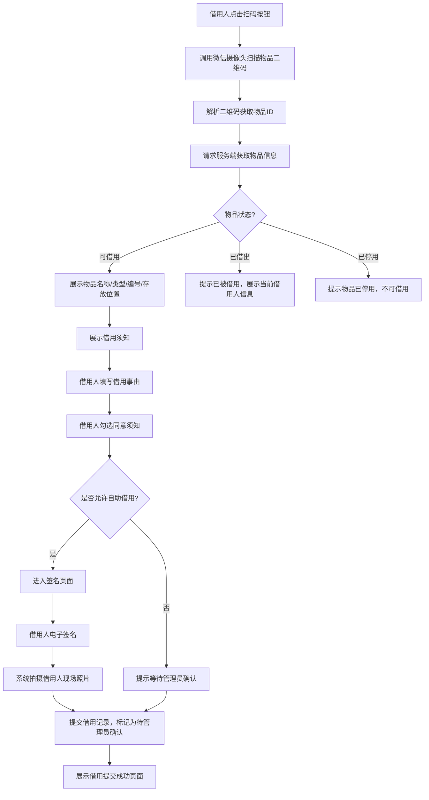

**业务规则说明**：
1. 二维码解析失败时，提示"无法识别该物品，请重新扫描或联系管理员"
2. 借用事由为必填项，长度限制10-200字
3. 电子签名区域不小于屏幕宽度的80%，笔迹需流畅低延迟
4. 签名完成后以图片形式固化，不可篡改
5. 自助借用模式下，借用记录初始状态为"待确认"，管理员确认后才正式生效
6. 非自助借用模式下，需管理员在场扫码确认后完成借用

**验收标准**：
- [ ] 正常流程：扫码后1秒内展示物品信息，签名提交后生成借用记录
- [ ] 异常流程：物品已借出时展示当前借用人信息，二维码损坏时提示重新扫描
- [ ] 性能要求：从扫码到展示物品信息不超过1秒

### 3.1.2 代替借用

**功能描述**：日常管理员在借用人不会使用小程序或管理员主动分发钥匙的场景下，代替借用人发起借用登记。

| 项 | 内容 |
| --- | --- |
| 优先级 | P0 |
| 依赖需求 | URS-3.1.1 借用管理 |
| 前置条件 | 操作者角色为日常管理员或组织管理员 |

**详细流程**：

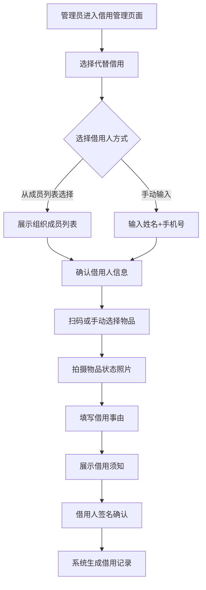

**业务规则说明**：
1. 手动输入的手机号如不在组织成员列表中，系统自动创建一条临时借用人记录
2. 管理员代替借用时，仍需借用人本人签名确认（除非借用人不在场，此时管理员可代签并注明"管理员代签"）
3. 代替借用产生的记录，系统会同时通知借用人（微信消息）

**验收标准**：
- [ ] 正常流程：管理员可选择成员列表中的借用人或手动输入，完成借用登记
- [ ] 异常流程：成员列表中无合适借用人时，可手动输入手机号
- [ ] 性能要求：成员列表加载时间不超过2秒（100人以内）

### 3.1.3 自助借用

**功能描述**：管理员不在场时，借用人自行扫码发起借用，系统拍摄借用人现场照片作为凭证，借用记录进入待确认状态。

| 项 | 内容 |
| --- | --- |
| 优先级 | P1 |
| 依赖需求 | URS-3.1.1 借用管理；组织管理员已开启"允许自助借用" |
| 前置条件 | 组织已开启自助借用开关 |

**详细流程**：

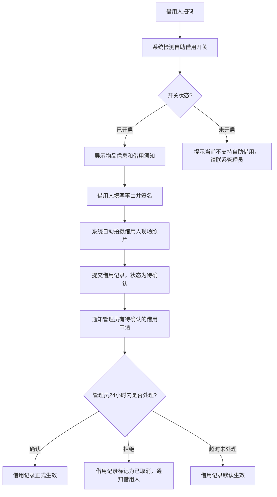

**业务规则说明**：
1. 自助借用开关由组织管理员在后台配置，关闭后所有借用必须由管理员操作
2. 自助借用时系统自动调用前置摄像头拍摄借用人现场照片（至少1张）
3. 管理员需在24小时内确认自助借用申请，超时未处理则默认生效（可配置）
4. 自助借用期间，物品状态标记为"待确认借出"，其他借用人扫描该物品时提示"有人正在申请借用"

**验收标准**：
- [ ] 正常流程：借用人扫码后自助完成借用，照片自动拍摄，管理员收到通知
- [ ] 异常流程：开关关闭时给出明确提示，管理员拒绝后通知借用人
- [ ] 性能要求：现场照片拍摄并上传完成不超过5秒

### 3.1.4 物品状态拍照

**功能描述**：借出时，日常管理员对物品当前状态进行拍照记录。照片自动关联到借用记录，作为归还时核对的依据。

| 项 | 内容 |
| --- | --- |
| 优先级 | P0 |
| 依赖需求 | URS-3.1.1 借用管理 |
| 前置条件 | 借用流程已发起 |

**业务规则说明**：
1. 拍照时自动添加时间水印（日期+时间+地点）
2. 至少拍摄1张照片，最多支持9张
3. 照片自动压缩至不超过2MB，保证上传速度
4. 拍照界面提供取景框引导，支持自动对焦和闪光灯控制
5. 拍照后即时预览，支持重拍

**验收标准**：
- [ ] 正常流程：拍照后自动压缩上传，显示上传进度，完成后关联到借用记录
- [ ] 异常流程：网络中断时缓存照片，网络恢复后自动上传
- [ ] 性能要求：单张照片上传时间不超过5秒（4G网络）

### 3.1.5 电子签名

**功能描述**：借用人阅读借用须知后，在屏幕上手写签名确认。签名内容与借用记录绑定存储，不可修改。

| 项 | 内容 |
| --- | --- |
| 优先级 | P0 |
| 依赖需求 | URS-3.1.1 借用管理 |
| 前置条件 | 借用须知已展示，借用人已勾选同意 |

**业务规则说明**：
1. 签名区域不小于屏幕宽度的80%，高度不小于150px
2. 笔迹流畅，渲染延迟不超过50ms
3. 提供"清除重签"按钮
4. 签名内容为空（借用人未书写任何笔迹）时，提交按钮置灰不可点击
5. 签名完成后以PNG图片形式存储，与借用记录绑定，不可篡改

**验收标准**：
- [ ] 正常流程：借用人签名后点击确认，签名图片成功存储并关联到借用记录
- [ ] 异常流程：签名为空时阻止提交，提示"请先签名"
- [ ] 性能要求：签名笔迹渲染延迟不超过50ms

### 3.1.6 借用记录查看

**功能描述**：借用人可查看当前正在借用中的物品列表和全部借用历史记录。

| 项 | 内容 |
| --- | --- |
| 优先级 | P0（当前借用）/ P1（历史记录） |
| 依赖需求 | URS-3.1.1 借用管理 |
| 前置条件 | 借用人已登录并加入组织 |

**业务规则说明**：
1. 当前借用列表仅展示状态为"借用中"或"超期中"的记录
2. 超期记录以红色标签醒目标记，显示超期天数
3. 历史记录支持按时间范围筛选，默认展示近3个月
4. 点击单条记录可查看详情：借出照片、签名图片、归还照片、异常标记等

**验收标准**：
- [ ] 正常流程：列表正确展示借用记录，超期记录红色标记，点击可查看完整详情
- [ ] 异常流程：无借用记录时展示空状态引导
- [ ] 性能要求：列表加载时间不超过2秒（1000条以内记录）

### 3.1.7 扫码归还

**功能描述**：日常管理员扫描物品二维码，系统自动匹配当前借用记录，进入归还核对流程。

| 项 | 内容 |
| --- | --- |
| 优先级 | P0 |
| 依赖需求 | URS-3.1.2 归还管理 |
| 前置条件 | 操作者角色为日常管理员或组织管理员；物品当前状态为已借出 |

**详细流程**：

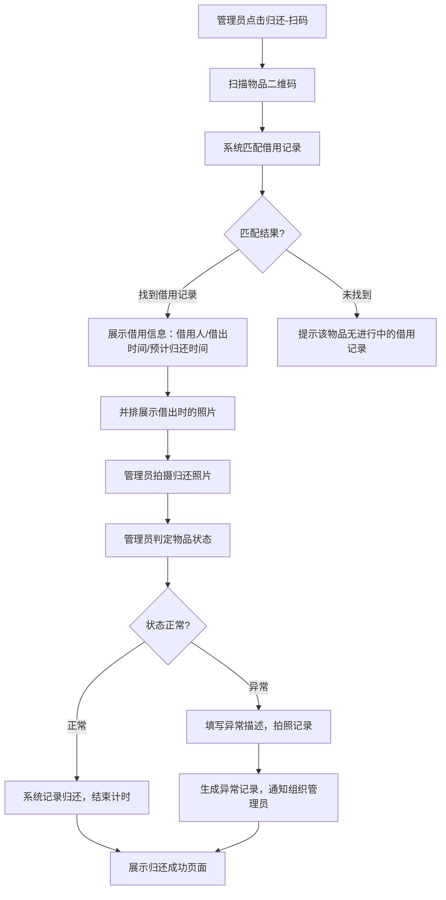

**业务规则说明**：
1. 二维码损坏无法扫描时，支持手动输入物品编号或搜索借用人姓名进行归还
2. 归还照片与借出照片并排展示，便于管理员对比
3. 选择"异常"时，异常描述为必填项，长度限制10-500字
4. 异常记录自动通知组织管理员
5. 归还完成后，系统自动通知借用人（微信消息）

**验收标准**：
- [ ] 正常流程：扫码后展示借用信息和借出照片，拍照后完成归还
- [ ] 异常流程：物品异常时可填写描述并拍照，通知组织管理员
- [ ] 性能要求：扫码后1秒内展示借用记录

### 3.1.8 自助归还

**功能描述**：借用人在管理员不在场时，自行扫码拍照归还物品，归还记录进入待确认状态。

| 项 | 内容 |
| --- | --- |
| 优先级 | P1 |
| 依赖需求 | URS-3.1.2 归还管理；组织管理员已开启"允许自助归还" |
| 前置条件 | 组织已开启自助归还开关 |

**业务规则说明**：
1. 自助归还时借用人需拍摄归还物品照片（至少1张）
2. 提交后归还记录状态为"待管理员确认"
3. 管理员在后台审核后确认归还完成
4. 如管理员48小时内未确认，系统默认归还完成（可配置）

**验收标准**：
- [ ] 正常流程：借用人拍照提交归还，管理员收到确认通知
- [ ] 异常流程：开关关闭时提示不支持自助归还
- [ ] 性能要求：照片上传并提还不超过5秒

### 3.1.9 待归还清单

**功能描述**：管理员查看所有当前借出未归还的物品清单，快速识别需要跟进的超期记录。

| 项 | 内容 |
| --- | --- |
| 优先级 | P0 |
| 依赖需求 | URS-3.1.2 归还管理 |
| 前置条件 | 操作者角色为日常管理员或组织管理员 |

**业务规则说明**：
1. 清单默认按超期天数降序排列（超期最久的排最前）
2. 超期记录以红色背景标记，即将到期（1天内）以橙色标记
3. 支持按借用人姓名、物品类型筛选
4. 支持一键发送催还提醒（向借用人发送微信消息）

**验收标准**：
- [ ] 正常流程：清单按超期天数排序，超期记录红色标记，可一键催还
- [ ] 异常流程：无待归还记录时展示空状态
- [ ] 性能要求：列表加载时间不超过2秒

### 3.1.10 提醒通知

**功能描述**：系统通过微信订阅消息自动发送到期提醒、超期提醒和异常通知。

| 项 | 内容 |
| --- | --- |
| 优先级 | P0 |
| 依赖需求 | URS-3.1.3 提醒通知 |
| 前置条件 | 用户已授权订阅消息 |

**业务规则说明**：
1. 即将到期提醒：默认提前1天发送，提醒时间可由组织管理员配置
2. 超期提醒阶梯策略：超期1天→提醒借用人；超期3天→同时提醒借用人和管理员；超期7天→通知组织管理员并生成超期责任报告
3. 阶梯策略可由组织管理员在后台自定义
4. 通知偏好可由用户在个人设置中单独配置

**验收标准**：
- [ ] 正常流程：按配置策略准时发送提醒，用户在微信中收到消息通知
- [ ] 异常流程：用户未授权订阅消息时，提示授权引导
- [ ] 性能要求：定时任务扫描执行时间不超过5分钟（10000条记录以内）

### 3.1.11 个人中心

**功能描述**：提供微信授权登录、个人信息管理、组织切换、邀请码加入组织、通知列表等功能。

| 项 | 内容 |
| --- | --- |
| 优先级 | P0 |
| 依赖需求 | URS-3.1.4 个人中心 |
| 前置条件 | 用户已安装微信 |

**业务规则说明**：
1. 微信授权登录后自动关联OpenID，后续无需重复登录
2. 用户属于多个组织时，可在小程序内切换当前组织视角
3. 通过邀请码加入组织后，默认为"借用人"角色
4. 通知列表汇总所有系统通知，支持标记已读/未读

**验收标准**：
- [ ] 正常流程：微信一键登录成功，可切换组织，可查看通知
- [ ] 异常流程：邀请码无效时提示错误，网络异常时缓存登录状态
- [ ] 性能要求：登录流程不超过3秒

---

## 3.2 WEB管理后台功能

### 3.2.1 组织信息管理

**功能描述**：组织管理员创建和编辑组织基本信息，管理邀请码。

| 项 | 内容 |
| --- | --- |
| 优先级 | P0 |
| 依赖需求 | URS-3.2.1 组织管理 |
| 前置条件 | 用户已注册并创建组织 |

**业务规则说明**：
1. 组织类型包括：物业公司、合租房、共享办公、其他
2. 邀请码为6位大写字母+数字组合，系统自动生成
3. 管理员可查看和重置邀请码，重置后旧邀请码立即失效
4. 组织Logo建议尺寸200×200px，支持JPG/PNG格式

**验收标准**：
- [ ] 正常流程：管理员可编辑组织信息，可查看/重置邀请码
- [ ] 异常流程：组织名称不可为空，Logo上传限制5MB以内
- [ ] 性能要求：信息保存后即时生效

### 3.2.2 成员管理

**功能描述**：组织管理员查看成员列表、分配角色、移除成员。

| 项 | 内容 |
| --- | --- |
| 优先级 | P0 |
| 依赖需求 | URS-3.2.1 组织管理 |
| 前置条件 | 操作者为组织管理员 |

**业务规则说明**：
1. 成员列表支持按姓名、手机号、角色搜索和筛选
2. 角色变更即时生效，被降级的管理员立即失去管理权限
3. 移除成员后，该成员无法再查看组织内的物品和借用记录，但历史借用记录仍保留
4. 组织管理员不可移除自己，至少保留一个组织管理员

**验收标准**：
- [ ] 正常流程：可搜索成员，可升降级角色，可移除成员
- [ ] 异常流程：尝试移除最后一个管理员时提示错误
- [ ] 性能要求：成员列表加载时间不超过2秒（200人以内）

### 3.2.3 借用规则配置

**功能描述**：组织管理员配置借用相关的默认规则和开关。

| 项 | 内容 |
| --- | --- |
| 优先级 | P0 |
| 依赖需求 | URS-3.2.1 组织管理 |
| 前置条件 | 操作者为组织管理员 |

**业务规则说明**：
1. 默认借用时长：可选1小时/4小时/24小时/3天/7天/自定义
2. 最大借用时长：不超过30天
3. 自助借用开关：开启后允许借用人自助发起借用
4. 自助归还开关：开启后允许借用人自助拍照归还
5. 超期提醒策略：可自定义各级提醒的触发天数和通知对象

**验收标准**：
- [ ] 正常流程：管理员可配置各项规则，保存后即时生效
- [ ] 异常流程：默认借用时长不可大于最大借用时长
- [ ] 性能要求：规则保存后即时生效，新借用记录使用新规则

### 3.2.4 物品录入

**功能描述**：管理员录入新的可借用物品，系统自动生成专属二维码。

| 项 | 内容 |
| --- | --- |
| 优先级 | P0 |
| 依赖需求 | URS-3.2.2 物品管理 |
| 前置条件 | 操作者为组织管理员或日常管理员 |

**业务规则说明**：
1. 物品类型：钥匙、门禁卡、工牌、遥控器、其他（支持自定义）
2. 物品编号可自动生成（格式：类型缩写-6位数字，如 KY-000123）或手动输入
3. 录入后可选上传物品基准照片
4. 录入完成后系统自动生成二维码，支持预览和下载

**验收标准**：
- [ ] 正常流程：录入物品后自动生成二维码，可预览和下载打印
- [ ] 异常流程：物品编号重复时提示修改
- [ ] 性能要求：二维码生成时间不超过1秒

### 3.2.5 物品清单管理

**功能描述**：查看所有物品的清单，支持筛选、搜索、查看详情、管理状态、下载二维码。

| 项 | 内容 |
| --- | --- |
| 优先级 | P0 |
| 依赖需求 | URS-3.2.2 物品管理 |
| 前置条件 | 操作者为组织管理员或日常管理员 |

**业务规则说明**：
1. 物品清单默认展示全部物品，支持按类型、状态、存放位置、分组筛选
2. 物品状态：可借用（绿色）、已借出（蓝色）、已停用（灰色）
3. 已借出的物品不可直接停用，需先归还
4. 二维码支持单个下载（PNG）和批量下载（PDF，含物品名称和编号）
5. 物品详情展示完整信息和借用历史（时间线形式）

**验收标准**：
- [ ] 正常流程：列表正确展示物品状态，可按条件筛选，可查看物品详情和借用历史
- [ ] 异常流程：已借出物品尝试停用时提示需先归还
- [ ] 性能要求：列表加载时间不超过2秒（1000个物品以内）

### 3.2.6 数据报表

**功能描述**：展示物品使用概况看板，提供借用统计和各类数据导出功能。

| 项 | 内容 |
| --- | --- |
| 优先级 | P0 |
| 依赖需求 | URS-3.2.3 数据报表 |
| 前置条件 | 操作者为组织管理员 |

**业务规则说明**：
1. 实时状态总览：展示物品总数、可借用数、已借出数、超期未还数、本月借用次数
2. 超期预警面板：集中展示所有超期未还记录，支持一键发送催还提醒
3. 借用频次统计：按日/周/月展示趋势折线图，支持按物品类型和借用人筛选
4. 借用记录导出：Excel格式，包含物品名称、借用人、借用时间、归还时间、借用时长、是否超期、物品状态
5. 超期记录导出：Excel格式，包含物品名称、借用人、借用时间、超期天数、联系人手机号
6. 责任报告：PDF格式综合报告，包含借用记录、超期记录、异常记录

**验收标准**：
- [ ] 正常流程：看板数据实时更新，统计数据按条件筛选，导出文件可正常下载打开
- [ ] 异常流程：无数据时展示空状态引导
- [ ] 性能要求：看板加载不超过3秒，10000条记录导出不超过30秒

### 3.2.7 订阅与账户管理

**功能描述**：查看订阅套餐信息，在线续费/升级，管理发票。

| 项 | 内容 |
| --- | --- |
| 优先级 | P0 |
| 依赖需求 | URS-3.2.4 订阅与账户 |
| 前置条件 | 操作者为组织管理员 |

**业务规则说明**：
1. 基础版：¥199/年/组织，含50个物品上限
2. 专业版：按物品数量加购，具体价格见定价页面
3. 支持微信支付
4. 订阅到期前30天、7天、1天分别发送提醒
5. 到期后系统进入只读模式（可查看历史记录但不可新增借用）
6. 发票为增值税普通发票，5个工作日内开具

**验收标准**：
- [ ] 正常流程：可查看套餐信息，可微信支付续费，可申请发票
- [ ] 异常流程：支付失败时给出明确提示
- [ ] 性能要求：支付回调处理时间不超过3秒

---

## 3.3 后台服务功能

### 3.3.1 通知服务

**功能描述**：对接微信订阅消息接口，执行定时任务扫描超期和即将到期的借用记录。

| 项 | 内容 |
| --- | --- |
| 优先级 | P0 |
| 依赖需求 | URS-3.3.1 通知服务 |
| 前置条件 | 微信订阅消息接口已对接 |

**业务规则说明**：
1. 超期扫描：每日凌晨01:00执行全量扫描
2. 到期预提醒：每日凌晨01:30扫描次日到期的借用记录
3. 订阅到期检查：每日凌晨02:00扫描即将到期的订阅
4. 消息发送失败时自动重试3次，间隔5分钟
5. 所有通知发送记录持久化存储，供查询

**验收标准**：
- [ ] 正常流程：定时任务按时执行，消息按策略发送成功
- [ ] 异常流程：消息发送失败自动重试，重试记录可查
- [ ] 性能要求：全量扫描（10000条记录）执行时间不超过5分钟

### 3.3.2 数据存储服务

**功能描述**：提供照片存储、签名图片存储、文件导出生成、二维码生成等基础服务。

| 项 | 内容 |
| --- | --- |
| 优先级 | P0 |
| 依赖需求 | URS-3.3.2 数据存储服务 |
| 前置条件 | 对象存储服务已配置 |

**业务规则说明**：
1. 照片存储：压缩后不超过2MB/张，按借用记录ID组织目录
2. 签名图片：PNG格式永久保存，与借用记录绑定
3. 二维码生成：根据物品ID生成唯一二维码，支持PNG/PDF格式
4. 导出文件：临时存储，保留7天后自动清理

**验收标准**：
- [ ] 正常流程：照片/签名上传成功并正确关联，二维码生成正确
- [ ] 异常流程：存储空间不足时报警，上传失败时返回错误信息
- [ ] 性能要求：单文件上传不超过5秒，二维码生成不超过1秒

---

# 4 产品原型

## 4.1 页面跳转逻辑图

### 小程序端页面跳转

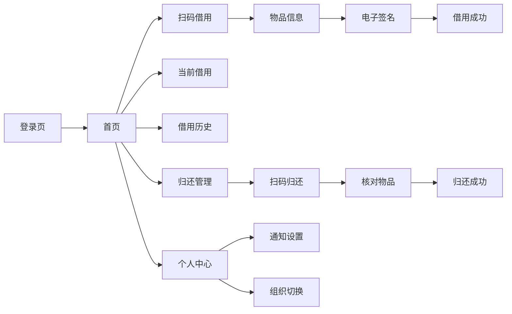

### WEB管理后台页面跳转

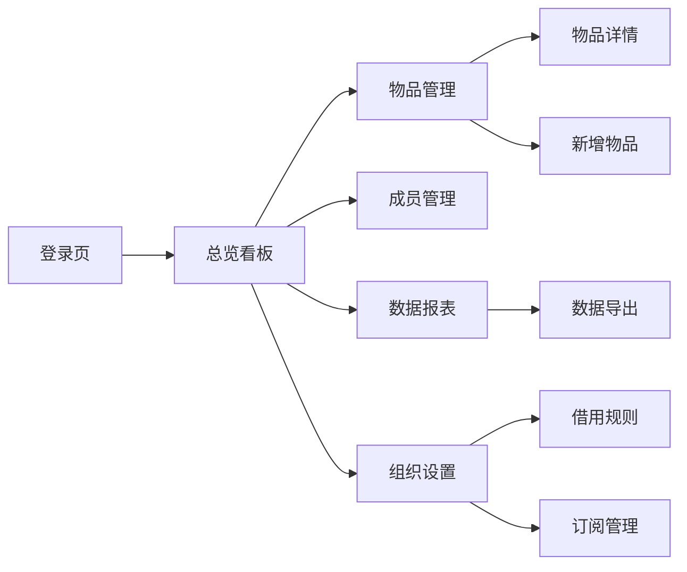

## 4.2 全站点原型设计

### 4.2.1 用户端小程序

**页面清单：**

| 序号 | 页面名称 | 所属模块 | 页面描述 | 关键元素 |
| --- | --- | --- | --- | --- |
| 1 | 登录引导页 | 个人中心 | 微信授权登录引导 | 微信授权按钮、须知说明 |
| 2 | 首页 | 借用管理 | 借还操作入口 | 扫码借用、扫码归还、当前借用入口、待归还入口 |
| 3 | 扫码结果页 | 借用管理 | 扫码后展示物品信息 | 物品信息卡片、借用须知、借用按钮 |
| 4 | 电子签名页 | 借用管理 | 借用人签名确认 | 签名区域、清除按钮、确认按钮 |
| 5 | 拍照页面 | 借用管理 | 拍摄物品状态照片 | 相机取景框、拍照按钮、闪光灯、相册入口 |
| 6 | 当前借用列表 | 借用管理 | 查看正在借用中的物品 | 物品列表、超期标记、归还入口 |
| 7 | 借用历史列表 | 借用管理 | 查看全部借用记录 | 记录列表、筛选条件、详情入口 |
| 8 | 借用详情页 | 借用管理 | 查看单条借用记录详情 | 借出照片、归还照片、签名图片、时间线 |
| 9 | 待归还清单 | 归还管理 | 管理员查看待归还物品 | 物品列表、超期排序、催还按钮 |
| 10 | 归还核对页 | 归还管理 | 管理员核对归还物品 | 借出/归还照片对比、状态判定、确认按钮 |
| 11 | 个人中心 | 个人中心 | 个人信息和组织管理 | 头像、姓名、组织信息、通知入口 |
| 12 | 通知列表 | 提醒通知 | 查看所有系统通知 | 通知列表、已读/未读标记 |
| 13 | 加入组织页 | 个人中心 | 通过邀请码加入组织 | 邀请码输入框、确认按钮 |

**交互说明：**
- 页面跳转关系：
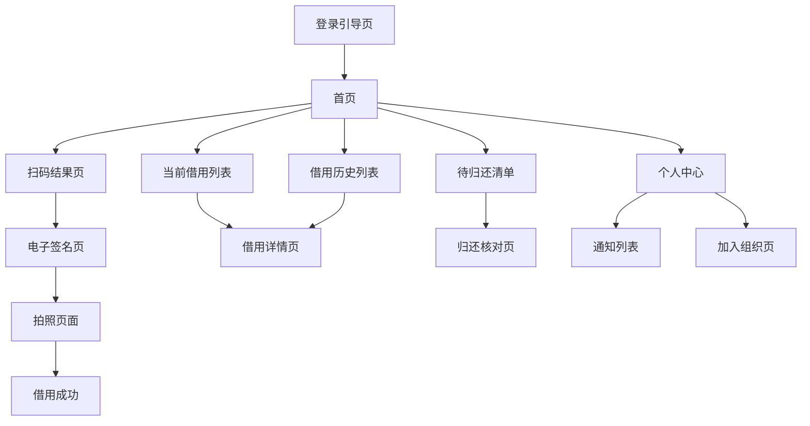
- 特殊交互：
  1. 首页下拉刷新、上拉加载更多
  2. 扫码页面自动对焦，支持闪光灯开关
  3. 签名页面支持横屏书写，笔迹低延迟渲染
  4. 照片上传时显示进度条，支持断点续传
  5. 超期记录红色背景闪烁提醒
  6. 空数据态：展示引导性插画和文案
  7. 加载态：骨架屏占位
  8. 错误态：展示重试按钮

**产品原型：**

[打开用户端小程序全站点原型](assets/prototypes/miniprogram-prototype.html)

### 4.2.2 WEB管理后台

**页面清单：**

| 序号 | 页面名称 | 所属模块 | 页面描述 | 关键元素 |
| --- | --- | --- | --- | --- |
| 1 | 登录页 | 账户 | 管理员登录 | 微信扫码登录、账号密码登录 |
| 2 | 总览看板 | 数据报表 | 物品使用概况和超期预警 | 数据卡片、趋势图表、超期列表 |
| 3 | 物品列表页 | 物品管理 | 查看所有物品清单 | 搜索栏、筛选条件、表格、操作按钮 |
| 4 | 新增物品页 | 物品管理 | 录入新物品 | 表单、照片上传、二维码预览 |
| 5 | 物品详情页 | 物品管理 | 查看物品完整信息 | 基本信息、借用历史时间线、二维码 |
| 6 | 成员列表页 | 组织管理 | 查看和管理组织成员 | 成员表格、搜索、角色标签、操作按钮 |
| 7 | 借用规则页 | 组织管理 | 配置借用相关规则 | 规则表单、开关组件、策略配置 |
| 8 | 借用须知编辑页 | 组织管理 | 编辑借用须知内容 | Markdown编辑器、预览面板 |
| 9 | 数据报表页 | 数据报表 | 借用统计图表 | 折线图、柱状图、排行榜、筛选器 |
| 10 | 数据导出页 | 数据报表 | 导出借用记录/超期记录/责任报告 | 导出选项、日期范围、格式选择 |
| 11 | 订阅管理页 | 订阅与账户 | 查看和管理订阅 | 套餐信息卡片、续费按钮、使用量进度条 |
| 12 | 发票管理页 | 订阅与账户 | 申请和管理发票 | 开票信息表单、发票列表 |

**交互说明：**
- 页面跳转关系：
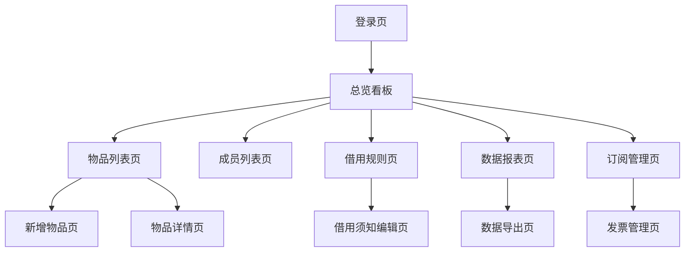
- 特殊交互：
  1. 左侧导航栏折叠/展开
  2. 表格列排序、分页、筛选
  3. 图表区域支持hover展示数据详情
  4. 导出文件时显示进度和完成通知
  5. 表单验证实时反馈
  6. 删除操作二次确认弹窗
  7. 数据看板支持时间范围切换

**产品原型：**

[打开WEB管理后台全站点原型](assets/prototypes/admin-web-prototype.html)

---

# 5 数据需求

## 5.1 数据使用规格

### 物品表

| **字段** | **是否必填** | **描述** | **数据类型** |
| --- | --- | --- | --- |
| id | 是 | 物品唯一标识 | UUID |
| org_id | 是 | 所属组织ID | UUID |
| name | 是 | 物品名称 | 字符串，1-50字 |
| type | 是 | 物品类型（钥匙/门禁卡/工牌/遥控器/其他） | 枚举 |
| code | 是 | 物品编号（唯一） | 字符串 |
| location | 否 | 存放位置 | 字符串 |
| group_id | 否 | 所属分组ID | UUID |
| status | 是 | 当前状态（可借用/已借出/已停用） | 枚举 |
| base_photo_url | 否 | 基准照片URL | 字符串 |
| qrcode_url | 是 | 二维码图片URL | 字符串 |
| remark | 否 | 备注说明 | 字符串 |
| created_at | 是 | 创建时间 | 时间戳 |
| updated_at | 是 | 更新时间 | 时间戳 |

### 借用记录表

| **字段** | **是否必填** | **描述** | **数据类型** |
| --- | --- | --- | --- |
| id | 是 | 记录唯一标识 | UUID |
| org_id | 是 | 所属组织ID | UUID |
| item_id | 是 | 借用物品ID | UUID |
| borrower_id | 是 | 借用人ID | UUID |
| borrower_name | 是 | 借用人姓名 | 字符串 |
| borrower_phone | 否 | 借用人手机号 | 字符串 |
| reason | 是 | 借用事由 | 字符串，10-200字 |
| status | 是 | 记录状态（待确认/借用中/超期中/已归还/异常归还/已取消） | 枚举 |
| borrow_time | 是 | 借用时间 | 时间戳 |
| expected_return_time | 是 | 预计归还时间 | 时间戳 |
| actual_return_time | 否 | 实际归还时间 | 时间戳 |
| borrow_photos | 是 | 借出照片URL列表 | JSON数组 |
| return_photos | 否 | 归还照片URL列表 | JSON数组 |
| signature_url | 是 | 电子签名图片URL | 字符串 |
| is_overdue | 是 | 是否超期 | 布尔 |
| overdue_days | 否 | 超期天数 | 整数 |
| is_abnormal | 否 | 是否异常归还 | 布尔 |
| abnormal_desc | 否 | 异常描述 | 字符串 |
| abnormal_photos | 否 | 异常照片URL列表 | JSON数组 |
| operator_id | 是 | 操作管理员ID | UUID |
| borrow_type | 是 | 借用类型（扫码借用/代替借用/自助借用） | 枚举 |
| return_type | 否 | 归还类型（扫码归还/自助归还） | 枚举 |
| created_at | 是 | 创建时间 | 时间戳 |
| updated_at | 是 | 更新时间 | 时间戳 |

### 组织成员表

| **字段** | **是否必填** | **描述** | **数据类型** |
| --- | --- | --- | --- |
| id | 是 | 成员记录ID | UUID |
| org_id | 是 | 所属组织ID | UUID |
| user_id | 是 | 用户ID | UUID |
| name | 是 | 姓名 | 字符串 |
| phone | 否 | 手机号 | 字符串 |
| role | 是 | 角色（组织管理员/日常管理员/借用人） | 枚举 |
| joined_at | 是 | 加入时间 | 时间戳 |

### 通知记录表

| **字段** | **是否必填** | **描述** | **数据类型** |
| --- | --- | --- | --- |
| id | 是 | 通知记录ID | UUID |
| user_id | 是 | 接收用户ID | UUID |
| type | 是 | 通知类型（到期提醒/超期提醒/异常通知/系统通知） | 枚举 |
| title | 是 | 通知标题 | 字符串 |
| content | 是 | 通知内容 | 字符串 |
| related_record_id | 否 | 关联借用记录ID | UUID |
| is_read | 是 | 是否已读 | 布尔 |
| send_status | 是 | 发送状态（待发送/已发送/发送失败） | 枚举 |
| retry_count | 否 | 重试次数 | 整数 |
| created_at | 是 | 创建时间 | 时间戳 |

## 5.2 统计数据

1. 统计组织下物品的借用总次数、当前借出数、超期数，按日/周/月维度统计（P0）
2. 统计各借用人的借用次数排名，按周/月维度（P1）
3. 统计各物品的被借用次数排名，按周/月维度（P1）
4. 统计超期次数和平均超期天数，按借用人维度（P1）

## 5.3 埋点需求

| 页面 | 事件 | 采集字段 | 说明 |
| --- | --- | --- | --- |
| 首页 | 点击扫码借用 | user_id, org_id, timestamp | 统计借用发起频次 |
| 首页 | 点击扫码归还 | user_id, org_id, timestamp | 统计归还操作频次 |
| 签名页 | 完成签名 | user_id, record_id, sign_duration | 统计签名耗时 |
| 拍照页 | 完成拍照 | user_id, record_id, photo_count | 统计拍照数量 |
| 借用成功页 | 展示成功 | user_id, record_id, borrow_type | 统计借用完成数 |
| 归还核对页 | 提交归还 | user_id, record_id, status, is_abnormal | 统计归还状态分布 |
| 物品管理页 | 新增物品 | user_id, org_id, item_type | 统计物品录入情况 |
| 数据导出页 | 点击导出 | user_id, export_type, record_count | 统计导出使用频率 |

---

# 6 非功能需求

## 6.1 性能需求

**6.1.1 延迟**

| 编号 | 项目 | 最大延迟 | 平均延迟 | 优先级 | 备注 |
| --- | --- | --- | --- | --- | --- |
| 0001 | 扫码后展示物品信息 | <1秒 | <0.5秒 | 高 | 含网络请求 |
| 0002 | 借用记录提交 | <2秒 | <1秒 | 高 | 含照片上传 |
| 0003 | 单张照片上传（4G） | <5秒 | <3秒 | 高 | 压缩后不超过2MB |
| 0004 | 小程序首页加载 | <2秒 | <1秒 | 高 | Wi-Fi环境 |
| 0005 | WEB端页面加载 | <3秒 | <1.5秒 | 高 | 主流浏览器 |
| 0006 | 借用记录列表查询（10000条以内） | <2秒 | <1秒 | 中 | 含分页 |
| 0007 | 数据看板加载 | <3秒 | <1.5秒 | 中 | 含图表渲染 |

**6.1.2 吞吐量**

| 编号 | 项 | 吞吐量 | 备注 |
| --- | --- | --- | --- |
| 0001 | 借用/归还操作 | 每分钟100次 | 单组织峰值 |
| 0002 | 照片上传 | 每分钟200次 | 含压缩处理 |
| 0003 | 消息推送 | 每分钟1000条 | 含重试 |

**6.1.3 容量**

| 编号 | 项 | 容量 | 备注 |
| --- | --- | --- | --- |
| 0001 | 单组织成员数 | ≤500人 | 基础版≤100人 |
| 0002 | 单组织物品数 | ≤5000个 | 基础版≤50个 |
| 0003 | 单条借用记录附件数 | ≤9张照片+1张签名 | |
| 0004 | 借用记录保留时长 | ≥3年 | 到期后可导出归档 |

## 6.2 安全需求

| 编号 | 项（系统数据 / 处理过程） |
| --- | --- |
| 0001 | 所有通讯均使用HTTPS加密传输 |
| 0002 | 用户身份认证基于微信OAuth2.0，Token有效期24小时 |
| 0003 | 管理后台登录需微信扫码验证，支持二次验证 |
| 0004 | 接口权限校验：每个API请求验证用户角色权限，防止越权操作 |
| 0005 | 照片和签名图片存储使用私有Bucket，通过临时签名URL访问 |
| 0006 | 导出的Excel/PDF文件通过临时下载链接访问，有效期24小时 |
| 0007 | 电子签名图片不可篡改，存储时计算哈希值校验 |
| 0008 | 防止SQL注入、XSS攻击，所有用户输入做转义处理 |

## 6.3 可靠性

| 编号 | 项 | 值 |
| --- | --- | --- |
| 0001 | 系统可用性 | 99.9% |
| 0002 | 平均正常运行时间 | 约365天/年 |
| 0003 | 平均故障恢复时间 | ≤30分钟 |
| 0004 | 数据备份频率 | 每日全量备份，每小时增量备份 |
| 0005 | 备份保留周期 | 30天 |

## 6.4 可连续性

| 编号 | 项 |
| --- | --- |
| Conti.1 | 系统7×24小时运行，全年无计划内停机 |
| Conti.2 | 弱网环境下（3G或信号差）支持操作缓存，网络恢复后自动同步 |
| Conti.3 | 定时任务支持断点续扫，异常中断后从上次位置继续 |

## 6.5 可恢复性

| 编号 | 项 |
| --- | --- |
| Modi.1 | 数据库每日全量备份，每小时增量备份，保留30天 |
| Modi.2 | 照片/签名文件使用多副本存储，数据持久性99.9999999% |
| Modi.3 | 重大故障在1～3小时内恢复服务，24小时内恢复数据 |
| Modi.4 | 系统支持跨可用区容灾部署 |

## 6.6 兼容性

| 编号 | 要求 | 备注 |
| --- | --- | --- |
| 0001 | 小程序端：微信版本7.0+，iOS 11+，Android 6.0+ | |
| 0002 | WEB端：Chrome 80+、Firefox 75+、Edge 80+、Safari 13+ | |
| 0003 | WEB端支持分辨率：1024×768、1366×768、1920×1080 | |
| 0004 | 小程序端适配主流分辨率：375×667、390×844、414×896 | |

## 6.7 易用性

| 编号 | 要求 | 备注 |
| --- | --- | --- |
| 0001 | 核心借还操作不超过3步（扫码→拍照→签名） | |
| 0002 | 单步操作耗时不超过5秒 | |
| 0003 | 界面采用大按钮、高对比度设计，适合户外/走廊使用 | |
| 0004 | 普通用户无需培训即可使用核心功能 | |
| 0005 | 管理后台表格支持列排序、分页、筛选，单页默认20条 | |

---

# 7 总结

## 7.1 上线计划

| 阶段 | 时间 | 内容 | 负责人 |
| --- | --- | --- | --- |
| 开发阶段 | 2026-07-01 ~ 2026-07-10 | 完成小程序端+WEB管理后台开发 | 开发团队 |
| 测试阶段 | 2026-07-11 ~ 2026-07-14 | 功能测试、兼容性测试、性能测试 | 测试团队 |
| 灰度阶段 | 2026-07-15 ~ 2026-07-18 | 选取3个物业/合租房场景灰度验证 | 产品+运营 |
| 全量上线 | 2026-07-19 | 全量开放，启动推广 | 产品+运营 |

## 7.2 后续迭代规划

- V1.1：支持物品分组管理、批量导入、高频物品/借用人排行
- V1.2：增加物品使用频次统计、智能推荐借用时长
- V1.3：支持多语言（英文）、国际化部署
- V2.0：对接智能柜/电子锁硬件，实现无人值守借还

## 7.3 参考文档

- 《钥匙门禁借还留痕器_需求规格说明书_v1.0》（URS文档）
- 微信小程序开发文档：https://developers.weixin.qq.com/miniprogram/dev/framework/
- 微信订阅消息接口文档：https://developers.weixin.qq.com/miniprogram/dev/framework/open-ability/subscribe-message.html
- 微信支付接口文档：https://pay.weixin.qq.com/wiki/doc/apiv3/index.shtml
