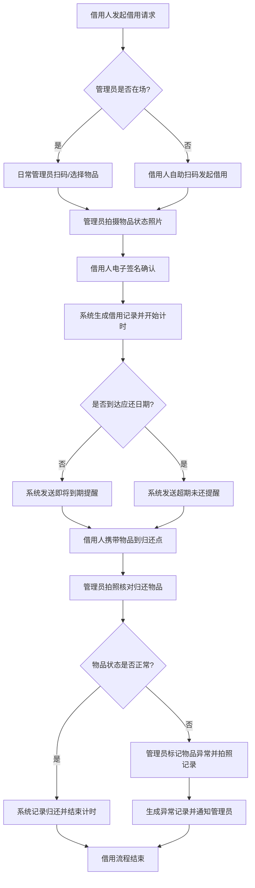
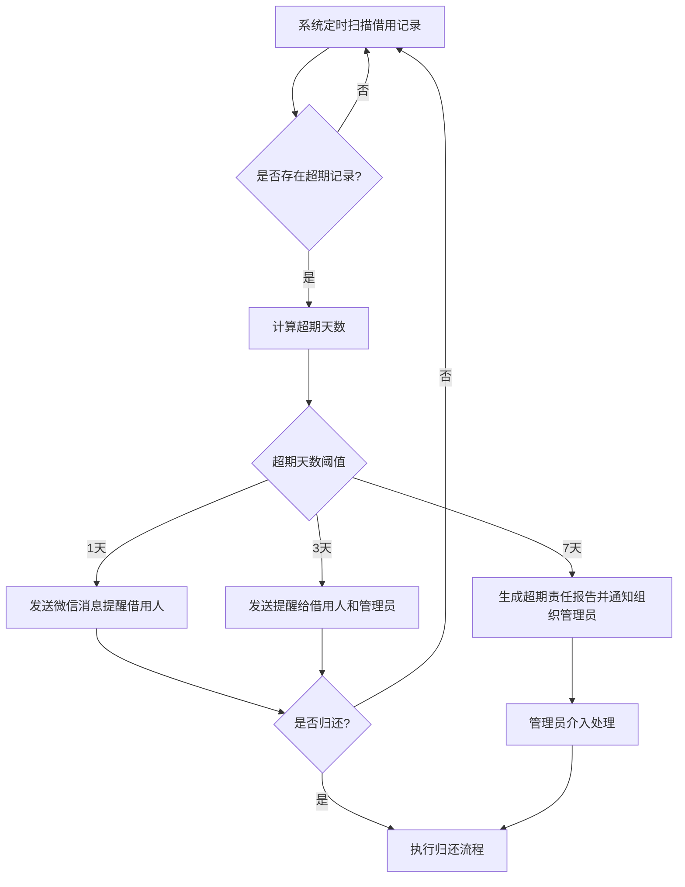
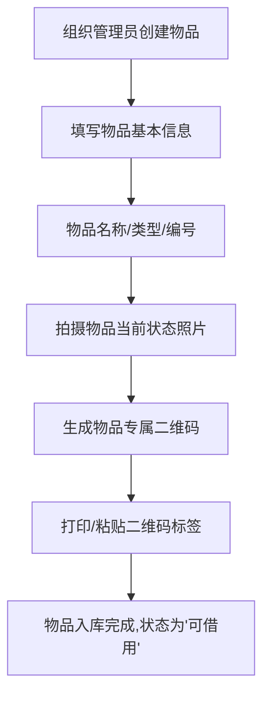
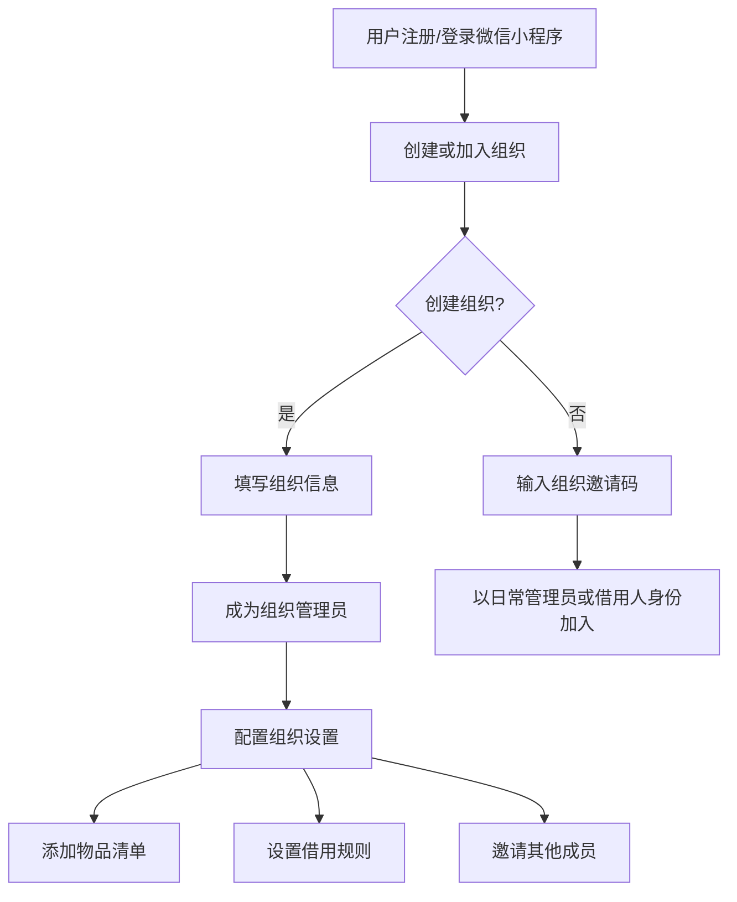
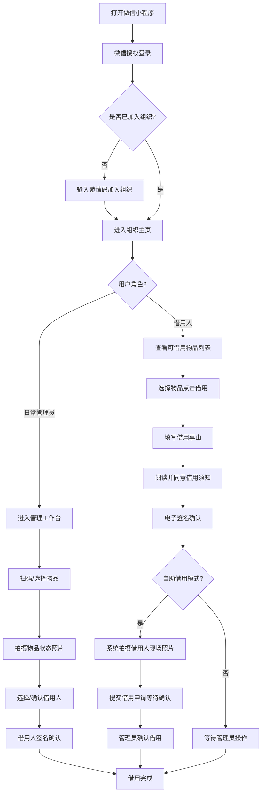
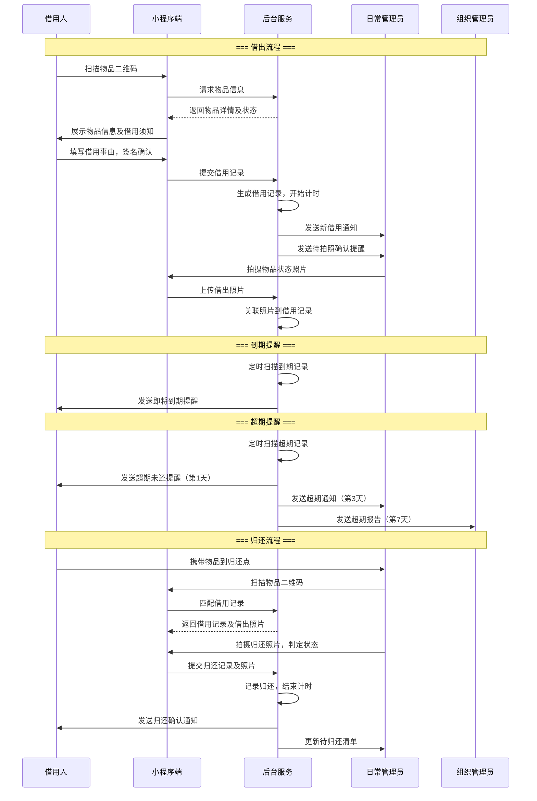
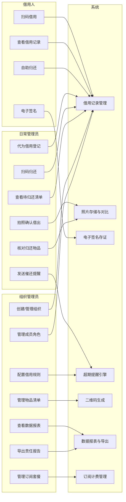
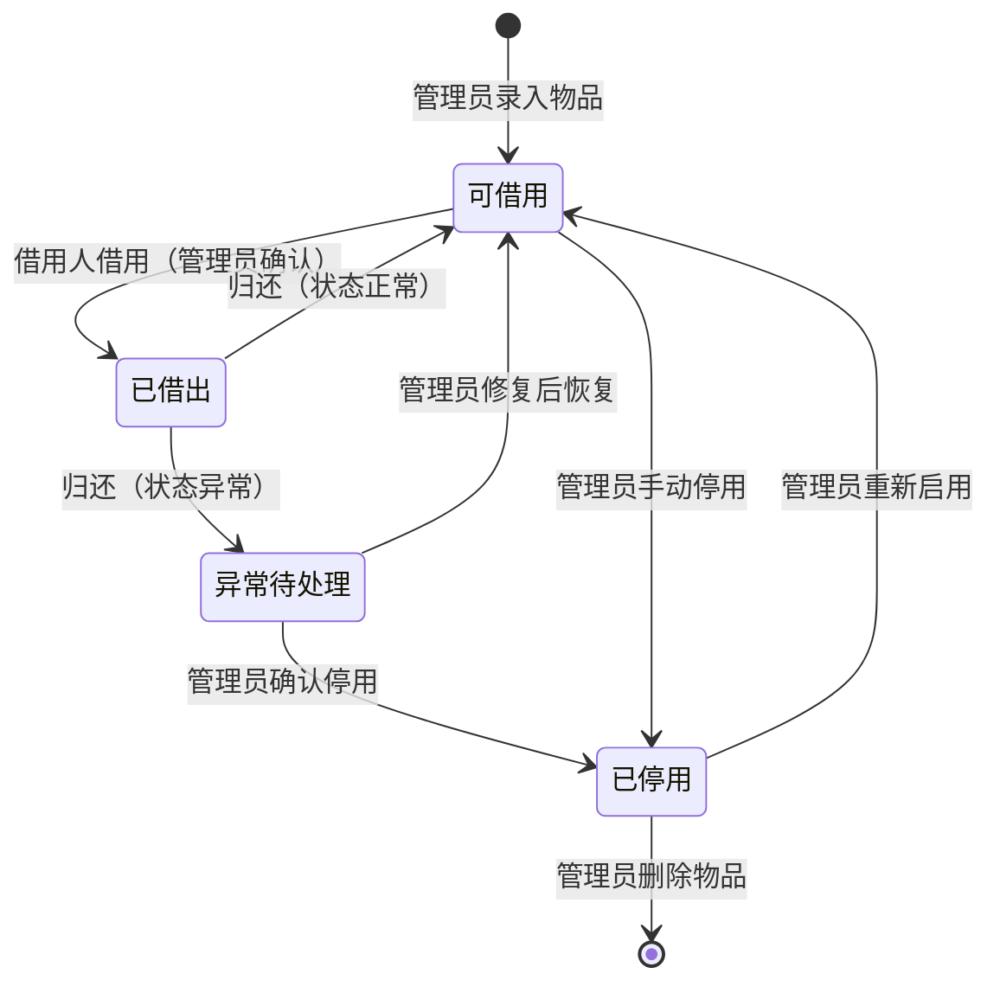
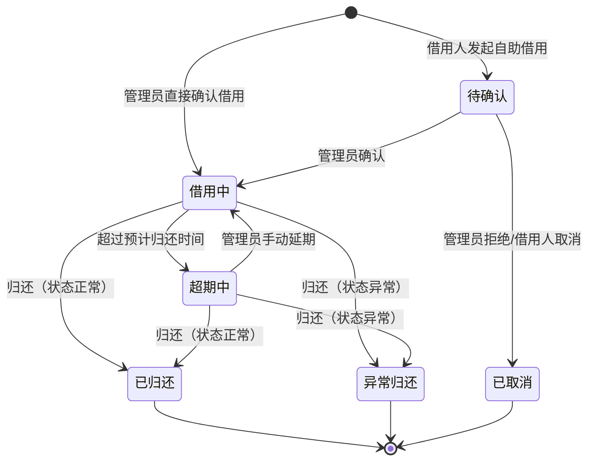

# 钥匙门禁借还留痕器 — 用户需求说明书（URS）

> 文档版本：v1.0.0
> 创建日期：2026-06-26
> 产品名称：钥匙门禁借还留痕器
> 文档类型：用户需求说明书（URS）

---

# 1. 需求概述

## 1.1 需求介绍

钥匙门禁借还留痕器是一款面向小区物业、合租房房东、共享办公室管理员的轻量级借还责任追踪工具。产品聚焦于"钥匙、门禁卡、工牌"等小件物品的借出与归还场景，通过拍照留证、电子签名、超期提醒等手段，实现借还行为的全程可追溯，解决传统纸质登记存在的信息缺失、责任不清、追溯困难等痛点。

产品采用微信小程序作为主要使用端，降低用户安装门槛，支持扫码即借、拍照确认、电子签名等轻量化操作，满足一线管理人员在日常巡查、维修派工、租户入住等高频场景中的快速使用需求。

### 1.1.1 所属领域

智慧社区管理 / 小型资产借还管理

具体覆盖以下细分行业：
- 住宅小区物业管理
- 长租公寓 / 合租房管理
- 共享办公空间管理

## 1.2 需求目标

1. **责任留痕**：为每一次钥匙/门禁卡的借出与归还建立完整的电子记录，包含借用人、借用时间、归还时间、状态照片、电子签名等信息，做到"谁借的、什么时候借的、什么时候还的、借的时候什么状态"一目了然。

2. **简化操作**：通过微信小程序实现全流程操作，借用人扫码即可完成借用登记，管理员拍照确认即可发放，全程操作不超过30秒。

3. **超期管控**：系统自动追踪借用状态，对超期未归还的物品发送提醒通知（微信消息/短信），并生成超期责任记录供管理员导出。

4. **降低纠纷**：借出时拍照记录物品状态、借用人电子签名确认，归还时自动核对，避免"钥匙损坏谁负责"、"到底借没借"等常见纠纷。

5. **低成本运营**：面向小型管理场景定价（¥199/年/组织），无需部署硬件设备，一部手机即可完成全部管理动作。

## 1.3 系统使用角色

| 角色 | 说明 | 典型用户 |
| --- | --- | --- |
| 组织管理员 | 负责创建组织、管理物品清单、配置规则、查看报表、导出数据。一个组织可有多个管理员。 | 物业经理、房东本人、共享办公室运营负责人 |
| 日常管理员 | 负责日常的钥匙/门禁卡借出和归还操作，拍照确认、核对归还物品。 | 物业前台/保安、房东委托的管家、共享办公前台接待 |
| 借用人 | 发起借用请求、签字确认借用、按时归还物品。可以查看自己的借用历史。 | 物业维修工、合租房租客、共享办公空间入驻企业员工 |

## 1.4 业务流程图

### 1.4.1 核心借还流程

### 1.4.2 超期处理流程

### 1.4.3 物品入库流程

### 1.4.4 组织与权限管理流程

# 2. 功能原型

| 原型名称 | 原型链接 | 对应端 | 备注 |
| --- | --- | --- | --- |
| 钥匙门禁借还留痕器 - 用户端 | 待设计 | 小程序端 | 面向日常管理员和借用人的借还操作界面 |
| 钥匙门禁借还留痕器 - 管理后台 | 待设计 | WEB端 | 面向组织管理员的配置、报表、数据导出界面 |

# 3. 需求清单

## 3.1 用户端-小程序端

用户端面向日常管理员（借出/归还操作）和借用人（发起借用/查看记录），提供移动场景下的轻量化操作体验。

### 3.1.1 借用管理模块

| 模块 | 一级功能 | 二级功能 | 功能描述 | 备注 |
| --- | --- | --- | --- | --- |
| 借用管理 | 发起借用 | 扫码借用 | 借用人扫描物品二维码，自动识别物品信息，填写借用事由，提交借用申请。系统校验物品当前状态是否"可借用"，若已被借出则提示当前借用人信息。 | 支持离线缓存二维码信息，弱网环境下可先记录后同步 |
| 借用管理 | 发起借用 | 代替借用 | 日常管理员代借用人发起借用登记。适用于借用人不会使用小程序、或管理员主动分发钥匙的场景。管理员选择借用人（从成员列表选取或手动输入姓名+手机号），记录借用信息。 | |
| 借用管理 | 发起借用 | 自助借用 | 管理员不在场时，借用人扫码自助发起借用。系统拍摄借用人现场照片作为凭证，借用人生效需等待管理员远程确认或在规定时间内默认生效。 | 需管理员预先开启"允许自助借用"开关 |
| 借用管理 | 借用确认 | 物品状态拍照 | 借出时，日常管理员对物品当前状态进行拍照记录（至少1张）。照片自动关联到借用记录，作为归还时核对的依据。支持多张照片上传。 | 拍照时自动添加时间水印 |
| 借用管理 | 借用确认 | 电子签名 | 借用人阅读借用须知后在屏幕上电子签名确认。签名内容包含：借用人姓名、借用物品、借用时间、预计归还时间、损坏赔偿条款。签名完成后不可修改。 | 签名图片与借用记录绑定存储 |
| 借用管理 | 借用确认 | 借用须知确认 | 展示组织管理员预设的借用须知（如"请妥善保管，损坏需赔偿"等），借用人需阅读并勾选同意后方可继续借用流程。 | 须知内容由组织管理员在后台配置 |
| 借用管理 | 借用记录 | 查看当前借用 | 借用人可查看自己当前正在借用中的物品列表，包含物品名称、借用时间、预计归还时间、超期天数。 | |
| 借用管理 | 借用记录 | 查看借用历史 | 借用人可查看自己的全部借用历史记录，包含已归还和未归还的记录，支持按时间范围筛选。 | |
| 借用管理 | 借用记录 | 借用详情 | 查看单条借用记录的完整信息：借用人、物品信息、借出照片、签名图片、借用时间、归还时间、归还照片、异常标记等。 | |

### 3.1.2 归还管理模块

| 模块 | 一级功能 | 二级功能 | 功能描述 | 备注 |
| --- | --- | --- | --- | --- |
| 归还管理 | 发起归还 | 扫码归还 | 日常管理员扫描物品二维码，系统自动匹配当前借用记录，进入归还核对流程。若二维码损坏，支持手动搜索物品编号或借用人姓名进行归还。 | |
| 归还管理 | 发起归还 | 自助归还 | 借用人扫描物品二维码发起自助归还，拍摄归还状态照片后提交。系统标记为"待管理员确认"，管理员审核通过后完成归还。 | 需管理员预先开启"允许自助归还"开关 |
| 归还管理 | 归还核对 | 归还拍照 | 管理员拍摄归还物品的当前状态照片，系统同时展示借出时的照片供对比。管理员判断物品状态是否正常。 | 并排展示借出/归还照片便于对比 |
| 归还管理 | 归还核对 | 状态判定 | 管理员对归还物品进行状态判定：正常/异常。选择"异常"时需填写异常描述（如"钥匙断裂"、"门禁卡消磁"等）并拍照记录。异常记录自动通知组织管理员。 | |
| 归还管理 | 归还核对 | 签名核对 | 系统自动展示借用时的电子签名，管理员可核对归还人身份。 | |
| 归还管理 | 归还记录 | 待归还清单 | 管理员查看所有当前借出未归还的物品清单，按超期天数降序排列，超期记录醒目标记。支持按借用人、物品类型筛选。 | |
| 归还管理 | 归还记录 | 归还详情 | 查看单条归还记录的完整信息，包含借出照片与归还照片的对比、状态判定结果、异常描述等。 | |

### 3.1.3 提醒通知模块

| 模块 | 一级功能 | 二级功能 | 功能描述 | 备注 |
| --- | --- | --- | --- | --- |
| 提醒通知 | 到期提醒 | 即将到期提醒 | 借用物品到达预计归还时间前（默认提前1天），系统向借用人发送微信消息提醒，提示归还物品。 | 提醒时间可由组织管理员配置 |
| 提醒通知 | 超期提醒 | 超期未还提醒 | 借用物品超过预计归还时间后，系统按阶梯策略发送提醒：超期1天提醒借用人，超期3天同时提醒借用人和管理员，超期7天通知组织管理员。 | 阶梯策略可由组织管理员自定义 |
| 提醒通知 | 超期提醒 | 超期记录标记 | 超期的借用记录在列表中以醒目标记（红色标签）显示，方便管理员快速识别需要跟进的记录。 | |
| 提醒通知 | 消息通知 | 微信消息通知 | 通过微信小程序订阅消息向用户发送通知，包含借用确认、到期提醒、超期提醒、异常通知等。 | 需用户首次使用时授权订阅消息 |
| 提醒通知 | 消息通知 | 通知偏好设置 | 用户可在小程序内设置通知偏好：是否接收到期提醒、超期提醒等，可单独开关各类通知。 | |

### 3.1.4 个人中心模块

| 模块 | 一级功能 | 二级功能 | 功能描述 | 备注 |
| --- | --- | --- | --- | --- |
| 个人中心 | 账户管理 | 微信授权登录 | 用户使用微信授权一键登录，无需注册。首次登录自动关联微信OpenID，后续无需重复登录。 | |
| 个人中心 | 账户管理 | 个人信息管理 | 用户可查看和修改个人信息：姓名、手机号、所属组织。 | |
| 个人中心 | 账户管理 | 组织切换 | 用户属于多个组织时，可在小程序内切换当前组织视角，查看不同组织下的借用记录。 | |
| 个人中心 | 组织加入 | 邀请码加入 | 用户通过输入组织邀请码加入组织，加入后默认为"借用人"角色，由组织管理员提升为"日常管理员"。 | |
| 个人中心 | 消息中心 | 通知列表 | 汇总展示所有系统通知：借用确认、到期提醒、超期提醒、异常通知、系统公告等，支持标记已读/未读。 | |

## 3.2 管理后台-WEB端

管理后台面向组织管理员，提供组织配置、物品管理、规则设置、数据报表等管理功能。

### 3.2.1 组织管理模块

| 模块 | 一级功能 | 二级功能 | 功能描述 | 备注 |
| --- | --- | --- | --- | --- |
| 组织管理 | 组织信息 | 基本信息维护 | 组织管理员创建和编辑组织信息：组织名称、组织类型（物业/合租房/共享办公）、联系方式、组织Logo。 | |
| 组织管理 | 组织信息 | 邀请码管理 | 系统自动生成组织专属邀请码，管理员可查看、重置邀请码。邀请码用于新成员加入组织。 | |
| 组织管理 | 成员管理 | 成员列表 | 展示组织下所有成员列表，包含姓名、手机号、角色（组织管理员/日常管理员/借用人）、加入时间、借用统计。支持搜索和筛选。 | |
| 组织管理 | 成员管理 | 角色分配 | 组织管理员可将借用人提升为日常管理员，或将日常管理员降级为借用人。角色变更即时生效。 | |
| 组织管理 | 成员管理 | 成员移除 | 组织管理员可将成员从组织中移除。移除后该成员无法再查看组织内的物品和借用记录，但历史借用记录仍保留。 | |
| 组织管理 | 借用规则 | 默认借用时长 | 设置组织内物品借用的默认时长（如24小时、3天、7天），借用人发起借用时默认填入该时长，可手动修改。 | |
| 组织管理 | 借用规则 | 最大借用时长 | 设置单次借用的最大允许时长，借用人不可超出该时长。超出需管理员手动延期。 | |
| 组织管理 | 借用规则 | 自助借用开关 | 控制是否允许借用人自助发起借用（管理员不在场时）。关闭后所有借用必须由管理员操作。 | |
| 组织管理 | 借用规则 | 自助归还开关 | 控制是否允许借用人自助归还（拍照后提交，等待管理员确认）。关闭后所有归还必须由管理员操作。 | |
| 组织管理 | 借用规则 | 超期提醒策略 | 配置超期提醒的阶梯策略：各级提醒的触发天数和通知对象。提供默认策略，管理员可自定义。 | |
| 组织管理 | 借用须知 | 须知编辑 | 编辑组织内借用须知内容（Markdown格式），借用人借用时需阅读并签名确认。支持设置多条须知，按物品类型匹配不同的须知内容。 | |

### 3.2.2 物品管理模块

| 模块 | 一级功能 | 二级功能 | 功能描述 | 备注 |
| --- | --- | --- | --- | --- |
| 物品管理 | 物品录入 | 新增物品 | 录入新的可借用物品：物品名称、物品类型（钥匙/门禁卡/工牌/其他）、物品编号（可自动生成或手动输入）、存放位置、备注说明。录入后系统自动生成该物品的专属二维码。 | |
| 物品管理 | 物品录入 | 批量导入 | 支持通过Excel模板批量导入物品清单，系统自动为每个物品生成二维码。提供模板下载功能。 | |
| 物品管理 | 物品录入 | 物品状态照片 | 录入物品时拍摄或上传物品当前状态照片，作为借出时对比的基准照片。 | |
| 物品管理 | 物品清单 | 物品列表 | 展示所有物品的清单，包含物品名称、类型、编号、当前状态（可借用/已借出/已停用）、当前借用人、借出时间。支持按类型、状态、存放位置筛选和搜索。 | |
| 物品管理 | 物品清单 | 物品详情 | 查看单个物品的完整信息：基本信息、当前借用记录、历史借用记录（时间线形式）、状态照片变更记录。 | |
| 物品管理 | 物品清单 | 物品状态管理 | 手动变更物品状态：可借用→已停用（物品损坏或丢失时）、已停用→可借用（物品恢复时）。已借出的物品不可直接停用。 | |
| 物品管理 | 物品清单 | 二维码管理 | 查看、重新生成、下载打印物品二维码。支持批量下载二维码（PDF格式，含物品名称和编号）。 | |
| 物品管理 | 物品分类 | 类型管理 | 管理物品类型分类：钥匙、门禁卡、工牌、遥控器、其他。支持自定义类型。每种类型可设置默认的借用时长和须知模板。 | |
| 物品管理 | 物品分类 | 分组管理 | 支持按物理位置或管理归属对物品进行分组（如"A栋配电房"、"3楼会议室"），方便管理员快速定位物品。 | |

### 3.2.3 数据报表模块

| 模块 | 一级功能 | 二级功能 | 功能描述 | 备注 |
| --- | --- | --- | --- | --- |
| 数据报表 | 总览看板 | 实时状态总览 | 展示当前组织的物品使用概况：物品总数、当前可借用数、当前已借出数、超期未还数、本月借用次数。 | |
| 数据报表 | 总览看板 | 超期预警面板 | 集中展示所有超期未还记录，按超期天数降序排列，支持一键发送催还提醒。 | |
| 数据报表 | 借用统计 | 借用频次统计 | 按日/周/月统计借用次数，展示趋势折线图。支持按物品类型、借用人筛选。 | |
| 数据报表 | 借用统计 | 借用人排行 | 统计借用次数最多的借用人排名，帮助管理员了解高频使用场景。 | |
| 数据报表 | 借用统计 | 高频物品排行 | 统计被借用次数最多的物品排名，帮助管理员了解哪些物品需求量大。 | |
| 数据报表 | 数据导出 | 借用记录导出 | 将借用记录导出为Excel文件，包含：物品名称、借用人、借用时间、归还时间、借用时长、是否超期、物品状态。支持按时间范围、借用人、物品类型筛选后导出。 | |
| 数据报表 | 数据导出 | 超期记录导出 | 单独导出超期未还记录，包含：物品名称、借用人、借用时间、超期天数、联系人手机号。用于责任追溯和线下跟进。 | |
| 数据报表 | 数据导出 | 责任报告 | 生成包含借用记录、超期记录、异常记录的综合责任报告（PDF格式），可用于物业交接、纠纷举证等场景。 | |

### 3.2.4 订阅与账户模块

| 模块 | 一级功能 | 二级功能 | 功能描述 | 备注 |
| --- | --- | --- | --- | --- |
| 订阅与账户 | 订阅管理 | 套餐查看 | 查看当前订阅套餐信息：套餐类型（基础版/专业版）、有效期、物品数量上限、已使用数量。 | |
| 订阅与账户 | 订阅管理 | 续费与升级 | 支持在线续费（¥199/年/组织）和升级套餐（增加物品数量上限）。支持微信支付。 | 基础版含50个物品，专业版按数量加购 |
| 订阅与账户 | 订阅管理 | 到期提醒 | 订阅到期前30天、7天、1天分别发送提醒通知，到期后系统进入只读模式（可查看历史记录但不可新增借用）。 | |
| 订阅与账户 | 发票管理 | 开具发票 | 组织管理员可申请开具电子发票（增值税普通发票），填写开票信息后提交，5个工作日内开具。 | |

## 3.3 后台服务

### 3.3.1 通知服务模块

| 模块 | 一级功能 | 二级功能 | 功能描述 | 备注 |
| --- | --- | --- | --- | --- |
| 通知服务 | 消息推送 | 微信订阅消息 | 对接微信订阅消息接口，向用户推送借用确认、到期提醒、超期提醒、异常通知等消息。 | 需用户预先授权 |
| 通知服务 | 定时任务 | 超期扫描 | 每日定时扫描所有借用记录，识别超期未还记录并触发对应的提醒流程。 | 建议每日凌晨执行 |
| 通知服务 | 定时任务 | 到期预提醒 | 每日定时扫描即将到期的借用记录（默认提前1天），发送到期预提醒。 | |
| 通知服务 | 定时任务 | 订阅到期检查 | 每日检查订阅到期时间，按策略发送续费提醒。 | |

### 3.3.2 数据存储服务模块

| 模块 | 一级功能 | 二级功能 | 功能描述 | 备注 |
| --- | --- | --- | --- | --- |
| 数据存储服务 | 文件存储 | 照片存储 | 存储借出照片、归还照片、物品状态照片等图片文件，支持按记录关联查询。 | |
| 数据存储服务 | 文件存储 | 签名图片存储 | 存储借用人电子签名图片，与借用记录绑定，长期保存。 | |
| 数据存储服务 | 文件存储 | 导出文件生成 | 生成Excel导出文件和PDF责任报告文件，临时存储后提供给用户下载。 | |
| 数据存储服务 | 二维码服务 | 二维码生成 | 根据物品ID生成唯一二维码，支持自定义尺寸和格式（PNG/PDF）。 | |

# 4. 非功能需求

## 4.1 使用界面需求

| 需求项 | 需求描述 |
| --- | --- |
| 小程序端操作简洁性 | 核心借还操作（扫码→拍照→签名）应在3步内完成，单步操作耗时不超过5秒。界面采用大按钮、高对比度设计，适合户外/走廊等光线复杂环境使用。 |
| 小程序端拍照体验 | 拍照界面提供取景框引导，支持自动对焦和闪光灯。拍照后即时预览，支持重拍。照片自动压缩至合适尺寸（不超过2MB），保证上传速度。 |
| 小程序端签名体验 | 电子签名区域不小于屏幕宽度的80%，笔迹流畅、低延迟。提供"清除重签"按钮。签名完成后以图片形式固化，不可篡改。 |
| WEB端响应式布局 | 管理后台WEB端支持1024px及以上分辨率访问，在1366px和1920px分辨率下均有良好展示效果。 |
| 数据表格展示 | 管理后台数据表格支持列排序、分页、筛选，单页默认展示20条记录，支持切换为50/100条。 |

## 4.2 软硬件环境需求

| 需求项 | 需求描述 |
| --- | --- |
| 小程序端运行环境 | 微信版本 7.0 及以上，iOS 11+ / Android 6.0+。依赖微信摄像头权限、存储权限、订阅消息权限。 |
| WEB端运行环境 | 支持 Chrome 80+、Firefox 75+、Edge 80+、Safari 13+ 主流浏览器。 |
| 服务端部署环境 | 云端部署，支持主流云服务商（腾讯云/阿里云）。需支持对象存储（图片文件）、关系型数据库（业务数据）、消息队列（异步通知）。 |
| 网络环境 | 小程序端需在移动网络（4G/5G）和Wi-Fi环境下均可正常使用。弱网环境（3G或信号差）下支持操作缓存，网络恢复后自动同步。 |

## 4.3 性能需求

| 需求项 | 需求描述 |
| --- | --- |
| 页面加载时间 | 小程序首页加载时间不超过2秒（Wi-Fi环境），WEB端管理后台页面加载时间不超过3秒。 |
| 照片上传时间 | 单张照片（压缩后2MB以内）上传时间不超过5秒（4G网络）。支持上传进度显示。 |
| 二维码识别速度 | 扫描物品二维码后，物品信息展示时间不超过1秒。 |
| 并发处理能力 | 支持单组织100个成员同时在线操作，系统响应时间不超过3秒。 |
| 数据查询性能 | 借用记录列表查询（含10000条以内记录）响应时间不超过2秒。 |
| 文件导出性能 | 10000条以内的借用记录导出为Excel文件，生成时间不超过30秒。 |

## 4.4 约束性需求

1. 本系统不实现物品采购、库存盘点、资产折旧等复杂资产管理功能，仅聚焦于借还责任留痕。
2. 本系统不对接任何物理门禁硬件设备（如门禁控制器、电子锁），仅通过软件手段记录借还行为。
3. 本系统不实现支付结算功能（如借用押金收取、损坏赔偿支付），赔偿事宜由线下自行处理。
4. 本系统不实现员工考勤、排班管理等功能，不与第三方考勤系统对接。
5. 电子签名仅作为借用确认的电子凭证，不具备法律效力层面的数字签名认证。
6. 系统必须依赖微信小程序平台运行，不支持独立APP或H5独立部署（MVP阶段）。
7. 本系统需要后台服务支撑全部功能的数据存储、消息推送、定时任务等能力。

# 5. 接口需求

## 5.1 硬件接口需求

| 需求项 | 需求描述 |
| --- | --- |
| 摄像头 | 调用手机摄像头进行物品状态拍照，需支持自动对焦、闪光灯控制。 |
| 触摸屏 | 电子签名功能依赖触摸屏输入，需支持手指书写轨迹的实时渲染。 |

## 5.2 软件接口需求

| 模块 | 接口名称 | 输入 | 输出 | 功能描述 |
| --- | --- | --- | --- | --- |
| 借用管理 | 微信登录接口 | 微信授权Code | 用户OpenID、UnionID、昵称、头像 | 实现用户身份识别和一键登录 |
| 借用管理 | 微信订阅消息接口 | 消息模板ID、用户OpenID、消息内容 | 消息发送结果 | 向用户推送借用确认、到期提醒、超期提醒等通知 |
| 提醒通知 | 微信订阅消息接口 | 消息模板ID、用户OpenID、消息内容 | 消息发送结果 | 发送到期提醒、超期提醒、异常通知等 |
| 数据存储服务 | 对象存储接口 | 图片文件（照片/签名） | 文件URL、存储路径 | 上传图片文件到云端对象存储 |
| 数据存储服务 | 二维码生成接口 | 物品ID、尺寸参数 | 二维码图片文件 | 生成物品专属二维码 |
| 订阅与账户 | 微信支付接口 | 订单信息、金额 | 支付结果 | 实现订阅续费与套餐升级的在线支付 |
| 数据报表 | 文件导出接口 | 筛选条件、导出格式 | Excel/PDF文件URL | 生成并下载借用记录、超期记录、责任报告等文件 |

## 5.4 通讯接口需求

| 需求项 | 需求描述 |
| --- | --- |
| HTTPS | 所有客户端与服务端的通讯均使用HTTPS加密传输。 |
| WebSocket | 管理后台WEB端可通过WebSocket接收实时通知（如新的借用请求、归还通知等）。 |

# 6. 附录

## 流程图

### 借用人完整操作流程图

## 时序图

### 借还完整交互时序图

## （用户与系统交互）用例图

## （系统）状态图

### 物品生命周期状态图

### 借用记录状态图

