# 长内容预热视频包装器 V1.0 — 产品需求规格说明书

## 变更历史

| 版本号 | 变更日期 | 变更内容 | 变更人 | 审核人 |
| --- | --- | --- | --- | --- |
| V1.0 | 2026-06-26 | 初始版本创建 | 产品文档结对写作专家 | 阶段一产品落地页文档总编辑 |

---

# 1 概述

## 1.1 需求背景

长内容创作者（知识付费讲师、播客主、B站/小红书内容创作者）在完成一段长音视频内容后，面临多平台分发预热的重复劳动：需要针对不同平台特性手动改编标题、文案、短视频脚本，并逐一记录发布效果。这一"发布前最后一公里"的包装工作耗时且缺乏数据反馈，导致创作者难以持续优化选题与包装策略。

市场上通用剪辑工具聚焦于内容编辑本身，缺乏对"包装策略"和"效果复盘"的系统支持。本产品旨在填补这一空白，通过 AI 驱动的自动化包装生成与数据复盘机制，帮助创作者以更低的成本完成多平台预热，并通过历史数据积累反推选题优化。

**业务价值**：
- 将多平台包装耗时从 2-3 小时降低至 15-30 分钟
- 通过数据复盘机制提升内容发布效果的可预测性
- 以 SaaS 订阅模式（¥49/月）构建可持续收入

## 1.2 名词解释

| **名词** | **说明** |
| --- | --- |
| ASR | Automatic Speech Recognition，自动语音识别，将音视频转为文字的技术服务 |
| LLM | Large Language Model，大语言模型，用于内容分析、亮点提取、文案生成等 AI 任务 |
| 包装组合 | 针对某一平台生成的一套预热素材，包含预热视频脚本、封面标题方案、导语文案 |
| 亮点 | 内容中具有传播价值的核心片段，包括金句、关键观点、故事、数据、争议点等 |
| 逐字稿 | 音视频内容的完整文字转录，可带时间戳 |
| 加量包 | 在月度订阅基础上额外购买的处理时长包，按使用量扣减 |
| 复盘报告 | 基于各平台发布效果数据生成的分析报告，含策略分析与选题建议 |

## 1.3 产品介绍

### 1.3.1 范围说明

| 项 | 内容 |
| --- | --- |
| 包含功能 | 内容上传与转写、章节智能拆分、亮点提取与编辑、多平台包装组合生成（B站/小红书/抖音/微信公众号）、包装预览与编辑、素材导出、发布记录与效果数据录入、复盘分析与选题建议、用户订阅与用量管理、运营管理后台（用户管理/订阅管理/模板管理/计费管理/系统监控） |
| 不包含功能 | 音视频剪辑、字幕制作、视频渲染、在线支付对接（MVP阶段手动确认到款）、移动端APP、微信小程序 |

**目标用户**：知识付费讲师、播客主、B站/小红书/抖音内容创作者

**使用场景**：
1. 创作者完成一段 30-120 分钟的长音视频后，上传到平台，系统自动转写、拆分章节、提取亮点
2. 创作者选择重点亮点和目标平台，一键生成各平台预热包装组合
3. 创作者在各平台发布后，录入效果数据，系统生成复盘报告并反推下次选题建议

**产品核心价值**：专注"发布前最后一公里的包装效率"，避开通用剪辑工具的红海竞争

---

# 2 产品设计

## 2.1 系统架构图

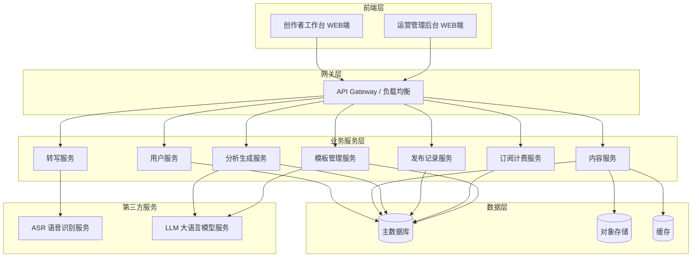

## 2.2 业务模块图

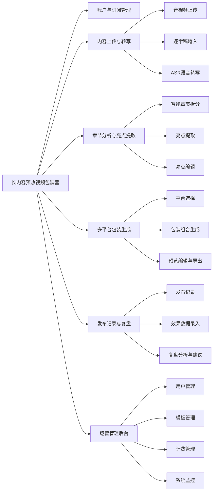

## 2.3 主业务流程

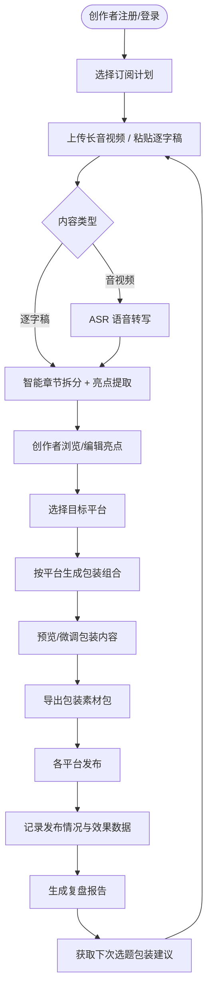

## 2.4 功能图/列表

### 创作者工作台

| 功能模块 | 功能名称 | 优先级 | 功能描述 |
| --- | --- | --- | --- |
| 账户与订阅 | 手机号注册登录 | P0 | 通过手机号+验证码完成注册与登录 |
| 账户与订阅 | 订阅计划查看 | P0 | 查看当前订阅等级、剩余处理时长、到期时间 |
| 账户与订阅 | 订阅购买/续费 | P0 | 购买月度订阅¥49/月或加量包 |
| 账户与订阅 | 用量统计 | P0 | 查看本月已用/剩余处理时长、生成次数 |
| 内容上传 | 音视频文件上传 | P0 | 支持MP3/MP4/WAV/M4A，单文件最大2GB |
| 内容上传 | 逐字稿输入 | P0 | 直接粘贴或上传TXT/DOCX格式逐字稿 |
| 内容上传 | 我的内容库 | P0 | 列表展示所有已上传内容及处理状态 |
| 转写与章节分析 | 自动语音转写 | P0 | 音视频自动转写为带时间戳的逐字稿 |
| 转写与章节分析 | 智能章节拆分 | P0 | 根据语义变化自动识别章节边界 |
| 转写与章节分析 | 章节标题生成 | P0 | 为每个章节自动生成概括性标题 |
| 亮点提取 | 章节亮点提取 | P0 | 为每章提取3-5个核心亮点 |
| 亮点提取 | 亮点编辑/补充 | P0 | 修改、删除或手动添加亮点 |
| 亮点提取 | 亮点选择 | P0 | 勾选要用于包装生成的重点亮点 |
| 多平台包装生成 | 目标平台选择 | P0 | 选择B站/小红书/抖音/微信公众号等 |
| 多平台包装生成 | 多平台批量生成 | P0 | 一次选择多平台批量生成包装组合 |
| 多平台包装生成 | 预热视频脚本生成 | P0 | 生成30-60秒预热视频脚本 |
| 多平台包装生成 | 封面标题生成 | P0 | 按平台特性生成3-5组封面标题方案 |
| 多平台包装生成 | 导语文案生成 | P0 | 按平台特性生成配套导语文案 |
| 多平台包装生成 | 包装结果预览 | P0 | 卡片形式展示每个平台的包装组合 |
| 多平台包装生成 | 包装内容微调 | P0 | 手动编辑修改生成的包装内容 |
| 多平台包装生成 | 一键导出 | P0 | 导出为Markdown/DOCX |
| 多平台包装生成 | 复制到剪贴板 | P0 | 快速复制单项内容到剪贴板 |
| 发布记录与复盘 | 新建发布记录 | P0 | 记录各平台发布时间与链接 |
| 发布记录与复盘 | 效果数据手动填写 | P0 | 录入播放量/点赞/评论/转发/收藏等 |
| 发布记录与复盘 | 发布效果汇总 | P0 | 表格/图表展示各平台效果对比 |
| 发布记录与复盘 | 复盘报告列表 | P0 | 查看所有历史复盘报告 |
| 发布记录与复盘 | 复盘报告详情 | P0 | 查看单条内容完整复盘分析 |
| 发布记录与复盘 | 微信快捷登录 | P1 | 支持微信扫码快捷登录 |
| 发布记录与复盘 | 转写结果校对 | P1 | 手动修正转写错误 |
| 发布记录与复盘 | 章节手动调整 | P1 | 手动合并、拆分或调整章节边界 |
| 发布记录与复盘 | 亮点类型标注 | P1 | 标注金句型/观点型/故事型/数据型/争议型 |
| 发布记录与复盘 | 亮点评分 | P1 | 根据传播潜力对亮点评分排序 |
| 发布记录与复盘 | 标签/话题推荐 | P1 | 推荐适合各平台的标签和话题 |
| 发布记录与复盘 | 重新生成 | P1 | 对不满意单项内容单独重新生成 |
| 发布记录与复盘 | 分平台导出 | P1 | 按单个平台分别导出 |
| 发布记录与复盘 | 发布状态跟踪 | P1 | 记录已发布/待发布/已草稿状态 |
| 发布记录与复盘 | 效果数据时间线 | P1 | 记录24h/48h/7d等关键时间节点数据 |
| 发布记录与复盘 | 包装策略分析 | P1 | 分析包装风格/选题方向与效果关联 |
| 发布记录与复盘 | 选题包装建议 | P1 | 基于历史数据反推选题方向和包装策略 |

### 运营管理后台

| 功能模块 | 功能名称 | 优先级 | 功能描述 |
| --- | --- | --- | --- |
| 用户管理 | 用户查询 | P0 | 查看所有注册用户，支持筛选 |
| 用户管理 | 用户详情 | P0 | 查看用户详细信息、订阅状态、用量 |
| 订阅管理 | 订阅记录查看 | P0 | 查看所有用户订阅/续费/加量包记录 |
| 模板管理 | 包装模板配置 | P0 | 配置各平台包装生成模板 |
| 计费管理 | 订阅套餐管理 | P0 | 配置月度订阅价格、加量包规格 |
| 计费管理 | 用量统计总览 | P0 | 查看平台整体用量 |
| 用户管理 | 手动调整订阅 | P1 | 为用户延长订阅期或调整额度 |
| 模板管理 | 模板预览与测试 | P1 | 预览模板效果，输入测试内容验证 |
| 模板管理 | 亮点提取规则 | P1 | 配置亮点提取偏好规则 |
| 系统监控 | 转写服务监控 | P1 | 监控ASR转写服务可用性与队列 |
| 系统监控 | 生成服务监控 | P1 | 监控包装生成服务可用性与响应时间 |

## 2.5 你的产品有哪些端

| 序号 | 端名称 | 端类型 | 目标用户 | 说明 |
| --- | --- | --- | --- | --- |
| 1 | 创作者工作台 | WEB端 | 内容创作者（知识付费讲师/播客主/B站小红书创作者） | 创作者在浏览器中完成内容上传、亮点分析、包装生成、发布复盘的全流程 |
| 2 | 运营管理后台 | WEB端 | 平台运营人员 | 运营在电脑上管理用户、模板、计费、监控系统状态 |

---

# 3 产品功能

## 3.1 创作者工作台 功能

### 3.1.1 账户与订阅管理

**功能描述**：提供创作者注册登录、订阅计划管理、用量查看等账户相关功能。

| 项 | 内容 |
| --- | --- |
| 优先级 | P0 |
| 依赖需求 | 无 |
| 前置条件 | 无 |

**详细流程**

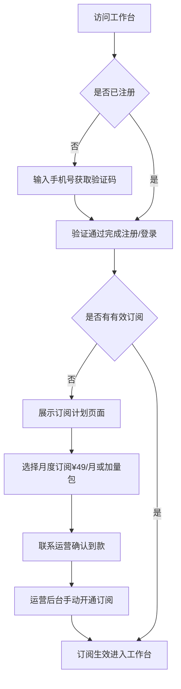

**业务规则说明**：
1. 手机号+验证码为 MVP 阶段唯一登录方式，验证码有效期 5 分钟
2. 月度订阅周期为自然月，到期后进入只读模式（可查看历史数据，不可新建任务）
3. 加量包在月度订阅基础上叠加，不改变订阅到期时间
4. 用量按处理时长（音视频时长）计算，逐字稿按等效时长计算（1万字≈10分钟）

**验收标准**：
- [ ] 正常流程：新手机号 60 秒内收到验证码，验证后 3 秒内完成注册并跳转
- [ ] 正常流程：已注册用户可直接登录，进入工作台首页
- [ ] 正常流程：订阅生效后立即可用，用量实时更新
- [ ] 异常流程：验证码错误时给出明确提示，不跳转
- [ ] 异常流程：订阅到期后新建任务时提示续费

### 3.1.2 内容上传与管理

**功能描述**：支持创作者上传音视频文件或输入逐字稿，管理所有内容记录。

| 项 | 内容 |
| --- | --- |
| 优先级 | P0 |
| 依赖需求 | 账户与订阅管理 |
| 前置条件 | 用户已登录且有有效订阅 |

**详细流程**

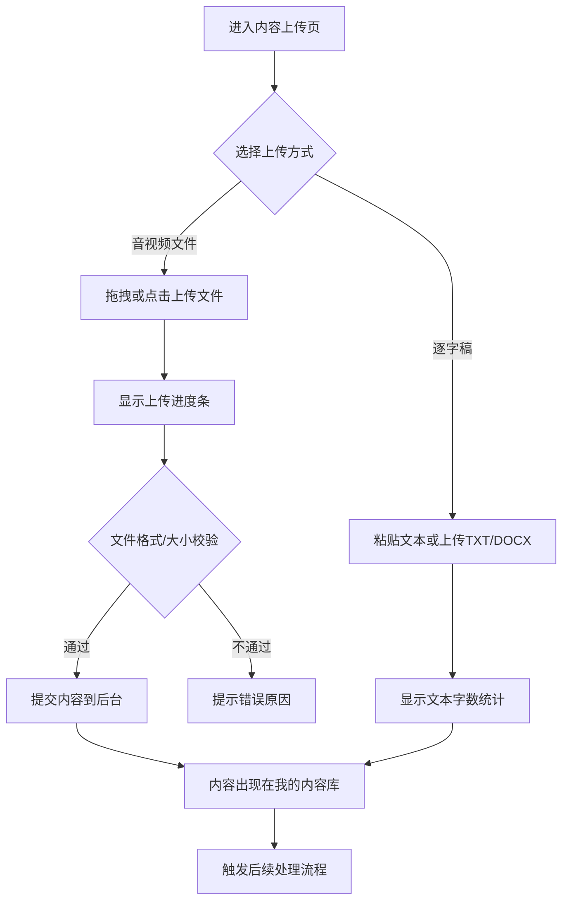

**业务规则说明**：
1. 支持格式：MP3/MP4/WAV/M4A（音视频）、TXT/DOCX（逐字稿）
2. 单文件最大 2GB，超出时提示"文件大小超过限制"
3. 上传过程中断网时，已上传部分不保留，需重新上传
4. 内容库按上传时间倒序排列，支持按标题搜索
5. 删除内容时同步删除关联的转写稿、章节、亮点、包装内容、发布记录

**验收标准**：
- [ ] 正常流程：1GB 文件在良好网络下 3 分钟内上传完成
- [ ] 正常流程：上传完成后 5 秒内自动触发转写/分析
- [ ] 正常流程：内容库列表加载时间不超过 2 秒
- [ ] 异常流程：上传不支持格式时立即提示，不消耗上传带宽
- [ ] 异常流程：超过 2GB 限制时提示，不开始上传

### 3.1.3 转写与章节分析

**功能描述**：将上传的音视频自动转写为逐字稿，并按语义拆分为章节，生成章节标题。

| 项 | 内容 |
| --- | --- |
| 优先级 | P0 |
| 依赖需求 | 内容上传与管理 |
| 前置条件 | 内容已上传成功 |

**详细流程**

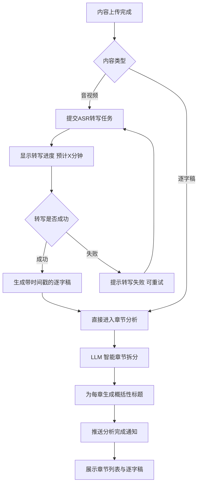

**业务规则说明**：
1. 转写结果包含时间戳，精度到句子级别
2. 章节拆分基于语义变化自动识别，不依赖固定时长
3. 每章标题不超过 20 字，概括该章核心内容
4. 转写失败时自动重试 1 次，仍失败则通知用户手动重试
5. 10 万字以内逐字稿的章节分析不超过 3 分钟

**验收标准**：
- [ ] 正常流程：1 小时音视频转写 10 分钟内完成
- [ ] 正常流程：章节拆分结果包含章节标题、时间范围、文本内容
- [ ] 正常流程：分析完成后通过 WebSocket 实时推送通知
- [ ] 异常流程：转写失败后显示"重试"按钮，点击后重新提交任务
- [ ] 异常流程：ASR 服务不可用时提示"服务暂时不可用，请稍后重试"

### 3.1.4 亮点提取与编辑

**功能描述**：从每个章节中提取核心亮点，支持创作者编辑、补充和选择重点亮点。

| 项 | 内容 |
| --- | --- |
| 优先级 | P0 |
| 依赖需求 | 转写与章节分析 |
| 前置条件 | 章节分析已完成 |

**详细流程**

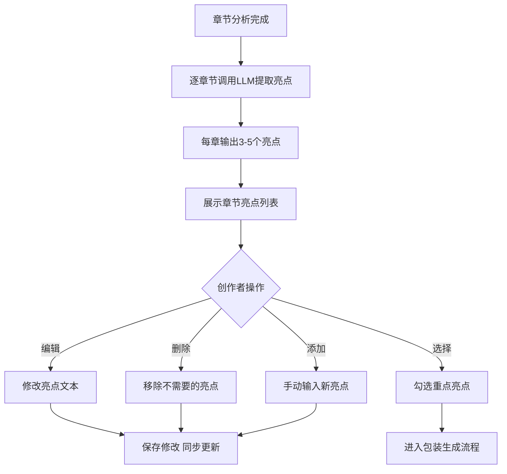

**业务规则说明**：
1. 每个亮点包含：亮点文本（原文摘录或概括）、所在章节、亮点位置（时间戳或段落位置）
2. 亮点类型分为：金句型、观点型、故事型、数据型、争议型（P1 阶段支持自动标注）
3. 修改亮点后，如已生成过包装内容，标记相关包装为"需重新生成"
4. 至少选择 1 个亮点才能进入包装生成流程

**验收标准**：
- [ ] 正常流程：亮点提取结果在章节分析完成后 3 分钟内展示
- [ ] 正常流程：编辑亮点后实时保存，不丢失修改
- [ ] 正常流程：选中的亮点以高亮样式区分
- [ ] 异常流程：未选择亮点时点击"生成包装"提示"请至少选择一个亮点"

### 3.1.5 多平台包装生成

**功能描述**：根据选中的亮点和目标平台，自动生成预热视频脚本、封面标题、导语文案组合包。

| 项 | 内容 |
| --- | --- |
| 优先级 | P0 |
| 依赖需求 | 亮点提取与编辑 |
| 前置条件 | 已选择至少 1 个亮点 |

**详细流程**

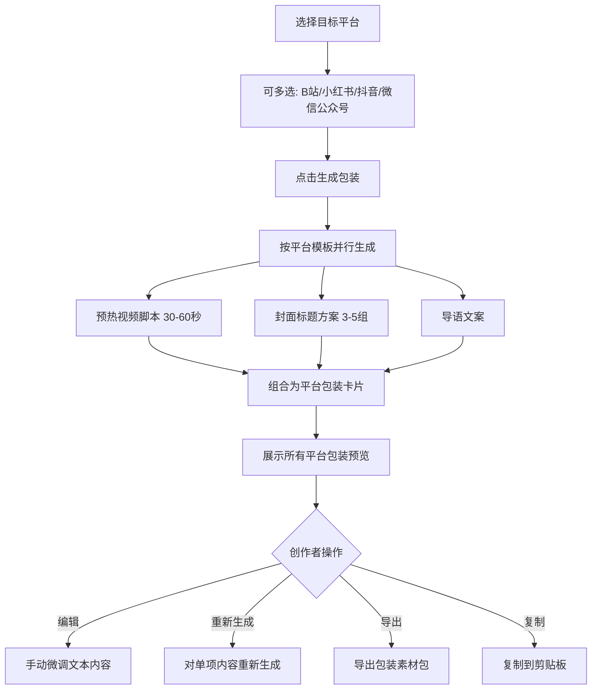

**业务规则说明**：
1. 各平台包装特性：
   - B站：标题含悬念/干货关键词，简介详实含时间线，标签覆盖垂直领域
   - 小红书：标题含 emoji + 数字，正文口语化 + 分段短句，标签含热门话题
   - 抖音：标题短而有冲击力（≤20字），脚本侧重视觉冲击 + 快节奏，标签含热门挑战
   - 微信公众号：标题引发好奇心，导语文案适合朋友圈转发，摘要 120 字以内
2. 预热视频脚本包含：画面描述、旁白文案、字幕建议三部分
3. 单平台生成时间不超过 30 秒
4. 导出格式支持 Markdown 和 DOCX

**验收标准**：
- [ ] 正常流程：单平台包装组合 30 秒内生成完成
- [ ] 正常流程：多平台批量生成时显示各平台进度
- [ ] 正常流程：导出的文档包含所有平台的完整包装内容
- [ ] 正常流程：复制到剪贴板后格式保持正确
- [ ] 异常流程：生成失败时显示"重新生成"按钮，不丢失已成功的平台结果

### 3.1.6 发布记录与复盘

**功能描述**：记录各平台发布情况与效果数据，生成复盘分析报告，反推选题包装建议。

| 项 | 内容 |
| --- | --- |
| 优先级 | P0 |
| 依赖需求 | 多平台包装生成 |
| 前置条件 | 包装内容已导出并发布 |

**详细流程**

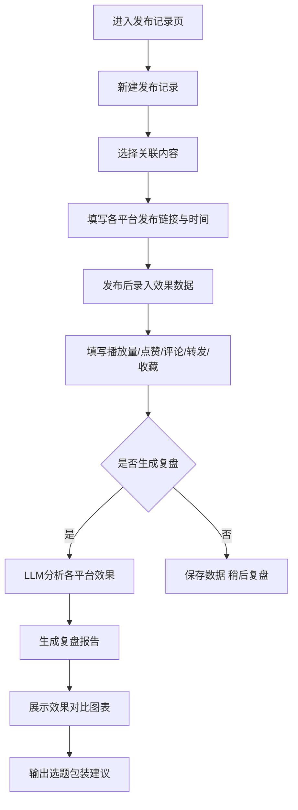

**业务规则说明**：
1. 效果数据字段：播放量、点赞数、评论数、转发数、收藏数（按平台特性显示适用字段）
2. 复盘报告包含：各平台数据对比、包装风格效果分析、选题方向建议
3. 选题建议基于至少 3 条历史发布记录生成
4. 复盘报告生成后不可修改，但可追加新的效果数据后重新生成

**验收标准**：
- [ ] 正常流程：发布效果汇总表格正确展示各平台数据
- [ ] 正常流程：复盘报告在 30 秒内生成
- [ ] 正常流程：选题建议内容与历史数据存在合理关联
- [ ] 异常流程：历史数据不足 3 条时提示"至少需要 3 条发布记录才能生成选题建议"

---

## 3.2 运营管理后台 功能

### 3.2.1 用户管理

**功能描述**：查看所有注册用户信息、订阅状态、使用情况。

| 项 | 内容 |
| --- | --- |
| 优先级 | P0 |
| 依赖需求 | 无 |
| 前置条件 | 运营人员已登录后台 |

**详细流程**

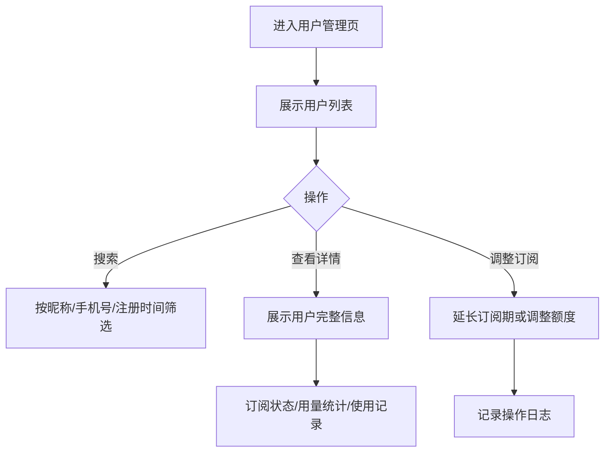

**验收标准**：
- [ ] 正常流程：用户列表支持分页，每页 20 条
- [ ] 正常流程：搜索结果在 1 秒内返回
- [ ] 正常流程：手动调整订阅后用户侧实时生效

### 3.2.2 模板管理

**功能描述**：配置各平台包装生成模板，控制生成内容的风格和质量。

| 项 | 内容 |
| --- | --- |
| 优先级 | P0 |
| 依赖需求 | 无 |
| 前置条件 | 运营人员已登录后台 |

**详细流程**

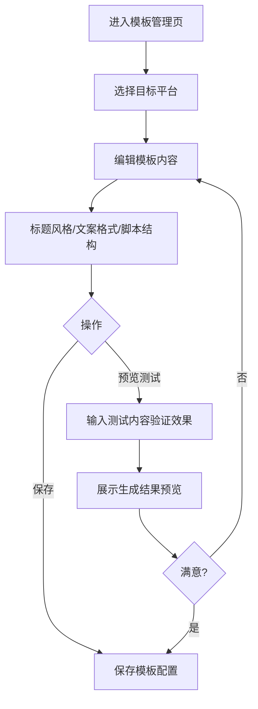

**验收标准**：
- [ ] 正常流程：模板保存后立即影响新包装生成任务
- [ ] 正常流程：预览测试在 30 秒内返回结果
- [ ] 异常流程：模板格式错误时提示具体错误位置

### 3.2.3 计费管理

**功能描述**：配置订阅套餐、查看平台整体用量。

| 项 | 内容 |
| --- | --- |
| 优先级 | P0 |
| 依赖需求 | 无 |
| 前置条件 | 运营人员已登录后台 |

**详细流程**

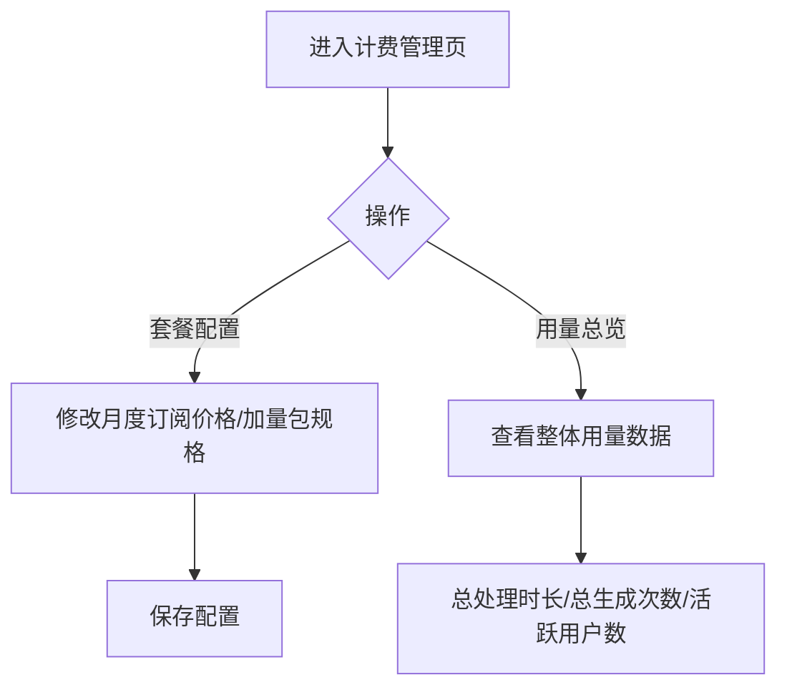

**验收标准**：
- [ ] 正常流程：套餐价格修改后对新购用户生效，已购用户不受影响
- [ ] 正常流程：用量统计数据延迟不超过 5 分钟

### 3.2.4 系统监控

**功能描述**：监控 ASR 转写服务和包装生成服务的可用性与性能。

| 项 | 内容 |
| --- | --- |
| 优先级 | P1 |
| 依赖需求 | 无 |
| 前置条件 | 运营人员已登录后台 |

**详细流程**

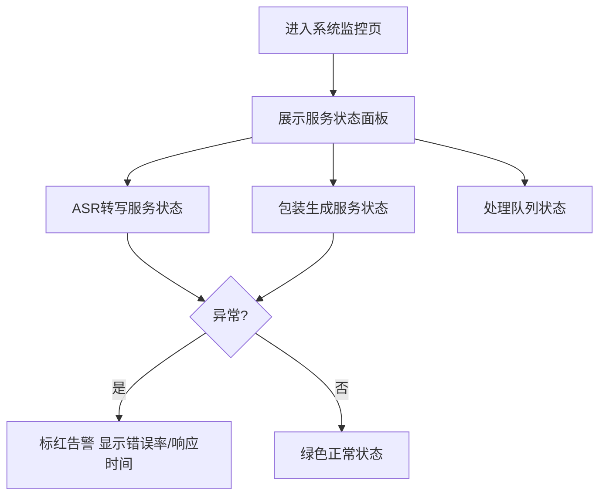

**验收标准**：
- [ ] 正常流程：服务状态面板每 30 秒自动刷新
- [ ] 正常流程：服务异常时 1 分钟内触发告警展示
- [ ] 异常流程：监控接口超时不影响其他后台功能

---

# 4 产品原型

## 4.1 页面跳转逻辑图

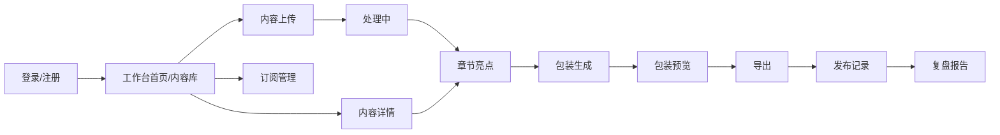

## 4.2 全站点原型设计

### 4.2.1 创作者工作台

**页面清单：**

| 序号 | 页面名称 | 所属模块 | 页面描述 | 关键元素 |
| --- | --- | --- | --- | --- |
| 1 | 登录页 | 账户与订阅 | 手机号+验证码登录 | 手机号输入框、验证码输入框、获取验证码按钮、登录按钮 |
| 2 | 工作台首页 | 总览 | 展示用量概览、最近内容、快捷操作 | 用量卡片、最近内容列表、快速上传入口 |
| 3 | 内容上传页 | 内容上传 | 上传音视频或输入逐字稿 | 拖拽上传区域、文件选择器、逐字稿输入框、格式提示 |
| 4 | 我的内容库 | 内容管理 | 所有内容的列表视图 | 搜索栏、内容卡片列表、状态标签、操作按钮 |
| 5 | 内容详情页 | 内容管理 | 展示逐字稿、章节、亮点 | 逐字稿区域（带时间戳）、章节列表、亮点标注 |
| 6 | 章节亮点页 | 转写与分析 | 章节拆分结果与亮点编辑 | 章节导航、逐字稿高亮、亮点卡片、编辑按钮 |
| 7 | 包装生成页 | 多平台包装 | 选择平台和亮点后生成包装 | 平台选择器、亮点勾选、生成按钮、进度指示 |
| 8 | 包装预览页 | 多平台包装 | 预览各平台包装组合 | 平台Tab切换、脚本卡片、标题方案、文案预览、编辑/导出按钮 |
| 9 | 发布记录页 | 发布复盘 | 记录各平台发布情况 | 发布记录列表、平台图标、状态标签、新建按钮 |
| 10 | 复盘报告页 | 发布复盘 | 展示效果数据与建议 | 数据对比图表、平台对比表格、选题建议卡片 |
| 11 | 订阅管理页 | 账户与订阅 | 查看订阅、购买加量包 | 当前订阅信息、用量进度条、套餐卡片、购买按钮 |

**交互说明：**
- 页面跳转关系：

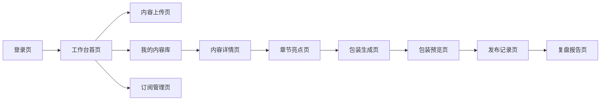

- 特殊交互：
  1. 上传区域支持拖拽文件进入，拖入时高亮边框
  2. 处理中状态（转写/分析/生成）显示进度条和预估剩余时间
  3. 包装预览页通过 Tab 切换不同平台结果，切换时保留编辑状态
  4. 空状态引导：内容库为空时显示"上传你的第一个音视频开始体验"
  5. 异常状态：转写/分析失败时显示红色状态标签和"重试"按钮

**产品原型：**

[🖥️ 打开创作者工作台全站点原型](assets/prototypes/creator-workspace-prototype.html)

### 4.2.2 运营管理后台

**页面清单：**

| 序号 | 页面名称 | 所属模块 | 页面描述 | 关键元素 |
| --- | --- | --- | --- | --- |
| 1 | 后台登录页 | 账户 | 运营人员登录 | 账号密码输入、登录按钮 |
| 2 | 仪表盘 | 总览 | 平台运营数据总览 | 用户数卡片、用量统计、收入概览、趋势图表 |
| 3 | 用户管理页 | 用户管理 | 用户列表与详情 | 搜索栏、用户表格、筛选条件、操作按钮 |
| 4 | 订阅管理页 | 订阅管理 | 订阅记录与调整 | 订阅列表、状态筛选、手动调整面板 |
| 5 | 模板管理页 | 模板管理 | 包装模板配置 | 平台选择器、模板编辑器、预览测试区域 |
| 6 | 计费管理页 | 计费管理 | 套餐配置与用量 | 套餐编辑表单、用量统计图表 |
| 7 | 系统监控页 | 系统监控 | 服务状态监控 | 服务状态面板、队列状态、告警列表 |

**交互说明：**
- 页面跳转关系：

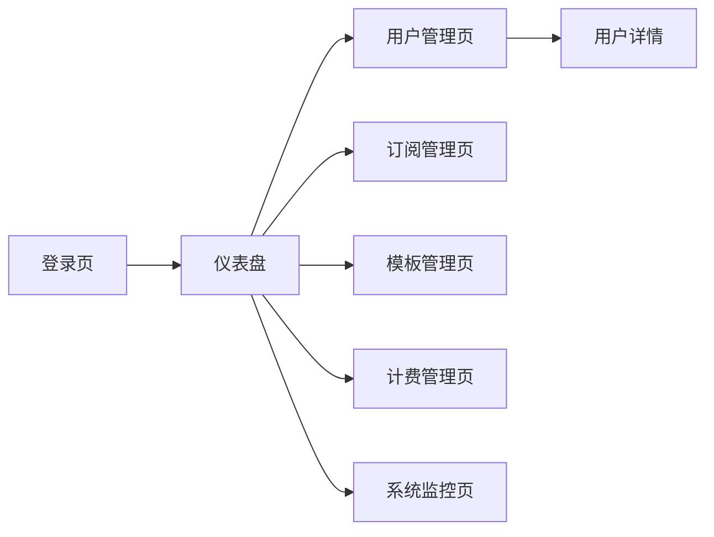

- 特殊交互：
  1. 侧边栏导航固定，点击切换主内容区
  2. 表格支持排序、分页、筛选
  3. 模板编辑支持实时预览
  4. 系统监控数据 30 秒自动刷新

**产品原型：**

[🖥️ 打开运营管理后台全站点原型](assets/prototypes/admin-backend-prototype.html)

---

# 5 数据需求

## 5.1 数据使用规格

### 用户表

| **字段** | **是否必填** | **描述** | **数据类型** |
| --- | --- | --- | --- |
| id | 是 | 用户唯一标识 | UUID |
| phone | 是 | 手机号 | 字符串 |
| nickname | 否 | 昵称 | 字符串 |
| avatar_url | 否 | 头像地址 | 字符串 |
| created_at | 是 | 注册时间 | 时间戳 |
| status | 是 | 账户状态（正常/禁用） | 枚举 |

### 内容表

| **字段** | **是否必填** | **描述** | **数据类型** |
| --- | --- | --- | --- |
| id | 是 | 内容唯一标识 | UUID |
| user_id | 是 | 所属用户 | UUID |
| title | 否 | 内容标题 | 字符串 |
| content_type | 是 | 类型（音视频/逐字稿） | 枚举 |
| file_url | 否 | 文件存储地址 | 字符串 |
| file_size | 否 | 文件大小（字节） | 数字 |
| duration | 否 | 时长（秒） | 数字 |
| status | 是 | 处理状态 | 枚举 |
| transcript | 否 | 逐字稿文本 | 文本 |
| created_at | 是 | 上传时间 | 时间戳 |

### 章节表

| **字段** | **是否必填** | **描述** | **数据类型** |
| --- | --- | --- | --- |
| id | 是 | 章节唯一标识 | UUID |
| content_id | 是 | 所属内容 | UUID |
| title | 是 | 章节标题 | 字符串 |
| start_time | 否 | 起始时间（秒） | 数字 |
| end_time | 否 | 结束时间（秒） | 数字 |
| text | 是 | 章节文本内容 | 文本 |
| sort_order | 是 | 排序序号 | 数字 |

### 亮点表

| **字段** | **是否必填** | **描述** | **数据类型** |
| --- | --- | --- | --- |
| id | 是 | 亮点唯一标识 | UUID |
| chapter_id | 是 | 所属章节 | UUID |
| text | 是 | 亮点内容 | 文本 |
| type | 否 | 亮点类型 | 枚举 |
| score | 否 | 传播潜力评分 | 数字 |
| selected | 是 | 是否被选中用于包装 | 布尔 |

### 包装记录表

| **字段** | **是否必填** | **描述** | **数据类型** |
| --- | --- | --- | --- |
| id | 是 | 记录唯一标识 | UUID |
| content_id | 是 | 所属内容 | UUID |
| platform | 是 | 目标平台 | 枚举 |
| script | 否 | 预热视频脚本 | 文本 |
| titles | 否 | 封面标题方案（JSON数组） | JSON |
| description | 否 | 导语文案 | 文本 |
| tags | 否 | 推荐标签（JSON数组） | JSON |
| created_at | 是 | 生成时间 | 时间戳 |

### 发布记录表

| **字段** | **是否必填** | **描述** | **数据类型** |
| --- | --- | --- | --- |
| id | 是 | 记录唯一标识 | UUID |
| content_id | 是 | 所属内容 | UUID |
| platform | 是 | 发布平台 | 枚举 |
| publish_url | 否 | 发布链接 | 字符串 |
| publish_time | 否 | 发布时间 | 时间戳 |
| status | 是 | 发布状态 | 枚举 |
| views | 否 | 播放量 | 数字 |
| likes | 否 | 点赞数 | 数字 |
| comments | 否 | 评论数 | 数字 |
| shares | 否 | 转发数 | 数字 |
| favorites | 否 | 收藏数 | 数字 |

### 订阅表

| **字段** | **是否必填** | **描述** | **数据类型** |
| --- | --- | --- | --- |
| id | 是 | 记录唯一标识 | UUID |
| user_id | 是 | 所属用户 | UUID |
| plan_type | 是 | 套餐类型（月度/加量包） | 枚举 |
| start_date | 是 | 生效日期 | 日期 |
| end_date | 否 | 到期日期 | 日期 |
| quota_minutes | 是 | 额度（分钟） | 数字 |
| used_minutes | 是 | 已用额度 | 数字 |
| status | 是 | 状态（有效/已过期/已用完） | 枚举 |

## 5.2 统计数据

1. 统计每位创作者的月度处理时长、生成次数、发布数量（P0）
2. 统计各平台发布效果的平均值、最高值（P0）
3. 统计平台整体活跃用户数、新增用户数、收入（P0）
4. 统计各模板的使用频率与用户满意度（P1）

## 5.3 埋点需求

| 页面 | 事件 | 采集字段 | 说明 |
| --- | --- | --- | --- |
| 内容上传页 | 上传开始 | user_id, file_type, file_size | 统计上传频率与文件特征 |
| 内容上传页 | 上传完成 | user_id, file_id, duration | 统计上传成功率与耗时 |
| 章节亮点页 | 亮点编辑 | user_id, content_id, action_type | 统计亮点编辑行为 |
| 包装生成页 | 生成请求 | user_id, platforms[], highlights_count | 统计平台偏好与亮点使用 |
| 包装预览页 | 内容编辑 | user_id, platform, field_type | 统计哪些字段常被修改 |
| 包装预览页 | 导出操作 | user_id, export_format, platforms[] | 统计导出偏好 |
| 发布记录页 | 数据录入 | user_id, platform, data_fields[] | 统计数据录入习惯 |
| 复盘报告页 | 查看报告 | user_id, report_id | 统计复盘使用频率 |

---

# 6 非功能需求

## 6.1 性能需求

**6.1.1 延迟**

| 编号 | 项目 | 最大延迟 | 平均延迟 | 优先级 | 备注 |
| --- | --- | --- | --- | --- | --- |
| 0001 | 页面首屏加载 | <2 秒 | <1 秒 | P0 | 主要页面 |
| 0002 | 内容列表加载 | <2 秒 | <1 秒 | P0 | |
| 0003 | 包装组合生成 | <30 秒 | <15 秒 | P0 | 单平台 |
| 0004 | 章节分析（10万字） | <3 分钟 | <2 分钟 | P0 | |
| 0005 | 语音转写（1小时） | <10 分钟 | <7 分钟 | P0 | |

**6.1.2 吞吐量**

| 编号 | 项 | 吞吐量 | 备注 |
| --- | --- | --- | --- |
| 0001 | 并发转写任务 | 每分钟 20 个 | MVP阶段 |
| 0002 | 并发包装生成 | 每分钟 100 个 | |
| 0003 | 文件上传 | 每分钟 50 个 | |

**6.1.3 容量**

| 编号 | 项 | 容量 | 备注 |
| --- | --- | --- | --- |
| 0001 | MVP 并发用户 | 100 | |
| 0002 | 单用户内容存储 | 100 条 | |
| 0003 | 单文件最大 | 2 GB | |

## 6.2 安全需求

| 编号 | 项（系统数据 / 处理过程） |
| --- | --- |
| 0001 | 用户密码/验证码传输必须使用 HTTPS 加密 |
| 0002 | 用户上传的音视频和逐字稿数据加密存储，不对外公开 |
| 0003 | 用户上传内容需经过基本的内容安全检测，禁止违法不良信息 |
| 0004 | API 接口使用 JWT Token 认证，Token 有效期 24 小时 |
| 0005 | 运营后台操作需记录操作日志，保留 90 天 |

## 6.3 可靠性

| 编号 | 项 | 值 |
| --- | --- | --- |
| 0001 | 服务可用性 | 99.5%（MVP阶段） |
| 0002 | 平均故障恢复时间 | <30 分钟 |
| 0003 | 数据备份频率 | 每日全量 + 每小时增量 |

## 6.4 可连续性

| 编号 | 项 |
| --- | --- |
| Modi.1 | 系统 7×24 全天候运行 |
| Modi.2 | ASR/LLM 第三方服务不可用时，已完成的转写/分析结果不受影响，新任务进入等待队列 |

## 6.5 可恢复性

| 编号 | 项 |
| --- | --- |
| Modi.1 | 数据库每日全量备份，保留 30 天 |
| Modi.2 | 用户上传文件在对象存储中保留，删除操作软删除（30天后彻底清除） |
| Modi.3 | 重大故障 1-3 小时内恢复服务，24 小时内恢复数据 |

## 6.6 兼容性

| 编号 | 要求 | 备注 |
| --- | --- | --- |
| 0001 | Chrome >=90 | P0 |
| 0002 | Firefox >=90 | P0 |
| 0003 | Safari >=15 | P0 |
| 0004 | Edge >=90 | P0 |
| 0005 | 桌面端优先，最小宽度 1280px | P0 |
| 0006 | 兼容平板横屏模式（1024px） | P1 |

## 6.7 易用性

| 编号 | 要求 | 备注 |
| --- | --- | --- |
| 0001 | 核心操作路径不超过 3 步（上传→分析→生成包装） | |
| 0002 | 普通用户无需培训即可使用核心功能 | |
| 0003 | 长时间任务必须显示进度条和预估时间 | |
| 0004 | 所有列表页提供引导性空状态 | |

---

# 7 总结

## 7.1 上线计划

| 阶段 | 时间 | 内容 | 负责人 |
| --- | --- | --- | --- |
| 开发阶段 | 第1-2周 | 核心链路开发（转写接入、模板化生成、发布记录表） | 开发团队 |
| 测试阶段 | 第3周 | 功能测试、性能测试、安全测试 | 测试团队 |
| 灰度阶段 | 第4周 | 灰度 10% 用户（约 10 人），验证稳定性 | 运营团队 |
| 全量上线 | 第5周 | 全量开放 | 全团队 |

## 7.2 后续迭代规划

- V1.1：微信快捷登录、亮点自动类型标注与评分、发布状态自动跟踪
- V1.2：效果数据时间线（24h/48h/7d）、包装策略深度分析
- V1.3：选题包装智能建议、标签/话题自动推荐、分平台导出
- V2.0：在线支付对接、移动端适配、API 开放接口

## 7.3 参考文档

- 长内容预热视频包装器V1.0-URS.md — 用户需求规格说明书
- 创作者工作台全站点原型 — assets/prototypes/creator-workspace-prototype.html
- 运营管理后台全站点原型 — assets/prototypes/admin-backend-prototype.html
