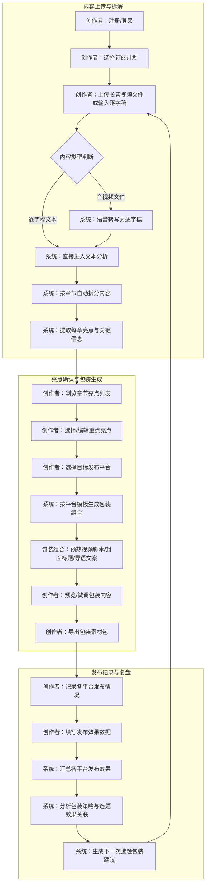
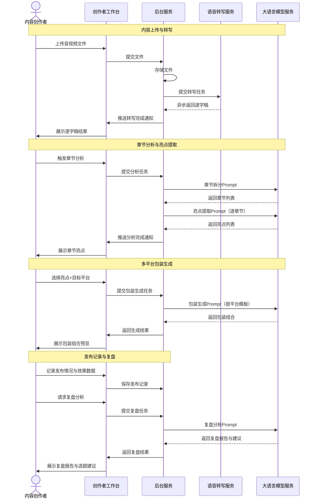
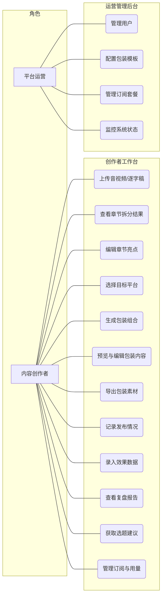
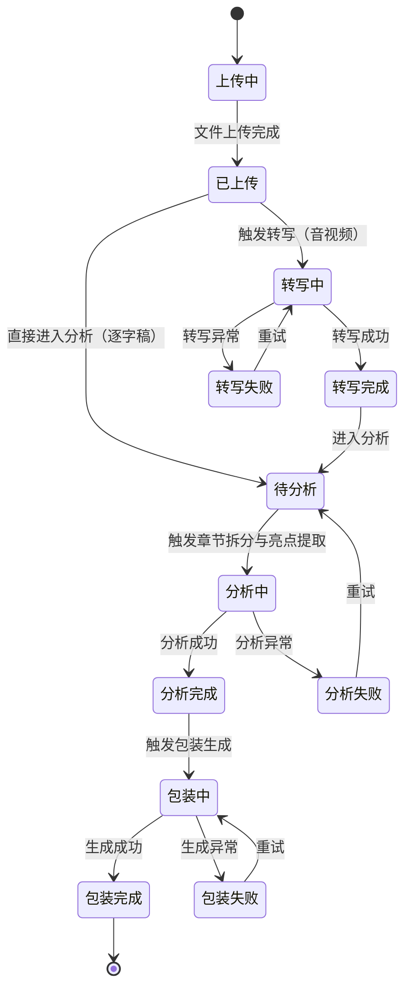
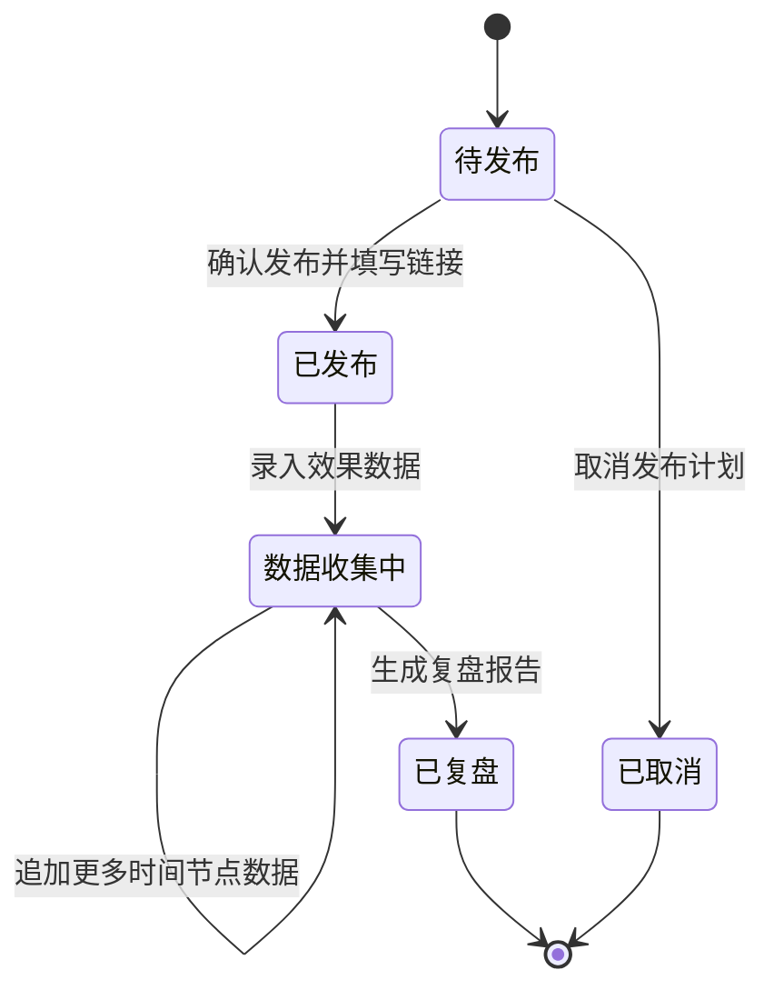

# 长内容预热视频包装器V1.0 - 用户需求规格说明书

# 1.需求概述

## 1.1 需求介绍

长内容预热视频包装器是一款面向内容创作者的SaaS工具，专注于长音视频内容在发布前的"包装与复盘"环节。创作者上传一段长音视频或逐字稿后，系统自动提取章节亮点，按目标平台（B站、小红书、抖音、微信公众号等）生成"预热短视频脚本/封面标题/导语文案"组合包，并记录各平台发布效果数据，反推下一次选题包装建议。本产品避开通用剪辑工具的红海竞争，聚焦"发布前最后一公里的包装效率"，帮助长内容创作者以更低成本完成多平台分发预热。

### 1.1.1 所属领域

内容创作工具、数字营销SaaS、知识付费辅助工具

## 1.2 需求目标

- 为内容创作者提供"上传即分析"的一站式内容拆解体验，将长音视频/逐字稿自动拆分为章节并提取每章亮点
- 为创作者按目标平台特性自动生成预热包装组合（短视频脚本、封面标题、导语文案），省去逐平台手动改编的重复劳动
- 为创作者建立发布效果记录与复盘机制，通过数据积累反推选题与包装策略优化
- 为平台运营方提供模板管理、用户管理、订阅计费的后台运营能力
- MVP阶段在1-2周内完成核心链路（转写接入、模板化生成、发布记录表），验证产品价值

## 1.3 系统使用角色

本平台主要服务于两类用户角色：

1. **内容创作者**：知识付费讲师、播客主、B站/小红书/抖音内容创作者。负责上传长内容、获取亮点分析、生成多平台包装素材、记录发布效果并进行复盘
2. **平台运营方**：负责包装模板管理、平台规则配置、用户订阅管理、用量监控与计费

## 1.4 业务流程图

# 2.功能原型

| 原型名称 | 原型链接 | 对应端 | 备注 |
| --- | --- | --- | --- |
| 创作者工作台 | 待设计 | WEB端 | V1.0 MVP |
| 运营管理后台 | 待设计 | WEB端 | V1.0 MVP |

# 3.需求清单

## 3.1 创作者工作台-WEB端

| 序号 | 功能模块 | 一级功能 | 二级功能 | 功能描述 | 优先级 | 备注 |
| --- | --- | --- | --- | --- | --- | --- |
| 1 | 账户与订阅 | 注册/登录 | 手机号注册登录 | 通过手机号+验证码完成注册与登录 | P0 | |
| 2 | | | 微信快捷登录 | 支持微信扫码快捷登录 | P1 | MVP后可迭代 |
| 3 | | 订阅管理 | 订阅计划查看 | 查看当前订阅等级、剩余处理时长、到期时间 | P0 | |
| 4 | | | 订阅购买/续费 | 购买月度订阅（¥49/月）或加量包（按处理时长计费） | P0 | |
| 5 | | | 用量统计 | 查看本月已用/剩余处理时长、生成次数 | P0 | |
| 6 | | 个人信息 | 个人资料管理 | 管理昵称、头像、联系方式等基本信息 | P1 | |
| 7 | 内容上传 | 文件上传 | 音视频文件上传 | 支持上传MP3/MP4/WAV/M4A等格式音视频文件，单文件最大2GB | P0 | |
| 8 | | | 逐字稿输入 | 支持直接粘贴或上传TXT/DOCX格式的逐字稿文本 | P0 | |
| 9 | | | 上传进度展示 | 显示文件上传进度、预计处理时间 | P0 | |
| 10 | | 内容管理 | 我的内容库 | 以列表形式展示所有已上传内容，包含标题、上传时间、处理状态、时长 | P0 | |
| 11 | | | 内容详情查看 | 查看某条内容的完整逐字稿、章节拆分结果、亮点标注 | P0 | |
| 12 | | | 内容删除 | 删除不需要的内容记录及其关联数据 | P1 | |
| 13 | 转写与章节分析 | 语音转写 | 自动语音转写 | 将上传的音视频文件自动转写为带时间戳的逐字稿 | P0 | 接入第三方ASR服务 |
| 14 | | | 转写结果校对 | 创作者可手动修正转写错误，修正后同步更新后续分析结果 | P1 | |
| 15 | | 章节拆分 | 智能章节拆分 | 根据内容语义变化自动识别章节边界，将长内容拆分为多个章节 | P0 | |
| 16 | | | 章节手动调整 | 创作者可手动合并、拆分或调整章节边界 | P1 | |
| 17 | | | 章节标题生成 | 为每个章节自动生成概括性标题 | P0 | |
| 18 | 亮点提取 | 亮点分析 | 章节亮点提取 | 为每个章节提取3-5个核心亮点（金句、关键观点、有趣片段） | P0 | |
| 19 | | | 亮点类型标注 | 标注亮点类型：金句型、观点型、故事型、数据型、争议型 | P1 | |
| 20 | | | 亮点评分 | 系统根据传播潜力对亮点进行评分排序 | P1 | |
| 21 | | 亮点编辑 | 亮点编辑/补充 | 创作者可修改、删除或手动添加亮点 | P0 | |
| 22 | | | 亮点选择 | 创作者勾选要用于包装生成的重点亮点 | P0 | |
| 23 | 多平台包装生成 | 平台选择 | 目标平台选择 | 选择要生成包装的目标平台（B站、小红书、抖音、微信公众号等） | P0 | |
| 24 | | | 多平台批量生成 | 一次选择多个平台，批量生成各平台对应的包装组合 | P0 | |
| 25 | | 包装内容生成 | 预热视频脚本生成 | 根据选中亮点和目标平台风格，生成30-60秒预热视频脚本（含画面描述、旁白文案、字幕建议） | P0 | 核心功能 |
| 26 | | | 封面标题生成 | 按平台特性生成3-5组封面标题方案（含主标题、副标题、封面文案建议） | P0 | |
| 27 | | | 导语文案生成 | 按平台特性生成配套导语文案（如B站简介、小红书正文、朋友圈文案等） | P0 | |
| 28 | | | 标签/话题推荐 | 根据内容主题推荐适合各平台的标签和话题 | P1 | |
| 29 | | 包装预览与编辑 | 包装结果预览 | 以卡片形式展示每个平台的完整包装组合（脚本+标题+文案） | P0 | |
| 30 | | | 包装内容微调 | 创作者可手动编辑修改生成的包装内容 | P0 | |
| 31 | | | 重新生成 | 对不满意的单项内容（标题/文案/脚本）可单独重新生成 | P1 | |
| 32 | | 素材导出 | 一键导出 | 将所有包装内容导出为结构化文本（Markdown/DOCX） | P0 | |
| 33 | | | 分平台导出 | 按单个平台分别导出包装内容 | P1 | |
| 34 | | | 复制到剪贴板 | 快速复制单项内容到剪贴板 | P0 | |
| 35 | 发布记录与复盘 | 发布记录 | 新建发布记录 | 为每条包装内容记录在各平台的发布时间、链接 | P0 | |
| 36 | | | 发布状态跟踪 | 记录各平台发布状态（已发布/待发布/已草稿） | P1 | |
| 37 | | 效果数据录入 | 效果数据手动填写 | 手动录入各平台发布后的效果数据（播放量、点赞、评论、转发、收藏等） | P0 | |
| 38 | | | 效果数据时间线 | 记录发布后24h/48h/7d等关键时间节点的数据 | P1 | |
| 39 | | 复盘分析 | 发布效果汇总 | 以表格/图表展示各平台发布效果对比 | P0 | |
| 40 | | | 包装策略分析 | 分析不同包装风格/选题方向与发布效果的关联 | P1 | |
| 41 | | | 选题包装建议 | 基于历史数据反推下一次选题方向和包装策略建议 | P1 | 核心差异化 |
| 42 | | 历史记录 | 复盘报告列表 | 查看所有历史复盘报告，按时间排序 | P0 | |
| 43 | | | 复盘报告详情 | 查看单条内容的完整复盘分析（含各平台数据、策略分析） | P0 | |

## 3.2 运营管理后台-WEB端

| 序号 | 功能模块 | 一级功能 | 二级功能 | 功能描述 | 优先级 | 备注 |
| --- | --- | --- | --- | --- | --- | --- |
| 1 | 用户管理 | 用户列表 | 用户查询 | 查看所有注册用户列表，支持按昵称、手机号、注册时间筛选 | P0 | |
| 2 | | | 用户详情 | 查看用户详细信息、订阅状态、用量统计、使用记录 | P0 | |
| 3 | | 订阅管理 | 订阅记录查看 | 查看所有用户的订阅记录、续费记录、加量包购买记录 | P0 | |
| 4 | | | 手动调整订阅 | 运营可手动为用户延长订阅期或调整额度 | P1 | |
| 5 | 模板管理 | 平台模板 | 包装模板配置 | 配置各平台的包装生成模板（标题风格、文案格式、脚本结构等） | P0 | |
| 6 | | | 模板预览与测试 | 预览模板效果，输入测试内容验证生成质量 | P1 | |
| 7 | | 亮点模板 | 亮点提取规则 | 配置亮点提取的偏好规则（偏金句/偏观点/偏故事等） | P1 | |
| 8 | 计费管理 | 套餐配置 | 订阅套餐管理 | 配置月度订阅价格、加量包规格与价格 | P0 | |
| 9 | | | 用量统计总览 | 查看平台整体用量（总处理时长、总生成次数、活跃用户数） | P0 | |
| 10 | 系统监控 | 服务状态 | 转写服务监控 | 监控ASR转写服务的可用性与处理队列状态 | P1 | |
| 11 | | | 生成服务监控 | 监控包装内容生成服务的可用性与响应时间 | P1 | |

# 4.非功能需求

## 4.1 使用界面需求

| 需求项 | 详细描述 | 备注 |
| --- | --- | --- |
| 设计风格 | 简洁、专业、高效，降低创作者学习成本，突出内容本身 | P0 |
| 主色调 | 以深蓝/紫为主色调，体现内容创作的专业感与创造力 | P1 |
| 响应式设计 | 优先适配桌面端（1280px及以上），兼容平板横屏模式 | P0 |
| 上传体验 | 支持拖拽上传，上传过程有明确进度反馈 | P0 |
| 加载体验 | 长时间处理任务（转写、分析、生成）需提供进度条和预估时间 | P0 |
| 空状态 | 各列表页面需设计引导性空状态（如"上传你的第一个音视频开始体验"） | P1 |

## 4.2 软硬件环境需求

| 需求项 | 详细描述 | 备注 |
| --- | --- | --- |
| 客户端环境 | 现代浏览器（Chrome 90+、Firefox 90+、Safari 15+、Edge 90+） | P0 |
| 后端环境 | 云端部署，支持弹性扩容 | P0 |
| 外部AI服务 | 需接入语音识别（ASR）服务和大语言模型（LLM）服务 | P0 |

## 4.3 性能需求

| 需求项 | 详细描述 | 备注 |
| --- | --- | --- |
| 文件上传 | 支持最大2GB单文件上传，1GB文件上传时间不超过3分钟（取决于网络） | P0 |
| 语音转写 | 1小时音视频转写完成时间不超过10分钟 | P0 |
| 章节分析 | 10万字逐字稿的章节拆分与亮点提取不超过3分钟 | P0 |
| 包装生成 | 单平台包装组合生成不超过30秒 | P0 |
| 页面加载 | 主要页面首屏加载时间不超过2秒 | P0 |
| 并发支持 | MVP阶段支持100并发用户 | P1 |

## 4.4 约束性需求

| 需求项 | 详细描述 | 备注 |
| --- | --- | --- |
| 内容安全 | 用户上传内容需经过基本的内容安全检测，禁止违法不良信息 | P0 |
| 数据隐私 | 用户上传的音视频和逐字稿数据加密存储，不对外公开 | P0 |
| 版权保护 | 生成内容的版权归属创作者，平台不主张版权 | P0 |
| 后台服务 | 是，需要后台服务来支撑语音转写、AI分析生成、计费等核心功能 | P0 |
| 不做功能 | 不提供音视频剪辑、字幕制作、视频渲染等通用剪辑功能，专注于文本层面的包装生成 | P0 |
| 计费约束 | MVP阶段仅支持手动确认到款后开通订阅，不对接在线支付 | P1 |

# 5.接口需求

## 5.1 硬件接口需求

本产品为纯Web SaaS应用，无硬件接口需求。

## 5.2 软件接口需求

| 模块 | 接口名称 | 输入 | 输出 | 功能描述 |
| --- | --- | --- | --- | --- |
| 用户认证 | 用户注册/登录 | 手机号、验证码 | Token、用户信息 | 完成用户注册与登录认证 |
| | 用户信息更新 | 用户资料 | 更新结果 | 更新用户个人资料 |
| 内容上传 | 文件上传 | 音视频/文档文件 | 文件ID、存储路径 | 上传内容文件到对象存储 |
| | 内容列表 | 用户ID、分页参数 | 内容列表 | 获取用户的内容库列表 |
| | 内容删除 | 内容ID | 删除结果 | 删除指定内容及其关联数据 |
| 转写服务 | 语音转写任务提交 | 文件ID | 任务ID | 提交音视频转写任务 |
| | 转写状态查询 | 任务ID | 转写状态、逐字稿文本 | 查询转写任务进度与结果 |
| 分析生成 | 章节拆分 | 逐字稿文本 | 章节列表（含标题、时间范围、文本） | 将长内容智能拆分为章节 |
| | 亮点提取 | 章节文本 | 亮点列表（含内容、类型、评分） | 从章节中提取核心亮点 |
| | 包装生成 | 亮点、目标平台、模板 | 脚本+标题+文案组合 | 按平台模板生成包装组合 |
| | 重新生成 | 原参数或调整参数 | 新生成的内容 | 对单项内容重新生成 |
| 发布记录 | 发布记录创建 | 内容ID、平台、发布时间、链接 | 记录ID | 创建一条发布记录 |
| | 效果数据录入 | 记录ID、效果数据 | 更新结果 | 录入发布效果数据 |
| | 效果数据查询 | 内容ID | 各平台效果数据 | 查询内容在各平台的发布效果 |
| 复盘分析 | 复盘报告生成 | 内容ID | 复盘报告 | 生成单条内容的复盘分析报告 |
| | 选题建议生成 | 用户历史数据 | 选题与包装建议 | 基于历史数据反推选题建议 |
| 订阅计费 | 订阅状态查询 | 用户ID | 订阅信息、用量 | 查询用户订阅状态与用量 |
| | 加量包扣减 | 用户ID、用量 | 扣减结果 | 按实际使用量扣减加量包额度 |

## 5.4 通讯接口需求

| 模块 | 接口名称 | 输入 | 输出 | 功能描述 |
| --- | --- | --- | --- | --- |
| 异步任务通知 | 处理完成推送 | 任务ID、结果 | 确认信息 | 转写/分析/生成任务完成后通过WebSocket或轮询通知前端 |
| 第三方ASR通讯 | ASR服务调用 | 音频文件URL | 转写文本（含时间戳） | 调用第三方语音识别服务进行语音转写 |
| 第三方LLM通讯 | LLM服务调用 | Prompt（含内容文本、模板、平台参数） | 生成结果文本 | 调用大语言模型进行亮点提取、包装内容生成 |
| 消息通知 | 处理完成通知 | 通知内容、用户ID | 发送结果 | 通过站内消息或邮件通知用户任务处理完成 |

# 6.附录

## 流程图

详见1.4章节业务流程图。

## 时序图

## （用户与系统交互）用例图

## （系统）状态图

### 内容处理生命周期状态图

### 发布记录生命周期状态图

