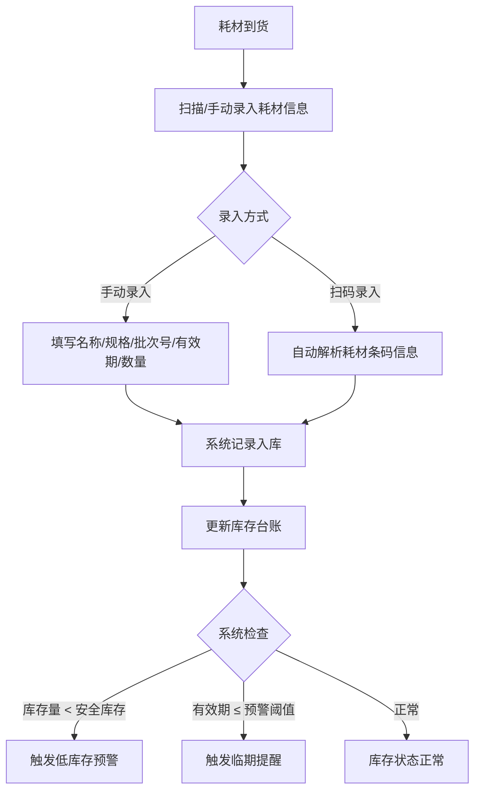
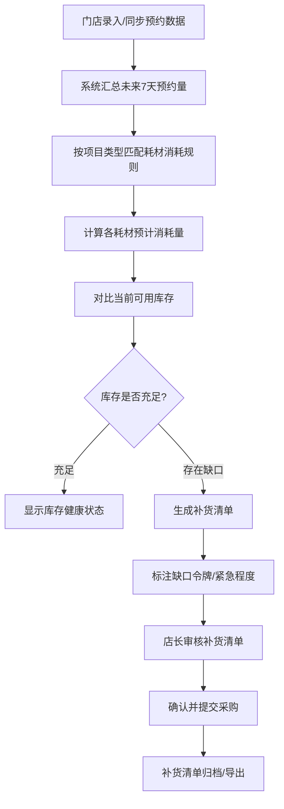
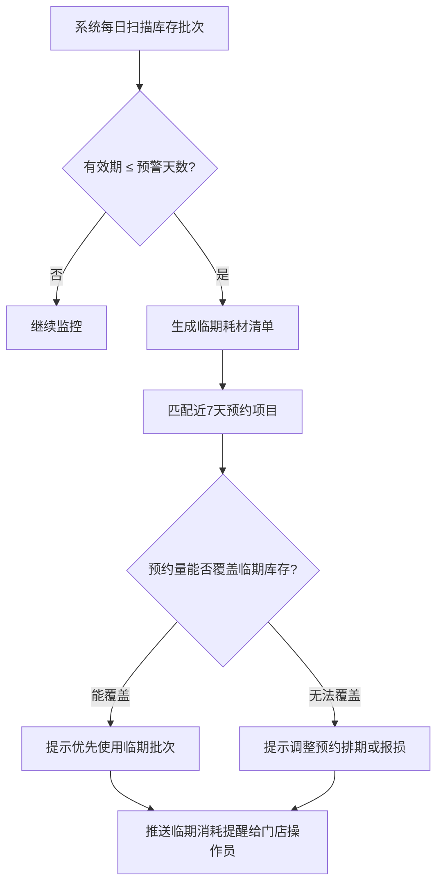
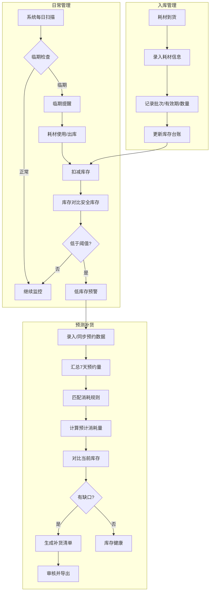

# 预约制门店耗材预测补货 — 用户需求说明书（URS）

| 项目名称 | 预约制门店耗材预测补货 |
|----------|------------------------|
| 文档版本 | v1.0.0 |
| 创建日期 | 2026-06-26 |
| 所属领域 | 医疗健康服务 — 预约制门店耗材管理 |
| 文档状态 | 待审核 |

---

# 1. 需求概述

## 1.1 需求介绍

预约制门店耗材预测补货系统是面向小型口腔诊所、医美/康复门店及连锁门店运营负责人的垂直行业 SaaS 工具。系统聚焦预约制服务门店中"耗材批次 + 有效期 + 安全库存 + 预约量预测"的核心管理场景，通过对接门店预约数据，自动推算未来 7 天各类耗材的消耗量与缺口，生成补货清单和临期消耗提醒，帮助门店从被动盘点转向主动预测，减少耗材过期浪费和临时缺货带来的经营风险。

### 1.1.1 所属领域

医疗健康服务（细分：口腔诊所、医美门店、康复门店等高频预约制服务门店的耗材库存管理）。

## 1.2 需求目标

1. **降低耗材过期浪费**：通过批次管理和临期提醒，让门店在耗材到期前合理安排消耗，减少因过期导致的报废损失。
2. **避免耗材缺货断供**：根据预约量预测未来 7 天耗材需求，提前生成补货清单，避免诊疗过程中耗材不足。
3. **减少人工盘点成本**：用系统自动化代替手工台账和记忆式管理，让医护人员将时间还给患者。
4. **支撑连锁规模化运营**：为连锁门店运营负责人提供多门店耗材健康度汇总视图，实现"一屏看全局"。
5. **商业模式验证**：门店订阅 ¥99/月，连锁版按门店数阶梯收费，MVP 周期 1–2 周。

## 1.3 系统使用角色

| 角色 | 说明 | 典型用户画像 |
|------|------|-------------|
| 门店操作员（护士/前台） | 负责耗材入库登记、日常库存查看、接收补货和临期提醒 | 口腔诊所护士小王，每天接待 20+ 患者，需要快速确认手套、麻药是否够用 |
| 门店店长/负责人 | 负责审核补货清单、管理安全库存阈值、查看门店运营报表 | 医美门店张店长，管理 3 名护士，需要控制耗材成本并保证不断供 |
| 连锁运营负责人 | 负责多门店耗材健康度监控、统一采购策略、异常门店预警 | 某口腔连锁运营总监，管理 15 家门店，需要一眼看到哪些门店耗材即将告急 |

## 1.4 业务流程图

### 1.4.1 耗材入库与库存维护流程

### 1.4.2 预约驱动的耗材预测与补货流程

### 1.4.3 临期耗材消耗管理流程

## 1.5 用户场景

### 场景 1：口腔诊所日常耗材入库

**角色**：门店操作员（护士）  
**场景描述**：某口腔诊所每周一收到供应商配送的一次性手套、口罩、麻醉剂、充填材料等耗材。护士拆开包装后，通过手机端或 WEB 端扫描耗材条码（或手动输入），系统自动记录耗材名称、规格、批次号、生产日期、有效期和入库数量。入库完成后，库存台账实时更新。如果某批次麻醉剂距有效期仅剩 30 天（达到预警阈值），系统立即弹出临期提醒。  
**验收标准**：
- 入库操作在 30 秒内完成单品录入
- 临期批次入库时即时弹出提醒
- 库存台账数量与入库数量一致

### 场景 2：医美门店根据预约量预测耗材缺口

**角色**：门店店长  
**场景描述**：医美门店下周已预约 15 例玻尿酸注射、8 例水光针、20 例光子嫩肤。店长打开"预测补货"页面，系统根据预约量和各项目的耗材消耗规则，自动计算出玻尿酸需 15 支（当前库存 10 支，缺口 5 支）、水光针套装需 8 套（当前库存 12 套，充足）、光子嫩肤探头需 20 个（当前库存 15 个，缺口 5 个）。系统生成补货清单，标注缺口项和预计到货截止日期，店长确认后一键导出采购单。  
**验收标准**：
- 预测结果与预约量 × 消耗规则的乘积一致
- 缺口项用红色高亮标注
- 补货清单可导出为 Excel/PDF

### 场景 3：连锁运营负责人查看多门店耗材健康度

**角色**：连锁运营负责人  
**场景描述**：某口腔连锁有 15 家门店，运营总监每周一早上打开系统，查看"连锁总览"页面。页面以红绿灯形式展示各门店的耗材健康状态：12 家门店显示绿色（库存健康），2 家门店显示黄色（存在临期耗材），1 家门店显示红色（3 种耗材已低于安全库存）。点击红色门店，可下钻查看具体缺口令牌和补货建议。运营总监据此统一协调采购和门店间调拨。  
**验收标准**：
- 总览页面加载时间 < 3 秒
- 红绿灯状态与实时库存数据一致
- 支持下钻到单门店明细

### 场景 4：护士利用临期提醒安排优先消耗

**角色**：门店操作员（护士）  
**场景描述**：护士每天早上收到系统推送的"临期耗材提醒"：本诊所有 2 盒充填材料（批次 20260301）将在 15 天后到期，当前库存 5 盒。系统同时显示未来 7 天有 8 例充填预约，按消耗规则预计使用 8 盒，临期批次可以被正常消耗完。护士据此安排优先使用临期批次，避免过期浪费。  
**验收标准**：
- 临期提醒每天定时推送
- 提醒内容包含批次号、到期日期、当前库存量
- 系统自动对比预约消耗量与临期库存量

### 场景 5：门店首次配置安全库存阈值

**角色**：门店店长  
**场景描述**：门店首次使用系统时，店长根据过往经验为每种耗材设置安全库存阈值。例如，一次性手套的安全库存设为 5 盒（低于此数量时报警），麻醉剂设为 10 支。系统提供"根据近 30 天平均消耗量自动推荐安全库存"的辅助功能，店长可一键采纳或手动调整。  
**验收标准**：
- 支持手动设置每种耗材的安全库存阈值
- 系统根据历史消耗自动推荐阈值
- 安全库存变更后，预警规则实时生效

---

# 2. 功能原型

| 原型名称 | 原型链接 | 对应端 | 备注 |
| --- | --- | --- | --- |
| 耗材库存管理页 | 待设计 | WEB端 | 入库、台账、批次管理、安全库存设置 |
| 预约量录入/同步页 | 待设计 | WEB端 | 预约数据录入或对接外部预约系统 |
| 预测补货页 | 待设计 | WEB端 | 7 天缺口预测、补货清单生成与导出 |
| 临期管理页 | 待设计 | WEB端 | 临期耗材清单、消耗建议、报损记录 |
| 连锁总览页 | 待设计 | WEB端 | 多门店耗材健康度汇总、红绿灯预警 |
| 消息提醒（通知中心） | 待设计 | WEB端 | 低库存、临期、补货到达等消息推送 |

---

# 3. 需求清单

## 3.1 耗材管理端（WEB端）

### 3.1.1 耗材入库管理

| 模块 | 一级功能 | 二级功能 | 功能描述 | 优先级 | 备注 |
| --- | --- | --- | --- | --- | --- |
| 耗材入库 | 手动录入入库 | 填写耗材信息 | 用户手动输入耗材名称、规格、批次号、生产日期、有效期、入库数量 | P0 | MVP核心 |
| 耗材入库 | 扫码录入入库 | 条码解析 | 扫描耗材条码自动解析名称、规格、批次、有效期等信息 | P2 | 可后续迭代 |
| 耗材入库 | 入库记录查询 | 入库历史 | 查看历史入库记录，支持按日期、耗材名称、批次号筛选 | P1 | |
| 耗材入库 | 入库异常处理 | 退回/更正 | 对错误入库记录进行修正或退回操作 | P1 | |

### 3.1.2 耗材库存台账

| 模块 | 一级功能 | 二级功能 | 功能描述 | 优先级 | 备注 |
| --- | --- | --- | --- | --- | --- |
| 库存台账 | 库存总览 | 当前库存列表 | 展示所有耗材的当前库存量、安全库存、库存状态（正常/低库存/缺货） | P0 | MVP核心 |
| 库存台账 | 批次明细查看 | 按批次展示 | 查看某一耗材的所有在库批次，含各批次剩余数量和有效期 | P0 | MVP核心 |
| 库存台账 | 库存操作 | 出库/报损登记 | 记录耗材出库（使用）或报损操作，实时更新库存数量 | P0 | MVP核心 |
| 库存台账 | 库存盘点 | 盘点录入 | 支持定期盘点，录入实际库存量，系统自动计算差异 | P2 | |

### 3.1.3 安全库存管理

| 模块 | 一级功能 | 二级功能 | 功能描述 | 优先级 | 备注 |
| --- | --- | --- | --- | --- | --- |
| 安全库存 | 安全库存设置 | 手动设置阈值 | 为每种耗材设置安全库存下限值，低于此值触发预警 | P0 | MVP核心 |
| 安全库存 | 智能推荐 | 自动推荐阈值 | 根据近 30 天平均消耗量自动推荐安全库存值 | P1 | |
| 安全库存 | 批量设置 | 批量导入/调整 | 支持批量导入或按分类批量调整安全库存阈值 | P2 | |

### 3.1.4 预约数据管理

| 模块 | 一级功能 | 二级功能 | 功能描述 | 优先级 | 备注 |
| --- | --- | --- | --- | --- | --- |
| 预约数据 | 手动录入预约 | 逐条录入 | 录入预约日期、患者信息、预约项目类型 | P0 | MVP核心 |
| 预约数据 | 预约量汇总 | 按日期/项目汇总 | 自动汇总未来 7 天各项目的预约数量 | P0 | MVP核心 |
| 预约数据 | 外部系统对接 | 预约系统同步 | 与门店现有预约系统（如HIS/诊所管理系统）对接自动同步预约数据 | P2 | |
| 预约数据 | 消耗规则配置 | 项目-耗材映射 | 配置每个服务项目对应的耗材消耗种类和数量（如"洗牙"对应 1 副手套 + 1 个口杯） | P0 | MVP核心 |

### 3.1.5 耗材缺口预测

| 模块 | 一级功能 | 二级功能 | 功能描述 | 优先级 | 备注 |
| --- | --- | --- | --- | --- | --- |
| 缺口预测 | 7天缺口计算 | 自动预测 | 根据预约量 × 消耗规则计算各耗材未来 7 天预计消耗量，与当前库存对比得出缺口 | P0 | MVP核心 |
| 缺口预测 | 缺口可视化 | 图表展示 | 以图表形式展示各耗材的当前库存、预计消耗、缺口量 | P1 | |
| 缺口预测 | 多情景模拟 | 预约量调整 | 支持手动调整预约量假设，查看不同情景下的缺口变化 | P2 | |
| 缺口预测 | 预测准确度回顾 | 历史对比 | 将历史预测与实际消耗进行对比，评估预测准确度 | P3 | |

### 3.1.6 补货清单管理

| 模块 | 一级功能 | 二级功能 | 功能描述 | 优先级 | 备注 |
| --- | --- | --- | --- | --- | --- |
| 补货清单 | 自动生成 | 补货清单生成 | 根据缺口预测结果自动生成补货清单，包含耗材名称、规格、缺口数量、建议采购量 | P0 | MVP核心 |
| 补货清单 | 清单审核 | 店长确认 | 店长审核补货清单，可调整数量后确认 | P1 | |
| 补货清单 | 清单导出 | Excel/PDF导出 | 将补货清单导出为 Excel 或 PDF 文件，方便发送给供应商 | P0 | MVP核心 |
| 补货清单 | 历史清单 | 补货记录查询 | 查看历史补货清单，支持按日期、耗材筛选 | P1 | |
| 补货清单 | 紧急程度标注 | 优先级排序 | 按缺口紧急程度（预计断货日期）对补货项排序并标注 | P1 | |

### 3.1.7 临期耗材管理

| 模块 | 一级功能 | 二级功能 | 功能描述 | 优先级 | 备注 |
| --- | --- | --- | --- | --- | --- |
| 临期管理 | 临期批次预警 | 自动扫描 | 系统每日自动扫描所有在库批次，识别达到预警阈值的临期批次 | P0 | MVP核心 |
| 临期管理 | 临期清单 | 临期耗材列表 | 展示所有临期耗材的批次号、到期日期、剩余数量、剩余天数 | P0 | MVP核心 |
| 临期管理 | 消耗匹配分析 | 预约消耗对比 | 将临期库存量与未来 7 天预约预计消耗量对比，判断能否在到期前消耗完 | P1 | |
| 临期管理 | 消耗建议 | 优先使用提醒 | 对可消耗的临期批次，建议安排优先使用并关联到对应预约 | P1 | |
| 临期管理 | 报损处理 | 过期报损登记 | 对无法在到期前消耗的批次，支持报损登记并更新库存 | P1 | |
| 临期管理 | 预警天数配置 | 自定义阈值 | 用户可自定义临期预警天数（如到期前 30/60/90 天触发提醒） | P1 | |

### 3.1.8 消息提醒中心

| 模块 | 一级功能 | 二级功能 | 功能描述 | 优先级 | 备注 |
| --- | --- | --- | --- | --- | --- |
| 消息提醒 | 低库存提醒 | 推送通知 | 当库存低于安全库存时，向门店操作员和店长推送提醒 | P0 | MVP核心 |
| 消息提醒 | 临期提醒 | 推送通知 | 当耗材批次进入临期预警范围时，推送提醒给相关人员 | P0 | MVP核心 |
| 消息提醒 | 补货到达提醒 | 推送通知 | 补货清单确认后，提醒跟进采购进度 | P2 | |
| 消息提醒 | 提醒规则配置 | 自定义设置 | 用户可配置提醒方式（站内信/微信/短信）、提醒频率和接收人 | P2 | |

### 3.1.9 连锁门店管理（连锁版）

| 模块 | 一级功能 | 二级功能 | 功能描述 | 优先级 | 备注 |
| --- | --- | --- | --- | --- | --- |
| 连锁管理 | 门店总览 | 多门店健康度看板 | 以红绿灯/评分形式展示所有门店的耗材库存健康状态 | P1 | 连锁版核心 |
| 连锁管理 | 门店下钻 | 单门店明细查看 | 从总览下钻到单个门店查看具体库存、缺口、临期详情 | P1 | |
| 连锁管理 | 异常预警 | 异常门店标注 | 自动识别并标注库存异常（多品类缺货、大量临期）的门店 | P1 | |
| 连锁管理 | 统一采购 | 多门店合并采购 | 将多门店补货清单合并为统一采购单，获取批量采购优势 | P2 | |
| 连锁管理 | 门店间调拨 | 调拨建议 | 当某门店缺货而相邻门店有余量时，建议门店间调拨 | P3 | |

---

# 4. 非功能需求

## 4.1 使用界面需求

| 需求项 | 要求说明 |
|--------|----------|
| 响应式设计 | WEB 端需适配 PC（1280×720 及以上）和平板（1024×768 及以上）屏幕 |
| 操作简洁性 | 核心操作（入库、查看库存、生成补货清单）不超过 3 步完成 |
| 视觉状态标识 | 库存状态使用颜色编码（绿色=正常、黄色=临期/低库存、红色=缺货/过期） |
| 中文界面 | 全系统中文，耗材名称支持自定义 |
| 移动端查看 | 消息提醒和库存查看需支持手机端（至少 H5 响应式页面） |

## 4.2 软硬件环境需求

| 需求项 | 要求说明 |
|--------|----------|
| 部署方式 | 云端 SaaS（公有云部署），用户通过浏览器访问 |
| 浏览器兼容 | 支持 Chrome 90+、Edge 90+、Safari 14+、Firefox 90+ |
| 服务端 | 云服务器（阿里云/腾讯云），按需扩展 |
| 客户端 | 无需安装客户端，浏览器 + 可选微信小程序 |

## 4.3 性能需求

| 需求项 | 要求说明 |
|--------|----------|
| 页面加载 | 核心页面首屏加载时间 < 3 秒（4G 网络环境） |
| 预测计算 | 7 天缺口预测计算时间 < 5 秒（单门店，500 种耗材以内） |
| 并发支持 | 支持 100 家门店同时在线操作（MVP 阶段） |
| 数据备份 | 每日自动备份，数据保留 3 年 |

## 4.4 约束性需求

| 编号 | 约束说明 |
|------|----------|
| C1 | 系统不实现采购下单功能（仅生成补货清单供导出），不对接供应商系统 |
| C2 | 系统不实现财务结算功能（耗材成本核算属于后续迭代） |
| C3 | 系统不提供诊疗管理功能（预约数据由外部系统录入或手动输入） |
| C4 | 耗材编码体系不自建，优先兼容国家医疗器械唯一标识（UDI）体系 |
| C5 | 系统需要后台服务支撑，提供云端 SaaS 服务 |
| C6 | MVP 阶段不支持多语言、多币种 |

---

# 5. 接口需求

## 5.1 硬件接口需求

| 需求项 | 要求说明 |
|--------|----------|
| 条码扫描枪 | 支持 USB 蓝牙条码扫描枪输入（作为键盘输入设备，无特殊接口要求） |
| 移动设备摄像头 | 支持手机摄像头扫码（通过浏览器调用或微信小程序） |

## 5.2 软件接口需求

| 模块 | 接口名称 | 输入 | 输出 | 功能描述 |
| --- | --- | --- | --- | --- |
| 预约数据管理 | 预约系统对接接口 | 预约系统 API 凭证 | 预约记录（日期、项目、患者） | 对接外部预约系统/HIS 自动同步预约数据 |
| 消息提醒 | 消息推送接口 | 提醒事件（类型、内容、接收人） | 推送结果 | 站内信、微信模板消息或短信推送 |
| 补货清单 | 导出接口 | 补货清单数据 | Excel/PDF 文件 | 将补货清单导出为标准格式文件 |
| 耗材入库 | 条码解析接口 | 耗材条码/UDI 编码 | 耗材基本信息（名称、规格、厂商） | 解析国家医疗器械 UDI 编码获取耗材基础信息 |
| 连锁管理 | 多门店数据聚合接口 | 各门店库存/预测数据 | 汇总看板数据 | 聚合多门店数据供连锁总览页面展示 |

---

# 6. 附录

## 优先级排序汇总

| 优先级 | 功能模块 | 说明 |
|--------|----------|------|
| **P0（MVP必须）** | 耗材手动入库、库存台账、批次管理、安全库存设置、预约录入与汇总、消耗规则配置、7天缺口预测、补货清单生成与导出、临期批次预警与清单、低库存/临期消息提醒 | 核心业务闭环，MVP 1-2 周内必须完成 |
| **P1（重要迭代）** | 入库记录查询、出库/报损登记、智能安全库存推荐、缺口可视化图表、补货清单审核与历史、紧急程度标注、临期消耗匹配分析与建议、报损处理、预警天数配置、连锁门店总览与下钻、异常门店预警 | 提升用户体验和管理深度，MVP 后 1-2 个迭代完成 |
| **P2（增强功能）** | 扫码入库、库存盘点、批量安全库存设置、外部预约系统对接、补货到达提醒、提醒规则配置、多情景模拟、连锁统一采购 | 提升效率和自动化水平 |
| **P3（远期规划）** | 预测准确度回顾、门店间调拨建议 | 长期价值功能，视业务发展情况决定 |

## 术语表

| 术语 | 定义 |
|------|------|
| 耗材 | 医疗服务过程中使用的一次性物品或消耗性材料（如手套、口罩、注射器、麻醉剂等） |
| 批次 | 同一生产日期、同一有效期、同一供应商供货的耗材归为一个批次 |
| 安全库存 | 系统预设的库存下限阈值，当库存量低于此值时触发预警 |
| 临期耗材 | 距有效期达到预警天数的耗材批次（预警天数可配置，默认 30 天） |
| 缺口 | 预测消耗量超出当前可用库存的数量差值 |
| 消耗规则 | 每个服务项目对应的耗材消耗种类和数量的映射关系 |
| UDI | 医疗器械唯一标识（Unique Device Identification） |

## 业务流程图

### 完整业务流程（端到端）

